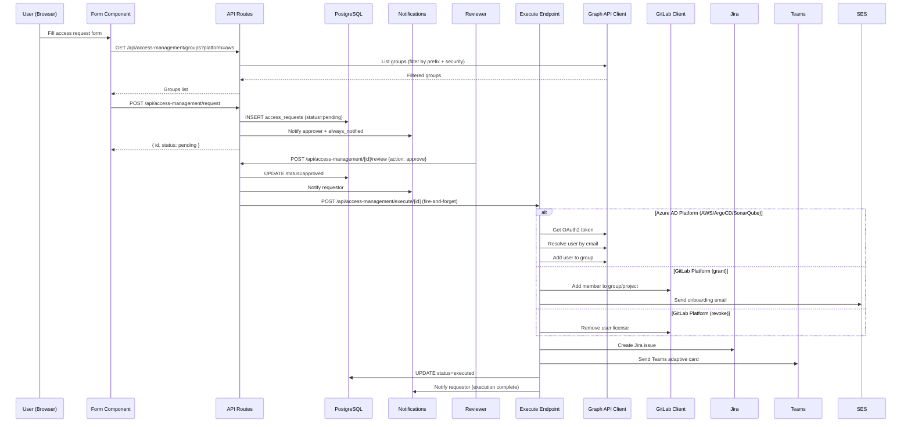
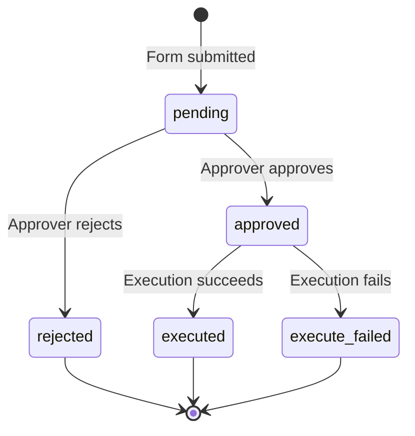

# Design Document: Access Management

## Overview

This feature replaces the existing n8n webhook flow (`add-user-to-group.json`) with a fully integrated access management system within the Platform Portal. It provides a unified request form, approval workflow, automated execution, Jira ticketing, and Teams notifications for granting users access to four enterprise platforms: AWS, ArgoCD, SonarQube (all via Azure AD group membership), and GitLab (via GitLab API with license management).

The system follows the same architectural pattern as the existing infra-request feature:
1. **Form submits** → creates DB record → notifies approver
2. **Approver reviews** → triggers execute endpoint internally via `localhost:3000`
3. **Execute endpoint** does the work (Azure AD / GitLab API) → Jira → Teams → update DB

### Key Design Decisions

- **Reuse infra-request approval pattern**: Same approvers list, same review endpoint pattern, same fire-and-forget execution trigger.
- **New Microsoft Graph API client**: Dedicated module (`src/lib/graph-client.ts`) with OAuth2 client credentials flow, token caching, and retry logic.
- **Extend existing GitLab client**: Add `addMember` method to the existing `gitlabClient` rather than creating a separate client.
- **Separate database table**: `access_requests` table with its own status lifecycle, independent from `infra_requests`.
- **Security filter at API level**: Groups are filtered server-side before being sent to the client, preventing privileged group names from ever reaching the frontend.

## Architecture



## Components and Interfaces

### 1. Microsoft Graph API Client (`src/lib/graph-client.ts`)

```typescript
interface GraphGroup {
  id: string;
  displayName: string;
  description?: string;
}

interface GraphUser {
  id: string;
  displayName: string;
  mail: string;
  userPrincipalName: string;
}

class GraphClient {
  private tokenCache: { token: string; expiresAt: number } | null;

  /** Obtain OAuth2 token via client credentials grant */
  async getToken(): Promise<string>;

  /** List groups filtered by displayName prefix (e.g., "AWS-") */
  async listGroupsByPrefix(prefix: string): Promise<GraphGroup[]>;

  /** Find a user by email (with domain fallback) */
  async findUserByEmail(email: string): Promise<GraphUser>;

  /** Add a user (by directoryObject ID) to a group */
  async addUserToGroup(groupId: string, userId: string): Promise<void>;
}

export const graphClient: GraphClient;
```

**Token caching**: The client caches the OAuth2 token in memory and refreshes it 5 minutes before expiry. This avoids hitting the token endpoint on every request.

**Domain fallback**: When `findUserByEmail` fails with a 404 for an `@emefinpetcare.com` email, it retries with `@iskaypet.com` (and vice versa).

### 2. Security Filter (`src/lib/access-management/security-filter.ts`)

```typescript
/** Platform prefix mapping */
const PLATFORM_PREFIXES: Record<string, string> = {
  aws: "AWS-",
  argocd: "ArgoCD-",
  sonarqube: "SonarQube-",
};

/** Forbidden substrings (case-insensitive) */
const FORBIDDEN_PATTERNS = ["admin", "owner"];

/** Filter groups by platform prefix and exclude admin/owner groups */
function filterGroups(groups: GraphGroup[], platform: string): GraphGroup[];

/** Check if a group name is safe (no admin/owner) */
function isGroupSafe(displayName: string): boolean;
```

### 3. Access Request API Routes (`src/app/api/access-management/`)

| Route | Method | Auth | Description |
|-------|--------|------|-------------|
| `/api/access-management/groups` | GET | User | Returns filtered groups for a platform |
| `/api/access-management/request` | POST | User | Creates a new access request |
| `/api/access-management/[id]/review` | POST | User (approver) | Approve or reject a request |
| `/api/access-management/execute/[id]` | POST | Internal | Execute an approved request |

### 4. Access Request Form Component (`src/components/access-management/access-request-form.tsx`)

The form follows the same pattern as `InfraRequestFormV2`:
- Platform selector (AWS, ArgoCD, SonarQube, GitLab)
- Target user email (pre-filled with session email)
- Dynamic group/role selector (fetched from API based on platform)
- GitLab-specific: request type (grant/revoke) and role selector
- Approver selector (reuses `SELECTABLE_APPROVERS`)
- Submit button (enabled when all required fields are filled)

### 5. Domain Normalizer (`src/lib/access-management/domain-normalizer.ts`)

```typescript
/** Normalize email domain: @emefinpetcare.com → @iskaypet.com, lowercase */
function normalizeEmail(email: string): string;

/** Compare two emails with domain normalization */
function emailsMatch(a: string, b: string): boolean;

/** Get alternate domain email for fallback lookup */
function getAlternateDomainEmail(email: string): string | null;
```

### 6. GitLab Access Extensions

Add to existing `gitlabClient` in `src/lib/gitlab.ts`:

```typescript
/** Add a member to a GitLab group with a specific access level */
async addGroupMember(groupId: number, email: string, accessLevel: number): Promise<void>;

/** Remove a user from GitLab (revoke license/seat) */
async removeUser(userId: number): Promise<void>;

/** Find a GitLab user by email */
async findUserByEmail(email: string): Promise<{ id: number; username: string } | null>;

/** List GitLab groups (top-level, for the access form) */
async listGroups(): Promise<{ id: number; name: string; full_path: string }[]>;
```

### 7. Onboarding Email Template (`src/lib/access-management/gitlab-onboarding-email.ts`)

```typescript
function buildGitLabOnboardingEmail(params: {
  targetEmail: string;
  groupName: string;
  roleName: string;
}): { subject: string; bodyHtml: string; bodyText: string };
```

## Data Models

### `access_requests` Table

```sql
CREATE TABLE IF NOT EXISTS access_requests (
  id              SERIAL PRIMARY KEY,
  requestor_email TEXT NOT NULL,
  target_user_email TEXT NOT NULL,
  platform        TEXT NOT NULL,          -- aws, argocd, sonarqube, gitlab
  request_type    TEXT NOT NULL DEFAULT 'grant', -- grant, revoke
  group_id        TEXT,                   -- Azure AD group ID or GitLab group ID
  group_name      TEXT,                   -- Display name of the group
  role            TEXT,                   -- GitLab access level (guest, reporter, developer, maintainer)
  approver_email  TEXT NOT NULL,          -- Selected approver
  status          TEXT NOT NULL DEFAULT 'pending', -- pending, approved, rejected, executed, execute_failed
  reviewer_email  TEXT,
  reviewer_name   TEXT,
  review_comment  TEXT,
  reviewed_at     TIMESTAMPTZ,
  executed_at     TIMESTAMPTZ,
  jira_key        TEXT,
  created_at      TIMESTAMPTZ NOT NULL DEFAULT NOW(),
  updated_at      TIMESTAMPTZ NOT NULL DEFAULT NOW()
);

CREATE INDEX IF NOT EXISTS idx_access_requests_status ON access_requests (status, created_at DESC);
CREATE INDEX IF NOT EXISTS idx_access_requests_requestor ON access_requests (requestor_email, created_at DESC);
CREATE INDEX IF NOT EXISTS idx_access_requests_target ON access_requests (target_user_email, created_at DESC);
```

### Request Payload (POST `/api/access-management/request`)

```typescript
interface AccessRequestPayload {
  platform: "aws" | "argocd" | "sonarqube" | "gitlab";
  targetUserEmail: string;
  requestType: "grant" | "revoke";
  groupId?: string;       // Required for grant, not for revoke
  groupName?: string;     // Required for grant, not for revoke
  role?: string;          // Required for GitLab grant
  approverEmail: string;
}
```

### Review Payload (POST `/api/access-management/[id]/review`)

```typescript
interface ReviewPayload {
  action: "approve" | "reject";
  comment?: string;
}
```

## Correctness Properties

*A property is a characteristic or behavior that should hold true across all valid executions of a system — essentially, a formal statement about what the system should do. Properties serve as the bridge between human-readable specifications and machine-verifiable correctness guarantees.*

### Property 1: Platform prefix filter returns only matching groups

*For any* list of Azure AD groups and any platform (aws, argocd, sonarqube), the platform filter SHALL return only groups whose `displayName` starts with the corresponding prefix ("AWS-", "ArgoCD-", "SonarQube-"), and SHALL not omit any group that matches the prefix (before security filtering).

**Validates: Requirements 2.1, 2.2, 2.3**

### Property 2: Security filter excludes all privileged groups

*For any* list of groups (Azure AD or GitLab), the security filter SHALL exclude every group whose `displayName` contains "admin", "Admin", "owner", or "Owner" (case-insensitive match on these substrings), and SHALL include every group that does not contain these substrings.

**Validates: Requirements 2.4, 2.6**

### Property 3: Domain normalizer produces consistent canonical form

*For any* email address, applying the domain normalizer SHALL:
- Convert `@emefinpetcare.com` to `@iskaypet.com`
- Lowercase the entire email
- Be idempotent: `normalize(normalize(email)) === normalize(email)`

And for any two emails that differ only in case or domain variant (`@emefinpetcare.com` vs `@iskaypet.com`), `emailsMatch(a, b)` SHALL return `true`.

**Validates: Requirements 10.1, 10.3**

### Property 4: Domain fallback produces the alternate domain

*For any* email with domain `@emefinpetcare.com`, `getAlternateDomainEmail` SHALL return the same local part with `@iskaypet.com`. For any email with `@iskaypet.com`, it SHALL return the same local part with `@emefinpetcare.com`. For any email with a different domain, it SHALL return `null`.

**Validates: Requirements 6.2, 10.2**

### Property 5: Self-approval prevention with domain normalization

*For any* access request where the requestor email and reviewer email are equivalent after domain normalization (case-insensitive, `@emefinpetcare.com` ↔ `@iskaypet.com`), the review endpoint SHALL reject the approval with a 403 status.

**Validates: Requirements 5.2**

### Property 6: Non-pending requests cannot be reviewed

*For any* access request whose status is not "pending" (i.e., "approved", "rejected", "executed", or "execute_failed"), attempting to review it SHALL return a 409 conflict status.

**Validates: Requirements 5.7**

### Property 7: Onboarding email contains all required sections

*For any* GitLab access grant with any target email and group name, the generated onboarding email body SHALL contain: login instructions, 2FA setup guide, a link to the GitLab instance, and a support contact.

**Validates: Requirements 7.3**

### Property 8: Jira issue content completeness

*For any* executed access request, the generated Jira issue SHALL have:
- A summary matching the format `[Access] Solicitud de acceso a {PLATFORM} para {target_user_email}`
- A description containing: platform name, target user email, group or role name, requestor email, approver email, and execution timestamp

**Validates: Requirements 8.2, 8.4**

### Property 9: Teams card content completeness

*For any* executed access request, the generated Teams adaptive card SHALL contain: the title "🔐 Solicitud de Acceso", the platform name, the target user email, the group or role name, the status "✅ Acceso Concedido", and a link to the Jira ticket.

**Validates: Requirements 9.2**

## Error Handling

### Graph API Client Errors

| Error | Handling |
|-------|----------|
| Token request fails (network/auth) | Return descriptive error with HTTP status code. Do not cache failed tokens. |
| User not found (404) | Try alternate domain email. If both fail, mark request as `execute_failed`. |
| User already in group (400 with "already exists") | Treat as success (idempotent). |
| Group not found (404) | Mark request as `execute_failed`, notify requestor. |
| Rate limited (429) | Retry with exponential backoff (max 3 retries). |

### GitLab API Errors

| Error | Handling |
|-------|----------|
| User not found | Mark request as `execute_failed`, notify requestor. |
| User already a member | Treat as success (idempotent). |
| Insufficient permissions | Mark request as `execute_failed`, notify requestor. |
| License provisioning fails | Mark request as `execute_failed`, notify requestor. |

### Non-Blocking Failures

The following operations are non-blocking (fire-and-forget with error logging):
- Jira ticket creation
- Teams webhook notification
- Onboarding email sending

If these fail, the access grant is still considered successful and the request status is set to "executed".

### State Machine



## Testing Strategy

### Property-Based Tests (fast-check)

The project uses TypeScript with Next.js. Property-based tests will use **fast-check** library with a minimum of 100 iterations per property.

Each property test will be tagged with:
```
Feature: access-management, Property {number}: {property_text}
```

Properties to test:
1. Platform prefix filter
2. Security filter
3. Domain normalizer idempotence and consistency
4. Domain fallback alternate generation
5. Self-approval prevention
6. Non-pending review rejection
7. Onboarding email content
8. Jira issue content format
9. Teams card content

### Unit Tests (example-based)

- Form component rendering (platform options, conditional fields)
- API route authentication (401 for unauthenticated)
- API route validation (400 for invalid payloads)
- Approval flow state transitions
- Error handling paths (execute_failed scenarios)

### Integration Tests

- Graph API client token acquisition (mocked HTTP)
- Graph API client user lookup with domain fallback (mocked HTTP)
- GitLab member addition (mocked HTTP)
- Full approval → execution flow (mocked external services)
- Database operations (access_requests CRUD)

### Smoke Tests

- Environment variable configuration (AZURE_AD_TENANT_ID, AZURE_AD_CLIENT_ID, etc.)
- Database migration applies cleanly
- API routes respond (health check level)
