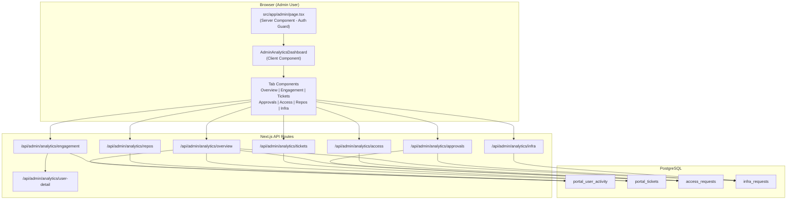

# Design Document: Admin Analytics Dashboard

## Overview

This design replaces the existing basic admin activity page (`/admin`) with a comprehensive, multi-tab analytics dashboard. The dashboard aggregates data from four PostgreSQL tables (`portal_user_activity`, `portal_tickets`, `access_requests`, `infra_requests`) and presents it through KPI cards with trend indicators, time-series charts, ranked lists, and distribution visualizations.

The architecture follows the existing portal patterns: server-side auth guard on the page, client-side React components fetching data from Next.js API routes, and PostgreSQL queries via the shared `pg` pool. The UI uses shadcn/ui components, Tailwind CSS, and Recharts — all already present in the project.

### Key Design Decisions

1. **Tab-based SPA navigation** — Tabs switch content client-side without full page reloads, using `@radix-ui/react-tabs` (already available via shadcn/ui).
2. **One API route per analytics domain** — Each tab has a dedicated `/api/admin/analytics/{domain}` endpoint that returns pre-aggregated data for the selected time range. This keeps queries focused and cacheable.
3. **Trend calculation in SQL** — Percentage change is computed server-side by querying both the current and previous period in a single query using window functions or CTEs.
4. **No new database tables** — All analytics are derived from existing tables. Repository creation data comes from `portal_user_activity` events with `event_type = 'repo_created'`.
5. **Reuse existing auth pattern** — Same `getServerSession` + `hasSessionMinimumRole(session, "admin")` guard used in the current admin page and API routes.

## Architecture



### Data Flow

1. Admin navigates to `/admin` → server component verifies session + admin role → renders client shell
2. Client component mounts with default 30-day range and "Overview" tab active
3. On tab activation or time range change, the active tab fetches its API endpoint with `?days=N`
4. API route validates auth, computes aggregations via SQL CTEs, returns JSON
5. Client renders KPI cards, charts, and tables using the response data

## Components and Interfaces

### Page Component

**File:** `src/app/admin/page.tsx` (existing, modified)

No changes needed — the existing server component already handles auth and renders a client component. We replace the import from `AdminActivityDashboard` to `AdminAnalyticsDashboard`.

### Main Dashboard Component

**File:** `src/components/admin/admin-analytics-dashboard.tsx` (new, replaces existing)

```typescript
interface AdminAnalyticsDashboardProps {}

// Internal state
type TabId = "overview" | "engagement" | "tickets" | "approvals" | "access" | "repos" | "infra";
type TimeRange = "7" | "30" | "90" | "180" | "365";
```

Responsibilities:
- Renders time range selector and tab navigation
- Manages active tab and time range state
- Passes `days` prop to each tab panel component
- Provides manual refresh trigger

### Tab Panel Components

Each tab is a separate component in `src/components/admin/analytics/`:

| Component | File | API Endpoint |
|-----------|------|-------------|
| `OverviewTab` | `overview-tab.tsx` | `/api/admin/analytics/overview` |
| `EngagementTab` | `engagement-tab.tsx` | `/api/admin/analytics/engagement` |
| `TicketsTab` | `tickets-tab.tsx` | `/api/admin/analytics/tickets` |
| `ApprovalsTab` | `approvals-tab.tsx` | `/api/admin/analytics/approvals` |
| `AccessTab` | `access-tab.tsx` | `/api/admin/analytics/access` |
| `ReposTab` | `repos-tab.tsx` | `/api/admin/analytics/repos` |
| `InfraTab` | `infra-tab.tsx` | `/api/admin/analytics/infra` |

### Shared UI Components

**File:** `src/components/admin/analytics/kpi-card.tsx`

```typescript
interface KpiCardProps {
  label: string;
  value: number | string;
  icon: React.ComponentType<{ className?: string }>;
  trend: TrendData | null;
}

interface TrendData {
  currentValue: number;
  previousValue: number;
  percentChange: number | null; // null when previous is 0
  isNew: boolean;
}
```

**File:** `src/components/admin/analytics/trend-indicator.tsx`

```typescript
interface TrendIndicatorProps {
  trend: TrendData;
}
```

Renders green up arrow for positive, red down arrow for negative, "New" badge when `isNew` is true. Rounds to one decimal place.

### API Route Interfaces

Each API route follows the same pattern:

```typescript
// Common query parameter
interface AnalyticsQueryParams {
  days: number; // 7 | 30 | 90 | 180 | 365
}

// Common response wrapper
interface AnalyticsResponse<T> {
  period: { days: number; from: string; to: string };
  data: T;
}
```

#### Overview Response

```typescript
interface OverviewData {
  kpis: {
    totalUsers: number;
    activeUsers7d: number;
    activeUsers30d: number;
    totalTickets: number;
    totalAccessRequests: number;
    totalInfraRequests: number;
  };
  trends: Record<string, TrendData>;
  weeklyActiveUsers: Array<{ week: string; count: number }>;
  roleDistribution: Array<{ role: string; count: number }>;
  peakHours: Array<{ hour: number; count: number }>;
}
```

#### Engagement Response

```typescript
interface EngagementData {
  kpis: {
    uniqueUsers: number;
    totalSessions: number;
    totalPageViews: number;
    avgSessionDuration: number; // minutes
    totalLogins: number;
  };
  trends: Record<string, TrendData>;
  dailyActiveUsers: Array<{ date: string; count: number }>;
  topPaths: Array<{ path: string; views: number; uniqueUsers: number }>;
  sectionViews: Array<{ section: string; views: number }>;
  userRanking: Array<{
    email: string;
    name: string;
    role: string;
    totalEvents: number;
    sessionCount: number;
    totalMinutes: number;
    lastSeen: string;
  }>;
  hourlyDistribution: Array<{ hour: number; count: number }>;
}
```

#### Tickets Response

```typescript
interface TicketsData {
  kpis: {
    totalTickets: number;
    totalIncidents: number;
    totalRequests: number;
    openCount: number;
  };
  trends: Record<string, TrendData>;
  dailyVolume: Array<{ date: string; incidents: number; requests: number }>;
  topRequestors: Array<{ email: string; name: string; incidents: number; requests: number; total: number }>;
  byTeam: Array<{ team: string; count: number }>;
  statusDistribution: Array<{ status: string; count: number }>;
  priorityDistribution: Array<{ priority: string; count: number }>;
}
```

#### Approvals Response

```typescript
interface ApprovalsData {
  kpis: {
    totalReviews: number;
    approvalRate: number; // percentage
    avgTimeToReview: number; // hours
    pendingCount: number;
  };
  trends: Record<string, TrendData>;
  topReviewers: Array<{ email: string; name: string; approved: number; rejected: number; total: number }>;
  approvalRateByTeam: Array<{ team: string; rate: number; total: number }>;
  dailyVolume: Array<{ date: string; approved: number; rejected: number }>;
}
```

#### Access Response

```typescript
interface AccessData {
  kpis: {
    totalRequests: number;
    grantCount: number;
    revokeCount: number;
    executedCount: number;
  };
  trends: Record<string, TrendData>;
  byPlatform: Array<{ platform: string; count: number }>;
  dailyVolume: Array<{ date: string; count: number }>;
  topRequestors: Array<{ email: string; name: string; count: number }>;
  statusDistribution: Array<{ status: string; count: number }>;
}
```

#### Repos Response

```typescript
interface ReposData {
  kpis: {
    totalCreated: number;
    uniqueCreators: number;
  };
  trends: Record<string, TrendData>;
  dailyVolume: Array<{ date: string; count: number }>;
  topCreators: Array<{ email: string; name: string; count: number }>;
}
```

#### Infra Response

```typescript
interface InfraData {
  kpis: {
    totalRequests: number;
    approvalRate: number;
    pendingCount: number;
    avgTimeToReview: number; // hours
  };
  trends: Record<string, TrendData>;
  byResourceType: Array<{ type: string; count: number }>;
  dailyVolume: Array<{ date: string; count: number }>;
  byTeam: Array<{ team: string; count: number }>;
  topRequestors: Array<{ email: string; name: string; count: number }>;
}
```

#### User Detail Response

```typescript
// GET /api/admin/analytics/user-detail?email=...&days=N
interface UserDetailData {
  user: { email: string; name: string; role: string };
  navigationHistory: Array<{
    occurredAt: string;
    eventType: string;
    path: string | null;
    action: string | null;
  }>;
}
```

## Data Models

No new database tables are required. All analytics are derived from existing tables:

### Existing Tables Used

| Table | Key Columns for Analytics |
|-------|--------------------------|
| `portal_user_activity` | `occurred_at`, `event_type`, `user_email`, `user_name`, `user_role`, `path`, `action`, `duration_seconds`, `portal_session_id` |
| `portal_tickets` | `created_at`, `type`, `requestor_email`, `requestor_name`, `business_team`, `status`, `priority` |
| `access_requests` | `created_at`, `requestor_email`, `platform`, `request_type`, `status`, `reviewer_email`, `reviewer_name`, `reviewed_at` |
| `infra_requests` | `created_at`, `resource_type`, `team`, `requestor_email`, `requestor_name`, `status`, `reviewer_email`, `reviewer_name`, `reviewed_at` |

### Query Patterns

**Trend Calculation CTE Pattern:**

```sql
WITH current_period AS (
  SELECT COUNT(*) as value
  FROM portal_tickets
  WHERE created_at >= NOW() - INTERVAL '30 days'
),
previous_period AS (
  SELECT COUNT(*) as value
  FROM portal_tickets
  WHERE created_at >= NOW() - INTERVAL '60 days'
    AND created_at < NOW() - INTERVAL '30 days'
)
SELECT
  c.value as current_value,
  p.value as previous_value,
  CASE
    WHEN p.value = 0 THEN NULL
    ELSE ROUND(((c.value - p.value)::numeric / p.value) * 100, 1)
  END as percent_change
FROM current_period c, previous_period p;
```

**Hourly Distribution Pattern:**

```sql
SELECT EXTRACT(HOUR FROM occurred_at) as hour, COUNT(*) as count
FROM portal_user_activity
WHERE occurred_at >= NOW() - INTERVAL '30 days'
GROUP BY 1
ORDER BY 1;
```

**Approval Rate from Combined Tables:**

```sql
WITH all_reviews AS (
  SELECT reviewed_at, status, reviewer_email, reviewer_name
  FROM access_requests
  WHERE reviewed_at IS NOT NULL AND reviewed_at >= NOW() - INTERVAL '30 days'
  UNION ALL
  SELECT reviewed_at, status, reviewer_email, reviewer_name
  FROM infra_requests
  WHERE reviewed_at IS NOT NULL AND reviewed_at >= NOW() - INTERVAL '30 days'
)
SELECT
  COUNT(*) as total_reviews,
  ROUND(COUNT(*) FILTER (WHERE status = 'approved')::numeric / NULLIF(COUNT(*), 0) * 100, 1) as approval_rate
FROM all_reviews;
```

### Performance Considerations

All required indexes already exist on the tables:
- `portal_user_activity`: indexes on `occurred_at DESC`, `user_email`, `event_type`, `portal_session_id`
- `portal_tickets`: indexes on `created_at DESC`, `requestor_email`, `status`, `type`
- `access_requests`: indexes on `status + created_at DESC`, `requestor_email + created_at DESC`
- `infra_requests`: indexes on `status + created_at DESC`, `requestor_email + created_at DESC`

For the 1-year time range on large tables, queries use indexed date range scans. No additional indexes are needed given the existing schema.

## Correctness Properties

*A property is a characteristic or behavior that should hold true across all valid executions of a system — essentially, a formal statement about what the system should do. Properties serve as the bridge between human-readable specifications and machine-verifiable correctness guarantees.*

### Property 1: Trend Calculation Correctness

*For any* pair of non-negative integers (currentValue, previousValue), the trend calculation function SHALL:
- Return `((currentValue - previousValue) / previousValue) * 100` rounded to one decimal place when previousValue > 0
- Return `null` with `isNew: true` when previousValue is 0
- Indicate positive direction (green/up) when the result is > 0 and negative direction (red/down) when < 0

**Validates: Requirements 12.1, 12.2, 12.3, 12.4, 3.2, 4.2, 5.2, 6.2, 7.2, 8.2**

### Property 2: Grouping Partition Invariant

*For any* set of records and any categorical grouping attribute (status, priority, team, platform, resource_type, role, hour-of-day), the sum of all group counts SHALL equal the total number of records in the input set, and no record SHALL appear in more than one group.

**Validates: Requirements 4.5, 4.6, 4.7, 6.3, 6.6, 8.3, 8.5, 9.2, 3.5, 3.8**

### Property 3: Ranking Sort and Limit Invariant

*For any* set of records and any ranking metric (total events, ticket count, review count, request count, creation count), the returned ranked list SHALL be sorted in descending order by that metric, limited to at most 10 entries, and each entry's aggregated count SHALL match the actual count of records for that entity in the input.

**Validates: Requirements 3.4, 3.6, 4.4, 5.3, 6.5, 7.4, 8.6**

### Property 4: Time-Series Aggregation Invariant

*For any* set of timestamped records within a date range, when aggregated into time buckets (daily or weekly), the sum of all bucket counts SHALL equal the total number of records in the input set for that period.

**Validates: Requirements 3.3, 4.3, 5.5, 6.4, 7.3, 8.4, 9.3**

### Property 5: Type Decomposition Invariant

*For any* set of records with a type/category field, the sum of subtype counts SHALL equal the total count. Specifically:
- For tickets: incidents + requests = total tickets
- For access requests: grants + revokes = total access requests
- For approvals: approved + rejected = total reviewed (excluding pending)

**Validates: Requirements 4.1, 6.1, 5.6**

### Property 6: Filter Correctness

*For any* set of records and any filter criterion (user email, event type, date range), the filtered result SHALL contain only records matching all filter criteria, and SHALL contain every record from the input that matches those criteria.

**Validates: Requirements 3.7, 7.5**

### Property 7: Tab State Preservation on Range Change

*For any* active dashboard tab and any time range transition (from one valid range to another), changing the time range SHALL NOT change the currently active tab.

**Validates: Requirements 2.4**

### Property 8: Time Window Monotonicity

*For any* set of user activity records, the count of active users in a shorter time window SHALL be less than or equal to the count of active users in a longer time window that contains it. Specifically: active_7d <= active_30d <= total_registered.

**Validates: Requirements 9.1**

### Property 9: Approval Rate Formula Correctness

*For any* set of reviewed requests (from both access_requests and infra_requests combined), the approval rate SHALL equal `(approved_count / total_reviewed_count) * 100` rounded to one decimal place, and the average time-to-review SHALL equal the mean of all `(reviewed_at - created_at)` durations in hours.

**Validates: Requirements 5.1, 5.4, 8.1**

## Error Handling

### API Error Responses

| Scenario | HTTP Status | Response Body |
|----------|-------------|---------------|
| No session | 401 | `{ "error": "Unauthorized" }` |
| Non-admin role | 403 | `{ "error": "Forbidden" }` |
| Invalid `days` parameter | 400 | `{ "error": "Invalid time range" }` |
| Database query failure | 500 | `{ "error": "Failed to fetch analytics" }` |
| Database timeout | 500 | `{ "error": "Query timeout" }` |

### Client-Side Error Handling

- Each tab component manages its own loading/error state independently
- API failures show an inline error card with a "Retry" button
- Errors in one tab do NOT affect other tabs or crash the dashboard
- Network errors are caught and displayed with user-friendly messages
- Loading skeletons (shadcn/ui `Skeleton` component) shown during data fetch

### Data Edge Cases

- Empty result sets: Display "No data for this period" message with zero-value KPI cards
- Division by zero in rates: Return `null` for percentage, display "N/A" or "New"
- Missing `reviewed_at` timestamps: Exclude from time-to-review calculations
- Future timestamps in data: Clamp queries to `NOW()` as upper bound

## Testing Strategy

### Unit Tests (Example-Based)

Focus on specific scenarios and edge cases:

- **Auth guard tests**: Verify redirect for unauthenticated, non-admin, and successful render for admin
- **API auth tests**: Verify 401/403 responses for each endpoint
- **UI state tests**: Default tab, default time range, tab list completeness
- **Error handling tests**: API failure displays error card, retry works
- **Loading state tests**: Skeleton appears during fetch
- **Edge cases**: Empty data sets, zero previous period values, missing fields

### Property-Based Tests (fast-check)

Each property test runs a minimum of 100 iterations using `fast-check` (already in devDependencies).

| Property | Test File | What's Generated |
|----------|-----------|-----------------|
| Property 1: Trend Calculation | `trend-calculation.property.test.ts` | Random pairs of non-negative integers |
| Property 2: Grouping Partition | `grouping-partition.property.test.ts` | Random arrays of records with categorical fields |
| Property 3: Ranking Sort/Limit | `ranking-invariant.property.test.ts` | Random arrays of records with numeric metrics |
| Property 4: Time-Series Aggregation | `timeseries-aggregation.property.test.ts` | Random arrays of timestamped records within date ranges |
| Property 5: Type Decomposition | `type-decomposition.property.test.ts` | Random arrays of typed records (tickets, access requests) |
| Property 6: Filter Correctness | `filter-correctness.property.test.ts` | Random arrays of records + random filter criteria |
| Property 7: Tab Preservation | `tab-preservation.property.test.ts` | Random tab IDs + random time range transitions |
| Property 8: Time Window Monotonicity | `time-window-monotonicity.property.test.ts` | Random arrays of activity records with timestamps |
| Property 9: Approval Rate | `approval-rate.property.test.ts` | Random arrays of reviewed requests with timestamps |

**Configuration:**
- Library: `fast-check` v4.7.0
- Minimum iterations: 100 per property
- Each test tagged with: `Feature: admin-analytics-dashboard, Property {N}: {title}`

### Integration Tests

- API response time < 3 seconds for each time range (7d, 30d, 90d, 180d, 365d)
- End-to-end tab navigation without page reload
- Data consistency between Overview KPIs and individual tab KPIs

### Test Organization

```
src/
  __tests__/
    admin-analytics/
      properties/
        trend-calculation.property.test.ts
        grouping-partition.property.test.ts
        ranking-invariant.property.test.ts
        timeseries-aggregation.property.test.ts
        type-decomposition.property.test.ts
        filter-correctness.property.test.ts
        tab-preservation.property.test.ts
        time-window-monotonicity.property.test.ts
        approval-rate.property.test.ts
      unit/
        auth-guard.test.ts
        api-auth.test.ts
        kpi-card.test.ts
        trend-indicator.test.ts
        error-handling.test.ts
      integration/
        api-performance.test.ts
        tab-navigation.test.ts
```

