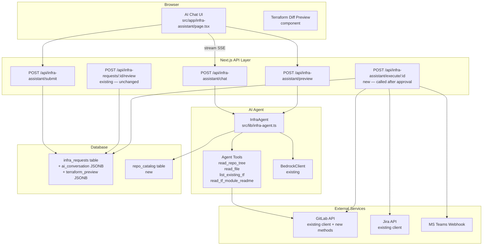
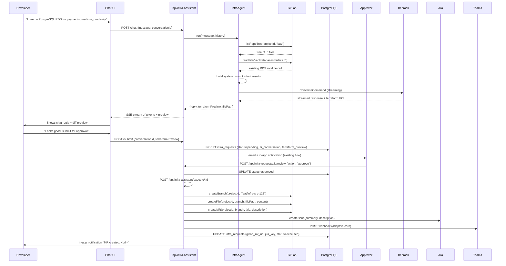
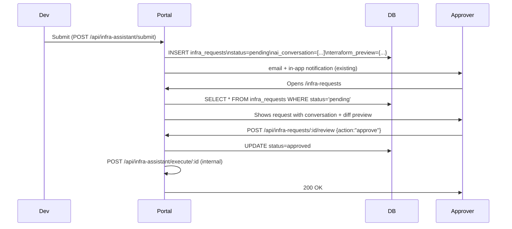

# Design Document: AI Infrastructure Assistant

## Overview

The AI Infrastructure Assistant replaces the rigid 4-resource form + n8n webhook pipeline with a conversational chat interface backed by Claude Sonnet (via the existing `BedrockClient`). The user describes what they need in plain language; the AI reads the team's actual GitLab infra repo to understand its structure, generates contextually correct Terraform, shows a diff preview, and — after portal approval — commits directly to GitLab, creates a branch + MR, opens a Jira ticket, and notifies Teams. The n8n flow is retired entirely.

The feature is additive: the existing `infra_requests` table, approval API routes, approver list, notification system, and email helpers are all reused. Two new columns and one new table extend the schema to carry conversation history and the generated Terraform preview.

---

## Architecture



---

## Sequence Diagrams

### Happy Path: Request → Approval → Execution



---

## Components and Interfaces

### InfraAgent (`src/lib/infra-agent.ts`)

The core orchestrator. Wraps `BedrockClient.invokeModel` with a tool-use loop.

**Interface**:
```typescript
interface AgentRunOptions {
  message: string
  history: ConversationMessage[]
  team: string
  projectId: number
  defaultBranch: string
  requestorEmail: string
}

interface AgentRunResult {
  reply: string
  terraformPreview: TerraformPreview | null
  updatedHistory: ConversationMessage[]
  done: boolean          // true when agent signals it has a complete preview ready
}

interface TerraformPreview {
  filePath: string       // e.g. "iac/databases/payments-rds.tf"
  content: string        // full HCL content
  resourceType: string   // "rds" | "s3" | "lambda" | "iam_role" | ...
  resourceName: string
  targetEnvironments: string[]
  estimatedCostMonthly: number | null
}

interface ConversationMessage {
  role: 'user' | 'assistant'
  content: string
  timestamp: string
  toolCalls?: ToolCall[]
  toolResults?: ToolResult[]
}

class InfraAgent {
  async run(opts: AgentRunOptions): Promise<AgentRunResult>
  async runStream(opts: AgentRunOptions): AsyncGenerator<AgentStreamChunk>
}
```

**Responsibilities**:
- Maintain the agentic tool-use loop (call Bedrock → parse tool calls → execute tools → feed results back → repeat until final answer)
- Enforce the security guardrails (read-only during generation phase)
- Produce a structured `TerraformPreview` when the agent signals completion
- Never write to GitLab — that is exclusively the job of the execute endpoint

---

### Agent Tools

The agent is given these tools via the Bedrock `toolConfig` parameter:

```typescript
const AGENT_TOOLS = [
  {
    name: "read_repo_tree",
    description: "List files and directories in the team's infra repo at a given path prefix. Use this first to understand the repo structure before reading files.",
    inputSchema: {
      type: "object",
      properties: {
        path_prefix: { type: "string", description: "Directory prefix to list, e.g. 'iac/' or 'iac/databases/'" }
      },
      required: ["path_prefix"]
    }
  },
  {
    name: "read_file",
    description: "Read the raw content of a file from the team's infra repo. Use to read existing Terraform files to understand patterns, variable names, module versions, and subnet references.",
    inputSchema: {
      type: "object",
      properties: {
        file_path: { type: "string", description: "Full path to the file, e.g. 'iac/databases/orders.tf'" }
      },
      required: ["file_path"]
    }
  },
  {
    name: "list_existing_tf_resources",
    description: "Scan all .tf files under a directory and return a summary of existing resource names and module calls. Useful to avoid naming conflicts.",
    inputSchema: {
      type: "object",
      properties: {
        directory: { type: "string", description: "Directory to scan, e.g. 'iac/databases/'" }
      },
      required: ["directory"]
    }
  },
  {
    name: "read_tf_module_readme",
    description: "Read the README of a Terraform module from the platform-engineering modules repo to understand required variables and usage examples.",
    inputSchema: {
      type: "object",
      properties: {
        module_name: {
          type: "string",
          enum: ["rds-module", "aws-lambda-module", "aws-iam-module"],
          description: "Name of the Terraform module"
        }
      },
      required: ["module_name"]
    }
  }
]
```

**Tool execution is read-only.** The agent cannot call any write operation (createBranch, createFile, createMR). Those are only invoked by the execute endpoint after human approval.

---

### GitLab Client Extensions (`src/lib/gitlab.ts`)

New methods added to the existing `GitLabClient` class:

```typescript
// List repository tree (files + directories) at a given path
async listRepoTree(
  projectId: number,
  path: string,
  ref: string,
  recursive?: boolean
): Promise<GitLabTreeItem[]>

interface GitLabTreeItem {
  id: string
  name: string
  type: 'blob' | 'tree'
  path: string
  mode: string
}

// Create a new branch from a ref
async createBranch(
  projectId: number,
  branchName: string,
  ref: string
): Promise<{ name: string; web_url: string }>

// Create or update a file in a branch
async createFile(
  projectId: number,
  filePath: string,
  branch: string,
  content: string,
  commitMessage: string
): Promise<{ file_path: string; branch: string }>

// Create a merge request
async createMR(
  projectId: number,
  sourceBranch: string,
  targetBranch: string,
  title: string,
  description: string
): Promise<{ iid: number; web_url: string }>
```

---

### Repo Catalog (`src/lib/repo-catalog.ts`)

Replaces the hardcoded `teamMap` in n8n and the `TEAM_REPO_MAPPING` in the form. Backed by a DB table so it can be extended without code changes.

```typescript
interface RepoCatalogEntry {
  id: number
  team: string                  // "Digital", "Helios", etc.
  gitlabProjectId: number
  defaultBranch: string         // "main" | "master"
  infraRootPath: string         // "iac/" — where Terraform lives in the repo
  description: string | null
  active: boolean
  createdAt: string
  updatedAt: string
}

class RepoCatalog {
  async getAll(): Promise<RepoCatalogEntry[]>
  async getByTeam(team: string): Promise<RepoCatalogEntry | null>
  async upsert(entry: Omit<RepoCatalogEntry, 'id' | 'createdAt' | 'updatedAt'>): Promise<RepoCatalogEntry>
  async deactivate(team: string): Promise<void>
}

export const repoCatalog = new RepoCatalog()
```

---

### Jira Integration (`src/lib/jira.ts` extension)

New function added to the existing Jira client:

```typescript
async function jiraCreateIssue(opts: {
  projectKey: string        // "SRE"
  issueTypeId: string       // "10048"
  summary: string
  description: string
  labels?: string[]
}): Promise<{ key: string; id: string; url: string }>
```

---

## Data Models

### `infra_requests` table — extended columns

```sql
ALTER TABLE infra_requests
  ADD COLUMN IF NOT EXISTS ai_conversation   JSONB,
  ADD COLUMN IF NOT EXISTS terraform_preview JSONB,
  ADD COLUMN IF NOT EXISTS gitlab_mr_url     TEXT,
  ADD COLUMN IF NOT EXISTS gitlab_branch     TEXT,
  ADD COLUMN IF NOT EXISTS jira_key          TEXT,
  ADD COLUMN IF NOT EXISTS executed_at       TIMESTAMPTZ;
```

`ai_conversation` shape:
```typescript
type StoredConversation = ConversationMessage[]
```

`terraform_preview` shape:
```typescript
interface StoredTerraformPreview {
  filePath: string
  content: string
  resourceType: string
  resourceName: string
  targetEnvironments: string[]
  estimatedCostMonthly: number | null
  generatedAt: string   // ISO timestamp
  repoProjectId: number
  repoBranch: string
}
```

### `repo_catalog` table — new

```sql
CREATE TABLE IF NOT EXISTS repo_catalog (
  id                SERIAL PRIMARY KEY,
  team              TEXT NOT NULL UNIQUE,
  gitlab_project_id INTEGER NOT NULL,
  default_branch    TEXT NOT NULL DEFAULT 'main',
  infra_root_path   TEXT NOT NULL DEFAULT 'iac/',
  description       TEXT,
  active            BOOLEAN NOT NULL DEFAULT true,
  created_at        TIMESTAMPTZ NOT NULL DEFAULT NOW(),
  updated_at        TIMESTAMPTZ NOT NULL DEFAULT NOW()
);

-- Seed with current known teams
INSERT INTO repo_catalog (team, gitlab_project_id, default_branch, infra_root_path) VALUES
  ('Digital',  45379727, 'main',   'iac/'),
  ('Helios',   71456629, 'main',   'iac/'),
  ('Retail',   45383610, 'main',   'iac/'),
  ('Commerce', 45379518, 'main',   'iac/'),
  ('Clusters', 45379816, 'main',   'iac/'),
  ('Tooling',  45950137, 'master', 'iac/')
ON CONFLICT (team) DO NOTHING;
```

---

## API Endpoints

### `POST /api/infra-assistant/chat`

Streams the agent response as Server-Sent Events.

**Request body**:
```typescript
{
  message: string
  conversationId: string | null   // null for first message
  team: string
}
```

**Response**: `text/event-stream`
```
data: {"type":"token","content":"I'll look at your repo..."}
data: {"type":"token","content":" to understand the structure."}
data: {"type":"tool_call","tool":"read_repo_tree","input":{"path_prefix":"iac/databases/"}}
data: {"type":"tool_result","tool":"read_repo_tree","output":"[...]"}
data: {"type":"preview","preview":{...TerraformPreview}}
data: {"type":"done","conversationId":"conv_abc123","reply":"Here is the Terraform..."}
```

**Auth**: `requireUserAuth` (any authenticated user)

---

### `POST /api/infra-assistant/submit`

Saves the conversation + preview to `infra_requests` and triggers the existing approval notification flow.

**Request body**:
```typescript
{
  conversationId: string
  conversation: ConversationMessage[]
  terraformPreview: TerraformPreview
  team: string
  approver: string    // email of selected approver
}
```

**Response**:
```typescript
{ id: number; status: "pending" }
```

**Side effects**: calls `createNotificationBatch` + `sendEmail` (reusing existing helpers) to notify the approver.

---

### `POST /api/infra-requests/:id/review` (existing — modified)

The existing review endpoint is modified in one place: when `action === "approve"`, instead of calling the n8n webhook it calls the new execute endpoint internally.

```typescript
// Replace n8n webhook call with:
await fetch(`${process.env.NEXTAUTH_URL}/api/infra-assistant/execute/${requestId}`, {
  method: "POST",
  headers: { "Content-Type": "application/json", "x-internal-secret": process.env.INTERNAL_SECRET },
  body: JSON.stringify({ approvedByEmail: reviewerEmail, approvedByName: reviewerName }),
})
```

---

### `POST /api/infra-assistant/execute/:id`

Internal endpoint (protected by `x-internal-secret` header, not exposed to the browser). Performs all write operations after approval.

**Steps** (each wrapped in try/catch with partial-failure logging):
1. Load `infra_requests` row, parse `terraform_preview`
2. Look up repo from `repo_catalog` by team
3. `gitlabClient.createBranch(projectId, "feat/infra-${jiraKey}", defaultBranch)`
4. `gitlabClient.createFile(projectId, filePath, branch, content, commitMessage)`
5. `gitlabClient.createMR(projectId, branch, defaultBranch, title, description)`
6. `jiraCreateIssue(...)` — returns `jiraKey`
7. POST Teams adaptive card webhook
8. `UPDATE infra_requests SET gitlab_mr_url, gitlab_branch, jira_key, executed_at, status='executed'`
9. `createNotification` to requestor with MR URL

**Idempotency**: if `executed_at IS NOT NULL`, return 200 immediately (no double-execution on retry).

---

## AI System Prompt

```
You are the Iskaypet Platform Engineering Infrastructure Assistant.
Your job is to help developers request AWS infrastructure by generating production-ready Terraform code
that fits their team's existing infra repository structure.

## Your workflow
1. When a user describes what they need, use the read_repo_tree tool to explore the team's infra repo.
2. Read 1-3 existing .tf files in the relevant directory to understand: module versions, variable names,
   subnet references, naming conventions, and tag patterns.
3. Read the relevant module README using read_tf_module_readme to understand required inputs.
4. Generate Terraform that follows the exact same patterns as the existing files.
5. Present the generated code to the user and ask for confirmation before they submit.

## Available Terraform modules (all in gitlab.com/iskaypetcom/digital/platform-engineering/aws/terraform-modules/)
- rds-module (ref: main) — PostgreSQL RDS instances
- aws-lambda-module (ref: main) — Lambda functions
- aws-iam-module (ref: main) — IAM roles with IRSA support

## Rules
- NEVER invent variable names, subnet IDs, or VPC IDs. Always read them from existing files in the repo.
- ALWAYS use the count = contains(var.target_environments, var.environment) ? 1 : 0 pattern for multi-env support.
- ALWAYS follow the naming convention you observe in the existing files.
- If you are unsure about a value, ask the user rather than guessing.
- You can only READ from the repo during this phase. You cannot create branches or commit files.
- When you have a complete, correct Terraform file ready, output it inside a <terraform_preview> XML tag
  followed by a JSON block with metadata: file_path, resource_type, resource_name, target_environments.

## Tone
Be concise and technical. The users are developers. Skip pleasantries.
```

---

## UI Component Design

### Chat Interface (`src/components/infra-assistant/chat-panel.tsx`)

```typescript
interface ChatPanelProps {
  team: string
  onPreviewReady: (preview: TerraformPreview) => void
  onSubmitReady: (conversationId: string) => void
}
```

Layout: split-pane. Left: chat messages + input. Right: Terraform diff preview (shown once the agent produces one).

Message types rendered:
- `user` — right-aligned bubble
- `assistant` — left-aligned, markdown rendered
- `tool_call` — collapsible "🔍 Reading repo..." indicator
- `preview` — triggers the right pane update

### Terraform Diff Preview (`src/components/infra-assistant/terraform-preview.tsx`)

```typescript
interface TerraformPreviewProps {
  preview: TerraformPreview
  onApprove: () => void   // triggers submit
  onEdit: () => void      // sends "please change X" back to chat
}
```

Renders the HCL with syntax highlighting (using `react-syntax-highlighter` or the existing code block pattern in the portal). Shows:
- File path badge
- Resource type + name
- Target environments chips
- Estimated cost (if available)
- "Submit for approval" button
- "Ask to change..." button

### Approver View (extension of existing infra-requests page)

The existing approver review UI at `/infra-requests` is extended to show:
- The full conversation history (collapsible)
- The Terraform diff preview (same component, read-only, no action buttons)
- The existing approve/reject buttons

---

## Approval Flow Integration



The approver sees exactly what will be committed — the same HCL that was shown to the developer. There is no template re-generation at execution time; the stored `terraform_preview.content` is committed verbatim.

---

## Repo Catalog Design

The `repo_catalog` table is the single source of truth for team → repo mapping. It replaces:
- The hardcoded `teamMap` object in `docs/n8n/infra-request-flow.json`
- The `TEAM_REPO_MAPPING` constant in `src/components/infra-request-form.tsx`

**Extensibility**: adding a new team requires one `INSERT` into `repo_catalog` — no code changes. A future admin UI can expose CRUD for this table.

**`infra_root_path`**: each entry stores where Terraform lives in that repo (default `iac/`). Some repos may use `terraform/` or `infra/` — this field handles that without special-casing.

---

## Error Handling

### Agent tool failures

If `read_repo_tree` or `read_file` returns an error (e.g. 404, token expired), the agent receives the error as the tool result and is instructed to tell the user it could not read the repo and ask them to provide the relevant details manually. The conversation continues — it does not crash.

### Execute endpoint partial failures

Each step in the execute endpoint is wrapped independently:

| Step | On failure |
|------|-----------|
| createBranch | Abort, set `status='execute_failed'`, notify requestor |
| createFile | Attempt to delete the branch, set `status='execute_failed'` |
| createMR | Branch + file exist; log error, set `gitlab_mr_url=null`, notify requestor to create MR manually |
| jiraCreateIssue | Log warning, continue — Jira is non-blocking |
| Teams webhook | Log warning, continue — Teams is non-blocking |

The `status` column gains a new value: `'execute_failed'` to distinguish from `'rejected'`.

### Conversation state

`conversationId` is a client-generated UUID stored in React state and passed on every `/chat` call. The full conversation is sent with each request (stateless server). On submit, the full conversation array is persisted to `ai_conversation`. This avoids server-side session state.

---

## Testing Strategy

### Unit Testing

- `InfraAgent.run()` — mock Bedrock responses and GitLab tool calls; assert that the tool-use loop terminates and produces a valid `TerraformPreview`
- `RepoCatalog` — test DB queries with a test database
- `gitlabClient` new methods — mock `fetch`, assert correct URL construction and request bodies
- Execute endpoint — mock all external calls; assert idempotency (second call returns 200 without re-executing)

### Property-Based Testing (fast-check)

- For any `TerraformPreview.content`, the generated HCL must contain the `count = contains(...)` pattern
- For any team name in `repo_catalog`, `getByTeam` must return a non-null entry with a positive `gitlabProjectId`
- The execute endpoint must be idempotent: calling it twice with the same `id` must not create two branches

### Integration Testing

- End-to-end: POST `/chat` with a real (or stubbed) Bedrock response → assert SSE stream contains a `preview` event
- Submit → review → execute flow with mocked GitLab/Jira/Teams

---

## Security Considerations

### What the AI can do
- Read any file in the team's infra repo (scoped to the project ID from `repo_catalog`)
- Read module READMEs from the platform-engineering modules repo

### What the AI cannot do
- Write to GitLab (no branch/file/MR creation during the chat phase)
- Access repos outside the team's registered `gitlabProjectId`
- Access other portal data (DORA metrics, FinOps, etc.)
- Execute Terraform or trigger pipelines

### Prompt injection defense
- Tool results (file contents from GitLab) are wrapped in a `<tool_result>` XML envelope before being fed back to the model, making it harder for malicious repo content to hijack the system prompt
- The system prompt explicitly states the agent's role and limitations
- Maximum token budget per conversation: 32k tokens (enforced in `inferenceConfig`)

### GitLab token scope
- The `GITLAB_TOKEN` used for the new write operations (createBranch, createFile, createMR) must have `api` scope on the relevant projects
- Recommend a dedicated service account token, not a personal token

### Internal execute endpoint
- Protected by `x-internal-secret` header (shared secret between the review route and the execute route, stored in env)
- Not reachable from the browser (middleware blocks the path for non-internal callers)

### Approval is mandatory
- The execute endpoint checks `status === 'approved'` before proceeding; it will not execute a `pending` or `rejected` request even if called directly

---

## What to Keep vs. Replace from n8n

| n8n node | Decision | Replacement |
|----------|----------|-------------|
| Webhook trigger | Replace | `/api/infra-requests/:id/review` calls execute endpoint directly |
| Jira Create | Replace | `jiraCreateIssue()` in execute endpoint |
| Map Project ID (hardcoded teamMap) | Replace | `repo_catalog` DB table |
| GitLab Create Branch | Replace | `gitlabClient.createBranch()` |
| Switch Resource + S3/RDS/Lambda/IAM templates | Replace | AI-generated Terraform (no hardcoded templates) |
| GitLab Commit | Replace | `gitlabClient.createFile()` |
| GitLab Create MR | Replace | `gitlabClient.createMR()` |
| Prepare Teams Card + Send Teams Notification | Keep logic, move to code | Teams webhook POST in execute endpoint |

The n8n flow (`docs/n8n/infra-request-flow.json`) can be deactivated once the execute endpoint is deployed and verified.

---

## Dependencies

- `@aws-sdk/client-bedrock-runtime` — already installed (used by `BedrockClient`)
- `@aws-sdk/client-sts` — already installed
- `react-syntax-highlighter` or equivalent — for HCL syntax highlighting in the diff preview (check if already in `package.json`; if not, add)
- No new infrastructure dependencies — GitLab, Jira, Teams, PostgreSQL, and Bedrock are all already wired up


---

## Correctness Properties

*A property is a characteristic or behavior that should hold true across all valid executions of a system — essentially, a formal statement about what the system should do. Properties serve as the bridge between human-readable specifications and machine-verifiable correctness guarantees.*

### Property 1: Chat API always streams a valid SSE response for non-empty messages

*For any* non-empty message sent to the Chat_API with a valid team, the response SHALL be a valid SSE stream containing at least one `token` event and a terminal `done` event with a non-empty `conversationId`.

**Validates: Requirements 1.1, 1.3, 1.5**

---

### Property 2: Agent reads repo before generating Terraform

*For any* InfraAgent run, the sequence of tool calls SHALL include at least one `read_repo_tree` call and at least one `read_file` call before a `TerraformPreview` is produced.

**Validates: Requirements 2.1, 2.2**

---

### Property 3: Generated Terraform contains the multi-environment count pattern

*For any* TerraformPreview produced by the InfraAgent, the `content` field SHALL contain the string `count = contains(var.target_environments, var.environment) ? 1 : 0`.

**Validates: Requirements 2.5**

---

### Property 4: TerraformPreview always has all required fields populated

*For any* TerraformPreview object produced by the InfraAgent, the fields `filePath`, `content`, `resourceType`, `resourceName`, and `targetEnvironments` SHALL all be non-empty/non-null.

**Validates: Requirements 2.4, 3.2**

---

### Property 5: Agent tool failures do not terminate the conversation

*For any* InfraAgent run where a tool call returns an error, the InfraAgent SHALL include the error as the tool result and produce a non-empty `reply` that continues the conversation rather than throwing an exception.

**Validates: Requirements 2.6, 9.1**

---

### Property 6: Submit persists conversation and preview with pending status

*For any* valid submission to the Submit_API, the resulting `infra_requests` row SHALL have `status = 'pending'`, a non-null `ai_conversation` array, and a non-null `terraform_preview` object containing the submitted TerraformPreview.

**Validates: Requirements 3.5**

---

### Property 7: Execute endpoint is idempotent

*For any* `infra_requests` row where `executed_at IS NOT NULL`, calling the Execute_API again SHALL return HTTP 200 without creating a new GitLab branch, committing a new file, creating a new MR, or creating a new Jira issue.

**Validates: Requirements 5.8**

---

### Property 8: Execute endpoint stores all output artifacts

*For any* successful Execute_API run, the resulting `infra_requests` row SHALL have non-null values for `gitlab_mr_url`, `gitlab_branch`, `jira_key`, `executed_at`, and `status = 'executed'`.

**Validates: Requirements 5.6**

---

### Property 9: Execute endpoint enforces approved status

*For any* `infra_requests` row with `status != 'approved'`, the Execute_API SHALL return HTTP 403 without invoking `GitLab_Client.createBranch`, `GitLab_Client.createFile`, `GitLab_Client.createMR`, or `Jira_Client.jiraCreateIssue`.

**Validates: Requirements 8.2, 8.3**

---

### Property 10: RepoCatalog upsert round-trip

*For any* valid `RepoCatalogEntry`, calling `RepoCatalog.upsert(entry)` followed by `RepoCatalog.getByTeam(entry.team)` SHALL return an object equivalent to the upserted entry (same `team`, `gitlabProjectId`, `defaultBranch`, `infraRootPath`).

**Validates: Requirements 6.4**

---

### Property 11: RepoCatalog deactivation hides team from lookups

*For any* active team in the RepoCatalog, calling `RepoCatalog.deactivate(team)` followed by `RepoCatalog.getByTeam(team)` SHALL return `null`.

**Validates: Requirements 6.5**

---

### Property 12: Agent tool results are XML-wrapped before Bedrock submission

*For any* tool result processed by the InfraAgent, the content passed to the Bedrock `ConverseCommand` SHALL be wrapped in a `<tool_result>` XML envelope.

**Validates: Requirements 8.6**

---

### Property 13: Agent is read-only during chat phase

*For any* InfraAgent run, the set of tool calls made SHALL be a subset of `{read_repo_tree, read_file, list_existing_tf_resources, read_tf_module_readme}` and SHALL NOT include any GitLab write operations.

**Validates: Requirements 8.1**
