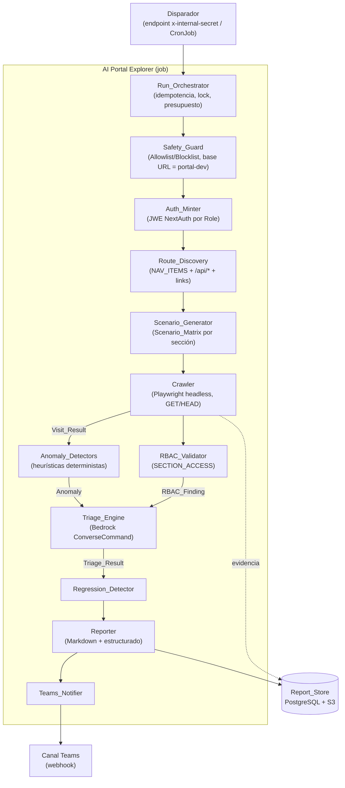
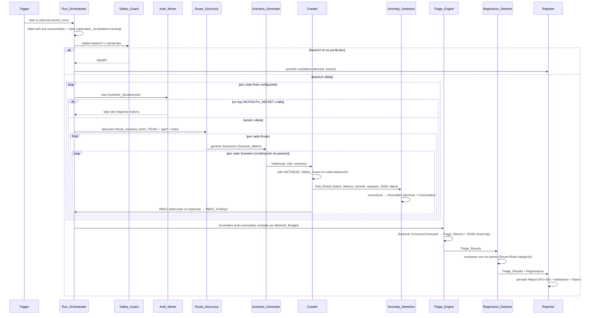
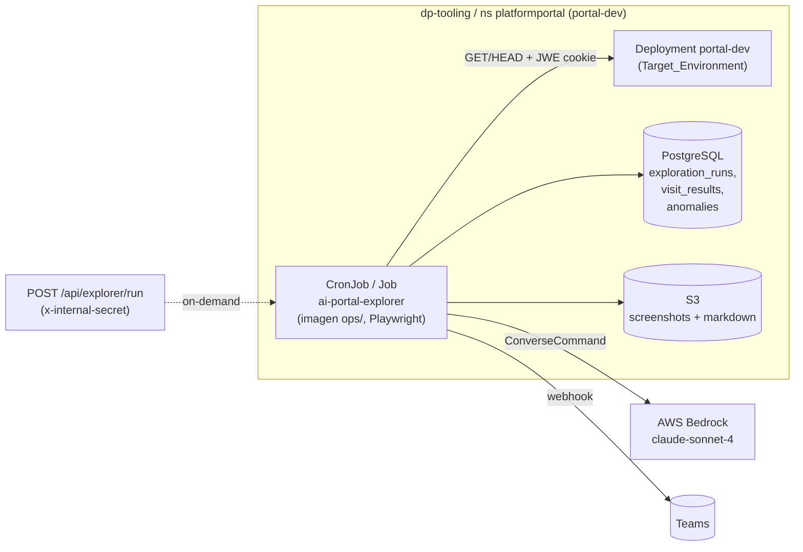

# Documento de Diseño — AI Portal Explorer

## Overview

El **AI Portal Explorer** es un sistema ejecutable como job (on-demand y CronJob) que recorre el Platform Portal de forma **estrictamente de solo lectura**, bajo cada rol RBAC mediante sesiones sintéticas, y se comporta como un **QA funcional exhaustivo**: no se limita a errores técnicos (consola JS, peticiones 4xx/5xx, latencia, estados de error del DOM) sino que **prueba combinaciones de parámetros** (rangos de fechas, filtros de equipo/proyecto/autor, selección de cuentas FinOps) para detectar **anomalías de datos y funcionales** — totales incoherentes, series temporales truncadas, empty-states donde debería haber datos, paginación que no avanza.

El sistema captura evidencia técnica y semántica de cada visita, pasa **únicamente las anomalías** por Amazon Bedrock para obtener un triage estructurado (severidad, categoría, causa probable, fix sugerido, evidencia), persiste un informe + histórico en PostgreSQL (y screenshots/markdown en S3), notifica a Teams y detecta regresiones entre ejecuciones.

### Caso motivador (bug real de Gestión)

En la pestaña Gestión (`engineering-dashboard`), con rango personalizado `01/01/2026–28/03/2026`, aparece "No hay datos de MRs para el periodo seleccionado" pese a que sí hubo actividad. Causa probable: la snapshot `gitlab_mr_analytics` se re-upserta a 90 días (`src/lib/mr-snapshot.ts`, `ninetyDaysAgo`), así que los rangos históricos quedan vacíos. El arreglo del bug es otro spec; **el Explorer debe ser capaz de DETECTARLO** automáticamente probando un rango que cruza el límite de 90 días y reconociendo el empty-state como anomalía funcional (no técnica: la petición devuelve 200 OK con cero datos).

### Principios de diseño

1. **Solo lectura innegociable**: el `Safety_Guard` permite una interacción si y solo si pertenece a la Allowlist; el `Crawler` solo emite GET/HEAD. Cero mutaciones, fijado a `portal-dev`.
2. **QA funcional, no solo técnico**: el barrido cruza parámetros seguros (Scenario_Matrix) y aplica heurísticas deterministas de anomalía de datos, complementadas por juicio semántico de Bedrock.
3. **Reutilización del estado actual**: NextAuth/JWE (`NEXTAUTH_SECRET`), `SECTION_ACCESS` de `rbac.ts`, `NAV_ITEMS` de `portal-shell.tsx`, `bedrock.ts` (ConverseCommand), `db.ts` (PostgreSQL), `teams-notify.ts`, patrón de jobs `ops/` + `generic-chart` CronJobs (como `lighthouse-scanner` con runtime de navegador).
4. **Robustez**: idempotencia, degradación elegante (un fallo de ruta no aborta el run), coste de Bedrock acotado por presupuesto, ejecución única (no concurrente).

### Separación determinista vs. semántico (clave del intent)

| Capa | Qué hace | Dónde vive | Testeable por |
|------|----------|------------|---------------|
| **Heurísticas deterministas** | Detectan anomalías de datos computables: serie truncada antes del fin del rango, empty-state con expectativa de datos, paginación estancada, totales incoherentes entre rangos solapados, valores `null`/`NaN`/`-`, latencia/timeout, RBAC | `anomaly-detectors.ts` (funciones puras) | **PBT** (este documento) |
| **Juicio semántico** | Severidad, categoría, causa probable, fix sugerido, "¿este empty-state es esperable o un bug?" sobre la evidencia (incl. screenshot/extracto de datos) | `triage-engine.ts` → Bedrock | Integración (mocks) |

Las heurísticas **marcan candidatos** (Anomalies) de forma determinista y barata; Bedrock **enriquece y prioriza** solo esos candidatos. Esta frontera es lo que hace el sistema testeable y económico.

## Architecture

### Componentes y flujo de alto nivel



### Pipeline de un Exploration_Run



### Topología de despliegue (reutiliza el patrón existente)



**Decisiones de despliegue:**
- La imagen del job se construye con el patrón de `ops/` (como `Dockerfile.lighthouse`: `node:20-slim` + Chromium). El Explorer usa **Playwright** (no Puppeteer/Lighthouse) por su API de interceptación de red, captura de consola y `route()` para bloquear métodos no-GET a nivel de transporte.
- Se declara como `cronjobs.jobs` en `generic-chart` (GitOps `argocd/tooling`), `envFrom` el secret `portal-env`, `concurrencyPolicy: Forbid`, `activeDeadlineSeconds` acotado.
- El endpoint on-demand `POST /api/explorer/run` vive en el portal-dev, validado por `requireInternalAuth` (`x-internal-secret`), y arranca el run en background (patrón de los snapshots existentes).
- IRSA `portal-inventory-irsa` para acceso a Bedrock (vía role chain) y S3.

## Components and Interfaces

Todas las firmas en TypeScript. Los módulos viven en `src/lib/explorer/` (lógica pura y orquestación reutilizable por el job y el endpoint) y el runner del job en `ops/portal-explorer/`.

### Tipos compartidos (`src/lib/explorer/types.ts`)

```typescript
import type { AppRole, PortalSection } from "@/lib/rbac";

/** Entorno objetivo, fijado a portal-dev. */
export interface TargetEnvironment {
  baseUrl: string;            // https://portal.today.dev.tooling.dp.iskaypet.com
  namespace: "platformportal";
  isDevelopment: true;
}

/** Una Route navegable: UI o endpoint de API. */
export interface Route {
  id: string;                 // estable: hash de kind+path
  kind: "ui" | "api";
  path: string;               // "/metrics", "/api/metrics/team-activity"
  section: PortalSection;
  /** Plantillas de parámetros seguros (query/path) para esta Route. */
  paramSpec?: ParamSpec;
}

/** Especificación de parámetros seguros para una Route. */
export interface ParamSpec {
  dateRange?: boolean;        // admite startDate/endDate
  filters?: FilterSpec[];     // team, project, author, accountIds...
}

export interface FilterSpec {
  key: string;                // "team" | "accountIds" | "projectIds" | "author"
  safeValues: string[];       // valores de ejemplo seguros (configurables)
}

/** Un Scenario = Route + una combinación concreta de parámetros seguros. */
export interface Scenario {
  scenarioId: string;         // estable y determinista (ver buildScenarioId)
  route: Route;
  params: Record<string, string>;   // { startDate, endDate, team, accountIds }
  /** Expectativa de datos: ¿este scenario DEBERÍA devolver datos? */
  expectsData: boolean;
  /** Etiqueta semántica del scenario (p.ej. "crosses-90d-boundary"). */
  label?: string;
}

/** Resultado de visitar un Scenario con un Role. */
export interface VisitResult {
  runId: string;
  scenarioId: string;
  route: Route;
  role: AppRole;
  params: Record<string, string>;
  httpStatus: number | null;       // status de la respuesta principal
  latencyMs: number;
  timedOut: boolean;
  consoleErrors: ConsoleError[];
  failedRequests: FailedRequest[];
  domErrorStates: DomErrorState[];
  /** Señal de datos extraída del DOM/JSON para heurísticas funcionales. */
  dataSignal: DataSignal | null;
  screenshotRef: string | null;    // s3://... o null para rutas API
  accessObserved: "granted" | "denied";
  uncaughtError?: string;          // excepción no controlada de la Visit
}

export interface ConsoleError { message: string; }
export interface FailedRequest { url: string; method: string; status: number | null; }
export interface DomErrorState { kind: "error-message" | "blank-page" | "empty-state" | "render-exception"; detail: string; }

/**
 * Señal de datos para heurísticas funcionales/semánticas. Extraída de forma
 * best-effort del DOM (cards, tablas, charts) o del JSON de una respuesta API.
 */
export interface DataSignal {
  isEmptyState: boolean;            // se ve "No hay datos..." o lista vacía
  rowCount: number | null;          // filas de tabla / items de lista
  timeSeries: TimeSeriesSignal | null;
  pagination: PaginationSignal | null;
  totals: Record<string, number>;   // KPIs/totales nombrados detectados
}

/** Señal de serie temporal para detectar truncamiento. */
export interface TimeSeriesSignal {
  requestedStart: string;           // YYYY-MM-DD (del scenario)
  requestedEnd: string;
  firstDataPoint: string | null;    // fecha del primer punto con datos
  lastDataPoint: string | null;     // fecha del último punto con datos
  pointCount: number;
}

/** Señal de paginación para detectar estancamiento. */
export interface PaginationSignal {
  pageIndex: number;
  hasNextControl: boolean;          // existe un control "siguiente" habilitado
  pageItemSignature: string;        // hash de los items de esta página
}

export type AnomalyCategory =
  | "console-error" | "failed-request" | "dom-error" | "performance" | "timeout"
  | "rbac" | "empty-state" | "truncated-series" | "stuck-pagination"
  | "incoherent-totals" | "suspicious-null";

export interface Anomaly {
  anomalyId: string;                // determinista: ver buildAnomalyId
  runId: string;
  route: Route;
  role: AppRole;
  scenarioId: string;
  category: AnomalyCategory;
  detector: "deterministic" | "rbac";
  evidence: AnomalyEvidence;
}

export interface AnomalyEvidence {
  summary: string;
  httpStatus: number | null;
  latencyMs: number | null;
  consoleErrors: string[];
  failedRequests: FailedRequest[];
  domErrorStates: DomErrorState[];
  dataSignal: DataSignal | null;
  screenshotRef: string | null;
  expectedAccess?: "granted" | "denied";
  observedAccess?: "granted" | "denied";
}

export type Severity = "critical" | "high" | "medium" | "low" | "info";
export const SEVERITY_ORDER: Severity[] = ["critical", "high", "medium", "low", "info"];

export type TriageStatus = "triaged" | "triage-unavailable" | "triage-skipped-budget";

/** Salida estructurada del triage de una Anomaly. */
export interface TriageResult {
  id: string;                       // == anomalyId
  route: string;                    // route.path
  role: AppRole;
  severity: Severity;
  category: AnomalyCategory;
  probable_cause: string;
  suggested_fix: string;
  evidence: AnomalyEvidence;
  status: TriageStatus;
}

export type RunStatus = "running" | "completed" | "completed-with-errors" | "aborted";

export interface ExplorationRun {
  runId: string;
  startedAt: string;
  finishedAt: string | null;
  status: RunStatus;
  abortReason: string | null;
  rolesCovered: AppRole[];
  baseUrl: string;
}
```

### Safety_Guard (`src/lib/explorer/safety-guard.ts`)

```typescript
/** Métodos HTTP de solo lectura permitidos. */
export const SAFE_METHODS = ["GET", "HEAD"] as const;

/** Patrones de etiqueta/control que indican mutación (Blocklist). */
export const MUTATION_KEYWORDS = [
  "submit", "delete", "approve", "reject", "execute", "cancel",
  "create", "rotate", "modify", "sync", "remove", "save", "send",
];

export interface InteractionCandidate {
  kind: "navigate" | "read" | "open-panel" | "paginate" | "http" | "submit-form" | "click-button";
  httpMethod?: string;             // para kind === "http"
  controlLabel?: string;           // texto del botón/control
  controlAttributes?: Record<string, string>;
}

export interface GuardDecision {
  allowed: boolean;
  reason: string;
}

/** Decide si una interacción candidata pertenece a la Allowlist. (Req 1.3, 1.4) */
export function evaluateInteraction(candidate: InteractionCandidate): GuardDecision;

/** Valida que la base URL corresponde al Target_Environment de desarrollo. (Req 1.2) */
export function isDevTargetEnvironment(baseUrl: string): boolean;

/** Normaliza un método HTTP y decide si es seguro. (Req 1.5, 1.6) */
export function isSafeMethod(method: string): boolean;
```

`evaluateInteraction` es **default-deny**: permite solo `navigate`/`read`/`open-panel`/`paginate` y `http` con método seguro; bloquea `submit-form`, `click-button` cuyo `controlLabel`/atributos casen (substring, case-insensitive) con `MUTATION_KEYWORDS`, y cualquier `http` con método no seguro.

### Auth_Minter (`src/lib/explorer/auth-minter.ts`)

```typescript
import type { AppRole } from "@/lib/rbac";

export interface SyntheticSession {
  role: AppRole;
  cookieName: string;              // next-auth.session-token / __Secure-...
  cookieValue: string;             // JWE cifrado con NEXTAUTH_SECRET
  synthetic: true;                 // marca de identidad sintética (Req 2.4)
}

/**
 * Acuña una cookie de sesión NextAuth (JWE) válida para un Role, sin login OIDC.
 * Usa el mismo `encode` de next-auth/jwt con NEXTAUTH_SECRET, replicando los
 * claims que produce el callback jwt() de src/lib/auth.ts (appRole, roles, oid).
 * (Req 2.1, 2.2, 2.4)
 */
export async function mintSyntheticSession(role: AppRole): Promise<SyntheticSession>;

/** True si el entorno puede acuñar sesiones (NEXTAUTH_SECRET presente). (Req 2.5) */
export function canMintSessions(): boolean;

/** Construye los claims sintéticos para un Role (identidad no-real). */
export function buildSyntheticClaims(role: AppRole): Record<string, unknown>;
```

La identidad sintética usa un email reservado (p.ej. `explorer+<role>@synthetic.invalid`) y `appRole`/`roles` coherentes con el `ROLE_ALIASES` de `rbac.ts`, de modo que `middleware.ts` y `api-auth.ts` resuelvan el rol esperado. Las sesiones **no se persisten** en el Report (Req 2.6).

### RBAC_Validator (`src/lib/explorer/rbac-validator.ts`)

```typescript
import type { AppRole, PortalSection } from "@/lib/rbac";

export interface RbacExpectation {
  section: PortalSection;
  role: AppRole;
  expected: "granted" | "denied";
}

/** Deriva la matriz esperada desde SECTION_ACCESS de rbac.ts. (Req 3.1) */
export function deriveRbacExpectations(roles: AppRole[]): RbacExpectation[];

/** Expectativa para un (role, section) concreto. */
export function expectedAccess(role: AppRole, section: PortalSection): "granted" | "denied";

export interface RbacFinding {
  route: Route;
  role: AppRole;
  observed: "granted" | "denied";
  expected: "granted" | "denied";
  kind: "unauthorized-access" | "wrongly-blocked";
  minSeverity: Severity;          // "high" para unauthorized-access (Req 3.3)
}

/** Compara acceso observado vs esperado y produce un RBAC_Finding si difieren. (Req 3.2-3.6) */
export function evaluateRbac(
  route: Route,
  role: AppRole,
  observed: "granted" | "denied",
): RbacFinding | null;
```

### Route_Discovery (`src/lib/explorer/route-discovery.ts`)

```typescript
/** Rutas de UI base derivadas de NAV_ITEMS (espejo del array de portal-shell.tsx). */
export function discoverNavRoutes(): Route[];

/** Endpoints /api/* conocidos accesibles por GET (catálogo curado + validación). */
export function discoverApiRoutes(): Route[];

/** Añade una Route destino al inventario si no está presente (dedupe por id). (Req 4.3) */
export function addRouteIfAbsent(inventory: Route[], candidate: Route): Route[];

/** True si la URL pertenece al dominio del Target_Environment. (Req 4.6) */
export function isInternalUrl(url: string, baseUrl: string): boolean;

/** Inventario completo: NAV_ITEMS + descendientes + /api/* GET, dedupe. (Req 4.1, 4.2, 4.4) */
export function buildRouteInventory(baseUrl: string): Promise<Route[]>;
```

### Scenario_Generator (`src/lib/explorer/scenario-generator.ts`)

```typescript
/**
 * Matriz de scenarios configurable por sección. Define qué rangos de fechas y
 * filtros seguros se prueban en cada Route que admite parámetros.
 */
export interface ScenarioMatrix {
  dateRanges: DateRangeSpec[];
  filtersBySection: Partial<Record<PortalSection, FilterSpec[]>>;
}

export interface DateRangeSpec {
  label: string;                   // "last-7d", "last-90d", "crosses-90d-boundary", "historic-q1"
  startDate: string;               // YYYY-MM-DD (relativo a runDate, resuelto al generar)
  endDate: string;
  /** ¿Se espera que este rango devuelva datos? Alimenta expectsData. */
  expectsData: boolean;
}

/** Matriz por defecto. Incluye DELIBERADAMENTE un rango que cruza el límite de 90 días. */
export const DEFAULT_SCENARIO_MATRIX: ScenarioMatrix;

/**
 * Genera los Scenarios de una Route a partir de la matriz: producto cartesiano
 * acotado de rangos de fechas × filtros seguros. Determinista. (Req 4.5)
 */
export function generateScenarios(route: Route, matrix: ScenarioMatrix, runDate: string): Scenario[];

/** ID de scenario estable y determinista (independiente de runId/timestamp). */
export function buildScenarioId(route: Route, params: Record<string, string>): string;
```

`DEFAULT_SCENARIO_MATRIX` incluye, para secciones con `dateRange` (metrics, finops), un `DateRangeSpec` etiquetado `"crosses-90d-boundary"` (p.ej. `2026-01-01`–`2026-03-28`) con `expectsData: true` — exactamente el rango del bug de Gestión. Si el portal devuelve empty-state ahí, la heurística lo marca.

### Anomaly_Detectors (`src/lib/explorer/anomaly-detectors.ts`)

El corazón testeable del QA funcional. Todas son **funciones puras** `VisitResult -> Anomaly[]`.

```typescript
/** Heurísticas técnicas: console errors, failed requests, DOM errors. (Req 5.7) */
export function detectTechnicalAnomalies(visit: VisitResult): Anomaly[];

/** Latencia por encima del umbral configurable. (Req 5.6) */
export function detectLatencyAnomaly(visit: VisitResult, thresholdMs: number): Anomaly | null;

/** Timeout: la Visit superó el tiempo máximo. (Req 10.6) */
export function detectTimeoutAnomaly(visit: VisitResult): Anomaly | null;

/**
 * Empty-state con expectativa de datos: el scenario esperaba datos
 * (expectsData) pero el resultado es un empty-state / rowCount 0. (intent: bug Gestión)
 */
export function detectEmptyStateAnomaly(visit: VisitResult, scenario: Scenario): Anomaly | null;

/**
 * Serie truncada: la serie temporal termina antes del fin del rango pedido
 * (lastDataPoint < requestedEnd más allá de una tolerancia), pese a esperar datos.
 */
export function detectTruncatedSeriesAnomaly(visit: VisitResult): Anomaly | null;

/**
 * Paginación estancada: existe control "siguiente" habilitado pero la página
 * siguiente repite la firma de items de la anterior (no avanza).
 */
export function detectStuckPaginationAnomaly(prev: VisitResult, next: VisitResult): Anomaly | null;

/**
 * Totales incoherentes: dos scenarios con rangos solapados (o la misma métrica
 * en dos vistas) producen totales que violan una relación esperada
 * (p.ej. el total de un rango mayor no puede ser menor que el de un sub-rango).
 */
export function detectIncoherentTotals(a: VisitResult, b: VisitResult): Anomaly | null;

/** Valores sospechosos: null / NaN / "-" en KPIs donde se esperaba número. */
export function detectSuspiciousNulls(visit: VisitResult): Anomaly | null;

/** Orquestador: aplica todos los detectores deterministas a un Visit_Result. */
export function detectAnomalies(
  visit: VisitResult,
  scenario: Scenario,
  config: DetectorConfig,
): Anomaly[];

export interface DetectorConfig {
  latencyThresholdMs: number;
  seriesEndToleranceDays: number;
}

/** ID de anomalía determinista a partir de route+role+category+scenario. */
export function buildAnomalyId(runId: string, route: Route, role: AppRole, category: AnomalyCategory, scenarioId: string): string;

/** Clave de equivalencia para regresiones: Route + Role + categoría. (Req 8.4) */
export function anomalyEquivalenceKey(a: Anomaly | TriageResult): string;
```

### Triage_Engine (`src/lib/explorer/triage-engine.ts`)

```typescript
/** Invoca Bedrock (ConverseCommand) con la evidencia y devuelve un Triage_Result. (Req 6.1, 6.2) */
export async function triageAnomaly(anomaly: Anomaly, deps: TriageDeps): Promise<TriageResult>;

/**
 * Procesa el lote de Anomalies respetando el Bedrock_Budget: hasta `budget`
 * invocaciones; el resto se marca triage-skipped-budget. Las que fallan se
 * marcan triage-unavailable y NO abortan. (Req 6.4, 6.5, 6.6, 9.4)
 */
export async function triageAll(anomalies: Anomaly[], budget: number, deps: TriageDeps): Promise<TriageResult[]>;

export interface TriageDeps {
  invokeBedrock: (prompt: string, system: string, evidence: AnomalyEvidence) => Promise<string>;
  parseTriage: (raw: string, anomaly: Anomaly) => TriageResult;
}

/** Serializa un Triage_Result a JSON canónico. (Req 6.7) */
export function serializeTriageResult(t: TriageResult): string;

/** Deserializa JSON a Triage_Result. Inversa de serializeTriageResult. (Req 6.7) */
export function deserializeTriageResult(json: string): TriageResult;

/** Fallback determinista cuando Bedrock falla o se omite (severidad desde categoría). */
export function fallbackTriage(anomaly: Anomaly, status: TriageStatus): TriageResult;
```

El prompt incluye la evidencia estructurada y, cuando hay screenshot, su referencia/contenido para juicio semántico (¿el empty-state es esperable o un bug?). El modelo es `eu.anthropic.claude-sonnet-4-20250514-v1:0` vía el patrón de `bedrock.ts`.

### Regression_Detector (`src/lib/explorer/regression-detector.ts`)

```typescript
/**
 * Identifica como Regression cada Anomaly del run actual ausente (por
 * Route+Role+categoría) en el run previo comparable. (Req 8.1, 8.4)
 */
export function detectRegressions(
  current: TriageResult[],
  previous: TriageResult[] | null,
): RegressionReport;

export interface RegressionReport {
  hasBaseline: boolean;            // false si no hay run previo (Req 8.3)
  regressions: TriageResult[];     // nuevas respecto al baseline
}
```

### Reporter (`src/lib/explorer/reporter.ts`) y Teams_Notifier

```typescript
export interface Report {
  run: ExplorationRun;
  triageResults: TriageResult[];
  regressions: RegressionReport;
  summary: ReportSummary;
}

export interface ReportSummary {
  routesVisited: number;
  anomaliesBySeverity: Record<Severity, number>;
  rbacFindings: number;
}

/** Calcula el resumen determinista del run. (Req 7.4) */
export function buildSummary(visits: VisitResult[], triage: TriageResult[]): ReportSummary;

/** Renderiza el Report como Markdown consumible por el asistente. (Req 7.2, 7.3) */
export function renderMarkdown(report: Report): string;

/** Construye la Adaptive Card de resumen para Teams (reusa buildDigestCard/sendTeamsCard). (Req 7.5) */
export function buildExplorerTeamsCard(report: Report, reportUrl: string): Record<string, unknown>;
```

### Run_Orchestrator (`src/lib/explorer/orchestrator.ts`)

```typescript
export interface RunConfig {
  baseUrl: string;
  roles: AppRole[];
  scenarioMatrix: ScenarioMatrix;
  detector: DetectorConfig;
  bedrockBudget: number;
  visitTimeoutMs: number;
}

/** Ejecuta un Exploration_Run completo. Idempotente, no concurrente, degradación elegante. */
export async function runExploration(config: RunConfig, deps: OrchestratorDeps): Promise<Report>;

/** Reclama el lock de ejecución única; false si ya hay un run en curso. (Req 9.5) */
export function claimRunLock(deps: OrchestratorDeps): Promise<{ acquired: boolean; runId: string }>;
```

## Data Models

Migración `migrations/2026-06-20_ai_portal_explorer.sql` (PostgreSQL 16). Screenshots y markdown completo en S3; PostgreSQL guarda metadatos, evidencia estructurada (JSONB) y referencias S3.

### Tabla `exploration_runs`

```sql
CREATE TABLE IF NOT EXISTS exploration_runs (
  run_id            UUID PRIMARY KEY,
  started_at        TIMESTAMPTZ NOT NULL DEFAULT NOW(),
  finished_at       TIMESTAMPTZ,
  status            TEXT NOT NULL DEFAULT 'running',  -- running|completed|completed-with-errors|aborted
  abort_reason      TEXT,
  base_url          TEXT NOT NULL,
  roles_covered     JSONB NOT NULL DEFAULT '[]',      -- AppRole[]
  trigger_source    TEXT NOT NULL DEFAULT 'cron',     -- cron|on-demand
  routes_visited    INTEGER NOT NULL DEFAULT 0,
  anomalies_total   INTEGER NOT NULL DEFAULT 0,
  bedrock_calls     INTEGER NOT NULL DEFAULT 0,
  report_markdown_ref TEXT,                            -- s3://...
  summary           JSONB                              -- ReportSummary
);

CREATE INDEX IF NOT EXISTS idx_exploration_runs_started ON exploration_runs (started_at DESC);
CREATE INDEX IF NOT EXISTS idx_exploration_runs_status  ON exploration_runs (status, started_at DESC);
```

### Tabla `visit_results`

```sql
CREATE TABLE IF NOT EXISTS visit_results (
  id                BIGSERIAL PRIMARY KEY,
  run_id            UUID NOT NULL REFERENCES exploration_runs(run_id) ON DELETE CASCADE,
  scenario_id       TEXT NOT NULL,
  route_path        TEXT NOT NULL,
  route_kind        TEXT NOT NULL,                     -- ui|api
  section           TEXT NOT NULL,
  role              TEXT NOT NULL,
  params            JSONB NOT NULL DEFAULT '{}',
  http_status       INTEGER,
  latency_ms        INTEGER NOT NULL DEFAULT 0,
  timed_out         BOOLEAN NOT NULL DEFAULT FALSE,
  access_observed   TEXT NOT NULL,                     -- granted|denied
  console_errors    JSONB NOT NULL DEFAULT '[]',
  failed_requests   JSONB NOT NULL DEFAULT '[]',
  dom_error_states  JSONB NOT NULL DEFAULT '[]',
  data_signal       JSONB,                             -- DataSignal
  screenshot_ref    TEXT,                              -- s3://...
  uncaught_error    TEXT,
  created_at        TIMESTAMPTZ NOT NULL DEFAULT NOW(),
  UNIQUE (run_id, scenario_id, role)                   -- una Visit por scenario+role (Req 4.4)
);

CREATE INDEX IF NOT EXISTS idx_visit_results_run ON visit_results (run_id);
CREATE INDEX IF NOT EXISTS idx_visit_results_route_role ON visit_results (route_path, role);
```


### Tabla `anomalies`

```sql
CREATE TABLE IF NOT EXISTS anomalies (
  anomaly_id        TEXT NOT NULL,
  run_id            UUID NOT NULL REFERENCES exploration_runs(run_id) ON DELETE CASCADE,
  scenario_id       TEXT NOT NULL,
  route_path        TEXT NOT NULL,
  role              TEXT NOT NULL,
  category          TEXT NOT NULL,                     -- AnomalyCategory
  detector          TEXT NOT NULL,                     -- deterministic|rbac
  equivalence_key   TEXT NOT NULL,                     -- route+role+category (Req 8.4)
  evidence          JSONB NOT NULL,                    -- AnomalyEvidence
  created_at        TIMESTAMPTZ NOT NULL DEFAULT NOW(),
  PRIMARY KEY (run_id, anomaly_id)
);

CREATE INDEX IF NOT EXISTS idx_anomalies_run ON anomalies (run_id);
CREATE INDEX IF NOT EXISTS idx_anomalies_equiv ON anomalies (equivalence_key);
```

### Tabla `triage_results`

```sql
CREATE TABLE IF NOT EXISTS triage_results (
  id                TEXT NOT NULL,                     -- == anomaly_id
  run_id            UUID NOT NULL REFERENCES exploration_runs(run_id) ON DELETE CASCADE,
  route_path        TEXT NOT NULL,
  role              TEXT NOT NULL,
  severity          TEXT NOT NULL,                     -- critical|high|medium|low|info
  category          TEXT NOT NULL,
  probable_cause    TEXT NOT NULL,
  suggested_fix     TEXT NOT NULL,
  evidence          JSONB NOT NULL,
  status            TEXT NOT NULL,                     -- triaged|triage-unavailable|triage-skipped-budget
  is_regression     BOOLEAN NOT NULL DEFAULT FALSE,    -- (Req 8.1, 8.2)
  equivalence_key   TEXT NOT NULL,
  created_at        TIMESTAMPTZ NOT NULL DEFAULT NOW(),
  PRIMARY KEY (run_id, id)
);

CREATE INDEX IF NOT EXISTS idx_triage_run_sev ON triage_results (run_id, severity);
CREATE INDEX IF NOT EXISTS idx_triage_equiv ON triage_results (equivalence_key, created_at DESC);
```

### Tabla `explorer_run_lock` (ejecución única)

```sql
-- Lock de ejecución única: una sola fila singleton. El claim atómico evita runs
-- concurrentes (Req 9.5), análogo al patrón de deploy_notifications.
CREATE TABLE IF NOT EXISTS explorer_run_lock (
  id                INTEGER PRIMARY KEY DEFAULT 1 CHECK (id = 1),
  active_run_id     UUID,
  acquired_at       TIMESTAMPTZ,
  CONSTRAINT explorer_run_lock_singleton CHECK (id = 1)
);
```

El claim usa `UPDATE explorer_run_lock SET active_run_id = $1, acquired_at = NOW() WHERE id = 1 AND active_run_id IS NULL` y comprueba `rowCount`; al finalizar se libera con `active_run_id = NULL`. El histórico se conserva (Req 7.7): nunca se borran runs anteriores.

### Relación de entidades

```mermaid
erDiagram
    exploration_runs ||--o{ visit_results : "tiene"
    exploration_runs ||--o{ anomalies : "tiene"
    exploration_runs ||--o{ triage_results : "tiene"
    anomalies ||--|| triage_results : "triage de"
    exploration_runs }o--|| explorer_run_lock : "claim"


## Correctness Properties

*Una propiedad es una característica o comportamiento que debe cumplirse en todas las ejecuciones válidas de un sistema — esencialmente, una afirmación formal sobre lo que el sistema debe hacer. Las propiedades son el puente entre las especificaciones legibles por humanos y las garantías de corrección verificables por máquina.*

Esta feature es **altamente adecuada para property-based testing**: la lógica de QA funcional (Safety_Guard, derivación RBAC, detectores de anomalías deterministas, round-trip del Triage_Result, equivalencia de regresiones e idempotencia del barrido) son funciones puras con propiedades universales. El juicio semántico de Bedrock, la captura con navegador y la configuración IaC se cubren con tests de integración/snapshot (ver Testing Strategy), no con PBT.

Tras la reflexión de propiedades, se consolidaron criterios redundantes: los criterios de solo lectura (1.3–1.8) se agrupan en una propiedad de Allowlist más una de método HTTP; los de RBAC_Finding (3.2–3.6) en una sola propiedad; la forma del Triage_Result (6.1–6.3) en una propiedad de buena-formación.

### Property 1: El entorno objetivo está fijado a desarrollo

*Para toda* base URL, el Explorer arranca un Exploration_Run si y solo si la URL pertenece al dominio del Target_Environment de desarrollo (`portal-dev`); en cualquier otro caso aborta antes de realizar ninguna Visit y registra el motivo.

**Validates: Requirements 1.2**

### Property 2: El Safety_Guard solo permite interacciones de solo lectura (default-deny)

*Para toda* interacción candidata, el Safety_Guard la permite si y solo si pertenece a la Allowlist (navegar, leer, abrir paneles/tabs, paginar lecturas, o petición HTTP de método seguro); toda interacción de mutación (envío de formulario, o control cuya etiqueta/atributos casen con la Blocklist) es bloqueada y registrada con su motivo.

**Validates: Requirements 1.3, 1.4, 1.7, 1.8**

### Property 3: El Crawler solo emite métodos HTTP seguros

*Para todo* string de método HTTP, `isSafeMethod` devuelve verdadero si y solo si normaliza (case-insensitive) a `GET` o `HEAD`; en consecuencia, para todo Exploration_Run el conjunto de peticiones emitidas hacia el Portal contiene únicamente métodos seguros.

**Validates: Requirements 1.5, 1.6, 1.8**

### Property 4: Las sesiones sintéticas round-trip al rol pedido y se marcan sintéticas

*Para todo* Role del conjunto `{admin, directores, staff, desarrolladores, externos}`, acuñar una Synthetic_Session y decodificar su cookie JWE con `NEXTAUTH_SECRET` produce unos claims cuyo `appRole` resuelve exactamente a ese Role y cuya identidad está marcada como sintética.

**Validates: Requirements 2.1, 2.2, 2.4**

### Property 5: Las sesiones sintéticas nunca se persisten en el Report

*Para todo* Report producido por un Exploration_Run, ni su forma estructurada ni su Markdown contienen el valor de ninguna cookie de Synthetic_Session.

**Validates: Requirements 2.6**

### Property 6: La RBAC_Expectation refleja SECTION_ACCESS

*Para toda* combinación de Role y sección del Portal, la expectativa derivada por `expectedAccess` coincide con `canAccessSection` de `src/lib/rbac.ts` (`granted` si y solo si el Role está en `SECTION_ACCESS[section]`).

**Validates: Requirements 3.1**

### Property 7: Un RBAC_Finding existe si y solo si el acceso observado difiere del esperado

*Para toda* Route, Role y acceso observado, `evaluateRbac` produce un RBAC_Finding si y solo si el acceso observado difiere de la RBAC_Expectation; cuando se produce, el finding incluye Route, Role, acceso observado y esperado, y todo finding de tipo acceso-no-autorizado tiene Severity mínima `high`.

**Validates: Requirements 3.2, 3.3, 3.4, 3.5, 3.6**

### Property 8: El inventario de rutas no contiene duplicados y su construcción es idempotente

*Para toda* Route candidata e inventario, `addRouteIfAbsent` añade la Route si y solo si su `id` no estaba presente; aplicarla repetidamente con la misma Route no cambia el inventario, y por tanto el Route_Inventory resultante no contiene `id` duplicados (una Visit por Route y Role).

**Validates: Requirements 4.1, 4.2, 4.3, 4.4**

### Property 9: Solo se incluyen URLs internas al Target_Environment

*Para toda* URL y base URL, `isInternalUrl` devuelve verdadero si y solo si la URL pertenece al dominio de la base URL; en consecuencia, el Route_Inventory excluye toda URL externa al dominio del Target_Environment.

**Validates: Requirements 4.6**

### Property 10: La generación de Scenarios es determinista y usa solo valores seguros

*Para toda* Route, Scenario_Matrix y fecha de run, `generateScenarios` produce el mismo conjunto de `scenarioId` en cada invocación, y todo valor de parámetro de todo Scenario generado pertenece al conjunto de `safeValues` declarado para ese filtro.

**Validates: Requirements 4.5**

### Property 11: Anomalía de latencia/timeout si y solo si se supera el umbral o expira

*Para todo* Visit_Result y umbral de latencia configurado, se marca una Anomaly de categoría rendimiento si y solo si la Latency supera el umbral; y se marca una Anomaly de categoría timeout si y solo si la Visit superó su tiempo máximo (`timedOut`).

**Validates: Requirements 5.6, 10.6**

### Property 12: Anomalía técnica si y solo si hay evidencia técnica

*Para todo* Visit_Result, los detectores deterministas producen al menos una Anomaly técnica si y solo si el Visit_Result contiene al menos un Console_Error, una Failed_Request o un DOM_Error_State.

**Validates: Requirements 5.7**

### Property 13: Empty-state con expectativa de datos es una anomalía funcional

*Para todo* Visit_Result y su Scenario, se produce una Anomaly de categoría `empty-state` si y solo si el Scenario esperaba datos (`expectsData`) y la señal de datos observada es un empty-state (lista vacía o `rowCount` cero); si el Scenario no esperaba datos o se observaron datos, no se produce dicha anomalía.

**Validates: Requirements 5.7** (intent: detección del bug de Gestión — empty-state con HTTP 200)

### Property 14: Serie temporal truncada antes del fin del rango es una anomalía

*Para todo* Visit_Result con señal de serie temporal y expectativa de datos, se produce una Anomaly de categoría `truncated-series` si y solo si el último punto con datos cae antes del fin del rango solicitado por encima de la tolerancia configurada.

**Validates: Requirements 5.7** (intent: serie que se corta antes del fin del rango pedido)

### Property 15: Paginación estancada es una anomalía

*Para todo* par de páginas consecutivas de una misma lista, se produce una Anomaly de categoría `stuck-pagination` si y solo si existe un control "siguiente" habilitado y la firma de items de la página siguiente es idéntica a la de la anterior (no avanza).

**Validates: Requirements 5.7** (intent: paginación que no avanza)

### Property 16: Totales incoherentes entre rangos solapados son una anomalía

*Para todo* par de Visit_Results sobre la misma métrica donde el rango de uno incluye al del otro, se produce una Anomaly de categoría `incoherent-totals` si y solo si el total del rango que incluye al otro es estrictamente menor que el total del rango incluido (relación monótona violada).

**Validates: Requirements 5.7** (intent: totales que no cuadran entre rangos solapados)

### Property 17: El Triage_Result está bien formado y con severidad válida

*Para toda* Anomaly, el Triage_Result producido (incluso con Bedrock simulado) contiene los ocho campos `id`, `route`, `role`, `severity`, `category`, `probable_cause`, `suggested_fix` y `evidence`, y su `severity` pertenece al conjunto `{critical, high, medium, low, info}`.

**Validates: Requirements 6.1, 6.2, 6.3**

### Property 18: El triage respeta el presupuesto y solo procesa anomalías

*Para todo* conjunto de Anomalies y Bedrock_Budget `B`, `triageAll` invoca a Bedrock como máximo `B` veces (y nunca para un Visit_Result sin anomalía), las Anomalies más allá del presupuesto quedan marcadas `triage-skipped-budget`, y el número total de Triage_Results es igual al número de Anomalies de entrada.

**Validates: Requirements 6.4, 6.6, 9.4**

### Property 19: El triage degrada con elegancia ante fallos de Bedrock

*Para todo* conjunto de Anomalies donde un subconjunto arbitrario de invocaciones a Bedrock falla, toda Anomaly sigue teniendo exactamente un Triage_Result (las fallidas marcadas `triage-unavailable`) y la cardinalidad del resultado coincide con la de entrada.

**Validates: Requirements 6.5**

### Property 20: Round-trip JSON del Triage_Result

*Para todo* Triage_Result válido, deserializar su forma serializada a JSON produce un Triage_Result equivalente (`deserializeTriageResult(serializeTriageResult(t))` es igual a `t`).

**Validates: Requirements 6.7**

### Property 21: El Markdown del Report contiene la evidencia de cada triage

*Para todo* Report, el documento Markdown renderizado incluye, para cada Triage_Result, su Route, Role, Severity, categoría, causa probable, fix sugerido y referencia a la evidencia.

**Validates: Requirements 7.1, 7.2, 7.3**

### Property 22: El resumen del Report es una agregación coherente

*Para todo* Exploration_Run, el resumen cumple que la suma de Anomalies por Severity es igual al número total de Triage_Results, que `routesVisited` es igual al número de Routes distintas visitadas, y que `rbacFindings` es igual al número de Anomalies de categoría `rbac`.

**Validates: Requirements 7.4**

### Property 23: La detección de regresiones es determinista por Route+Role+categoría

*Para todo* conjunto de Triage_Results actual y baseline, el conjunto de Regressions es exactamente el de los Triage_Results actuales cuya clave de equivalencia (Route + Role + categoría) no aparece en el baseline; si no existe baseline comparable, no se clasifica ninguna Regression y se registra la ausencia de base de comparación. Además, `anomalyEquivalenceKey` depende solo de Route, Role y categoría (misma terna ⇒ misma clave; cualquier diferencia ⇒ clave distinta).

**Validates: Requirements 8.1, 8.2, 8.3, 8.4**

### Property 24: La ejecución es única (no concurrente)

*Para toda* secuencia de intentos de claim del lock de ejecución sin liberación intermedia, exactamente el primer intento adquiere el lock (`acquired = true`) y todos los posteriores son rechazados (`acquired = false`).

**Validates: Requirements 9.5**

### Property 25: Un fallo de Visit no aborta el run y queda registrado

*Para todo* conjunto de Visits donde un subconjunto arbitrario lanza una excepción no controlada, el Exploration_Run llega a un estado terminal, cada Visit fallida queda registrada con su Route y Role, y ninguna Visit fallida impide el procesamiento de las restantes.

**Validates: Requirements 10.1**

### Property 26: El estado terminal refleja si hubo errores

*Para todo* Exploration_Run, el estado terminal persistido es `completed-with-errors` si y solo si al menos una Visit registró una excepción no controlada (o fallo equivalente); en caso contrario es `completed`.

**Validates: Requirements 10.2**

### Property 27: El barrido es idempotente sobre un estado idéntico del Portal

*Para todo* estado fijo del Portal, ejecutar dos veces el Exploration_Run produce el mismo conjunto de Routes visitadas y el mismo conjunto de Anomalies detectadas (comparadas por scenario y clave de equivalencia), salvo las marcas temporales y el identificador del run.

**Validates: Requirements 10.4**

## Error Handling

El Explorer prioriza la **degradación elegante**: ningún fallo local aborta el barrido completo (salvo el aborto deliberado de seguridad por entorno incorrecto).

| Situación | Manejo | Requisito |
|-----------|--------|-----------|
| Base URL no es `portal-dev` | Abortar el run antes de cualquier Visit; persistir `status=aborted` + `abort_reason` | 1.2 |
| Interacción de mutación candidata | Safety_Guard bloquea, registra Route + motivo; continúa | 1.3, 1.4 |
| Interacción requeriría POST/PUT/PATCH/DELETE | Omitir y continuar con la siguiente Visit | 1.6 |
| `NEXTAUTH_SECRET` ausente o mint falla para un Role | Omitir Visits de ese Role, registrar motivo, continuar con los demás | 2.5 |
| Excepción no controlada en una Visit | Capturar por-visita, registrar `uncaught_error` con Route+Role, continuar | 10.1 |
| Visit supera el tiempo máximo | Registrar Visit como Anomaly `timeout`, continuar | 10.6 |
| Invocación a Bedrock falla | Triage_Result `triage-unavailable` (fallback determinista), continuar | 6.5 |
| Bedrock_Budget agotado | Anomalies restantes `triage-skipped-budget`, sin invocar | 6.6, 9.4 |
| Fallo de persistencia de un `visit_result` | Registrar el fallo, conservar los ya persistidos, continuar | 10.5 |
| Fallo de publicación en Teams | Conservar Report persistido, registrar fallo de notificación | 7.6 |
| Inicio duplicado (run en curso) | `claimRunLock` devuelve `acquired=false`; rechazar y registrar | 9.5 |
| Sin run previo comparable | `hasBaseline=false`, no se clasifican Regressions | 8.3 |

**Contrato de no-lanzamiento**: `triageAnomaly`/`triageAll`, `sendTeamsCard` (ya lo cumple), la persistencia por-fila y el bucle de Visits **nunca lanzan** hacia el orquestador; devuelven resultados marcados o `false`/fallback. El orquestador solo aborta por la comprobación de entorno (Property 1).

**Estados terminales**: `completed` (sin fallos), `completed-with-errors` (≥1 fallo de Visit/persistencia), `aborted` (entorno inválido). Siempre se persiste el estado terminal junto al Report (10.2).

## Testing Strategy

Enfoque dual: **tests de propiedad** para la lógica pura (universal sobre todos los inputs) y **tests de ejemplo/integración** para la captura con navegador, la integración con Bedrock y la configuración IaC.

### Framework y configuración PBT

- **Librería**: `fast-check` (ya idiomática en el ecosistema TS del portal; los tests corren con `node:test` vía `tsx` + `c8`, igual que la suite existente — ver `src/lib/__tests__/*.property.test.ts`).
- **No** se implementa property-based testing desde cero.
- **Mínimo 100 iteraciones** por test de propiedad (`fc.assert(fc.property(...), { numRuns: 100 })`).
- Cada test de propiedad lleva un comentario con el formato:
  `// Feature: ai-portal-explorer, Property {N}: {texto de la propiedad}`
- Cada propiedad de corrección se implementa con **un único** test de propiedad.
- Ubicación: `src/lib/explorer/__tests__/*.property.test.ts`.

### Generadores (arbitraries) clave

- `arbAppRole`: uno de `{admin, directores, staff, desarrolladores, externos}`.
- `arbInteractionCandidate`: navegación/lectura/paginación + envíos y clicks con etiquetas que incluyen/excluyen `MUTATION_KEYWORDS`.
- `arbHttpMethod`: métodos válidos e inválidos, mayúsculas/minúsculas.
- `arbDataSignal` / `arbTimeSeriesSignal`: incluyen deliberadamente empty-states, series que terminan antes del fin del rango, valores `null`/`NaN`/`"-"` y rangos que cruzan el límite de 90 días (caso Gestión).
- `arbVisitResult`: combina presencia/ausencia de console errors, failed requests, DOM errors, latencias y timeouts.
- `arbTriageResult`: severidades válidas, categorías, evidencia anidada — para el round-trip JSON (Property 20).
- `arbAnomalySet` + baseline: para regresiones e idempotencia.

### Mapa propiedad → módulo bajo test

| Propiedades | Módulo |
|-------------|--------|
| 1, 3 | `safety-guard.ts` (`isDevTargetEnvironment`, `isSafeMethod`) |
| 2 | `safety-guard.ts` (`evaluateInteraction`) |
| 4, 5 | `auth-minter.ts` |
| 6, 7 | `rbac-validator.ts` |
| 8, 9, 10 | `route-discovery.ts`, `scenario-generator.ts` |
| 11, 12, 13, 14, 15, 16 | `anomaly-detectors.ts` |
| 17, 18, 19, 20 | `triage-engine.ts` (Bedrock inyectado/mockeado) |
| 21, 22 | `reporter.ts` |
| 23 | `regression-detector.ts` |
| 24, 25, 26, 27 | `orchestrator.ts` (portal y store mockeados) |

### Tests unitarios (ejemplos y edge cases)

- **Bug de Gestión (ejemplo dirigido)**: un Visit_Result con HTTP 200, scenario `crosses-90d-boundary` (`2026-01-01`–`2026-03-28`, `expectsData: true`) y `dataSignal.isEmptyState=true` ⇒ debe producir una Anomaly `empty-state`. Es la regresión que el sistema debe cazar.
- Lectura de formulario sin envío (1.7): visita una ruta con `<form>`, assert que se registran los campos y que no se emitió ninguna petición no-GET.
- Degradación sin `NEXTAUTH_SECRET` (2.5), fallo de Teams (7.6), fallo de persistencia por-fila (10.5), histórico conservado (7.7): tests de ejemplo con dependencias inyectadas.
- Endpoint on-demand (9.1, 9.2): reusa `requireInternalAuth`; test de 401 sin secreto vs arranque con secreto válido.

### Tests de integración (no PBT)

- **Crawler + Playwright** (5.1–5.5): 1–3 visitas contra un portal de prueba/mock que verifican que el Visit_Result puebla status, latency, console errors, failed requests, DOM states y screenshot. Comportamiento determinista del navegador, no se beneficia de 100 iteraciones.
- **Triage_Engine + Bedrock real** (smoke): 1 invocación end-to-end opcional para validar el contrato del `ConverseCommand` (acotada, fuera de CI por coste).

### Tests de snapshot/configuración (SMOKE)

- Manifiesto del CronJob en `generic-chart` (9.3): `envFrom` el secret `portal-env`, `concurrencyPolicy: Forbid`, `activeDeadlineSeconds` acotado, imagen `ops/portal-explorer`.
- Migración SQL: aplica limpiamente y crea las tablas + índices descritos.
- Trazas de progreso (10.3): el runner emite contadores de Routes visitadas y Anomalies detectadas.
