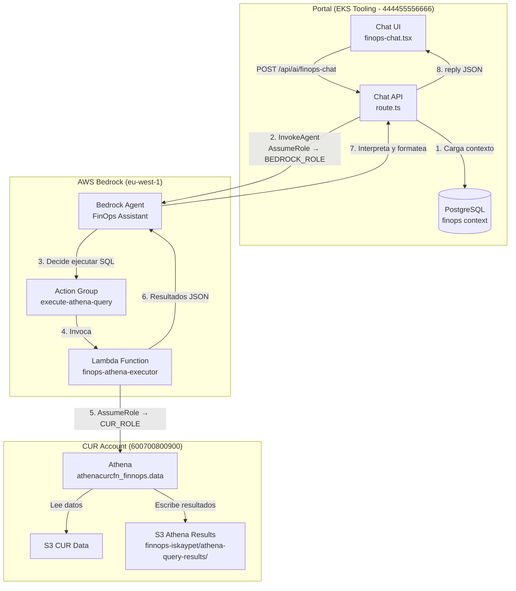
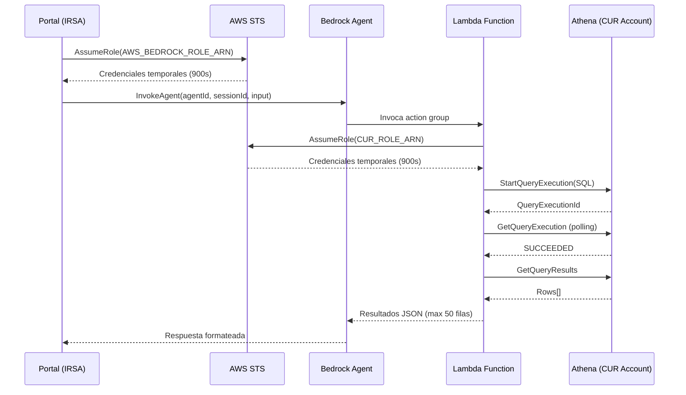

# Documento de Diseño — Bedrock FinOps Agent

## Visión General

Este diseño describe la migración del chatbot FinOps actual (basado en Converse API con Nova Lite y text-to-SQL manual) a un **AWS Bedrock Agent** completo. El nuevo agente será una entidad autónoma en AWS Bedrock que orquesta la generación de SQL, ejecución contra Athena, interpretación de resultados y formateo de respuestas de forma nativa, eliminando la lógica de extracción/reintento de SQL del portal.

### Decisiones de diseño clave

1. **Bedrock Agent vs Converse API**: Se elige Bedrock Agent porque gestiona nativamente la orquestación de herramientas (action groups), memoria conversacional (sessionId), y reintentos. Esto elimina ~300 líneas de lógica de extracción SQL, polling y retry del route handler actual.

2. **Lambda como Action Group vs Return of Control**: Se elige Lambda porque la ejecución de queries Athena requiere acceso cross-account con AssumeRole, polling asíncrono y timeout de hasta 120s. Return of Control requeriría que el portal gestione esta lógica, perdiendo la ventaja del agente.

3. **Terraform vs CloudFormation/CDK**: Se elige Terraform porque es la herramienta de IaC estándar de la organización. Los recursos de Bedrock (`aws_bedrockagent_agent`, `aws_bedrockagent_agent_action_group`) tienen soporte en el provider AWS de Terraform. Esto mantiene la coherencia con el resto de la infraestructura.

4. **Modelo fundacional**: Se elige `anthropic.claude-3-sonnet-20240229-v1:0` (o `eu.anthropic.claude-3-sonnet-20240229-v1:0` si se requiere prefijo regional) por su equilibrio entre capacidad de razonamiento SQL, coste y disponibilidad en eu-west-1. Se parametriza para poder cambiar a Claude 3.5 Sonnet sin modificar código.

5. **Contexto del portal como prompt enrichment vs Knowledge Base**: Se inyecta el contexto de PostgreSQL (snapshots, inventario, oportunidades) directamente en el `sessionState.promptSessionAttributes` al invocar el agente, en lugar de crear una Knowledge Base separada. Esto es más simple, evita sincronización de datos, y el volumen de contexto (~2-4KB) cabe en el prompt.

---

## Arquitectura

### Diagrama de arquitectura



### Flujo de invocación

1. El usuario envía un mensaje desde la Chat UI
2. La Chat API autentica al usuario (`requireUserAuth`), carga contexto de PostgreSQL, y llama a `InvokeAgent` con el `sessionId`
3. El Bedrock Agent analiza la pregunta, genera SQL internamente, y decide invocar el action group `execute-athena-query`
4. La Lambda del action group recibe la SQL, asume el rol cross-account, ejecuta la query en Athena, y devuelve resultados JSON
5. El agente interpreta los resultados, aplica las reglas de formato (account names, moneda, tablas/listas), y devuelve la respuesta final
6. La Chat API devuelve el `reply` al frontend

### Cadena de roles IAM



---

## Componentes e Interfaces

### 1. Bedrock Agent (`FinOpsAssistant`)

**Recurso Terraform**: `aws_bedrockagent_agent`

| Propiedad | Valor |
|---|---|
| AgentName | `iskaypet-finops-assistant` |
| FoundationModel | `anthropic.claude-3-sonnet-20240229-v1:0` (parametrizable) |
| IdleSessionTTLInSeconds | `1800` (30 min) |
| Instruction | System prompt completo (ver sección Data Models) |

El agente recibe las instrucciones (system prompt) que incluyen:
- Esquema completo del CUR
- Mapa de cuentas AWS (22 cuentas + agrupaciones)
- Reglas SQL obligatorias para Athena/Presto
- Reglas de formato de respuesta
- Ejemplos de queries por tipo de pregunta

### 2. Action Group (`execute-athena-query`)

**Recurso Terraform**: `aws_bedrockagent_agent_action_group`

Define una única acción `executeAthenaQuery` con esquema OpenAPI:

```yaml
openapi: "3.0.0"
info:
  title: "FinOps Athena Query API"
  version: "1.0.0"
paths:
  /executeAthenaQuery:
    post:
      summary: "Ejecuta una query SQL contra el CUR en Athena"
      description: >
        Ejecuta una query SQL SELECT contra la base de datos athenacurcfn_finnops
        en AWS Athena. Solo permite queries SELECT de lectura. Devuelve los
        resultados en formato JSON con un máximo de 50 filas.
      operationId: "executeAthenaQuery"
      requestBody:
        required: true
        content:
          application/json:
            schema:
              type: object
              required:
                - sql_query
              properties:
                sql_query:
                  type: string
                  description: >
                    Query SQL SELECT para ejecutar contra athenacurcfn_finnops.data.
                    Debe incluir filtro line_item_line_item_type IN ('Usage','Tax','Fee').
                max_rows:
                  type: integer
                  description: "Número máximo de filas a devolver (default: 50, max: 200)"
                  default: 50
      responses:
        "200":
          description: "Resultados de la query"
          content:
            application/json:
              schema:
                type: object
                properties:
                  status:
                    type: string
                    enum: [success, error]
                  row_count:
                    type: integer
                  rows:
                    type: array
                    items:
                      type: object
                  execution_time_ms:
                    type: integer
                  error_message:
                    type: string
```

### 3. Lambda Function (`finops-athena-executor`)

**Runtime**: Node.js 20.x  
**Timeout**: 120 segundos  
**Memoria**: 256 MB  
**Región**: eu-west-1

La Lambda recibe el evento del action group de Bedrock, extrae los parámetros, valida la query, ejecuta contra Athena y devuelve resultados.

```typescript
// Pseudocódigo de la Lambda
interface ActionGroupEvent {
  messageVersion: string;
  agent: { name: string; id: string; alias: string; version: string };
  inputText: string;
  sessionId: string;
  actionGroup: string;
  apiPath: string;
  httpMethod: string;
  parameters: Array<{ name: string; type: string; value: string }>;
  requestBody: {
    content: {
      "application/json": {
        properties: Array<{ name: string; type: string; value: string }>;
      };
    };
  };
}

// Flujo:
// 1. Extraer sql_query y max_rows del requestBody
// 2. Validar que es SELECT (rechazar INSERT/UPDATE/DELETE/DROP)
// 3. AssumeRole al CUR_ROLE_ARN
// 4. StartQueryExecution en Athena
// 5. Poll GetQueryExecution hasta SUCCEEDED/FAILED
// 6. GetQueryResults (limitado a max_rows)
// 7. Devolver respuesta en formato Bedrock action group response
```

**Formato de respuesta de la Lambda** (requerido por Bedrock):

```json
{
  "messageVersion": "1.0",
  "response": {
    "actionGroup": "execute-athena-query",
    "apiPath": "/executeAthenaQuery",
    "httpMethod": "POST",
    "httpStatusCode": 200,
    "responseBody": {
      "application/json": {
        "body": "{\"status\":\"success\",\"row_count\":5,\"rows\":[...],\"execution_time_ms\":2340}"
      }
    }
  }
}
```

### 4. Chat API (`/api/ai/finops-chat/route.ts`) — Refactorizado

El route handler se simplifica significativamente:

```typescript
// Interfaz simplificada
interface ChatRequest {
  message: string;       // Mensaje del usuario (ya no array de messages)
  sessionId?: string;    // SessionId para continuidad (gestionado por frontend)
}

interface ChatResponse {
  reply: string;         // Respuesta del agente
  sessionId: string;     // SessionId para siguiente mensaje
}
```

**Cambios principales**:
- Elimina la lógica de `extractSql()`, `executeSqlWithRetry()`, `buildConversationContext()`
- Elimina la importación de `BedrockRuntimeClient` / `ConverseCommand`
- Usa `BedrockAgentRuntimeClient` / `InvokeAgentCommand` de `@aws-sdk/client-bedrock-agent-runtime`
- Inyecta contexto de PostgreSQL via `promptSessionAttributes` en el `sessionState`
- El agente gestiona internamente la memoria multi-turno via `sessionId`

### 5. Chat UI (`finops-chat.tsx`) — Cambios mínimos

| Aspecto | Antes | Después |
|---|---|---|
| Payload al API | `{ messages: Message[] }` | `{ message: string, sessionId?: string }` |
| Gestión de historial | Frontend envía todo el historial | Frontend solo envía mensaje actual + sessionId |
| SessionId | No existía | Generado al abrir chat, renovado en "Nueva conversación" |
| Diseño visual | Sin cambios | Sin cambios |

### 6. Infraestructura Terraform

**Directorio**: `platformportal/infra/bedrock-finops-agent/`

Archivos:

| Archivo | Descripción |
|---|---|
| `main.tf` | Recursos principales: agente, action group, Lambda, roles IAM |
| `variables.tf` | Variables parametrizables (modelo, región, ARNs, base de datos) |
| `outputs.tf` | Outputs: agent_id, agent_alias_id, lambda_arn |
| `lambda/index.mjs` | Código fuente de la Lambda del action group |
| `openapi.json` | Esquema OpenAPI del action group |

Recursos definidos:

| Recurso | Tipo Terraform | Descripción |
|---|---|---|
| `aws_bedrockagent_agent` | `aws_bedrockagent_agent` | El agente con instrucciones y configuración |
| `aws_bedrockagent_agent_action_group` | `aws_bedrockagent_agent_action_group` | Action group con esquema OpenAPI y Lambda |
| `aws_bedrockagent_agent_alias` | `aws_bedrockagent_agent_alias` | Alias del agente para invocación estable |
| `aws_lambda_function` | `aws_lambda_function` | Lambda del action group |
| `aws_iam_role` (agent) | `aws_iam_role` | Rol IAM del agente Bedrock |
| `aws_iam_role` (lambda) | `aws_iam_role` | Rol de la Lambda (permite AssumeRole al CUR account) |
| `aws_lambda_permission` | `aws_lambda_permission` | Permiso para que Bedrock invoque la Lambda |

**Variables del módulo** (`variables.tf`):

```hcl
variable "foundation_model_id" {
  type    = string
  default = "anthropic.claude-3-sonnet-20240229-v1:0"
}

variable "athena_database" {
  type    = string
  default = "athenacurcfn_finnops"
}

variable "athena_output_bucket" {
  type    = string
  default = "s3://finnops-iskaypet/athena-query-results/"
}

variable "cur_role_arn" {
  type    = string
  default = "arn:aws:iam::600700800900:role/Cur-AWSS3CURLambdaExecutor-Y5pT9wqNQaur"
}

variable "bedrock_region" {
  type    = string
  default = "eu-west-1"
}
```

---

## Modelos de Datos

### System Prompt del Agente

El system prompt se migra del actual `SYSTEM_PROMPT` en `route.ts` al campo `instruction` del recurso `aws_bedrockagent_agent` en Terraform. Se mantiene el contenido completo incluyendo:

- **Identidad**: Asistente FinOps experto de IskayPet
- **Esquema CUR**: Todas las columnas de `athenacurcfn_finnops.data` con tipos y descripciones
- **Account Map**: Las 22 cuentas con IDs y nombres amigables + agrupaciones lógicas
- **Reglas SQL**: 10 reglas obligatorias para Athena/Presto (filtros, fechas, costes, límites)
- **Ejemplos de queries**: 10+ ejemplos por tipo de pregunta
- **Reglas de formato**: Idioma, moneda, tablas vs listas, emojis, sustitución de IDs/ARNs

**Nota**: El system prompt tiene ~4000 tokens. Bedrock Agent soporta hasta 4096 caracteres en el campo `instruction`. Si excede, se dividirá entre `instruction` (identidad + reglas principales) y `promptSessionAttributes` (esquema detallado + ejemplos).

### Esquema OpenAPI del Action Group

Definido en la sección de Componentes (punto 2). Se almacena como fichero `openapi.json` en el directorio de infraestructura y se referencia desde Terraform via `file()`.

### Evento de la Lambda (Action Group)

```typescript
// Input del action group (Bedrock → Lambda)
interface ActionGroupInput {
  sql_query: string;    // Query SQL generada por el agente
  max_rows?: number;    // Máximo de filas (default 50)
}

// Output de la Lambda (Lambda → Bedrock)
interface ActionGroupOutput {
  status: "success" | "error";
  row_count?: number;
  rows?: Record<string, string>[];
  execution_time_ms?: number;
  error_message?: string;
}
```

### Contexto de sesión (Portal → Bedrock Agent)

```typescript
// Inyectado via sessionState.promptSessionAttributes
interface SessionContext {
  portal_context: string;    // Snapshot FinOps + inventario + oportunidades de ahorro
  current_date: string;      // Fecha actual ISO
  user_name: string;         // Nombre del usuario para personalización
}
```

### Variables de entorno del portal (nuevas/modificadas)

| Variable | Descripción | Ejemplo |
|---|---|---|
| `AWS_BEDROCK_AGENT_ID` | ID del agente Bedrock | `ABCDE12345` |
| `AWS_BEDROCK_AGENT_ALIAS_ID` | ID del alias del agente | `TSTALIASID` |
| `AWS_BEDROCK_ROLE_ARN` | Rol para invocar Bedrock (existente) | `arn:aws:iam::...` |
| `AWS_BEDROCK_REGION` | Región de Bedrock (existente) | `eu-west-1` |

### Variables de entorno de la Lambda

| Variable | Descripción | Valor |
|---|---|---|
| `CUR_ROLE_ARN` | Rol cross-account para Athena | `arn:aws:iam::600700800900:role/Cur-AWSS3CURLambdaExecutor-Y5pT9wqNQaur` |
| `ATHENA_DATABASE` | Base de datos Athena | `athenacurcfn_finnops` |
| `ATHENA_OUTPUT` | Bucket de resultados | `s3://finnops-iskaypet/athena-query-results/` |
| `ATHENA_REGION` | Región de Athena | `eu-west-1` |
| `MAX_ROWS_DEFAULT` | Filas por defecto | `50` |
| `QUERY_TIMEOUT_MS` | Timeout de polling | `110000` |

---


## Propiedades de Corrección

*Una propiedad es una característica o comportamiento que debe cumplirse en todas las ejecuciones válidas de un sistema — esencialmente, una declaración formal sobre lo que el sistema debe hacer. Las propiedades sirven como puente entre especificaciones legibles por humanos y garantías de corrección verificables por máquinas.*

### Property 1: Validación SQL — solo SELECT permitido

*Para cualquier* string SQL, la función Lambda del action group SHALL aceptar la query si y solo si es una operación SELECT de lectura. *Para cualquier* string SQL que contenga las palabras clave `INSERT`, `UPDATE`, `DELETE`, `DROP`, `ALTER`, `CREATE` o `TRUNCATE` (case-insensitive), la Lambda SHALL rechazarla devolviendo un error con status "error" y un mensaje descriptivo, sin ejecutarla contra Athena.

**Validates: Requirements 2.1, 10.5**

### Property 2: Limitación de filas en resultados

*Para cualquier* resultado de query Athena con N filas (donde N puede ser 0, 1, 50, 200, 1000+), la Lambda SHALL devolver como máximo `max_rows` filas (default 50). El campo `row_count` del resultado SHALL ser igual al número real de filas devueltas, y cada fila SHALL ser un objeto JSON válido con claves string y valores string.

**Validates: Requirements 2.3**

### Property 3: Propagación de errores de Athena

*Para cualquier* error de ejecución de Athena (query inválida, timeout, permisos, tabla no encontrada), la Lambda SHALL devolver una respuesta con `status: "error"` y el campo `error_message` SHALL contener el mensaje de error original de Athena. La respuesta SHALL mantener el formato válido de action group response de Bedrock (messageVersion, response.actionGroup, httpStatusCode 200).

**Validates: Requirements 2.4**

### Property 4: Formato de respuesta de la Chat API

*Para cualquier* respuesta del Bedrock Agent (string vacío, string con markdown, string con caracteres especiales, string largo), la Chat API SHALL devolver un objeto JSON con el campo `reply` conteniendo exactamente la respuesta del agente, y el campo `sessionId` conteniendo el ID de sesión utilizado. El status HTTP SHALL ser 200.

**Validates: Requirements 3.4**

### Property 5: Unicidad de Session IDs

*Para cualquier* conjunto de N sesiones generadas (donde N >= 2), todos los sessionIds SHALL ser distintos entre sí. Cada sessionId SHALL ser un string no vacío con formato UUID v4.

**Validates: Requirements 4.1**

---

## Gestión de Errores

### Errores en la Lambda (Action Group)

| Escenario | Comportamiento | Respuesta |
|---|---|---|
| Query SQL con mutación (INSERT/UPDATE/DELETE/DROP) | Rechazar sin ejecutar | `{status: "error", error_message: "Solo se permiten queries SELECT de lectura"}` |
| Error de AssumeRole al CUR account | Capturar excepción STS | `{status: "error", error_message: "Error de acceso cross-account: ..."}` |
| Query Athena falla (syntax error, tabla no existe) | Capturar error de Athena | `{status: "error", error_message: "Athena error: ..."}` |
| Timeout de polling Athena (>110s) | Abortar polling | `{status: "error", error_message: "Query timeout: la consulta tardó más de 110 segundos"}` |
| Resultado vacío (0 filas) | Devolver array vacío | `{status: "success", row_count: 0, rows: []}` |

**Nota**: Todos los errores se devuelven con `httpStatusCode: 200` en el formato de action group response. El agente Bedrock recibe el error y decide cómo comunicarlo al usuario (reformular query, explicar el problema, etc.).

### Errores en la Chat API

| Escenario | Comportamiento | Respuesta HTTP |
|---|---|---|
| Usuario no autenticado | `requireUserAuth` rechaza | 401 Unauthorized |
| Falta `message` en el body | Validación de input | 400 `{error: "message required"}` |
| AssumeRole a Bedrock falla | Capturar excepción STS | 200 `{reply: "Error de conectividad temporal con el servicio de IA. Inténtalo en unos minutos."}` |
| InvokeAgent timeout (>120s) | Capturar timeout | 200 `{reply: "La consulta tardó demasiado. Intenta reformular la pregunta o ser más específico."}` |
| Respuesta del agente vacía/inválida | Detectar y sustituir | 200 `{reply: "No pude generar una respuesta. Intenta reformular la pregunta."}` |
| Error inesperado | Catch genérico | 200 `{reply: "Lo siento, hubo un error procesando tu pregunta. Inténtalo de nuevo."}` |

**Decisión de diseño**: Los errores del chat siempre devuelven HTTP 200 con un `reply` descriptivo (excepto auth/validation), para que el frontend siempre pueda mostrar un mensaje al usuario sin lógica especial de manejo de errores HTTP.

### Errores en la Chat UI

| Escenario | Comportamiento |
|---|---|
| Fetch falla (network error) | Mostrar "Error de conexión. Inténtalo de nuevo." |
| Respuesta sin campo `reply` | Mostrar "No pude generar una respuesta." |
| Timeout del fetch | Mostrar "La consulta está tardando demasiado. Inténtalo de nuevo." |

---

## Estrategia de Testing

### Enfoque dual: Unit Tests + Property Tests

Este feature combina lógica de aplicación (Lambda, API handler, session management) con integración de servicios AWS (Bedrock Agent, Athena, STS). La estrategia de testing refleja esta dualidad:

#### Property-Based Tests (fast-check)

**Librería**: [fast-check](https://github.com/dubzzz/fast-check) — la librería PBT estándar para TypeScript/JavaScript.

**Configuración**: Mínimo 100 iteraciones por propiedad.

Se implementarán las 5 propiedades de corrección definidas arriba:

1. **SQL Validation Property** — Genera strings SQL aleatorios (SELECT válidos, INSERT/UPDATE/DELETE/DROP maliciosos, strings vacíos, SQL injection attempts) y verifica que la Lambda solo acepta SELECT.
   - Tag: `Feature: bedrock-finops-agent, Property 1: SQL validation — solo SELECT permitido`

2. **Row Capping Property** — Genera arrays de resultados de tamaño aleatorio (0 a 500 filas) con max_rows aleatorio (1 a 200) y verifica que el output nunca excede max_rows.
   - Tag: `Feature: bedrock-finops-agent, Property 2: Limitación de filas en resultados`

3. **Error Propagation Property** — Genera mensajes de error aleatorios y verifica que la Lambda los envuelve correctamente en el formato de action group response.
   - Tag: `Feature: bedrock-finops-agent, Property 3: Propagación de errores de Athena`

4. **API Response Format Property** — Genera strings de respuesta aleatorios (incluyendo markdown, emojis, caracteres especiales, strings vacíos) y verifica que la API los envuelve en `{reply, sessionId}`.
   - Tag: `Feature: bedrock-finops-agent, Property 4: Formato de respuesta de la Chat API`

5. **Session ID Uniqueness Property** — Genera N session IDs y verifica que todos son únicos y tienen formato UUID v4.
   - Tag: `Feature: bedrock-finops-agent, Property 5: Unicidad de Session IDs`

#### Unit Tests (ejemplo)

- **Lambda handler**: Tests con eventos mock de Bedrock action group, verificando parsing de parámetros y formato de respuesta
- **Chat API**: Tests con requests mock, verificando autenticación, carga de contexto, y manejo de errores
- **Session management**: Tests de generación y renovación de sessionId
- **Context loading**: Tests con DB mock, verificando que `getFinOpsContext()` formatea correctamente los datos

#### Integration Tests

- **End-to-end**: Invocar el agente real con preguntas representativas y verificar que responde con datos del CUR
- **Cross-account**: Verificar que la Lambda puede asumir el rol CUR y ejecutar queries en Athena
- **Multi-turn**: Verificar que el agente mantiene contexto entre mensajes de la misma sesión

#### Infrastructure Tests

- **Terraform validation**: `terraform validate` y `terraform plan` sobre el módulo
- **Variables**: Verificar que todas las variables tienen valores por defecto válidos
- **Recursos**: Verificar que el plan define todos los recursos requeridos (Agent, ActionGroup, Lambda, Roles)

### Dependencia nueva

Se necesita añadir `@aws-sdk/client-bedrock-agent-runtime` al `package.json` del portal. La versión debe ser compatible con la existente de `@aws-sdk/client-bedrock-runtime` (^3.1001.0).

Para tests: añadir `fast-check` como devDependency. Se necesitará también un test runner — el proyecto no tiene uno configurado actualmente, se recomienda `vitest` por su compatibilidad con Next.js y TypeScript.
