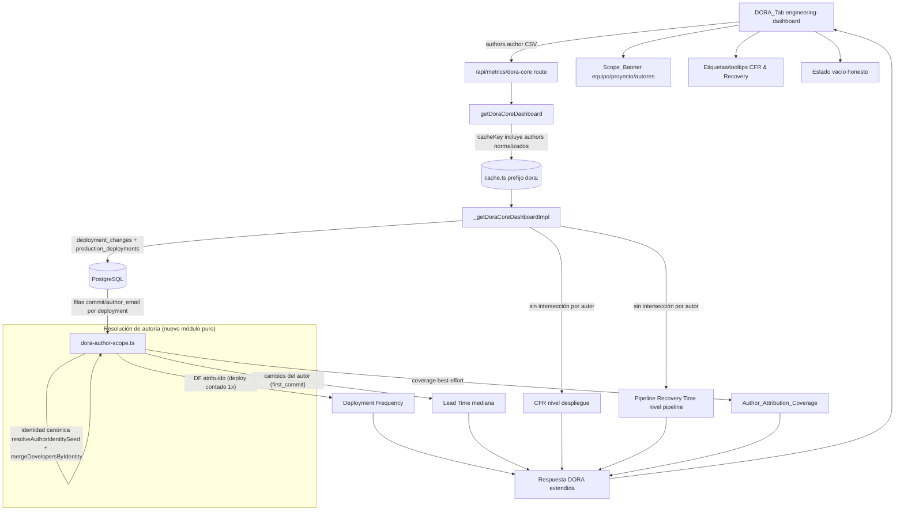

# Design Document: DORA Author Scoping

## Overview

Hoy la pestaña DORA de `/metrics` ofrece un filtro global de autores que el usuario percibe como aplicable a toda la página, pero en DORA es un **no-op**: `getDoraCoreDashboard` construye su clave de caché solo con `days/from/to/teams/projectIds/includeClusterSignals` y, peor aún, pasa `doraScopeFilters = { ...filters, developers: [] }` a las queries, por lo que `filters.authors` nunca llega al cálculo. Añadir o quitar autores no cambia ninguna métrica DORA.

Esta feature añade la **dimensión de autor de extremo a extremo** a DORA, con una semántica honesta por métrica, arreglando el problema **en el origen** (el cálculo) y reflejándolo con transparencia en la UI. La autoría de cada despliegue se deriva de los cambios reales en `deployment_changes` (ligados a `production_deployments`), y la identidad de autor se resuelve **reutilizando** los mismos helpers que el lado MR (`resolveAuthorIdentitySeed` + `mergeDevelopersByIdentity`), tomando como patrón de referencia `src/lib/mr-metrics-canonical.ts` (lógica de dedup aislada en funciones puras testeables).

El diseño materializa una dirección ya aprobada (no se reabre):

1. **Modelo de alcance único**: toda métrica DORA se calcula sobre `Production_Deployments` y sus cambios, scoped por `(fecha ∩ equipo ∩ proyecto ∩ autores)`.
2. **Semántica honesta por métrica** bajo filtro de autor:
   - **Deployment Frequency**: despliegues con ≥1 cambio de un autor seleccionado, contados **una sola vez**.
   - **Lead Time**: mediana sobre los cambios de esos autores (variante canónica `first_commit`).
   - **CFR** y **Pipeline Recovery Time**: nivel despliegue/pipeline, **sin** intersección por autor ni atribución personal, con etiqueta/tooltip en la UI.
3. **Cache key con `authors`** (orden-insensible; vacío ⇒ clave idéntica a la actual ⇒ regresión cero).
4. **Banner de alcance** + estado vacío honesto + **Author_Attribution_Coverage** (best-effort) con aviso si <80%.

Adicionalmente cierra los **property tests y checkpoints pendientes** de la spec previa `dora-metrics-production-readiness` (`selectLeadTimeWithVariant`, `calculateConfidenceScore`, `filterByConfidence`/`MIN_CORRELATION_CONFIDENCE`) que quedaron sin implementar, reutilizando esos símbolos sin redefinirlos.

### Principios de diseño

| Principio | Aplicación |
|-----------|------------|
| Arreglar en el origen | El filtro de autor se aplica en el cálculo DORA (queries + funciones puras), no parcheando la UI |
| Funciones puras para todo lo testeable | Módulo nuevo `src/lib/dora-author-scope.ts` con resolución/dedup/predicados/conteos puros |
| Reutilizar, no reinventar | Identidad canónica idéntica al lado MR; símbolos de la spec previa intactos |
| Honestidad por métrica | DF/Lead Time atribuidos; CFR/Recovery a nivel despliegue, etiquetados como tal |
| Regresión cero | `authors` vacío ⇒ misma clave de caché, mismo scope, mismos valores que hoy |

## Architecture

No hay cambios estructurales: se threada una dimensión nueva (`authors`) a través del pipeline DORA existente y se añade un módulo puro de scoping de autoría.



### Flujo end-to-end de la dimensión de autor

1. **Route** `/api/metrics/dora-core`: ya parsea `authors`/`author` vía `parseCsv` en `parseFiltersFromRequest` (`filters.authors`). Sin cambios en el parseo.
2. **`getDoraCoreDashboard`**: incluye `authors` (normalizados y ordenados) en la `cacheKey`, y deja de borrar la dimensión de autor antes de llamar a la implementación.
3. **`_getDoraCoreDashboardImpl`**: cuando `filters.authors` no está vacío, resuelve la autoría desde `deployment_changes` y aplica el scoping de autor a DF y Lead Time mediante el módulo puro; CFR y Pipeline Recovery Time se calculan a nivel despliegue/pipeline (como hoy) y se marcan con flags de nivel-despliegue.
4. **UI** (`engineering-dashboard.tsx`, pestaña DORA): banner de alcance, etiquetas/tooltips para CFR/Recovery, estado vacío honesto y aviso de cobertura.

### Decisiones de diseño clave

| Decisión | Justificación |
|----------|---------------|
| Módulo puro nuevo `dora-author-scope.ts` | Aísla la lógica testeable (resolución/dedup/predicado/conteo/coverage) sin DB, igual que `mr-metrics-canonical.ts` hace para MR |
| Reutilizar `resolveAuthorIdentitySeed` + `mergeDevelopersByIdentity` | Misma identidad canónica que el lado MR ⇒ un desarrollador no se duplica por emails/usernames distintos; consistencia entre pestañas |
| DF: deploy contado una sola vez si incluye ≥1 cambio del autor | Un despliegue es una unidad; mezclar autores no debe inflar la frecuencia |
| CFR/Recovery a nivel despliegue, no atribuidos | Un despliegue fallido puede mezclar varios autores; atribuir el fallo a una persona sería deshonesto |
| `authors` vacío ⇒ clave de caché idéntica a la actual | Garantiza regresión cero y reaprovecha la caché existente |
| Lead Time bajo filtro = mediana (no media) | El criterio 1.3 exige mediana sobre cambios del autor (valor central / media de los 2 centrales) |
| `Author_Attribution_Coverage` best-effort + aviso <80% | Transparencia sobre la fiabilidad de la atribución cuando `deployment_changes` es incompleto |

## Components and Interfaces

### 1. Nuevo módulo puro: `src/lib/dora-author-scope.ts`

Concentra toda la lógica de autoría DORA testeable por propiedades. Sin dependencias de DB: recibe filas ya leídas y devuelve estructuras puras. Sigue el patrón de `mr-metrics-canonical.ts`.

```typescript
import {
  mergeDevelopersByIdentity,
  type DeveloperIdentityInput,
  type MergedDeveloperIdentity,
} from "@/lib/developer-identity";
import { resolveAuthorIdentitySeed } from "@/lib/dashboard-utils";

/** Fila cruda de cambio de despliegue (subset de deployment_changes + join). */
export interface DeploymentChangeRow {
  deploymentId: number;
  /** DATE(pd.deploy_completed_at) en formato YYYY-MM-DD (fecha de despliegue correcta). */
  deployDate: string;
  commitSha: string | null;
  commitCreatedAt: Date | string | null;
  mrFirstCommitAt: Date | string | null;
  deployCompletedAt: Date | string | null;
  authorEmail: string | null;
  /** Username opcional si el join con MR lo aporta; normalmente null en deployment_changes. */
  authorUsername: string | null;
}

/** Despliegue con su autoría canónica resuelta y deduplicada. */
export interface DeploymentAuthorship {
  deploymentId: number;
  deployDate: string;
  /** Claves canónicas distintas de los autores resolubles del despliegue. */
  authorKeys: Set<string>;
  /** true si el despliegue no tiene ningún cambio con identidad resoluble. */
  unresolved: boolean;
}

/** Clave canónica normalizada de un autor (para Author_Filter y dedup). */
export type CanonicalAuthorKey = string;

/**
 * Resuelve la identidad canónica de cada fila usando el seed compartido con MR
 * y la fusión por identidad. Determinista e independiente del orden de entrada.
 * Las filas sin email/username resoluble quedan marcadas como autoría no resoluble.
 */
export function resolveChangeAuthorKeys(
  rows: DeploymentChangeRow[]
): Map<DeploymentChangeRow, CanonicalAuthorKey | null>;

/**
 * Agrupa los cambios por despliegue y deduplica autores por clave canónica.
 * N filas equivalentes (mismo deployment, misma identidad) ⇒ un único autor.
 */
export function buildDeploymentAuthorship(
  rows: DeploymentChangeRow[]
): DeploymentAuthorship[];

/**
 * Normaliza un Author_Filter a su conjunto de claves canónicas
 * (orden-insensible, sin duplicados). Vacío ⇒ Set vacío.
 */
export function normalizeAuthorFilter(authors: string[]): Set<CanonicalAuthorKey>;

/**
 * Predicado de pertenencia: ¿la clave canónica de la identidad pertenece al filtro?
 * true sii la clave coincide con al menos una clave del Author_Filter.
 */
export function changeBelongsToAuthorFilter(
  authorKey: CanonicalAuthorKey | null,
  filter: Set<CanonicalAuthorKey>
): boolean;

/**
 * Deployment Frequency atribuido: cuenta cada despliegue UNA sola vez cuando
 * incluye al menos un cambio cuya identidad canónica pertenece al filtro.
 * Invariante ante duplicación de filas equivalentes.
 */
export function countAttributedDeployments(
  authorship: DeploymentAuthorship[],
  filter: Set<CanonicalAuthorKey>
): number;

/**
 * Selecciona los Lead Time (variante first_commit, en horas) de los cambios
 * cuya identidad canónica pertenece al filtro. Excluye autores no seleccionados
 * y filas no resolubles. Aplica el guard rail de outliers existente.
 */
export function selectAuthorLeadTimes(
  rows: DeploymentChangeRow[],
  authorKeyByRow: Map<DeploymentChangeRow, CanonicalAuthorKey | null>,
  filter: Set<CanonicalAuthorKey>,
  guardHours: number
): number[];

/** Mediana de una lista de valores (central si impar, media de los 2 centrales si par). */
export function median(values: number[]): number | null;

/**
 * Author_Attribution_Coverage: % de despliegues del alcance con autoría resoluble.
 * Redondeado a 1 decimal, acotado [0,100]. null si no hay despliegues en el alcance.
 */
export function authorAttributionCoverage(
  authorship: DeploymentAuthorship[]
): number | null;

/** Lista de autores canónicos seleccionables (sin duplicados, orden determinista). */
export function listSelectableAuthors(
  rows: DeploymentChangeRow[]
): MergedDeveloperIdentity[];
```

**Nota sobre identidad**: `deployment_changes` expone `author_email` (email de commit) pero no `author_username`. El seed se construye con `resolveAuthorIdentitySeed(authorEmail, authorUsername)` (username normalmente `null`), idéntico al patrón del manager dashboard (`metrics-dashboard.ts` ~L4003). La fusión final se hace con `mergeDevelopersByIdentity`, de modo que dos emails de commit distintos del mismo desarrollador colapsan a una sola `canonicalKey`.

### 2. `src/lib/metrics-dashboard.ts` — `getDoraCoreDashboard` (cache key)

Hoy (anclaje verificado, L1033):

```typescript
const key = cacheKey("dora-core", {
  days: filters.days,
  from: filters.from || null,
  to: filters.to || null,
  teams: filters.teams,
  projectIds: filters.projectIds,
  includeClusterSignals: options.includeClusterSignals ?? true,
});
```

Cambio: añadir `authors` normalizados a claves canónicas y ordenados. `cacheKey` ya ordena arrays (`[...v].sort()`), por lo que basta con pasar el array de claves canónicas; el orden de entrada y los duplicados quedan neutralizados al normalizar primero.

```typescript
const authorKeys = [...normalizeAuthorFilter(filters.authors)].sort();
const key = cacheKey("dora-core", {
  days: filters.days,
  from: filters.from || null,
  to: filters.to || null,
  teams: filters.teams,
  projectIds: filters.projectIds,
  includeClusterSignals: options.includeClusterSignals ?? true,
  authors: authorKeys, // [] cuando no hay filtro ⇒ "authors=" ⇒ misma sub-clave para todas las consultas sin autor
});
```

Cuando `authors` está vacío, `normalizeAuthorFilter([])` ⇒ `[]` ⇒ la sub-clave `authors=` es constante, de modo que dos consultas sin filtro de autor con idénticas dimensiones comparten entrada de caché (regresión cero, criterios 4.4 y 9.5). El prefijo de invalidación sigue siendo `dora:`/`dora-core:` (canónico de la spec previa); sin cambios en `invalidateCache`.

### 3. `src/lib/metrics-dashboard.ts` — `_getDoraCoreDashboardImpl` (aplicar autor)

Hoy (anclaje verificado, L1049) el impl borra la dimensión de autor:

```typescript
const doraScopeFilters = { ...filters, developers: [] };
```

Cambios:

- **Dejar de descartar `authors`**: el alcance `(fecha ∩ equipo ∩ proyecto)` para las queries base se mantiene (DF/Lead Time globales del alcance sin autor siguen calculándose para el caso `authors` vacío). Cuando `filters.authors` no está vacío, se añade un paso de scoping de autor.
- **Nueva consulta de autoría** (solo si `filters.authors.length > 0`), que lee los cambios del alcance desde `deployment_changes` ligados a `production_deployments` (reutilizando las mismas condiciones de `getCanonicalDoraRows`/`getCanonicalUniqueChangeCount`: `source='gitlab'`, `status='success'`, ventana de fechas, `environment ∈ DORA_PROD_ENVIRONMENTS`, team/projectIds):

```typescript
async function getDeploymentChangeRows(
  startDate: string,
  endDate: string,
  filters: DashboardFilters
): Promise<DeploymentChangeRow[]>; // SELECT pd.id, DATE(pd.deploy_completed_at), dc.commit_sha,
                                   // dc.commit_created_at, dc.mr_first_commit_at, pd.deploy_completed_at,
                                   // dc.author_email FROM production_deployments pd
                                   // LEFT JOIN deployment_changes dc ON dc.deployment_id = pd.id ...
```

- **Aplicación pura** (sin tocar SQL de CFR/MTTR):

```typescript
if (filters.authors.length > 0) {
  const changeRows = await getDeploymentChangeRows(startA, endA, filters);
  const authorKeyByRow = resolveChangeAuthorKeys(changeRows);
  const authorship = buildDeploymentAuthorship(changeRows);
  const filter = normalizeAuthorFilter(filters.authors);

  // DF atribuido (deploy contado una sola vez)
  const attributedDeployments = countAttributedDeployments(authorship, filter);

  // Lead Time = mediana de first_commit de los cambios del autor
  const authorLeadTimes = selectAuthorLeadTimes(changeRows, authorKeyByRow, filter, LEAD_TIME_GUARD_HOURS);
  const authorLeadMedian = median(authorLeadTimes); // null ⇒ no disponible

  // Coverage best-effort sobre TODOS los despliegues del alcance (no solo los del autor)
  authorCoverage = authorAttributionCoverage(authorship); // null si 0 despliegues
}
```

- **Override de DF y Lead Time** en la respuesta cuando hay filtro de autor: `summary.deploymentFrequency` pasa a reflejar `attributedDeployments` (conteo exacto), y `summary.leadTimeForChanges` se sustituye por `authorLeadMedian` o por el indicador explícito de no disponible si es `null`. **CFR y MTTR (Pipeline Recovery Time) NO se tocan**: conservan el cálculo a nivel despliegue/pipeline del alcance `(fecha ∩ equipo ∩ proyecto)`, y se marcan con `deploymentLevel: true`.
- **Estado vacío honesto**: si `attributedDeployments === 0`, DF = `0` exacto; si `authorLeadTimes` está vacío, Lead Time = no disponible (no se hereda el del alcance sin autor). En ningún caso se sustituye una métrica por la del alcance global.

### 4. `src/lib/metrics-formulas.ts` y `src/lib/deployment-correlation.ts` — reutilización (spec previa)

Se **reutilizan sin redefinir** los símbolos ya diseñados (y a completar en tests) por `dora-metrics-production-readiness`:

- `selectLeadTimeWithVariant(firstCommitHours, mrCreatedHours, lastCommitHours)` y `CANONICAL_LEAD_TIME_VARIANT` (`metrics-formulas.ts`).
- `calculateConfidenceScore({ leadTimeCoveragePct, avgCorrelationConfidence, anomalyCount })` (`metrics-dashboard.ts`).
- `filterByConfidence(correlations, minConfidence?)` y `MIN_CORRELATION_CONFIDENCE` (`deployment-correlation.ts`).

Esta spec **no** los reimplementa; aporta los **property tests** que quedaron pendientes (ver Estrategia de Testing y Propiedades).

### 5. Componentes Frontend — pestaña DORA en `engineering-dashboard.tsx`

```typescript
/** Banner permanente de alcance (equipo ∩ proyecto ∩ autores). */
interface ScopeBannerProps {
  teams: string[];
  projects: { id: number; name: string }[];
  authors: { key: string; name: string }[]; // Canonical_Author_Identity aplicadas
  maxAuthorsShown?: number; // default 5
}
function ScopeBanner(props: ScopeBannerProps): JSX.Element;
// - Muestra SIEMPRE las 3 dimensiones (aunque vacías).
// - authors vacío ⇒ "Sin filtro de autor — todo el equipo/proyecto".
// - ni team ni proyecto ni autores ⇒ "Todos los equipos y proyectos".
// - >5 autores ⇒ primeros 5 + "+N más".
// - Se re-renderiza al completar el recálculo (estado React), sin recarga manual.

/** Etiqueta + tooltip accesible para CFR y Pipeline Recovery Time bajo filtro de autor. */
interface DeploymentLevelBadgeProps {
  metric: "cfr" | "recovery";
  visible: boolean; // solo cuando authors no está vacío
}
function DeploymentLevelBadge(props: DeploymentLevelBadgeProps): JSX.Element | null;
// - Texto: "Nivel despliegue/pipeline".
// - Tooltip (hover + foco de teclado, role="tooltip", aria-describedby): explica que un
//   despliegue fallido puede mezclar varios autores y que la métrica no responsabiliza a
//   una persona. Permanece visible mientras dure hover/focus.
// - visible=false cuando authors está vacío ⇒ no se renderiza (regresión cero, criterio 9.4).

/** Estado vacío honesto cuando el autor no tiene actividad en el alcance. */
interface DoraEmptyStateProps {
  authors: { key: string; name: string }[];
  deployments: 0;
  attributableChanges: 0;
}
function DoraEmptyState(props: DoraEmptyStateProps): JSX.Element;
// - Identifica los autores seleccionados, indica 0 despliegues y 0 cambios atribuibles.
// - Distinto visualmente de error y de loading.

/** Aviso de cobertura best-effort. */
function AttributionCoverageNotice(props: { coverage: number | null; threshold: number }): JSX.Element | null;
// - Si coverage < threshold (default 80.0) ⇒ aviso visible "atribución best-effort, puede estar incompleta".
// - Bajo filtro de autor, nota permanente: "atribución basada en cambios de deployment_changes".
```

### 6. Endpoint `/api/metrics/dora-core/route.ts`

Sin cambios de parseo (ya soporta `authors`/`author`). La respuesta extendida (ver Modelos de Datos) viaja por el mismo endpoint cacheado con prefijo `dora:`.

## Data Models

### Columnas de `deployment_changes` usadas para autoría (esquema verificado)

De `migrations/2026-03-03_reliability_foundation.sql`:

| Columna | Uso en esta feature |
|---------|---------------------|
| `deployment_id` (FK → `production_deployments.id`) | Agrupar cambios por despliegue (DF atribuido, dedup) |
| `commit_sha` | Identidad del cambio; dedup de filas equivalentes |
| `commit_created_at` | Soporte de variantes de lead time |
| `mr_first_commit_at` | **Variante canónica `first_commit`** para Lead Time atribuido |
| `author_email` | Seed de identidad canónica (`resolveAuthorIdentitySeed`) |

De `production_deployments`: `id`, `deploy_completed_at` (fecha de despliegue correcta = `DATE(pd.deploy_completed_at)`), `source`, `status`, `environment`, `project_id`, `team` (vía `services`/`pd.team`). **No** se requieren migraciones nuevas: los índices `idx_deployment_changes_deployment` y `idx_deployment_changes_commit` ya existen.

### Shape de la respuesta DORA extendida

Adiciones al objeto `summary` que devuelve `_getDoraCoreDashboardImpl` (el resto se mantiene):

```typescript
interface DoraAuthorScope {
  /** Author_Filter aplicado (claves canónicas + nombre legible). Vacío ⇒ sin filtro. */
  authors: { key: string; name: string }[];
  /** % de despliegues del alcance con autoría resoluble; null si 0 despliegues. */
  attributionCoverage: number | null;
  /** Umbral configurable (default 80.0) para el aviso de cobertura. */
  attributionCoverageThreshold: number;
  /** true cuando hay filtro de autor activo (controla banner/labels/empty-state en UI). */
  active: boolean;
}

interface DoraDeploymentLevelFlags {
  /** CFR es de nivel despliegue (no atribuido) bajo filtro de autor. */
  changeFailureRate: boolean;
  /** Pipeline Recovery Time es de nivel pipeline (no atribuido) bajo filtro de autor. */
  pipelineRecoveryTime: boolean;
}

// summary (extensión):
//   authorScope: DoraAuthorScope;
//   deploymentLevel: DoraDeploymentLevelFlags;
//   deploymentFrequency: TrendMetric;   // bajo filtro: conteo atribuido (deploy 1x)
//   leadTimeForChanges: TrendMetric | { available: false };  // bajo filtro: mediana first_commit del autor
//   changeFailureRate: TrendMetric | { available: false };   // nivel despliegue; no disponible si 0 deploys
//   mttr: TrendMetric | { available: false };                // Pipeline Recovery Time; no disponible si 0 pipelines
```

**Indicador "no disponible"**: se modela como un objeto/flag explícito (`{ available: false }`) distinto del valor numérico `0`, para no confundir "sin actividad atribuible" con "cero medido" (criterios 2.5, 6.2, 6.3).

### Author_Attribution_Coverage en el audit summary

Bajo filtro de autor, `summary.audit` incluye un check adicional:

```typescript
createAuditCheck(
  "author_attribution_coverage",
  "Cobertura de atribución por autor",
  coverage === null ? "info" : coverage >= threshold ? "pass" : "warn",
  coverage === null ? "n/d" : `${coverage.toFixed(1)}%`,
  "% de despliegues del alcance con autoría resoluble desde deployment_changes."
);
```


## Correctness Properties

*Una propiedad es una característica o comportamiento que debe mantenerse verdadero en todas las ejecuciones válidas de un sistema — esencialmente, una declaración formal sobre lo que el sistema debe hacer. Las propiedades sirven como puente entre especificaciones legibles por humanos y garantías de correctitud verificables por máquina.*

Tras el prework se consolidaron las propiedades para eliminar redundancia. En concreto: 1.4/1.5 quedan subsumidas por las propiedades de DF y Lead Time atribuidos; 1.6/3.2/3.3 se integran en la propiedad de identidad canónica y en la de invariancia ante duplicación; 4.1/4.2/4.3/4.4/9.5 se unifican en una única propiedad de clave de caché; 6.3 coincide con 2.5; 9.1/9.3 se integran en la propiedad de regresión cero. Las propiedades resultantes son las siguientes.

### Property 1: Identidad canónica de autor determinista e independiente del orden

*Para cualquier* conjunto de filas de `deployment_changes` (con emails de commit variados, incluyendo distintos emails del mismo desarrollador), `resolveChangeAuthorKeys` y `buildDeploymentAuthorship` SHALL producir, ante cualquier permutación de la entrada, el mismo conjunto de claves canónicas por despliegue, agrupando bajo una sola `canonicalKey` los cambios que el lado MR consideraría la misma identidad.

**Validates: Requirements 3.1, 3.2, 3.3**

### Property 2: Pertenencia a Author_Filter por clave canónica

*Para cualquier* identidad de cambio y cualquier Author_Filter, `changeBelongsToAuthorFilter` SHALL devolver verdadero si y solo si la clave canónica de la identidad coincide con la clave canónica de al menos un autor del filtro.

**Validates: Requirements 1.6**

### Property 3: Deployment Frequency atribuido cuenta cada despliegue una sola vez

*Para cualquier* conjunto de despliegues con cambios de autores variados (dentro y fuera del filtro) y cualquier Author_Filter no vacío, `countAttributedDeployments` SHALL ser igual al número de despliegues que contienen al menos un cambio cuya identidad canónica pertenece al filtro, contando cada despliegue exactamente una vez con independencia de cuántos cambios coincidentes contenga.

**Validates: Requirements 1.1, 1.2, 1.4**

### Property 4: Conteo atribuido invariante ante duplicación de filas equivalentes

*Para cualquier* conjunto de filas de `deployment_changes` y cualquier Author_Filter, duplicar un número arbitrario de filas equivalentes (mismo `deployment_id` y misma identidad canónica) SHALL producir el mismo `countAttributedDeployments` que el conjunto sin duplicar, deduplicando por identidad canónica y por la fecha de despliegue correcta (`DATE(deploy_completed_at)`).

**Validates: Requirements 8.4, 3.3**

### Property 5: Lead Time atribuido es la mediana de los cambios del autor

*Para cualquier* conjunto de cambios y cualquier Author_Filter no vacío, el Lead Time SHALL calcularse como la mediana (valor central si el número de muestras es impar, media aritmética de los dos centrales si es par) de los Lead Time de variante `first_commit` de los cambios cuya identidad canónica pertenece al filtro, excluyendo los cambios de autores no seleccionados y las filas no resolubles, y SHALL ser no disponible (no cero) cuando no hay cambios atribuibles.

**Validates: Requirements 1.3, 1.5, 6.2**

### Property 6: Las métricas de nivel despliegue son invariantes al filtro de autor

*Para cualquier* alcance `(fecha ∩ equipo ∩ proyecto)`, Change_Failure_Rate (valor en [0,100]) y Pipeline_Recovery_Time (duración no negativa) SHALL producir el mismo valor con Author_Filter vacío que con cualquier Author_Filter no vacío, ya que se calculan a nivel despliegue/pipeline sin intersecar el conjunto por autor.

**Validates: Requirements 2.1, 2.2**

### Property 7: Escenario vacío bajo filtro de autor devuelve no disponible

*Para cualquier* Author_Filter no vacío cuyo alcance resultante no contenga despliegues ni pipelines, Deployment_Frequency SHALL ser exactamente cero y Lead_Time, Change_Failure_Rate y Pipeline_Recovery_Time SHALL devolver un indicador explícito de no disponible distinto del valor numérico cero, sin sustituir ninguna métrica por la del alcance sin filtro de autor.

**Validates: Requirements 2.5, 6.1, 6.3, 6.4**

### Property 8: Author_Attribution_Coverage bien definido y acotado

*Para cualquier* conjunto de despliegues del alcance, `authorAttributionCoverage` SHALL ser igual a `(despliegues con autoría resoluble / total de despliegues) * 100` redondeado a 1 decimal y acotado a `[0.0, 100.0]`, considerando no resolubles los despliegues sin cambios o sin ninguna identidad canónica, y SHALL ser no disponible (null) cuando el alcance no contiene despliegues.

**Validates: Requirements 7.1, 7.2, 7.3**

### Property 9: Lista de autores seleccionables canónica, sin duplicados y determinista

*Para cualquier* conjunto de filas de cambios, `listSelectableAuthors` SHALL devolver, ante cualquier permutación de la entrada, la misma lista de Canonical_Author_Identity sin entradas duplicadas por `canonicalKey` y en un orden determinista.

**Validates: Requirements 3.4**

### Property 10: Clave de caché canónica en la dimensión de autor

*Para cualquier* combinación de dimensiones de fecha, equipo y proyecto: (a) dos consultas que difieren solo en el conjunto de identidades canónicas de Author_Filter SHALL producir claves distintas; (b) dos consultas con el mismo conjunto de identidades canónicas, con independencia del orden y de entradas duplicadas que resuelvan a la misma identidad, SHALL producir la misma clave; y (c) con Author_Filter vacío la clave SHALL ser idéntica a la que produciría una consulta con idénticas dimensiones sin la dimensión de autor.

**Validates: Requirements 4.1, 4.2, 4.3, 4.4, 9.5**

### Property 11: Regresión cero sin filtro de autor

*Para cualquier* combinación de filtros de fecha, equipo y proyecto, con Author_Filter vacío el resultado DORA SHALL ser equivalente al de la implementación previa a la dimensión de autor: Deployment_Frequency con el mismo conteo entero exacto, y Lead_Time, Change_Failure_Rate y Pipeline_Recovery_Time con una diferencia absoluta no superior a 0,01 respecto a la referencia (y vacío cuando la referencia es vacía), sin que la dimensión de autor reduzca, amplíe ni reordene el conjunto considerado.

**Validates: Requirements 9.1, 9.2, 9.3**

### Property 12: Selección de Lead Time con fallback canónico (cierre spec previa)

*Para cualquier* terna de valores `(firstCommitHours, mrCreatedHours, lastCommitHours)` donde al menos uno es válido (finito y > 0), `selectLeadTimeWithVariant` SHALL retornar la primera variante disponible según el orden `first_commit` → `mr_created` → `last_commit`; cuando ninguno es válido SHALL retornar el indicador documentado de no disponible (null); y en ningún caso SHALL lanzar excepción.

**Validates: Requirements 8.1**

### Property 13: Confidence score en rango cerrado [0,100] (cierre spec previa)

*Para cualquier* combinación de entradas dentro del dominio documentado (`leadTimeCoveragePct ∈ [0,100]`, `avgCorrelationConfidence ∈ [0,1]`, `anomalyCount ≥ 0`), incluyendo los valores límite (mínimos, máximos, cero y entradas vacías), `calculateConfidenceScore` SHALL retornar un valor en el rango cerrado `[0, 100]`.

**Validates: Requirements 8.2**

### Property 14: Filtrado por confianza de correlaciones (cierre spec previa)

*Para cualquier* conjunto de correlaciones con scores de confianza y el umbral `MIN_CORRELATION_CONFIDENCE`, `filterByConfidence` SHALL devolver un subconjunto del conjunto original sin añadir ni modificar elementos, conservando todas y solo las correlaciones cuyo score es mayor o igual al umbral y descartando toda correlación con score inferior.

**Validates: Requirements 8.3**

## Error Handling

| Escenario | Comportamiento |
|-----------|----------------|
| Cambio con `author_email`/username no resoluble a identidad canónica | Marcar como autoría no resoluble; excluir de la agrupación por autor y del match con Author_Filter; conservar el despliegue en cálculos no dependientes de autor (DF global, CFR, Recovery) y contarlo como no resoluble en coverage (criterios 3.5, 7.2) |
| Alcance con 0 despliegues bajo filtro de autor | DF = 0 exacto; Lead Time, CFR y Recovery = no disponible (objeto `{ available: false }`, nunca `0`); coverage = null. Nunca heredar valores del alcance sin autor (criterios 2.5, 6.1–6.4, 7.3) |
| División por cero en mediana/coverage | `median([])` ⇒ null; `authorAttributionCoverage` con total 0 ⇒ null. Sin `NaN`/`Infinity` en la respuesta |
| Query de `deployment_changes` falla (tabla ausente, error SQL) | Capturar como en `getCanonicalDoraRows` (try/catch con `console.error`); degradar a alcance sin autor para DF/Lead Time y marcar `authorScope.attributionCoverage = null` con motivo en el audit, sin romper el resto de la respuesta (resultados parciales) |
| `deployment_changes` parcialmente poblado (cobertura < umbral) | Calcular best-effort y emitir aviso de cobertura en UI + check `author_attribution_coverage` en el audit (criterios 7.4, 7.5) |
| Author_Filter con identidades inexistentes en el alcance | DF = 0, Lead Time no disponible (sin actividad atribuible); no es error |
| Author_Filter vacío | Ruta de regresión cero: misma clave de caché, mismo scope, mismos valores; sin etiquetas/tooltips de nivel despliegue en UI (criterios 9.1–9.5) |
| Entradas duplicadas/orden distinto en Author_Filter | Normalizar a conjunto de claves canónicas antes de calcular y de construir la clave de caché (criterios 4.3, 4.4) |

## Testing Strategy

### Testing de Propiedades (property-based)

Se utiliza **fast-check** como librería de property-based testing, ejecutada sobre **`node:test` vía `tsx`** (el runner del portal: `npm run test`/`test:coverage` con c8), consistente con la suite existente y con los property tests de FinOps (`*.property.test.ts`).

Configuración obligatoria:
- Mínimo **100 iteraciones** por propiedad (`fc.assert(prop, { numRuns: 100 })`).
- **Semilla fija** por test (`{ seed: <n>, endOnFailure: true }`) para reproducibilidad idéntica entre ejecuciones (criterio 8.5).
- Cada test referencia su propiedad de diseño con un tag en comentario.
- Tag format: `Feature: dora-author-scoping, Property {N}: {título}`.

Las propiedades testeables (1–14) se implementan **una propiedad ↔ un test property-based**, todas contra el módulo puro `dora-author-scope.ts` (y los símbolos reutilizados de la spec previa para 12–14). Ubicación sugerida: `src/lib/__tests__/dora-author-scope.property.test.ts` y, para el cierre de la spec previa, los tests que faltaban sobre `metrics-formulas.ts`/`deployment-correlation.ts`/`metrics-dashboard.ts`.

Generadores clave:
- `DeploymentChangeRow[]`: emails de commit con variantes del mismo desarrollador (mayúsculas, dominios `@iskaypet.com`/`@emefinpetcare.com`), filas no resolubles (email/username vacíos), múltiples cambios por despliegue, filas duplicadas equivalentes, y lead times con outliers (> guard) y negativos.
- `Author_Filter`: subconjuntos aleatorios de las identidades generadas, con permutaciones y duplicados que resuelven a la misma identidad.
- Alcances vacíos para cubrir los edge cases (2.5, 6.x, 7.3).

Mapa propiedad → requisitos (las que cierran la spec previa marcadas ▸):
- P1 → 3.1/3.2/3.3 · P2 → 1.6 · P3 → 1.1/1.2/1.4 · P4 → 8.4/3.3 · P5 → 1.3/1.5/6.2 · P6 → 2.1/2.2 · P7 → 2.5/6.1/6.3/6.4 · P8 → 7.1/7.2/7.3 · P9 → 3.4 · P10 → 4.1/4.2/4.3/4.4/9.5 · P11 → 9.1/9.2/9.3 · ▸P12 → 8.1 · ▸P13 → 8.2 · ▸P14 → 8.3.

### Testing Unitario (example-based)

- **UI DORA** (render con Testing Library): Scope_Banner muestra siempre las 3 dimensiones (5.1), trunca a 5 + "+N" (5.2), texto "sin filtro" (5.3), "todos los equipos y proyectos" (5.5); etiquetas de nivel despliegue presentes con filtro y ausentes sin filtro (2.3, 9.4); estado vacío honesto distinto de error/carga (6.5); aviso de cobertura con `coverage < threshold` (7.5) y nota de `deployment_changes` (7.6).
- **Interacción/accesibilidad**: tooltip de CFR/Recovery visible en hover y en foco de teclado, persistente, con `role="tooltip"` y `aria-describedby` (2.4).
- **Reactividad**: cambiar Author_Filter/equipo/proyecto actualiza el banner en el mismo render sin recarga (5.4).
- **Estructura de respuesta**: bajo filtro de autor, `summary.audit` incluye el check `author_attribution_coverage` (7.4).

### Testing de Integración

- Query de autoría (`getDeploymentChangeRows`) contra base de datos de test con `production_deployments` + `deployment_changes` sembrados: verificar scoping `(fecha ∩ equipo ∩ proyecto)`, uso de `DATE(deploy_completed_at)` y join correcto (1–3 ejemplos representativos, no property-based por coste de I/O).
- Endpoint `/api/metrics/dora-core?authors=...`: verificar que el resultado cambia al variar autores y que la clave de caché distingue alcances (4.2) y comparte entrada sin filtro (4.4/9.5).
- **Regresión cero end-to-end**: snapshot del resultado con `authors=[]` antes/después del cambio ⇒ idéntico (refuerza P11 a nivel de integración).

### Testing de Humo (smoke)

- Configuración de los property tests: `numRuns >= 100` y semilla fija (8.5); la suite ejecuta los property tests de cálculos puros 1–4 (en términos de la spec previa) sin fallos (8.6).
- Invalidación de caché DORA usa el prefijo `dora:`/`dora-core:` canónico (4.5).
- Los símbolos reutilizados existen y no se han redefinido: `selectLeadTimeWithVariant`, `CANONICAL_LEAD_TIME_VARIANT`, `calculateConfidenceScore`, `filterByConfidence`, `MIN_CORRELATION_CONFIDENCE`.
