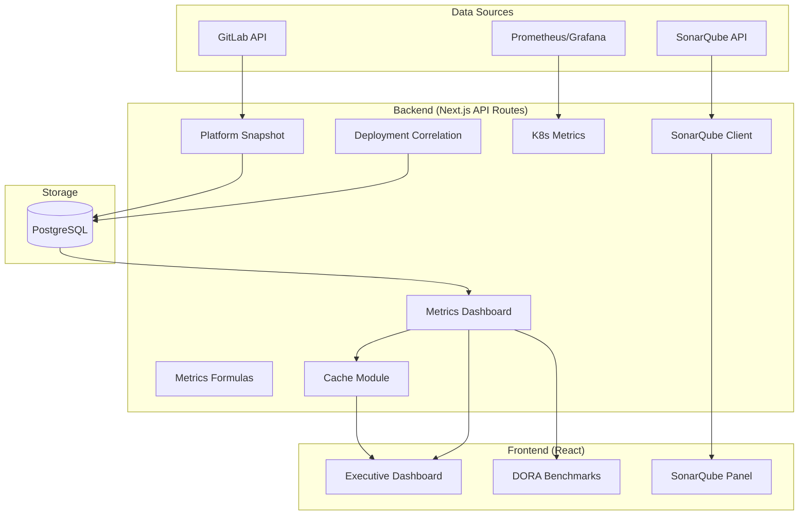

# Documento de Diseño: DORA Metrics Production Readiness

## Resumen

Este documento describe los cambios de diseño necesarios para llevar las métricas DORA del Portal de Plataforma a un estado production-ready. Se trata de un esfuerzo de **hardening** — no se introduce nueva arquitectura, sino que se corrigen definiciones, se mejora la configurabilidad, se optimiza el rendimiento y se añade transparencia sobre la calidad de los datos.

Los cambios se agrupan en:
1. **Correcciones semánticas** (Req 1, 2, 15): Definición canónica de Lead Time, renombrado MTTR → Pipeline Recovery Time
2. **Filtrado y confianza** (Req 3, 11): Umbral mínimo de correlación, indicador de confianza
3. **Configurabilidad** (Req 4, 6, 7, 13): Variables de entorno para umbrales y listas
4. **Mejoras de integración** (Req 5, 14): Auto-mapeo SonarQube, flexibilización de unicidad
5. **Rendimiento y API** (Req 8, 10, 12): Endpoint unificado, índices, caché selectiva
6. **Limpieza** (Req 9): Eliminación de columnas deprecadas

## Arquitectura

La arquitectura existente se mantiene sin cambios estructurales:



### Decisiones de Diseño Clave

| Decisión | Justificación |
|----------|---------------|
| Variables de entorno para configuración | Permite ajustes sin redeploy de código; patrón ya usado en el proyecto |
| Endpoint unificado `/api/metrics/executive-summary` | Reduce 5 llamadas paralelas a 1, simplifica error handling en frontend |
| Invalidación de caché por prefijo | El módulo `cache.ts` ya soporta invalidación por prefijo; solo falta usarlo selectivamente |
| Migración SQL para índices y constraints | Patrón establecido en `migrations/` del proyecto |
| Constante `CANONICAL_LEAD_TIME_VARIANT` en metrics-formulas | Centraliza la definición en el módulo de fórmulas, fuente de verdad para cálculos |

## Componentes e Interfaces

### 1. `src/lib/metrics-formulas.ts` — Cambios

```typescript
/** Variante canónica de Lead Time para reporting DORA oficial.
 * Mide desde el primer commit del MR hasta el deploy en producción.
 * Referencia: DORA/Accelerate State of DevOps Report. */
export const CANONICAL_LEAD_TIME_VARIANT = "first_commit" as const;

export type LeadTimeVariant = "first_commit" | "mr_created" | "last_commit";

/** Orden de fallback cuando la variante canónica no está disponible. */
export const LEAD_TIME_FALLBACK_ORDER: LeadTimeVariant[] = [
  "first_commit",
  "mr_created",
  "last_commit",
];

/** Umbral máximo de lead time en horas. Configurable via DORA_MAX_LEAD_TIME_HOURS. */
export const LEAD_TIME_GUARD_HOURS: number =
  parsePositiveEnvInt("DORA_MAX_LEAD_TIME_HOURS") ?? 90 * 24;

/**
 * Umbral de anomalía para Deployment Frequency.
 * Basado en el percentil 99 de frecuencias históricas observadas en el cluster.
 * Valores por encima de este umbral se consideran anómalos (posible error de conteo
 * o pipeline en loop). Configurable via DORA_DF_ANOMALY_THRESHOLD.
 */
export const DF_ANOMALY_THRESHOLD: number =
  parsePositiveEnvInt("DORA_DF_ANOMALY_THRESHOLD") ?? 50;

/**
 * Selecciona la variante de lead time según el orden canónico de fallback.
 * Retorna el valor y la variante utilizada.
 */
export function selectLeadTimeWithVariant(
  firstCommitHours: number | null,
  mrCreatedHours: number | null,
  lastCommitHours: number | null
): { hours: number; variant: LeadTimeVariant } | null;

/** Helper para parsear enteros positivos de variables de entorno. */
function parsePositiveEnvInt(envKey: string): number | null;
```

### 2. `src/lib/deployment-correlation.ts` — Cambios

```typescript
/** Confianza mínima para incluir correlaciones en cálculos de métricas.
 * Configurable via DORA_MIN_CORRELATION_CONFIDENCE. Default: 0.7 */
export const MIN_CORRELATION_CONFIDENCE: number =
  parsePositiveEnvFloat("DORA_MIN_CORRELATION_CONFIDENCE") ?? 0.7;

/**
 * Filtra correlaciones por confianza mínima.
 * Retorna solo las que superan el umbral configurado.
 */
export function filterByConfidence(
  correlations: Correlation[],
  minConfidence?: number
): Correlation[];

/**
 * Para un conjunto de correlaciones del mismo pipeline,
 * selecciona la de mayor confianza.
 */
export function selectBestCorrelationPerPipeline(
  correlations: Correlation[]
): Map<string, Correlation>;
```

### 3. `src/lib/k8s-metrics.ts` — Cambios

```typescript
/**
 * Conjunto de namespaces de infraestructura excluidos de métricas de aplicación.
 * Configurable via K8S_INFRA_NAMESPACES (lista separada por comas).
 */
export function getInfraNamespaces(): Set<string>;

// Se reemplaza la constante INFRA_NAMESPACES por la función getInfraNamespaces()
// que lee de env var con fallback al conjunto hardcodeado actual.
```

### 4. `src/lib/sonarqube.ts` — Cambios

```typescript
/** Máximo de páginas a iterar en getAllProjects.
 * Configurable via SONAR_MAX_PAGES. Default: 50 (= 5000 proyectos con pageSize=100). */
export const MAX_SONAR_PAGES: number =
  parsePositiveEnvInt("SONAR_MAX_PAGES") ?? 50;

/** Estrategias de auto-mapeo SonarQube → GitLab */
export type MappingStrategy = "exact-name" | "normalized-path" | "gitlab-project-id";

export interface MappingResult {
  sonarKey: string;
  gitlabProjectId: number | null;
  gitlabProjectPath: string | null;
  strategy: MappingStrategy | null;
  suggestions: Array<{ projectId: number; path: string; similarity: number }>;
}

/**
 * Intenta auto-mapear un proyecto SonarQube a GitLab usando múltiples estrategias.
 */
export function autoMapSonarProject(
  sonarProject: SonarQubeProject,
  gitlabProjects: Array<{ id: number; path: string; name: string }>
): MappingResult;
```

### 5. `src/lib/cache.ts` — Cambios

La función `invalidateCache` ya soporta invalidación por prefijo. Solo se necesita:
- Documentar los prefijos estándar
- Asegurar que `cacheKey()` use prefijos consistentes

```typescript
/** Prefijos estándar de caché para invalidación selectiva */
export const CACHE_PREFIXES = {
  dora: "dora",
  sonar: "sonar",
  k8s: "k8s",
  correlation: "correlation",
  executive: "executive",
} as const;

// invalidateCache(keyOrPrefix) ya funciona correctamente para prefijos.
// No se requieren cambios funcionales, solo uso consistente.
```

### 6. `src/lib/metrics-dashboard.ts` — Cambios

```typescript
/** Respuesta del endpoint unificado executive-summary */
export interface ExecutiveSummaryResponse {
  deploymentFrequency: TrendMetric;
  leadTime: {
    value: TrendMetric;
    variant: LeadTimeVariant;
    variantCoverage: Record<LeadTimeVariant, number>; // porcentaje por variante
  };
  changeFailureRate: {
    value: TrendMetric;
    confidenceLevel: "alta" | "media" | "baja";
    avgCorrelationConfidence: number;
    lowConfidenceWarning: boolean; // true si >30% bajo umbral
  };
  pipelineRecoveryTime: TrendMetric; // antes "mttr"
  totals: {
    deployments: number;
    failures: number;
    developers: number;
  };
  mrStats: {
    lifetime: { median: number; mean: number };
    leadTime: { median: number; mean: number };
    reviewTime: { median: number; mean: number };
    summary: { totalMRs: number; mergedMRs: number; openMRs: number; uniqueContributors: number };
  };
  audit: AuditSummary;
  errors: string[]; // secciones que fallaron (resultados parciales)
}

/**
 * Calcula el confidence score (0-100) basado en:
 * - Porcentaje de despliegues con lead time disponible (peso 40%)
 * - Confianza promedio de correlaciones (peso 40%)
 * - Ausencia de anomalías (peso 20%)
 */
export function calculateConfidenceScore(params: {
  leadTimeCoveragePct: number;
  avgCorrelationConfidence: number;
  anomalyCount: number;
}): number;

/**
 * Genera el resumen ejecutivo completo en una sola llamada.
 * Ejecuta consultas en paralelo internamente.
 */
export async function getExecutiveSummary(
  filters: DashboardFilters
): Promise<ExecutiveSummaryResponse>;
```

### 7. `src/lib/platform-snapshot.ts` — Cambios

```typescript
// Después de cada fase, invalidar solo los prefijos relevantes:
// Phase 1 DORA → invalidateCache("dora")
// Phase 1 SonarQube → invalidateCache("sonar")
// Phase 1 K8s → invalidateCache("k8s")
// Phase 3 Correlation → invalidateCache("dora") + invalidateCache("correlation")
// Reemplaza el invalidateCache() global actual al final.
```

### 8. Nuevo: `src/app/api/metrics/executive-summary/route.ts`

```typescript
import { NextRequest, NextResponse } from "next/server";
import { getExecutiveSummary } from "@/lib/metrics-dashboard";
import { cached, cacheKey, CACHE_PREFIXES } from "@/lib/cache";
import { requireAuth } from "@/lib/api-auth";

export async function GET(req: NextRequest): Promise<NextResponse> {
  // Acepta: days, teams, projectIds (mismos filtros que endpoints individuales)
  // Retorna: ExecutiveSummaryResponse
  // Cachea con prefijo "executive:"
}
```

### 9. Componentes Frontend — Cambios

**`src/components/metrics/executive-dashboard.tsx`:**
- Reemplazar 5 llamadas `fetch` por una sola a `/api/metrics/executive-summary`
- Añadir badge de confianza junto a CFR
- Añadir etiqueta de variante junto a Lead Time
- Renombrar "MTTR" → "Pipeline Recovery Time" en labels
- Añadir panel colapsable de auditoría
- Mostrar banner de advertencia cuando confidence < 50

**`src/components/metrics/shared/dora-benchmarks.tsx`:**
- Cambiar label "MTTR" → "Pipeline Recovery Time" (ya hecho parcialmente)
- Añadir subtítulo/tooltip en "Lead Time" indicando "desde primer commit hasta deploy"
- Añadir nota al pie sobre benchmarks DORA de referencia

**`src/components/sonarqube/enhanced-sonarqube-panel.tsx`:**
- Añadir sección "Proyectos sin mapear" con sugerencias
- Mostrar porcentaje de cobertura de mapeo

## Modelos de Datos

### Migración: `migrations/2026-05-XX_dora_production_readiness.sql`

```sql
-- 1. Deprecar columnas SonarQube en dora_metrics_daily (Req 9)
ALTER TABLE dora_metrics_daily
  ALTER COLUMN coverage SET DEFAULT NULL,
  ALTER COLUMN bugs SET DEFAULT NULL,
  ALTER COLUMN vulnerabilities SET DEFAULT NULL,
  ALTER COLUMN code_smells SET DEFAULT NULL,
  ALTER COLUMN tech_debt_minutes SET DEFAULT NULL;

COMMENT ON COLUMN dora_metrics_daily.coverage IS 'DEPRECATED: Use sonarqube_metrics_daily instead';
COMMENT ON COLUMN dora_metrics_daily.bugs IS 'DEPRECATED: Use sonarqube_metrics_daily instead';
COMMENT ON COLUMN dora_metrics_daily.vulnerabilities IS 'DEPRECATED: Use sonarqube_metrics_daily instead';
COMMENT ON COLUMN dora_metrics_daily.code_smells IS 'DEPRECATED: Use sonarqube_metrics_daily instead';
COMMENT ON COLUMN dora_metrics_daily.tech_debt_minutes IS 'DEPRECATED: Use sonarqube_metrics_daily instead';

-- 2. Índices de rendimiento (Req 10)
CREATE INDEX IF NOT EXISTS idx_deployment_traces_deploy_type
  ON deployment_traces(deploy_type);

CREATE INDEX IF NOT EXISTS idx_deployment_traces_composite
  ON deployment_traces(snapshot_date, project_id, deploy_type);

CREATE INDEX IF NOT EXISTS idx_dora_metrics_daily_date_project
  ON dora_metrics_daily(snapshot_date, project_id);

CREATE INDEX IF NOT EXISTS idx_sonarqube_metrics_daily_date_key
  ON sonarqube_metrics_daily(snapshot_date, sonar_project_key);

-- 3. Flexibilización de unicidad en deployment_correlation (Req 14)
-- Eliminar constraint actual
ALTER TABLE deployment_correlation
  DROP CONSTRAINT IF EXISTS deployment_correlation_correlation_date_gitlab_project_id_key;

-- Crear constraint más granular que permite múltiples syncs por pipeline
ALTER TABLE deployment_correlation
  ADD CONSTRAINT deployment_correlation_unique_sync
  UNIQUE (correlation_date, gitlab_project_id, gitlab_pipeline_id, argocd_app_key, argocd_sync_timestamp);
```

### Tipos TypeScript Actualizados

```typescript
// src/types/metrics.ts — adiciones

export type LeadTimeVariant = "first_commit" | "mr_created" | "last_commit";

export type ConfidenceLevel = "alta" | "media" | "baja";

export type ExecutiveSummaryData = {
  deploymentFrequency: MetricTrend;
  leadTime: {
    value: MetricTrend;
    variant: LeadTimeVariant;
    variantLabel: string;
    variantCoverage: Record<LeadTimeVariant, number>;
  };
  changeFailureRate: {
    value: MetricTrend;
    confidenceLevel: ConfidenceLevel;
    avgCorrelationConfidence: number;
    lowConfidenceWarning: boolean;
  };
  pipelineRecoveryTime: MetricTrend;
  totals: {
    deployments: number;
    failures: number;
    developers: number;
  };
  audit: AuditSummary;
  errors: string[];
};
```

## Propiedades de Correctitud

*Una propiedad es una característica o comportamiento que debe mantenerse verdadero en todas las ejecuciones válidas de un sistema — esencialmente, una declaración formal sobre lo que el sistema debe hacer. Las propiedades sirven como puente entre especificaciones legibles por humanos y garantías de correctitud verificables por máquina.*

### Propiedad 1: Selección de Lead Time con Fallback Canónico

*Para cualquier* conjunto de valores de lead time (firstCommitHours, mrCreatedHours, lastCommitHours) donde al menos uno es válido (finito y > 0), la función `selectLeadTimeWithVariant` SHALL retornar la primera variante disponible según el orden `first_commit` → `mr_created` → `last_commit`, y cuando ninguno es válido SHALL retornar null.

**Valida: Requisitos 1.2, 1.3**

### Propiedad 2: Exclusión de Correlaciones de Baja Confianza en CFR

*Para cualquier* conjunto de correlaciones con scores de confianza entre 0.0 y 1.0, y cualquier umbral MIN_CORRELATION_CONFIDENCE, la función `filterByConfidence` SHALL retornar únicamente correlaciones cuyo score sea ≥ al umbral, y el conjunto resultante SHALL ser un subconjunto del original.

**Valida: Requisitos 3.2**

### Propiedad 3: Advertencia de Confianza Baja

*Para cualquier* conjunto de correlaciones, si más del 30% tienen confianza inferior a MIN_CORRELATION_CONFIDENCE, el campo `lowConfidenceWarning` SHALL ser true; en caso contrario SHALL ser false.

**Valida: Requisitos 3.4**

### Propiedad 4: Parsing de Namespaces desde Variable de Entorno

*Para cualquier* string de namespaces separados por comas (incluyendo espacios extra, comas duplicadas, y strings vacíos), la función `getInfraNamespaces` SHALL retornar un Set que contenga exactamente los valores no-vacíos trimmeados, sin duplicados.

**Valida: Requisitos 4.2**

### Propiedad 5: Porcentaje de Mapeo SonarQube-GitLab

*Para cualquier* conjunto de N proyectos SonarQube donde M están mapeados a GitLab (0 ≤ M ≤ N, N > 0), el porcentaje de cobertura SHALL ser exactamente (M / N) * 100.

**Valida: Requisitos 5.4**

### Propiedad 6: Conteo de Despliegues Descartados

*Para cualquier* conjunto de despliegues con lead times variados y un umbral LEAD_TIME_GUARD_HOURS, el campo `droppedDeployments` en AuditSummary SHALL ser igual al número de despliegues cuyo lead time excede el umbral.

**Valida: Requisitos 6.4**

### Propiedad 7: Reporte de Anomalías en Audit Summary

*Para cualquier* valor de deployment frequency y un umbral DF_ANOMALY_THRESHOLD, si el valor excede el umbral, el evento SHALL aparecer en el AuditSummary con el valor observado y el umbral aplicado; si no lo excede, no SHALL aparecer.

**Valida: Requisitos 7.4**

### Propiedad 8: Resultados Parciales del Endpoint Unificado

*Para cualquier* combinación de sub-consultas que fallan o tienen éxito en `getExecutiveSummary`, la respuesta SHALL contener datos válidos para las secciones exitosas y SHALL listar en el campo `errors` exactamente las secciones que fallaron.

**Valida: Requisitos 8.4**

### Propiedad 9: Confidence Score en Rango Válido

*Para cualquier* combinación de inputs (leadTimeCoveragePct ∈ [0,100], avgCorrelationConfidence ∈ [0,1], anomalyCount ≥ 0), la función `calculateConfidenceScore` SHALL retornar un valor en el rango [0, 100].

**Valida: Requisitos 11.1**

### Propiedad 10: Invalidación Selectiva de Caché por Prefijo

*Para cualquier* estado del caché con entradas de múltiples prefijos, al invocar `invalidateCache(prefix)`, SHALL eliminarse todas y solo las entradas cuya clave comienza con `prefix:` o es exactamente `prefix`, y las demás entradas SHALL permanecer intactas.

**Valida: Requisitos 12.1, 12.2, 12.3, 12.4, 12.5**

### Propiedad 11: Paginación con Límite Máximo

*Para cualquier* valor de MAX_SONAR_PAGES > 0, cuando la API de SonarQube retorna páginas completas indefinidamente, `getAllProjects` SHALL detener la iteración después de exactamente MAX_SONAR_PAGES páginas y retornar los proyectos acumulados hasta ese punto.

**Valida: Requisitos 13.2**

### Propiedad 12: Selección de Mejor Correlación por Pipeline

*Para cualquier* conjunto de correlaciones donde existen múltiples entradas para el mismo (pipeline_id, argocd_app_key), la función `selectBestCorrelationPerPipeline` SHALL retornar para cada grupo la correlación con el mayor valor de confidence.

**Valida: Requisitos 14.4**

### Propiedad 13: Campo de API Renombrado

*Para cualquier* respuesta válida de `getExecutiveSummary`, el objeto SHALL contener el campo `pipelineRecoveryTime` y SHALL NO contener un campo `mttr` a nivel raíz.

**Valida: Requisitos 2.4**

## Manejo de Errores

| Escenario | Comportamiento |
|-----------|---------------|
| Variable de entorno con valor inválido (no numérico) | Usar valor por defecto, registrar warning en log |
| Endpoint unificado: sub-consulta falla | Retornar resultados parciales con `errors[]` |
| SonarQube: se alcanza MAX_SONAR_PAGES | Detener iteración, registrar warning, retornar datos parciales |
| Lead time excede guard | Descartar despliegue, registrar warning con detalles, incrementar contador en audit |
| Correlación sin confianza suficiente | Excluir de cálculos de CFR, incluir en conteo de correlaciones totales para transparencia |
| Caché: invalidación de prefijo inexistente | No-op silencioso (comportamiento actual) |
| Migración SQL: constraint ya eliminada | `IF EXISTS` previene error |
| Auto-mapeo SonarQube: sin coincidencias | Registrar en log, mostrar en panel como "sin mapear" con sugerencias |

## Estrategia de Testing

### Testing Unitario (example-based)

- **Labels y UI**: Verificar que los componentes renderizan las etiquetas correctas ("Pipeline Recovery Time", variante de lead time, tooltips)
- **Configuración**: Verificar lectura correcta de variables de entorno con valores válidos, inválidos y ausentes
- **Logging**: Verificar que se emiten los warnings esperados cuando se descartan despliegues o se alcanzan límites
- **Migración SQL**: Verificar que el archivo contiene los statements esperados (índices, constraints)

### Testing de Propiedades (property-based)

Se utilizará **fast-check** como librería de property-based testing (ya disponible en el ecosistema Node.js/TypeScript del proyecto).

Configuración:
- Mínimo **100 iteraciones** por propiedad
- Cada test referencia su propiedad del documento de diseño
- Tag format: `Feature: dora-metrics-production-readiness, Property {N}: {título}`

Propiedades a implementar:
1. Selección de Lead Time con Fallback (Prop 1)
2. Exclusión de correlaciones de baja confianza (Prop 2)
3. Advertencia de confianza baja (Prop 3)
4. Parsing de namespaces (Prop 4)
5. Porcentaje de mapeo (Prop 5)
6. Conteo de despliegues descartados (Prop 6)
7. Reporte de anomalías (Prop 7)
8. Resultados parciales (Prop 8)
9. Confidence score en rango (Prop 9)
10. Invalidación selectiva de caché (Prop 10)
11. Paginación con límite (Prop 11)
12. Mejor correlación por pipeline (Prop 12)
13. Campo API renombrado (Prop 13)

### Testing de Integración

- Endpoint `/api/metrics/executive-summary`: verificar respuesta completa con datos reales de test
- Migración SQL: ejecutar contra base de datos de test y verificar índices/constraints creados
- Snapshot pipeline: verificar invalidación selectiva de caché tras cada fase

### Testing de Humo (smoke)

- Verificar que constantes `CANONICAL_LEAD_TIME_VARIANT`, `MIN_CORRELATION_CONFIDENCE`, `MAX_SONAR_PAGES` existen con valores por defecto correctos
- Verificar que la migración SQL es parseable y ejecutable
