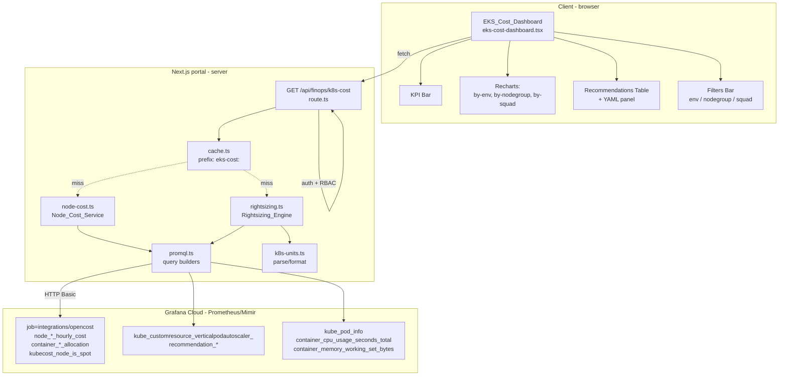

# Design Document — EKS Cost Optimization

## Overview

Esta feature rehace la pestaña "EKS Allocation" del portal (`/finops`) con una experiencia visual estilo AWS FinOps centrada en un mensaje claro: **el coste real de EKS es el NODO**. Todo lo demás (atribución por workload, por squad, recomendaciones de rightsizing) es un medio para reducir el número de nodos que corren en cada nodegroup.

La cadena de valor del dashboard es explícita:

```
recursos sobre-provisionados → nodos de más → coste en € →
recomendación concreta de ajuste → ahorro estimado en €
```

Reutiliza la infraestructura ya existente en el portal: métricas de OpenCost + VPA en Grafana Cloud (`src/lib/grafana-metrics.ts`), caché in-memory con prefijos (`src/lib/cache.ts`), auth NextAuth + RBAC (`hasSessionMinimumRole`, `SECTION_ACCESS`), logger estándar, y componentes shadcn/ui + Recharts.

El diseño evoluciona dos endpoints existentes:

- `GET /api/finops/k8s-allocation` — se **sustituye** por `GET /api/finops/k8s-cost` (nuevo shape, orientado a nodo).
- `GET /api/finops/vpa` — se **integra** dentro del nuevo modelo (`recommendations[]`), pero el endpoint se conserva vivo como fuente durante la transición.

Y sustituye dos componentes:

- `src/components/finops/k8s-allocation-dashboard.tsx` → `src/components/finops/eks-cost/eks-cost-dashboard.tsx`.
- `src/components/finops/k8s-vpa-table.tsx` → panel expandible dentro del nuevo `recommendations-table.tsx` (se elimina como sub-vista independiente).

Alcance: los 4 clusters EKS (dp-dev, dp-uat, dp-prd, dp-tooling, todos en eu-west-1). Acceso mínimo `desarrolladores`. Fuera de alcance: coste EBS/PV, aplicación automática de recomendaciones (el portal solo recomienda; el usuario edita su chart), y coste AWS ajeno a Kubernetes.

### Fuentes de datos y decisiones de diseño

| Decisión | Racional |
|----------|----------|
| Coste = `node_total_hourly_cost * 730` agregado por `(k8s_cluster_name, nodegroup)` | Es la métrica auditable y la que consumen ya el resto de vistas FinOps. Convención cloud estándar (730 h/mes). |
| Atribución nodo→workload por asignación de CPU y memoria | Los nuevos nodegroups por IaC garantizan afinidad pod→nodegroup ("cada pod en su nodo"). La suma es conservativa (≤ coste del nodo). |
| Squad = label de propiedad del workload; fallback namespace; fallback `"sin asignar"` | Consistente con `k8s-vpa.ts` (que ya usa `bySquad`). No inventamos una taxonomía nueva. |
| Nodegroup = etiqueta `eks.amazonaws.com/nodegroup` (canónica en EKS) con fallback a `nodegroup` (nombre corto) | Alineado con IaC del cluster tooling y de dp-dev/uat/prod. |
| Rightsizing con p95 7d + suelos por pod + upperbound VPA para memoria | Ya validado en `k8s-finops.ts` (heurística conservadora, cap 70% del coste). |
| Cache 5 min por combinación de filtros (prefijo `eks-cost:`) | Alineado con el resto de FinOps (Kiro, forecast, k8s-allocation). |
| Módulos separados en lugar de un `k8s-finops.ts` monolítico | Testabilidad (unidades puras, PBT), y separación de responsabilidades (cost / rightsizing / units / promql). |
| Nuevo endpoint `k8s-cost` en lugar de mutar `k8s-allocation` | El shape cambia por completo (nodo-centric). Mantener el legacy como alias durante 1-2 releases evita romper cronjobs internos o dashboards embebidos. |

## Architecture

### Diagrama de flujo



### Capas (backend)

El actual `src/lib/k8s-finops.ts` (900+ líneas) se **reescribe** partiéndolo en módulos con responsabilidades claras:

| Módulo | Responsabilidad | Puro (testable con PBT) |
|--------|-----------------|--------------------------|
| `src/lib/eks-cost/promql.ts` | Constructores de queries PromQL (strings). No hace fetch. | Sí |
| `src/lib/eks-cost/node-cost.ts` | Node_Cost_Service. Consume promql + `grafanaMetricsClient`, agrega por env/nodegroup/squad/workload. | Parcial (funciones agregadoras puras) |
| `src/lib/eks-cost/rightsizing.ts` | Rightsizing_Engine. Combina p95 + requests + VPA upperbound, produce `Recommendation[]` con YAML. | Parcial (cálculos puros, generación YAML pura) |
| `src/lib/eks-cost/k8s-units.ts` | `formatCpu`, `parseCpu`, `formatMemory`, `parseMemory`. | Sí (100% puro, round-trip PBT) |
| `src/lib/eks-cost/types.ts` | Tipos compartidos (`Environment`, `Nodegroup`, `Workload`, `Recommendation`, `AllocationResponse`, `Warning`). | N/A |
| `src/lib/eks-cost/index.ts` | Fachada: `fetchEksCostSummary(filters)`. | N/A |

El módulo original `src/lib/k8s-finops.ts` se elimina en cuanto ambos endpoints legacy dejen de referenciarlo (ver §Migration).

### Integración con `/finops`

La página `src/app/finops/page.tsx` ya tiene 4 pestañas (`Costes | Inventario | EKS Allocation | Asesor`). La pestaña "EKS Allocation" pasa a renderizar `<EksCostDashboard />` en lugar de `<K8sAllocationDashboard />`. El resto de pestañas no se toca. `K8sNodesAnalysis` (sub-componente pre-existente) queda deprecado; su información útil (nodos por cluster) se integra en el nuevo `nodegroup-breakdown-chart.tsx`.


## Components and Interfaces

### Backend — módulos y contratos

#### `src/lib/eks-cost/types.ts`

```typescript
export type EnvironmentName = "dev" | "uat" | "prod" | "tooling";

export interface Environment {
  name: EnvironmentName;            // dev|uat|prod|tooling
  cluster: string;                  // dp-dev, dp-uat, dp-prd, dp-tooling
  monthlyCostEur: number;           // suma de todos los nodegroups
  nodeCount: number;
  spotCount: number;
  spotCoveragePct: number;          // 0..100
  nodegroups: Nodegroup[];
}

export interface Nodegroup {
  name: string;                     // "main", "spot-4xl", …
  cluster: string;
  environment: EnvironmentName;
  nodeCount: number;
  spotCount: number;
  spotCoveragePct: number;          // 0..100
  monthlyCostEur: number;
  avgNodeCostEur: number;           // monthlyCostEur / nodeCount (>0)
  overprovisioningEur: number;      // agregado de las recomendaciones over-*
  excessNodes: number;              // overprovisioningEur / avgNodeCostEur (>=0)
}

export interface Workload {
  cluster: string;
  environment: EnvironmentName;
  namespace: string;
  workload: string;                 // pod name normalizado
  nodegroup: string;                // nodegroup dominante
  squad: string;                    // "sin asignar" si no hay label
  podCount: number;
  cpuRequestCores: number;          // suma de requests actuales
  memRequestBytes: number;          // idem
  cpuUsageP95Cores: number;         // p95 sobre 7d
  memUsageP95Bytes: number;         // idem
  monthlyCostEur: number;
}

export type RecommendationKind =
  | "over-cpu"
  | "over-mem"
  | "under-cpu"
  | "under-mem";

export interface Recommendation {
  cluster: string;
  environment: EnvironmentName;
  namespace: string;
  workload: string;
  nodegroup: string;
  squad: string;
  kind: RecommendationKind;
  // Valores en unidades canónicas del backend (cores + bytes) y también
  // en su expresión Kubernetes lista para copiar.
  currentRequest: { value: number; k8s: string };      // "500m", "2Gi", …
  recommendedRequest: { value: number; k8s: string };
  estimatedSavingsEur: number;                          // 0 para under-*
  unitYamlBlock: string;                                // bloque resources:
  reason: string;                                       // 1 línea humana
}

export interface Squad {
  name: string;
  monthlyCostEur: number;
  workloadCount: number;
  overprovisioningEur: number;
}

export type WarningCode =
  | "metrics-not-configured"
  | "metrics-partial-fail"
  | "vpa-missing"
  | "no-nodegroup-label"
  | "no-squad-label"
  | "empty-window";

export interface Warning {
  code: WarningCode;
  message: string;
  source: string;                   // "node-cost.fetchNodegroups" p.ej.
}

export interface AllocationResponse {
  generatedAt: string;              // ISO 8601
  totalMonthlyEur: number;
  totalNodeCount: number;
  totalSpotCoveragePct: number;
  totalEstimatedSavingsEur: number;
  environments: Environment[];
  nodegroups: Nodegroup[];
  squads: Squad[];
  workloads: Workload[];            // top-N (200 max) para la tabla
  recommendations: Recommendation[]; // top-N (100 max) por ahorro DESC
  warnings: Warning[];
}

export interface Filters {
  env?: EnvironmentName;            // "dev" | "uat" | "prod" | "tooling"
  nodegroup?: string;
  squad?: string;
}
```

Notas:

- Todos los importes en EUR. El backend hace `USD → EUR` con tasa fija por env (`EKS_USD_EUR_RATE`, default `0.92`), documentada como aproximada. El objetivo del dashboard es magnitud + tendencia, no facturación.
- Los valores de recurso en el backend siempre en unidades canónicas SI (cores como `number`, memoria como `bytes`). La representación Kubernetes vive en el campo `.k8s` producido por `k8s-units.ts`.
- `RecommendationKind` es un enum cerrado; los tests hacen exhaustive check.

#### `src/lib/eks-cost/promql.ts`

Constructores puros de queries. No hacen fetch, sólo componen strings. Facilita snapshot-testing y evita romper el "division-inside-sum-by" (gotcha #7 del portal).

```typescript
export const HOURS_PER_MONTH = 730;

// Coste horario nodo, agrupado por (cluster, nodegroup)
export function qNodeCostHourly(): string;

// Cuenta de nodos por (cluster, nodegroup)
export function qNodeCount(): string;

// Cuenta de nodos spot por (cluster, nodegroup)
export function qSpotCount(): string;

// Coste hora por workload (cpu ó ram), preservando labels
export function qWorkloadCost(kind: "cpu" | "ram"): string;

// Requests actuales del workload (cores | bytes)
export function qWorkloadRequests(kind: "cpu" | "mem"): string;

// p95 uso 7d (cores | bytes)
export function qWorkloadUsageP95(kind: "cpu" | "mem"): string;

// VPA recommendation target / upperBound
export function qVpaRecommendation(
  kind: "cpu-target" | "cpu-upper" | "mem-target" | "mem-upper"
): string;

// Nodegroup por nodo (para atribución nodo→workload)
export function qNodegroupByNode(): string;
```

Los tests validan que:

1. Las divisiones por bytes (`/(1024*1024*1024)`) siempre viven **dentro** del `sum by (…)` para preservar labels.
2. `qWorkloadCost("ram")` incluye la agrupación por `(cluster, node)` en el `on()` del join.
3. `qSpotCount` usa `count by (…) (kubecost_node_is_spot > 0)` (obligatorio en Mimir).

#### `src/lib/eks-cost/node-cost.ts` (Node_Cost_Service)

```typescript
export interface NodeCostContext {
  metrics: GrafanaMetricsClient;    // inyectable — permite mocks en PBT
  usdToEur: number;                 // default 0.92
  hoursPerMonth: number;            // default 730
  now: () => Date;                  // default () => new Date()
}

export async function fetchNodegroups(ctx: NodeCostContext): Promise<{
  nodegroups: Nodegroup[];
  environments: Environment[];
  warnings: Warning[];
}>;

export async function fetchWorkloads(ctx: NodeCostContext): Promise<{
  workloads: Workload[];
  warnings: Warning[];
}>;

// Función pura (testable con PBT)
export function attributeWorkloadCostToNodegroup(
  workloads: Workload[],
  nodegroups: Nodegroup[],
): { workloadsByNodegroup: Map<string, Workload[]>; warnings: Warning[] };

// Función pura
export function aggregateSquadCost(
  workloads: Workload[],
  recommendations: Recommendation[],
): Squad[];
```

Resolución de nodegroup y squad (documentado en la implementación):

```typescript
// nodegroup: prioridad label canónica EKS → label corta → "unknown"
function resolveNodegroup(nodeLabels: Record<string, string>): string {
  return (
    nodeLabels["eks_amazonaws_com_nodegroup"] ||
    nodeLabels["nodegroup"] ||
    "unknown"
  );
}

// squad: prioridad label owner → label squad → namespace → "sin asignar"
function resolveSquad(podLabels: Record<string, string>, namespace: string): string {
  return (
    podLabels["owner"] ||
    podLabels["squad"] ||
    podLabels["team"] ||
    namespace ||
    "sin asignar"
  );
}
```

#### `src/lib/eks-cost/rightsizing.ts` (Rightsizing_Engine)

```typescript
export interface RightsizingParams {
  headroomCpu: number;             // default 0.5
  headroomMem: number;             // default 0.7
  floorCpuPerPod: number;          // default 0.1 cores
  floorMemPerPod: number;          // default 128 * 1024 * 1024 (128Mi)
  savingsCapFraction: number;      // default 0.7
  minUptimeMinutes: number;        // default 60
  minMonthlyCostEur: number;       // default 10
}

// Pura, testable con PBT
export function computeCpuTarget(w: Workload, p: RightsizingParams): number;
export function computeMemTarget(
  w: Workload,
  vpaMemUpperBytes: number | null,
  p: RightsizingParams,
): number;

// Pura
export function classifyOverUnder(
  w: Workload,
  cpuTarget: number,
  memTarget: number,
): RecommendationKind[];

// Pura
export function estimateSavings(
  currentBytes: number,
  targetBytes: number,
  monthlyCostEur: number,
  cap: number,
): number;

// Pura: aplica reglas de priorización (memoria over CPU en under)
export function priorityFilter(
  recs: Recommendation[],
): Recommendation[];

// Pura: genera el bloque YAML resources: para copiar
export function buildYamlBlock(
  workload: string,
  namespace: string,
  cpuReq: string,      // "500m"
  memReq: string,      // "512Mi"
): string;

export async function fetchRecommendations(
  ctx: NodeCostContext,
  params: RightsizingParams,
  workloads: Workload[],
): Promise<{ recommendations: Recommendation[]; warnings: Warning[] }>;
```

Fórmulas canónicas (idénticas a las validadas hoy en `k8s-finops.ts`, expresadas ahora en tipos puros):

```
podCount     = max(1, workload.podCount)
target_cpu   = max(floorCpuPerPod  * podCount, p95_cpu_7d / headroomCpu)      # 50% headroom
target_mem   = max(floorMemPerPod * podCount, p95_mem_7d / headroomMem)      # 30% headroom
target_mem   = max(target_mem, vpaMemUpper)  when vpaMemUpper != null         # anti-OOM
monthlyCost  = hourlyCost * 730 * usdToEur
savings      = min((allocated - target) * unitCost * 730 * usdToEur,
                   monthlyCost * savingsCapFraction)
```

Priorización explícita: si un workload tiene simultáneamente `under-cpu` y `under-mem`, sólo se emite la recomendación de `under-mem` (mayor riesgo de OOM). Si tiene `over-cpu` y `over-mem`, se emiten ambas.

#### `src/lib/eks-cost/k8s-units.ts`

Módulo 100% puro. Round-trip garantizado dentro de la tolerancia de redondeo.

```typescript
// CPU
export function parseCpu(value: string): number;             // "500m" → 0.5, "2" → 2
export function formatCpu(cores: number): string;            // 0.5 → "500m", 2 → "2"

// Memoria
export function parseMemory(value: string): number;          // "512Mi" → 536870912, "2Gi" → 2147483648
export function formatMemory(bytes: number): string;         // 536870912 → "512Mi", 2147483648 → "2Gi"

// Round-trip helpers usados en tests
export function roundCpu(cores: number): number;             // redondea a milicores
export function roundMemory(bytes: number): number;          // redondea a Mi o Gi
```

Reglas de redondeo:

- **CPU**: siempre milicores enteros. `formatCpu(1.234)` → `"1234m"` (o `"1.234"` si ≥ 1000m se puede expresar en cores; el formato canónico usado por el YAML es milicores para <1 core y cores para ≥1).
- **Memoria**: si el valor en bytes ≤ 1024·1024·1024 (1 Gi) usamos `Mi` (redondeo hacia arriba en pasos de 16 Mi para no quedar corto). Si > 1 Gi usamos `Gi` con un decimal.
- **Round-trip**: `parseMemory(formatMemory(bytes)) ∈ [bytes, bytes * 1.06]` (nunca menor, cap 6% arriba por redondeo Mi step). `parseCpu(formatCpu(cores)) ∈ [cores, cores + 0.001]`.

Aceptamos entradas Kubernetes en las unidades habituales: cores enteros/decimales, milicores (`m`), Ki/Mi/Gi/Ti, K/M/G/T (base 1000). El **output** siempre es la forma canónica (`m` para CPU <1, `Mi`/`Gi` para memoria).

#### `src/lib/eks-cost/index.ts` — fachada

```typescript
export async function fetchEksCostSummary(
  filters: Filters,
  overrides?: Partial<NodeCostContext & RightsizingParams>,
): Promise<AllocationResponse>;
```

Es la única entrada consumida por el route handler. Aplica filtros server-side (para no mandar payloads gigantes al cliente), corta workloads a top-200 y recomendaciones a top-100 por `estimatedSavingsEur` DESC.

### Endpoint HTTP

#### `GET /api/finops/k8s-cost`

Nuevo route en `src/app/api/finops/k8s-cost/route.ts`.

Query params (todos opcionales, validados strictly):

| Param | Regex | Semántica |
|-------|-------|-----------|
| `env` | `^(dev|uat|prod|tooling)$` | Filtra a un `Environment` concreto |
| `nodegroup` | `^[a-z0-9][a-z0-9-]{0,62}$` | Filtra a un `Nodegroup` |
| `squad` | `^[A-Za-z0-9 _-]{1,64}$` | Filtra a un `Squad` |

Cualquier valor fuera del regex → **400** con mensaje que indica el parámetro inválido (sin devolver el valor recibido, para no reflejarlo en logs).

Auth y RBAC:

```typescript
const session = await getServerSession(authOptions);
if (!session?.user) return json({ error: "Authentication required" }, 401);
if (!hasSessionMinimumRole(session, "desarrolladores")) {
  return json({ error: "Access denied" }, 403);
}
```

Cache:

- Prefijo `eks-cost:` (nuevo, aislado del `dora:`, `sonar:`, `k8s:` existentes).
- Key: `cacheKey("eks-cost", { env, nodegroup, squad })`.
- TTL: 5 minutos.
- Invalidación: `invalidateCache("eks-cost")` (helper interno, útil para tests y para un futuro botón admin, NO expuesto en la UI para respetar Requirement 9.3).

Response 200:

```json
{
  "generatedAt": "2026-06-28T09:15:22.412Z",
  "totalMonthlyEur": 128456.32,
  "totalNodeCount": 128,
  "totalSpotCoveragePct": 42.1,
  "totalEstimatedSavingsEur": 21430.10,
  "environments": [ /* ... */ ],
  "nodegroups": [ /* ... */ ],
  "squads": [ /* ... */ ],
  "workloads": [ /* top 200 ... */ ],
  "recommendations": [ /* top 100 ... */ ],
  "warnings": [ { "code": "vpa-missing", "message": "…", "source": "rightsizing" } ]
}
```

Errores:

| Situación | Status | Cuerpo |
|-----------|--------|--------|
| Sin sesión | 401 | `{ "error": "Authentication required" }` (sin datos de coste) |
| Rol insuficiente | 403 | `{ "error": "Access denied" }` (sin datos de coste) |
| Query param inválido | 400 | `{ "error": "Invalid parameter: <name>" }` |
| Metrics_Provider no configurado (faltan env vars) | 500 | `{ "error": "Grafana Metrics is not ready", "missing": ["GRAFANA_METRICS_URL", "..."] }` |
| Fallo interno inesperado | 500 | `{ "error": "Failed to fetch EKS cost summary" }` (sin traza) |

Nota: el 500 por falta de configuración incluye los **nombres** de las env vars ausentes (obligatorio por Requirement 8.1). El resto de 500s son opacos para no filtrar internals.

Logging: cada consulta PromQL registra `{ query, durationMs, status, resultCount }` con el logger estándar del portal. Los tokens (`GRAFANA_METRICS_TOKEN`) nunca se loguean. La URL base ya la enmascara `grafanaMetricsClient`.

Timeouts: `grafanaMetricsClient` ya tiene `AbortController` con `GRAFANA_METRICS_TIMEOUT_MS` (default 15 s). No añadimos capa adicional. `maxDuration = 60` en el route (idéntico a `k8s-allocation`).

#### `GET /api/finops/k8s-allocation` (legacy)

Se mantiene como **alias temporal** durante 2 releases:

1. Sigue devolviendo el shape antiguo (`clusters`, `topNamespaces`, `topWorkloads`, `topLoadBalancers`, `rightsizingCandidates`).
2. Internamente construye ese shape a partir del nuevo `fetchEksCostSummary()` (adapter puro en `src/lib/eks-cost/legacy-adapter.ts`).
3. Header `Deprecation: true` + `Link: </api/finops/k8s-cost>; rel="successor-version"`.
4. Log `[k8s-allocation] legacy call from <session.email>` para saber cuándo podemos borrarlo.

Cuando el log muestre 0 calls en 2 semanas, se elimina route + `k8s-finops.ts`.

#### `GET /api/finops/vpa`

Se mantiene sin cambios de shape (lo consume la sub-vista "Ajuste de recursos" que se elimina, pero también lo puede consumir cualquier integración externa). Internamente puede rederivarse de `fetchEksCostSummary()` si conviene consolidar, pero no es objetivo de esta feature.


### Frontend — componentes y layout

Todos los componentes viven bajo `src/components/finops/eks-cost/`. Reutilizan el sistema de diseño existente (Tailwind + shadcn/ui + Recharts + `cn()` helper) y las utilidades de formato de euros de `costs-dashboard.tsx` (`formatEur`, `formatEurK`) — se extraen a `src/lib/eks-cost/format.ts` si aún no lo están.

```
src/components/finops/eks-cost/
├── eks-cost-dashboard.tsx          # contenedor + fetch + estados
├── kpi-bar.tsx                     # KPIs top-line
├── filters-bar.tsx                 # env / nodegroup / squad + refresh + timestamp
├── cost-by-environment-chart.tsx   # BarChart Recharts
├── nodegroup-breakdown-chart.tsx   # BarChart + drill-down + "N nodos de más"
├── squad-attribution-chart.tsx     # BarChart horizontal
├── recommendations-table.tsx       # tabla compacta
├── recommendation-detail-panel.tsx # panel expandible con YAML + copy
└── __tests__/
    └── *.test.tsx                  # tests de render y de propiedades UI
```

#### `EksCostDashboard` (contenedor)

Responsable de:

1. Fetch a `/api/finops/k8s-cost` con los filtros actuales (querystring).
2. Estados `loading`, `error`, `empty`, `ok`.
3. Propagar `AllocationResponse` a los sub-componentes.
4. Mostrar avisos (`warnings[]`) sin bloquear la vista (banner amarillo colapsable).

Estados terminales:

- **Loading**: skeletons en KPIs + gráficas (misma anchura y alto que la vista final para evitar CLS).
- **Empty**: (`totalMonthlyEur === 0` y sin warnings) mensaje "No hay datos de coste. Verifica que OpenCost está desplegado en los clusters."
- **Error**: card con mensaje + botón "Reintentar" (Requirement 8.5).
- **Ok con warnings**: renderiza normalmente + banner que lista `warnings[]`.

#### Layout (desktop)

```
┌─────────────────────────────────────────────────────────────────────────┐
│  FiltersBar: [Env ▼] [Nodegroup ▼] [Squad ▼]    Generado: 09:15  [↻]   │
├─────────────────────────────────────────────────────────────────────────┤
│  KpiBar: [Coste EKS/mes] [Ahorro potencial €] [Cobertura spot %]        │
│          [Nodos totales]   [Recomendaciones]                             │
├─────────────────────────────────────────────────┬───────────────────────┤
│  CostByEnvironmentChart                          │  SquadAttribution     │
│  (bar chart, altura ~280px)                      │  (horizontal bar)     │
├─────────────────────────────────────────────────┴───────────────────────┤
│  NodegroupBreakdownChart                                                 │
│  (bar chart apilado, con "N nodos de más" por nodegroup — Req 5.5)       │
├─────────────────────────────────────────────────────────────────────────┤
│  RecommendationsTable                                                    │
│  Cluster · NS · Workload · Squad · Tipo · Actual → Recomendado · €/mes  │
│  ▸ click → RecommendationDetailPanel: bloque YAML + botón Copiar         │
└─────────────────────────────────────────────────────────────────────────┘
```

Móvil: KPIs pasan a 2 por fila, gráficas 1 por fila, tabla con scroll horizontal (patrón ya usado en `k8s-allocation-dashboard.tsx`). El panel de detalle es un `Sheet` de shadcn en móvil.

#### `KpiBar`

5 tarjetas con `Card` + gradiente para la principal (coste total), igual patrón que la actual (`from-primary to-primary/80`). Todas usan el formato compacto (`formatEurK`, ej. `128,5k€`).

- **Coste EKS / mes**: `totalMonthlyEur` (destacado).
- **Ahorro potencial / mes**: `totalEstimatedSavingsEur` (verde).
- **Cobertura spot**: `totalSpotCoveragePct` (badge verde >30%, amarillo 10–30%, gris <10%).
- **Nodos totales**: `totalNodeCount` (+ subtítulo `X spot`).
- **Recomendaciones**: `recommendations.length` (+ subtítulo `top ahorro: X€`).

#### `FiltersBar`

- 3 `select` shadcn con las opciones derivadas de la respuesta: env de `environments[]`, nodegroup de `nodegroups[]` filtrado por env, squad de `squads[]`.
- Botón "Refrescar" — invoca refetch (Requirement 9.5).
- Timestamp `Generado: HH:mm:ss` con `data.generatedAt` en zona local (Requirement 9.4).
- Filtros son "sticky" en el estado local de React; NO se persiste a URL en la primera iteración (evita romper links viejos). Si el usuario cambia env, el nodegroup y squad se resetean si dejan de ser válidos.
- Requirement 6.5 (fallo de filtrado): si un filtro deriva en respuesta 400 (nodegroup no existe) el frontend hace fallback a no-filtro y muestra un toast informativo, sin bloquear la vista.

#### `CostByEnvironmentChart`

Recharts `<BarChart>` con `environments[].monthlyCostEur`. Colores diferenciados por entorno (paleta consistente con el resto de FinOps). Cada barra clicable → aplica filtro de env.

#### `NodegroupBreakdownChart`

Bar chart por nodegroup filtrado por env. Cada barra muestra 2 segmentos: `monthlyCost - overprovisioningEur` (verde) + `overprovisioningEur` (rojo suave). Debajo un texto explicativo por nodegroup (Requirement 5.5):

> `main` en dp-prd tiene **3 nodos de más** por sobre-provisionamiento (~7.200€/mes que el autoscaler no puede liberar).

El "N nodos de más" viene de `nodegroup.excessNodes` (=`overprovisioningEur / avgNodeCostEur`, `floor`). Si es 0 no se muestra la frase.

#### `SquadAttributionChart`

Bar horizontal con `squads[]` ordenados DESC. Muestra `monthlyCostEur` y overlay de `overprovisioningEur`. Al clicar un squad, aplica filtro `squad=<name>`.

#### `RecommendationsTable`

Tabla compacta (columnas: cluster, namespace, workload, squad, kind, actual, recomendado, €/mes). Ordenada por `estimatedSavingsEur` DESC. Fila con clase por `kind`:

- `over-cpu`, `over-mem` → borde verde suave (ahorro).
- `under-cpu`, `under-mem` → borde ámbar (riesgo).

Click en fila expande `RecommendationDetailPanel`.

#### `RecommendationDetailPanel`

Muestra:

- Bloque YAML del `unitYamlBlock` en `<pre>` con syntax highlighting básico.
- Botón "Copiar" (usa `navigator.clipboard.writeText`).
- Explicación (`recommendation.reason`) — 1 línea en humano ("Uso p95 CPU es 40m; pides 500m; recomendado 100m").
- Enlace a la sección del repo del squad si está disponible (best-effort desde `repo_catalog`, no bloqueante).

Ejemplo del `unitYamlBlock`:

```yaml
# EKS Cost recommendation for oms/oms-orders-api
# reason: p95 memory usage is 210Mi over 7d, allocated 1Gi
resources:
  requests:
    cpu: 100m
    memory: 320Mi
  limits:
    memory: 320Mi
```

Requirement 10.3: siempre incluye `requests.cpu`, `requests.memory` y `limits.memory` (nunca `limits.cpu`, coherente con la práctica de no limitar CPU salvo QoS Guaranteed).


## Data Models

### PromQL canónico

Todas las queries preservan la partición por `(k8s_cluster_name, …)` y respetan la gotcha #7 (division-inside-sum-by). Ver `src/lib/eks-cost/promql.ts`.

```promql
# Coste horario nodo por (cluster, nodegroup)
sum by (k8s_cluster_name, nodegroup) (
  node_total_hourly_cost
  * on (k8s_cluster_name, node) group_left(nodegroup)
    label_replace(
      kube_node_labels,
      "nodegroup",
      "$1",
      "label_eks_amazonaws_com_nodegroup",
      "(.+)"
    )
)

# Cuenta de nodos por (cluster, nodegroup)
count by (k8s_cluster_name, nodegroup) (
  label_replace(
    kube_node_labels,
    "nodegroup",
    "$1",
    "label_eks_amazonaws_com_nodegroup",
    "(.+)"
  )
)

# Cuenta de nodos spot por (cluster, nodegroup)
count by (k8s_cluster_name, nodegroup) (
  (kubecost_node_is_spot > 0)
  * on (k8s_cluster_name, node) group_left(nodegroup)
    label_replace(
      kube_node_labels, "nodegroup", "$1",
      "label_eks_amazonaws_com_nodegroup", "(.+)"
    )
)

# Coste por workload (CPU) — división DENTRO del sum by
sum by (k8s_cluster_name, namespace, pod) (
  avg by (k8s_cluster_name, namespace, pod, container, node)
    (container_cpu_allocation)
  * on (k8s_cluster_name, node) group_left()
    avg by (k8s_cluster_name, node) (node_cpu_hourly_cost)
)

# Coste por workload (RAM) — división por bytes DENTRO del sum
sum by (k8s_cluster_name, namespace, pod) (
  avg by (k8s_cluster_name, namespace, pod, container, node)
    (container_memory_allocation_bytes / (1024*1024*1024))
  * on (k8s_cluster_name, node) group_left()
    avg by (k8s_cluster_name, node) (node_ram_hourly_cost)
)

# p95 uso CPU 7d (cores)
sum by (k8s_cluster_name, namespace, pod) (
  quantile_over_time(0.95,
    rate(container_cpu_usage_seconds_total{container!="",container!="POD"}[5m])
    [7d:5m]
  )
)

# p95 uso RAM 7d (bytes) — mantenemos bytes en el backend, formateamos en UI
sum by (k8s_cluster_name, namespace, pod) (
  quantile_over_time(0.95,
    container_memory_working_set_bytes{container!="",container!="POD"}[7d]
  )
)

# VPA memory upperBound (bytes)
sum by (k8s_cluster_name, namespace, verticalpodautoscaler, container) (
  kube_customresource_verticalpodautoscaler_recommendation_memory_upperbound_bytes
)
```

Notas:

- `nodegroup` no siempre viene como label directa de `node_total_hourly_cost`. Se resuelve haciendo join con `kube_node_labels` y `label_replace` sobre `label_eks_amazonaws_com_nodegroup` (label canónica EKS). Si no matchea, la fila cae en `nodegroup="unknown"` y se emite un `warning` `no-nodegroup-label`.
- El nodegroup dominante de un workload se resuelve tomando el nodegroup del `node` donde corren la mayoría de sus pods. Se calcula server-side a partir de `qNodegroupByNode()` cruzado con la asignación de pods → node.

### Conversión de unidades Kubernetes

Reglas de parseo (`parseCpu`, `parseMemory`):

| Sufijo | Base | Ejemplos |
|--------|------|----------|
| (ninguno) | cores / bytes | `2` → 2 cores, `1024` → 1024 bytes |
| `m` | milicores | `500m` → 0.5 |
| `Ki`, `Mi`, `Gi`, `Ti`, `Pi` | 2^10 | `512Mi` → 536870912 |
| `K`, `M`, `G`, `T`, `P` | 10^3 | `500M` → 500_000_000 |
| `e<n>` | exponencial | `2e9` → 2_000_000_000 |

Reglas de formateo (`formatCpu`, `formatMemory`):

- `formatCpu(cores)`:
  - `cores >= 1`: `String(Math.round(cores * 1000) / 1000)` (máx 3 decimales, elimina trailing 0).
  - `cores <  1`: `${Math.round(cores * 1000)}m`.
- `formatMemory(bytes)`:
  - `bytes >= 1024^3`: `${roundedGi.toFixed(1)}Gi` (redondeo hacia arriba en pasos de 0.1 Gi).
  - `bytes <  1024^3`: `${roundedMi}Mi` (redondeo hacia arriba en pasos de 16 Mi).

Propiedad round-trip garantizada:

```
parseCpu(formatCpu(cores))         ∈ [cores, cores + 0.001]
parseMemory(formatMemory(bytes))   ∈ [bytes, bytes * 1.06]
```

Nunca menor: el formateo redondea hacia arriba para no dejar workloads con menos recurso del que necesitan.

### Ejemplo de respuesta (contrato con el frontend)

```json
{
  "generatedAt": "2026-06-28T09:15:22.412Z",
  "totalMonthlyEur": 128456.32,
  "totalNodeCount": 128,
  "totalSpotCoveragePct": 42.1,
  "totalEstimatedSavingsEur": 21430.10,
  "environments": [
    {
      "name": "prod",
      "cluster": "dp-prd",
      "monthlyCostEur": 84210.00,
      "nodeCount": 74,
      "spotCount": 22,
      "spotCoveragePct": 29.7,
      "nodegroups": [
        {
          "name": "main",
          "cluster": "dp-prd",
          "environment": "prod",
          "nodeCount": 40,
          "spotCount": 0,
          "spotCoveragePct": 0,
          "monthlyCostEur": 52000.00,
          "avgNodeCostEur": 1300.00,
          "overprovisioningEur": 7800.00,
          "excessNodes": 6
        }
      ]
    }
  ],
  "nodegroups": [ "…flattened para consumo directo…" ],
  "squads": [
    { "name": "oms", "monthlyCostEur": 21430.00, "workloadCount": 34, "overprovisioningEur": 3120.00 }
  ],
  "workloads": [ "…top-200…" ],
  "recommendations": [
    {
      "cluster": "dp-prd",
      "environment": "prod",
      "namespace": "oms",
      "workload": "oms-orders-api",
      "nodegroup": "main",
      "squad": "oms",
      "kind": "over-mem",
      "currentRequest": { "value": 1073741824, "k8s": "1Gi" },
      "recommendedRequest": { "value": 335544320, "k8s": "320Mi" },
      "estimatedSavingsEur": 812.55,
      "unitYamlBlock": "resources:\n  requests:\n    cpu: 100m\n    memory: 320Mi\n  limits:\n    memory: 320Mi\n",
      "reason": "p95 memory usage is 210Mi over 7d, allocated 1Gi"
    }
  ],
  "warnings": []
}
```


## Correctness Properties

*Una propiedad es una característica o comportamiento que debe cumplirse para todas las ejecuciones válidas del sistema: una afirmación formal sobre lo que el software debe hacer. Las propiedades son el puente entre la especificación humana y la verificación automática con generadores aleatorios (property-based testing).*

Esta feature es un caso ideal para PBT: los módulos backend son funciones puras (agregación, clasificación, formateo de unidades, YAML), el espacio de entradas es infinito (workloads, requests, uso p95, listas de nodos) y las propiedades son universalmente cuantificables. Se usa `fast-check` (ya presente en la suite de tests del portal, ver `finops-daily-digest.property.test.ts`, `deploy-notify.test.ts`).

Cada propiedad se anota con `**Feature: eks-cost-optimization, Property N: <título>**` en el fichero de test correspondiente y se configura con `numRuns: 100` como mínimo.

### Property 1: K8s unit formatting is canonical and round-trip safe

*For any* valor de CPU `cores >= 0` finito y para todo valor de memoria `bytes >= 0` finito, se cumple:

1. `formatCpu(cores)` coincide con `/^([0-9]+(\.[0-9]+)?|[0-9]+m)$/`.
2. `formatMemory(bytes)` coincide con `/^[0-9]+(\.[0-9]+)?(Mi|Gi)$/`.
3. `parseCpu(formatCpu(cores)) ∈ [cores, cores + 0.001]`.
4. `parseMemory(formatMemory(bytes)) ∈ [bytes, bytes * 1.06]`.

En particular, el redondeo siempre es hacia arriba, nunca hacia abajo, para no producir recomendaciones que dejen a un workload con menos recurso del que necesita.

**Validates: Requirements 10.1, 10.2, 10.4**

### Property 2: Environment aggregation preserves nodegroup totals

*For all* lista de `Nodegroup[]` etiquetada por `EnvironmentName`, el resultado de `aggregateEnvironments(nodegroups)` cumple:

1. `sum(env.monthlyCostEur for env in result) == sum(ng.monthlyCostEur for ng in nodegroups)` (± epsilon 0.01€ por redondeo).
2. Para cada `env` en el resultado: `env.monthlyCostEur == sum(ng.monthlyCostEur for ng in env.nodegroups)`.
3. `env.nodeCount == sum(ng.nodeCount)` y `env.spotCount == sum(ng.spotCount)`.
4. `env.spotCoveragePct == round((env.spotCount / max(1, env.nodeCount)) * 100, 1)` y siempre `∈ [0, 100]`.

**Validates: Requirements 1.1, 1.2, 1.3, 1.5, 1.6**

### Property 3: Monthly cost is hourly cost times 730

*For any* valor `h >= 0` finito, `hourlyToMonthly(h) == h * 730` con tolerancia de coma flotante `< 1e-6`.

**Validates: Requirements 1.3**

### Property 4: Attribution is conservative per node

*For all* nodegroup `ng` con `workloadsOnNodegroup(ng)` computados por `attributeWorkloadCostToNodegroup`:

```
sum(w.monthlyCostEur for w in workloadsOnNodegroup(ng)) <= ng.monthlyCostEur + epsilon
```

donde `epsilon = 0.005 * ng.monthlyCostEur` (0,5%, tolerancia por daemonsets del sistema no clasificados y por redondeo).

**Validates: Requirements 2.1**

### Property 5: Squad aggregation preserves and orders workload totals

*For all* lista de `Workload[]`, el resultado de `aggregateSquadCost(workloads)` cumple:

1. `sum(s.monthlyCostEur for s in result) == sum(w.monthlyCostEur for w in workloads)` (± 0.01€).
2. Para cada `w` en `workloads`, existe exactamente un `s` en `result` tal que `resolveSquad(w) == s.name` (partición).
3. Para todo `i < j`: `result[i].monthlyCostEur >= result[j].monthlyCostEur` (orden DESC).
4. Si `w` no tiene labels de propiedad y `w.namespace` está vacío, `resolveSquad(w) == "sin asignar"`.

**Validates: Requirements 2.2, 2.3, 2.4**

### Property 6: Classification detects over/under against target

*For any* `Workload w`, `cpuTarget`, `memTarget`, la salida `kinds = classifyOverUnder(w, cpuTarget, memTarget)` cumple:

- `"over-cpu" ∈ kinds` sii `w.cpuRequestCores > cpuTarget`.
- `"over-mem" ∈ kinds` sii `w.memRequestBytes > memTarget`.
- `"under-cpu" ∈ kinds` sii `w.cpuUsageP95Cores > w.cpuRequestCores`.
- `"under-mem" ∈ kinds` sii `w.memUsageP95Bytes > w.memRequestBytes`.

Además `"over-cpu"` y `"under-cpu"` son mutuamente exclusivas dentro del mismo workload (idem para memoria).

**Validates: Requirements 3.2, 3.3, 4.1, 4.2**

### Property 7: Target respects headroom and floor

*For any* `Workload w` con `podCount >= 1`, y `RightsizingParams p`:

1. `computeCpuTarget(w, p) == max(p.floorCpuPerPod * w.podCount, w.cpuUsageP95Cores / p.headroomCpu)`.
2. `computeMemTarget(w, null, p) == max(p.floorMemPerPod * w.podCount, w.memUsageP95Bytes / p.headroomMem)`.
3. Cuando `vpaMemUpper != null`: `computeMemTarget(w, vpaMemUpper, p) >= vpaMemUpper` (nunca por debajo del upperbound del VPA, anti-OOM).
4. `computeCpuTarget(w, p) >= p.floorCpuPerPod` (para `podCount >= 1`).

**Validates: Requirements 3.4, 3.5, 3.6**

### Property 8: Under-memory beats under-CPU in priority

*For all* lista `recs` de `Recommendation[]`, si un mismo `(cluster, namespace, workload)` tiene simultáneamente una recomendación `under-cpu` y otra `under-mem` en la entrada, entonces `priorityFilter(recs)` produce sólo la de `under-mem` para ese workload (no la de `under-cpu`).

Las recomendaciones de tipo `over-*` no se ven afectadas por este filtro (pueden convivir).

**Validates: Requirements 4.3**

### Property 9: Estimated savings are non-negative, conservative and capped

*For any* `currentValue >= targetValue >= 0` (mismo recurso, en unidades canónicas), `monthlyCost >= 0` y `cap ∈ [0, 1]`:

1. `estimateSavings(current, target, monthlyCost, cap) >= 0`.
2. `estimateSavings(...) <= monthlyCost * cap` (con `cap = 0.7` por Requirement 5.2).
3. `estimateSavings(current, current, monthlyCost, cap) == 0` (sin diferencia, sin ahorro).
4. Monotonicidad: si `target' <= target`, entonces `estimateSavings(current, target', ...) >= estimateSavings(current, target, ...)`.

Además, para cada `nodegroup ng`:

```
sum(rec.estimatedSavingsEur for rec in recommendations
    where rec.nodegroup == ng.name && rec.kind.startsWith("over-"))
  == ng.overprovisioningEur  (± 0.01€)
```

**Validates: Requirements 5.1, 5.2, 5.4**

### Property 10: Excess nodes equal overprovisioning divided by average node cost

*For any* `Nodegroup ng` con `ng.avgNodeCostEur > 0`:

```
ng.excessNodes == Math.floor(ng.overprovisioningEur / ng.avgNodeCostEur)
```

Y si `ng.overprovisioningEur == 0`, entonces `ng.excessNodes == 0`.

**Validates: Requirements 5.5**

### Property 11: Recommendation YAML is well-formed and round-trip parseable

*For any* `Recommendation rec` emitida por el `Rightsizing_Engine`:

1. `rec.unitYamlBlock` es YAML válido y parseable.
2. `parseYaml(rec.unitYamlBlock).resources.requests.cpu` está definido y no vacío.
3. `parseYaml(rec.unitYamlBlock).resources.requests.memory` está definido y no vacío.
4. `parseYaml(rec.unitYamlBlock).resources.limits.memory` está definido y no vacío.
5. `parseCpu(parseYaml(...).resources.requests.cpu)` coincide con `rec.recommendedRequest.value` cuando `rec.kind ∈ {"over-cpu", "under-cpu"}` (± tolerancia de redondeo, Property 1).
6. `parseMemory(parseYaml(...).resources.requests.memory)` coincide con `rec.recommendedRequest.value` cuando `rec.kind ∈ {"over-mem", "under-mem"}` (± tolerancia de redondeo).

**Validates: Requirements 5.6, 10.3, 10.4**

### Property 12: Filter application is idempotent and correct

*For any* `AllocationResponse r`, `dimension ∈ {"env", "nodegroup", "squad"}` y `value` válido:

1. `applyFilters(applyFilters(r, {[dimension]: value}), {[dimension]: value})` es igual (deep equality) a `applyFilters(r, {[dimension]: value})` (idempotencia).
2. Para todo item en `applyFilters(r, {[dimension]: value})` que tenga esa dimensión, `item[dimension] == value`.
3. `applyFilters(r, {})` deep-equals `r` (identidad).
4. Filtros combinados conmutan: `applyFilters(applyFilters(r, {env}), {nodegroup})` deep-equals `applyFilters(applyFilters(r, {nodegroup}), {env})`.

**Validates: Requirements 6.1, 6.2, 6.3, 6.4**

### Property 13: 403 responses never leak cost data

*For any* sesión con rol RBAC estrictamente inferior a `desarrolladores`, la respuesta de `GET /api/finops/k8s-cost` cumple:

1. `status === 403`.
2. El cuerpo JSON **no** contiene ninguna de las claves: `totalMonthlyEur`, `totalEstimatedSavingsEur`, `environments`, `nodegroups`, `squads`, `workloads`, `recommendations`, `warnings`.
3. El cuerpo contiene sólo `{ "error": string }`.

Esta property se implementa como test contra el route handler con `getServerSession` mockeado a distintos roles insuficientes (`externos`, y también sesión anónima que devuelve 401 pero verificamos el mismo invariante de "sin claves de coste").

**Validates: Requirements 7.3**

### Property 14: Partial failures preserve computed sections and expose warnings

*For any* subconjunto `F` no vacío de queries PromQL que se inyecta como fallo determinista en el `GrafanaMetricsClient` mockeado:

1. La respuesta HTTP sigue siendo `200` (no rompe la vista entera).
2. `response.warnings.length >= |F|` y cada warning tiene un `code` conocido (`metrics-partial-fail`, `vpa-missing`, etc.).
3. Las secciones cuyas queries **no** están en `F` mantienen la misma coherencia numérica que en un run sin fallos (`totalMonthlyEur` sobre la sub-parte no rota, agregaciones consistentes).
4. Nunca se produce `NaN` ni `Infinity` en ningún campo numérico de la respuesta.

**Validates: Requirements 8.2**


## Error Handling

### Estrategia general

Tres capas, todas obligatorias:

1. **Configuración**: si `grafanaMetricsClient.getStatus().ready === false`, el endpoint responde 500 con `{ error, missing: string[] }` que enumera las env vars ausentes (`GRAFANA_METRICS_URL`, `GRAFANA_METRICS_USERNAME`, `GRAFANA_METRICS_TOKEN`). La UI muestra ese mensaje sin ocultarlo.
2. **Errores parciales de datos**: cada query PromQL va en `Promise.all` con `.catch()` individual. Un fallo empuja un `Warning` con `code` y `source`, pero no aborta la respuesta. La UI muestra las secciones que sí llegaron y un banner con la lista de warnings.
3. **Errores catastróficos**: cualquier excepción no capturada dentro de `fetchEksCostSummary()` se convierte en `500 { error: "Failed to fetch EKS cost summary" }` sin filtrar la traza. El logger sí registra la traza completa.

### Timeouts y cancelación

- `grafanaMetricsClient` ya envuelve `fetch` con `AbortController` y timeout `GRAFANA_METRICS_TIMEOUT_MS` (default 15 s). Cada query PromQL cuenta con su propio timeout.
- `route.ts` fija `maxDuration = 60` (Vercel/Next.js) — margen para que 8-10 queries en paralelo completen sin agotar el runtime.
- Recomendación (fuera de scope de esta feature, pero anotada como deuda): extraer `fetchWithTimeout` a un helper genérico (ver deuda técnica §14, punto 5 del portal).

### Fallback de labels

- Nodegroup sin label EKS canónica → `nodegroup="unknown"` + warning `no-nodegroup-label` (una sola vez por request, agregado).
- Workload sin owner/squad/team → `squad = namespace || "sin asignar"` + warning `no-squad-label` sólo si el `%` de workloads sin label supera el 20% (evita spam de warnings).
- VPA sin recomendación para un workload → se usa el heurístico p95 puro; se emite warning agregado `vpa-missing` una sola vez si más del 30% de workloads están sin VPA.

### Errores del frontend

- Fetch 400 (filtro inválido): el frontend hace fallback a filtros vacíos y muestra toast. No rompe la vista.
- Fetch 401: redirect a login (comportamiento estándar de NextAuth).
- Fetch 403: card "Acceso denegado" (no debería llegar aquí; la RBAC de sección lo bloquea antes).
- Fetch 500: card de error con mensaje + botón "Reintentar" (Requirement 8.5).
- Timeout en el navegador (AbortController con 30 s): mismo tratamiento que 500 con mensaje "La consulta tardó demasiado".

### Logging

Cada consulta a Grafana registra:

```typescript
logger.info("[eks-cost] promql query", {
  query: query.replace(/\s+/g, " ").slice(0, 200),  // snippet, no completo
  durationMs,
  status,          // "ok" | "timeout" | "error"
  resultCount,     // 0..N
});
```

Nunca se logueá:
- El valor de `GRAFANA_METRICS_TOKEN`.
- El header `Authorization` completo.
- El body de respuesta de Grafana (puede tener labels sensibles).

## Testing Strategy

### Enfoque dual

- **Tests unitarios / example-based**: para render de componentes, integración de route handlers con auth/RBAC/cache, snapshot de queries PromQL, y comportamiento de UI en estados terminales.
- **Tests de propiedad (PBT)**: para toda la lógica pura de agregación, clasificación, formateo de unidades, filtrado y generación de YAML. Se usa `fast-check` (dependency ya en devDeps del portal).

### Herramientas y configuración

- Runner: `node:test` + `tsx` + `c8` (mismo que el resto del portal).
- Property-based library: `fast-check` (versión ya presente en `package.json`).
- Iteraciones mínimas: **100 por property** (por convención del portal, ver `finops-daily-digest.property.test.ts`).
- Etiqueta obligatoria en cada test:
  ```typescript
  // Feature: eks-cost-optimization, Property 1: K8s unit formatting is canonical and round-trip safe
  test("format/parse cpu round-trip", () => { … });
  ```
- Los generadores de `fast-check` (`fc.record`, `fc.array`, `fc.oneof`) modelan los tipos de `types.ts`. Se crea un módulo compartido `src/lib/eks-cost/__tests__/generators.ts` con builders reutilizables (`arbWorkload`, `arbNodegroup`, `arbAllocationResponse`).

### Cobertura por módulo

| Módulo | Unit | PBT | Notas |
|--------|------|-----|-------|
| `k8s-units.ts` | Sí (ejemplos canónicos: `"500m"`, `"2Gi"`, `"128Mi"`) | Property 1 | Round-trip + regex canónico. |
| `promql.ts` | Sí (snapshot de cada builder) | — | Verifica gotcha #7 (división dentro del sum). |
| `node-cost.ts` (agregadores puros) | Sí | Properties 2, 4, 5 | Mock del `grafanaMetricsClient`. |
| `node-cost.ts` (fetchers) | Sí (mock cliente) | — | Coherencia entre queries. |
| `rightsizing.ts` (compute/classify/estimate) | Sí | Properties 6, 7, 8, 9 | Puro. |
| `rightsizing.ts` (buildYamlBlock) | Sí | Property 11 | Round-trip con `js-yaml`. |
| `index.ts` (fachada) | Sí | Property 12 | Filtros e idempotencia. |
| `k8s-cost/route.ts` | Sí (auth, cache, params) | Property 13, 14 | Route unit + mock session. |
| Componentes React | Sí (render + interacción) | — | `@testing-library/react` + `happy-dom`. |

### Fixtures y snapshots

- Se crea `src/lib/eks-cost/__tests__/fixtures/` con:
  - `allocation-response.snapshot.json` — respuesta canónica de 3 clusters × N nodegroups. Se congela como oracle para tests de integración.
  - `promql-queries.snapshot.txt` — cada query PromQL con normalización de whitespace, útil para detectar cambios accidentales en los builders.
- Los snapshots viven bajo `src/lib/eks-cost/__tests__/`, NO en `coverage/` (que se regenera).

### Tests de RBAC y contract

- Property 13 (leak-proof) se implementa como test parametrizado sobre los 4 roles inferiores (`externos`) + sesión anónima. Verifica que la respuesta jamás incluye claves de coste.
- Test contract: la respuesta 200 satisface el schema `AllocationResponse` (validado con un mini-validator TS-native o `zod` si ya está en el portal). Cualquier campo extra o faltante rompe el test.

### Consideraciones de rendimiento

- Los tests de propiedad se ejecutan en CI (`npm run test:coverage`, bloqueante). Runtime esperado: <10 s por property con 100 iteraciones. Total esperado del módulo: <2 min.
- Fixtures grandes (>1MB de PromQL responses mock) se cargan lazy para no penalizar arranque del runner.

## Migration and Rollout

### Fases

**Fase 1 — Backend nuevo, sin exponer**

- Crear `src/lib/eks-cost/*` con módulos + tests.
- Crear `GET /api/finops/k8s-cost` (nuevo route, aislado).
- No modificar aún ningún componente ni endpoint existente.
- Deploy a dev + verificación manual (`curl` desde el pod).
- **Gate**: suite PBT (Properties 1-14) en verde + `portal_tests` en verde.

**Fase 2 — Frontend nuevo, feature flag off**

- Crear todos los componentes bajo `src/components/finops/eks-cost/`.
- Añadir feature flag `ENABLE_EKS_COST_V2` (default `false`) en `src/lib/feature-flags.ts`.
- `finops/page.tsx` renderiza `EksCostDashboard` si el flag está `true`, si no sigue con `K8sAllocationDashboard`.
- Deploy a dev con `ENABLE_EKS_COST_V2=true` para el equipo interno.

**Fase 3 — Cutover**

- Cambiar default del flag a `true` en `values-prod.yaml`.
- Verificar en prod (KPIs cuadran, filtros funcionan, warnings vacíos o justificados).
- Retirar `K8sAllocationDashboard`, `K8sVpaTable`, `K8sNodesAnalysis` del árbol activo.
- **NO borrar** el endpoint `/api/finops/k8s-allocation` aún: sigue devolviendo el shape antiguo vía adapter (`legacy-adapter.ts`).

**Fase 4 — Limpieza (2 releases después)**

- Si el log `[k8s-allocation] legacy call` no dispara en 2 semanas: borrar el route legacy, `k8s-finops.ts` y el adapter.
- Eliminar `K8sAllocationDashboard.tsx`, `K8sVpaTable.tsx`, `K8sNodesAnalysis.tsx` del repo.
- Cerrar el feature flag (se convierte en código muerto que se elimina).

### Rollback

En cada fase el rollback es una única acción no destructiva:

- Fase 1: revertir el commit (solo se añaden ficheros, nada rompe).
- Fase 2: `ENABLE_EKS_COST_V2=false` en el values del entorno → ArgoCD sincroniza → dashboard antiguo vuelve.
- Fase 3: `ENABLE_EKS_COST_V2=false` en `values-prod.yaml`, commit al GitOps_Repo `argocd/tooling`, ArgoCD sync.
- Fase 4: no aplicable (limpieza definitiva, el rollback requiere restaurar código; poco probable después de 2 semanas sin uso).

### Persistencia

**No se añade ninguna tabla PostgreSQL**. Toda la vista se computa on-the-fly con caché in-memory de 5 minutos (patrón consistente con el resto de FinOps: costs, forecast, kiro, k8s-allocation). Ventajas:

- Cero migraciones de BD.
- Cero cronjobs de snapshot que puedan salir sync con Grafana.
- Simplicidad: el "state of truth" son las métricas OpenCost/VPA en Grafana Cloud.

Si en el futuro se necesita histórico (tendencia coste EKS mes a mes), se aborda como feature separada (siguiendo el patrón del histórico de coste de IA en §3 del steering portal-architecture).

### Comunicación

- Anunciar en el canal SRE de Teams antes del cutover (Fase 3).
- Documentar los cambios en `docs/PORTAL_DOCUMENTATION.md` (sección FinOps) y en la página de Confluence "Portal de Plataforma" (id `994443265`).
- Añadir entrada a §14 del steering `portal-architecture.md` (deuda técnica) para trackear el borrado de código legacy.
