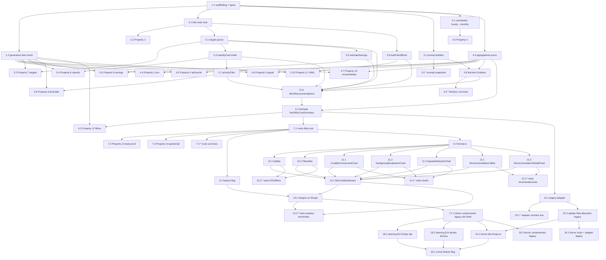

# Implementation Plan: EKS Cost Optimization

## Overview

Plan incremental orientado a TDD/PBT para rehacer la pestaña "EKS Allocation" del portal
(`/finops`) con un dashboard centrado en el **coste del nodo** y la cadena de valor
`over-provisioning → nodos de más → € → recomendación → ahorro`. Cuatro fases secuenciales
tal como fija §Migration and Rollout del diseño:

1. **Fase 1 — Backend nuevo, aislado** (`src/lib/eks-cost/*` + `GET /api/finops/k8s-cost`).
2. **Fase 2 — Frontend con feature flag off** (`src/components/finops/eks-cost/*` +
   integración en `src/app/finops/page.tsx`).
3. **Fase 3 — Cutover** (adapter legacy, `Deprecation` header, flag por defecto en prod,
   retirada del árbol activo de los componentes viejos).
4. **Fase 4 — Limpieza** (borrado definitivo de `k8s-finops.ts`, route legacy, componentes
   obsoletos y cierre del feature flag).

La estrategia separa **lógica pura** (unidades Kubernetes, agregación por env/nodegroup/squad,
clasificación over/under, cálculo de targets, ahorros y filtros — cubierta con PBT `fast-check`)
de las **capas de integración** (fetchers Grafana con cliente inyectable, route handler con
auth/RBAC/cache, componentes React con `@testing-library/react`+`happy-dom`).

Cada test de propiedad usa `fast-check` con **mínimo 100 iteraciones** (`{ numRuns: 100 }`) y
lleva el comentario `// Feature: eks-cost-optimization, Property N: <título>`. Convención: un
fichero por propiedad en `src/lib/eks-cost/__tests__/`, para permitir ejecución en paralelo sin
conflictos de fichero. Runner `node:test` vía `tsx` + `c8` (mismo stack que el resto del portal).

**Ticket SRE por fase** (convenciones `.kiro/steering/git-conventions.md`): cada fase se
consolida en una rama `feat/SRE-<n>` sin descripción y commits `[SRE-<n>] <type>: <desc>`
(2–70 chars ASCII).

**Persistencia**: NO se añade ninguna tabla PostgreSQL. Todo se computa on-the-fly con la
caché in-memory ya existente en `src/lib/cache.ts` (prefijo nuevo `eks-cost:`, TTL 5 min),
consistente con el resto de FinOps.

## Dependency Graph (Mermaid)



## Tasks

### Fase 1 — Backend nuevo, aislado (ticket SRE_1, rama `feat/SRE-<n>`)

- [x] 1. Scaffolding del módulo, tipos compartidos y generadores fast-check
  - [x] 1.1 Crear estructura `src/lib/eks-cost/` y `types.ts` con todos los tipos del diseño
    - Definir `EnvironmentName`, `Environment`, `Nodegroup`, `Workload`, `RecommendationKind`, `Recommendation`, `Squad`, `WarningCode`, `Warning`, `AllocationResponse`, `Filters` (SI canónicos: cores como `number`, memoria como `bytes`)
    - Crear el directorio `src/lib/eks-cost/__tests__/`
    - _Requirements: 1.1, 1.2, 2.1, 2.2, 2.3, 5.1, 5.3, 5.6, 6.1, 6.2, 6.3, 7.4, 8.2, 8.3, 10.1, 10.2, 10.3_

  - [x] 1.2 Fixtures y generadores fast-check en `__tests__/generators.ts`
    - `arbWorkload`, `arbNodegroup`, `arbEnvironment`, `arbRecommendation`, `arbAllocationResponse`, `arbRightsizingParams`, `arbFilters`, más un `arbCoreCount` y `arbByteCount` reutilizables
    - Fixture congelada `fixtures/allocation-response.snapshot.json` (3 clusters × N nodegroups) como oracle para los tests de integración
    - _Requirements: 10.4_

- [x] 2. Módulo `k8s-units.ts` (parseo y formateo canónicos)
  - [x] 2.1 Implementar `parseCpu`, `formatCpu`, `parseMemory`, `formatMemory`, `roundCpu`, `roundMemory`
    - Reglas del diseño: milicores enteros para CPU <1 core, cores decimales para ≥1; `Mi` step 16 para memoria <1Gi, `Gi` con 1 decimal para ≥1Gi; siempre redondeo hacia arriba (nunca dejar al workload con menos recurso del que necesita)
    - Aceptar sufijos `Ki|Mi|Gi|Ti|Pi` (2^10) y `K|M|G|T|P` (10^3) en el input
    - _Requirements: 10.1, 10.2_

  - [x] 2.2 Test de propiedad: round-trip canónico de unidades Kubernetes
    - **Feature: eks-cost-optimization, Property 1: K8s unit formatting is canonical and round-trip safe**
    - Fichero `__tests__/k8s-units.prop01.property.test.ts`, `fast-check`, `{ numRuns: 100 }`
    - Verificar que `formatCpu` casa `/^([0-9]+(\.[0-9]+)?|[0-9]+m)$/`, `formatMemory` casa `/^[0-9]+(\.[0-9]+)?(Mi|Gi)$/`, y que `parseCpu(formatCpu(cores)) ∈ [cores, cores + 0.001]`, `parseMemory(formatMemory(bytes)) ∈ [bytes, bytes * 1.06]`
    - **Validates: Requirements 10.1, 10.2, 10.4**

- [ ] 3. Módulo `promql.ts` (constructores puros de queries)
  - [x] 3.1 Implementar todos los builders del diseño
    - `qNodeCostHourly`, `qNodeCount`, `qSpotCount`, `qWorkloadCost(kind)`, `qWorkloadRequests(kind)`, `qWorkloadUsageP95(kind)`, `qVpaRecommendation(kind)`, `qNodegroupByNode`
    - Todos preservan la partición por `(k8s_cluster_name, …)` y respetan la gotcha #7 del portal (division-inside-sum-by para bytes)
    - _Requirements: 1.3, 1.4, 1.5, 1.6, 2.1, 2.5, 3.1, 3.6_

  - [x] 3.2* Tests snapshot de las queries PromQL
    - Snapshot por builder en `__tests__/fixtures/promql-queries.snapshot.txt` (whitespace normalizado)
    - Aserciones adicionales: `qWorkloadCost("ram")` incluye `/(1024*1024*1024)` **dentro** del `sum by`; `qSpotCount` usa `count by (...) (kubecost_node_is_spot > 0)` (obligatorio en Mimir, gotcha #6)
    - _Requirements: 2.5_

- [ ] 4. Módulo `node-cost.ts` — constantes, agregadores puros y fetchers
  - [x] 4.1 Implementar `hourlyToMonthly`, constante `HOURS_PER_MONTH = 730` y `NodeCostContext`
    - `NodeCostContext { metrics, usdToEur (default 0.92), hoursPerMonth (default 730), now }`
    - `hourlyToMonthly(h) = h * HOURS_PER_MONTH`
    - _Requirements: 1.3_

  - [x] 4.2 Test de propiedad: coste mensual = coste horario × 730
    - **Feature: eks-cost-optimization, Property 3: Monthly cost is hourly cost times 730**
    - Fichero `__tests__/node-cost.prop03.property.test.ts`
    - Tolerancia `< 1e-6` para coma flotante
    - **Validates: Requirements 1.3**

  - [x] 4.3 Implementar los agregadores puros de `node-cost.ts`
    - `aggregateEnvironments(nodegroups)` (agrupa por `EnvironmentName`, calcula `monthlyCostEur`, `nodeCount`, `spotCount`, `spotCoveragePct` con round a 1 decimal, `nodegroups[]`)
    - `attributeWorkloadCostToNodegroup(workloads, nodegroups)` (mapa `Map<string, Workload[]>`, cap conservador ≤ coste del nodo, warnings agregados)
    - `aggregateSquadCost(workloads, recommendations)` (agrupa por `resolveSquad`, ordenación DESC por `monthlyCostEur`, `overprovisioningEur` sumada desde recomendaciones `over-*`)
    - Helpers `resolveNodegroup(nodeLabels)` (label EKS canónica → label corta → `"unknown"`) y `resolveSquad(podLabels, namespace)` (owner → squad → team → namespace → `"sin asignar"`)
    - Cálculo puro de `Nodegroup.excessNodes = Math.floor(overprovisioningEur / avgNodeCostEur)` cuando `avgNodeCostEur > 0`, si no 0
    - _Requirements: 1.2, 1.4, 1.5, 1.6, 2.1, 2.2, 2.3, 2.4, 5.4, 5.5_

  - [x] 4.4 Test de propiedad: agregación por entorno preserva totales
    - **Feature: eks-cost-optimization, Property 2: Environment aggregation preserves nodegroup totals**
    - Fichero `__tests__/node-cost.prop02.property.test.ts`
    - Tolerancia 0.01€ por redondeo; `spotCoveragePct ∈ [0, 100]`; suma de nodegroups por env == env.monthlyCostEur; conteos coinciden
    - **Validates: Requirements 1.1, 1.2, 1.3, 1.5, 1.6**

  - [x] 4.5 Test de propiedad: atribución nodo→workload es conservadora
    - **Feature: eks-cost-optimization, Property 4: Attribution is conservative per node**
    - Fichero `__tests__/node-cost.prop04.property.test.ts`
    - `sum(w.monthlyCostEur for w in workloadsOnNodegroup(ng)) <= ng.monthlyCostEur + 0.005 * ng.monthlyCostEur` (0.5% de tolerancia por daemonsets del sistema)
    - **Validates: Requirements 2.1**

  - [x] 4.6 Test de propiedad: agregación por squad preserva totales y ordena
    - **Feature: eks-cost-optimization, Property 5: Squad aggregation preserves and orders workload totals**
    - Fichero `__tests__/node-cost.prop05.property.test.ts`
    - Partición (cada workload aparece en exactamente un squad); orden DESC por `monthlyCostEur`; fallback `"sin asignar"` cuando no hay label ni namespace
    - **Validates: Requirements 2.2, 2.3, 2.4**

  - [x] 4.7 Test de propiedad: `excessNodes` = floor(overprovisioning / avgNodeCost)
    - **Feature: eks-cost-optimization, Property 10: Excess nodes equal overprovisioning divided by average node cost**
    - Fichero `__tests__/node-cost.prop10.property.test.ts`
    - Verificación adicional del caso degenerado (`overprovisioningEur == 0 ⇒ excessNodes == 0`)
    - **Validates: Requirements 5.5**

  - [x] 4.8 Implementar `fetchNodegroups(ctx)` y `fetchWorkloads(ctx)`
    - Usan el `GrafanaMetricsClient` inyectable de `ctx.metrics`, consumen `promql.ts`, aplican `Promise.all` con `.catch` individual por query, generan `Warning[]` (`metrics-partial-fail`, `no-nodegroup-label`, `no-squad-label`, `empty-window`) sin lanzar
    - Resolución de nodegroup dominante del workload por conteo de pods sobre nodos
    - Sin logueo de tokens ni URL completa; snippet de query <200 chars con `logger.info`
    - _Requirements: 8.2_

  - [x] 4.9* Tests unitarios de `fetchNodegroups`/`fetchWorkloads` con `GrafanaMetricsClient` mockeado
    - Fichero `__tests__/node-cost.fetchers.test.ts`
    - Cubrir: caso happy path, 1 query en fallo → warning + resto ok, todas fallan → response degradada con warnings pero sin NaN, redondeos de spot%, warnings agregados
    - _Requirements: 8.2, 8.3_

- [x] 5. Módulo `rightsizing.ts` — targets, clasificación, ahorro, YAML
  - [x] 5.1 Implementar `computeCpuTarget(w, p)` y `computeMemTarget(w, vpaMemUpper, p)` puros
    - `podCount = max(1, w.podCount)`
    - `target_cpu = max(p.floorCpuPerPod * podCount, w.cpuUsageP95Cores / p.headroomCpu)` (headroom CPU 0.5)
    - `target_mem = max(p.floorMemPerPod * podCount, w.memUsageP95Bytes / p.headroomMem)` (headroom mem 0.7); si `vpaMemUpper != null`, `target_mem = max(target_mem, vpaMemUpper)` (anti-OOM)
    - Constantes por defecto en `RightsizingParams` según §rightsizing del diseño
    - _Requirements: 3.4, 3.5, 3.6_

  - [x] 5.2 Test de propiedad: target respeta headroom y floor
    - **Feature: eks-cost-optimization, Property 7: Target respects headroom and floor**
    - Fichero `__tests__/rightsizing.prop07.property.test.ts`
    - Verifica la fórmula exacta, monotonicidad respecto al VPA upperbound y respeto del floor con `podCount >= 1`
    - **Validates: Requirements 3.4, 3.5, 3.6**

  - [x] 5.3 Implementar `classifyOverUnder(w, cpuTarget, memTarget)`
    - Emite `over-cpu` sii `w.cpuRequestCores > cpuTarget`; `over-mem` sii `w.memRequestBytes > memTarget`; `under-cpu` sii `w.cpuUsageP95Cores > w.cpuRequestCores`; `under-mem` sii `w.memUsageP95Bytes > w.memRequestBytes`
    - `over-cpu` y `under-cpu` mutuamente exclusivas dentro del mismo workload (idem memoria)
    - Filtro `minUptimeMinutes` (default 60) para excluir cronjobs/jobs (Requirement 3.7)
    - _Requirements: 3.2, 3.3, 3.7, 4.1, 4.2_

  - [x] 5.4 Test de propiedad: `classifyOverUnder` produce categorías correctas
    - **Feature: eks-cost-optimization, Property 6: Classification detects over/under against target**
    - Fichero `__tests__/rightsizing.prop06.property.test.ts`
    - Cubrir mutual exclusion CPU y memoria, monotonicidad sobre `request` y `p95`
    - **Validates: Requirements 3.2, 3.3, 4.1, 4.2**

  - [x] 5.5 Implementar `estimateSavings(currentValue, targetValue, monthlyCost, cap)`
    - `estimateSavings >= 0`, `<= monthlyCost * cap` con `cap = 0.7` (Requirement 5.2), 0 cuando `currentValue == targetValue`, monótona en `target`
    - _Requirements: 5.1, 5.2_

  - [x] 5.6 Test de propiedad: ahorros no negativos, conservadores y capados
    - **Feature: eks-cost-optimization, Property 9: Estimated savings are non-negative, conservative and capped**
    - Fichero `__tests__/rightsizing.prop09.property.test.ts`
    - Verifica también la coherencia agregada: `sum(rec.estimatedSavingsEur where kind.startsWith("over-") && rec.nodegroup == ng.name) == ng.overprovisioningEur` (± 0.01€)
    - **Validates: Requirements 5.1, 5.2, 5.4**

  - [x] 5.7 Implementar `priorityFilter(recs)`
    - Cuando un `(cluster, namespace, workload)` tiene simultáneamente `under-cpu` y `under-mem`, sólo emite `under-mem` (mayor riesgo de OOM)
    - Las `over-*` no se ven afectadas y pueden coexistir
    - _Requirements: 4.3_

  - [x] 5.8 Test de propiedad: under-mem gana prioridad sobre under-cpu
    - **Feature: eks-cost-optimization, Property 8: Under-memory beats under-CPU in priority**
    - Fichero `__tests__/rightsizing.prop08.property.test.ts`
    - **Validates: Requirements 4.3**

  - [x] 5.9 Implementar `buildYamlBlock(workload, namespace, cpuReq, memReq)` + generación de `Recommendation.unitYamlBlock`
    - Formato canónico: comentario `# EKS Cost recommendation for <ns>/<workload>`, comentario con `reason`, bloque `resources:` con `requests.cpu`, `requests.memory` y `limits.memory` (nunca `limits.cpu`, coherente con QoS Guaranteed)
    - Formateo de valores con `k8s-units.ts` (Property 1)
    - _Requirements: 5.6, 10.3_

  - [x] 5.10 Test de propiedad: YAML de recomendación bien formado y round-trip parseable
    - **Feature: eks-cost-optimization, Property 11: Recommendation YAML is well-formed and round-trip parseable**
    - Fichero `__tests__/rightsizing.prop11.property.test.ts`
    - Usa `js-yaml` para parsear; verifica presencia de `requests.cpu`, `requests.memory`, `limits.memory` y que `parseCpu/parseMemory` sobre los valores coinciden con `rec.recommendedRequest.value` (± tolerancia Property 1)
    - **Validates: Requirements 5.6, 10.3, 10.4**

  - [x] 5.11 Implementar `fetchRecommendations(ctx, params, workloads)`
    - Orquesta: `computeCpuTarget`/`computeMemTarget` (con VPA upperbound cuando existe), `classifyOverUnder`, `estimateSavings`, `priorityFilter`, `buildYamlBlock` → `Recommendation[]`
    - Filtros `minMonthlyCostEur` (default 10€) y `minUptimeMinutes` (60) para descartar ruido
    - Warning agregado `vpa-missing` cuando >30% de workloads no tienen VPA
    - _Requirements: 3.1, 3.6, 3.7, 4.4, 5.3, 5.4_

- [x] 6. Fachada `src/lib/eks-cost/index.ts`
  - [x] 6.1 Implementar `fetchEksCostSummary(filters, overrides)`
    - Compone nodegroups + workloads + recomendaciones; aplica filtros server-side (env/nodegroup/squad); corta a top-200 workloads y top-100 recomendaciones ordenadas por `estimatedSavingsEur` DESC; suma `totalMonthlyEur`, `totalNodeCount`, `totalSpotCoveragePct`, `totalEstimatedSavingsEur`; propaga warnings
    - `applyFilters(response, filters)` idempotente y conmutativo (base para Property 12)
    - _Requirements: 1.1, 2.4, 5.4, 6.1, 6.2, 6.3, 6.4_

  - [x] 6.2 Test de propiedad: filtros idempotentes y conmutativos
    - **Feature: eks-cost-optimization, Property 12: Filter application is idempotent and correct**
    - Fichero `__tests__/index.prop12.property.test.ts`
    - Verifica idempotencia, identidad con `{}`, conmutatividad entre dimensiones y que todo item filtrado casa con la dimensión pedida
    - **Validates: Requirements 6.1, 6.2, 6.3, 6.4**

- [ ] 7. Endpoint HTTP `GET /api/finops/k8s-cost`
  - [x] 7.1 Implementar `src/app/api/finops/k8s-cost/route.ts`
    - `getServerSession(authOptions)` → 401 sin sesión; `hasSessionMinimumRole(session, "desarrolladores")` → 403 sin filtrar datos de coste
    - Validación estricta de query params (`env`, `nodegroup`, `squad`) con los regex del diseño → 400 con `{ error: "Invalid parameter: <name>" }` (sin echo del valor recibido)
    - Cache 5 min via `cached("eks-cost", ..., 5*60*1000)` con clave derivada de los filtros (prefijo nuevo `eks-cost:`)
    - 500 con `{ error, missing: [...] }` cuando `grafanaMetricsClient.getStatus().ready === false`; 500 opaco `{ error: "Failed to fetch EKS cost summary" }` en excepciones no capturadas (la traza va al logger)
    - `maxDuration = 60`; `dynamic = "force-dynamic"`; logging estructurado sin tokens
    - _Requirements: 1.1, 6.1, 6.2, 6.3, 6.4, 7.1, 7.2, 7.4, 8.1, 8.2, 8.3, 9.1, 9.2, 9.3_

  - [x] 7.2 Test de propiedad: 403 nunca filtra datos de coste
    - **Feature: eks-cost-optimization, Property 13: 403 responses never leak cost data**
    - Fichero `__tests__/route.prop13.property.test.ts`
    - Parametriza sobre roles inferiores a `desarrolladores` (`externos`) y sesión anónima; verifica que el cuerpo JSON contiene sólo `{ error: string }` y ninguna clave de coste (`totalMonthlyEur`, `environments`, `nodegroups`, `squads`, `workloads`, `recommendations`, `warnings`, …)
    - Mockea `getServerSession` desde el test
    - **Validates: Requirements 7.1, 7.2, 7.3**

  - [x] 7.3 Test de propiedad: fallos parciales preservan secciones y exponen warnings
    - **Feature: eks-cost-optimization, Property 14: Partial failures preserve computed sections and expose warnings**
    - Fichero `__tests__/route.prop14.property.test.ts`
    - Inyecta un `GrafanaMetricsClient` mockeado con subconjunto arbitrario `F` de queries fallando; verifica `status === 200`, `warnings.length >= |F|`, coherencia numérica del resto y **ausencia de `NaN`/`Infinity`** en cualquier campo
    - **Validates: Requirements 8.2, 8.3**

  - [x] 7.4* Tests unitarios adicionales del route handler
    - Fichero `__tests__/route.unit.test.ts`
    - Cubre: cache hit vs miss, params inválidos → 400 sin echo del valor, config missing → 500 con lista de env vars, header `Cache-Control` esperado, log sin tokens
    - _Requirements: 6.5, 8.1, 8.2, 9.1, 9.2_

- [x] 8. Checkpoint - Asegurar que pasan los tests de la Fase 1 (backend + endpoint)
  - Ensure all tests pass, ask the user if questions arise.

### Fase 2 — Frontend con feature flag off (ticket SRE_2, rama `feat/SRE-<n>`)

- [x] 9. Feature flag y utilidades de formato
  - [x] 9.1 Añadir `ENABLE_EKS_COST_V2` a `src/lib/feature-flags.ts` (default `false`)
    - Preparar override por env en `.helm/values.yaml` (habilitado en dev tras rollout) sin activar todavía prod
    - _Requirements: 9.5_

  - [x] 9.2 Extraer `formatEur`, `formatEurK` a `src/lib/eks-cost/format.ts`
    - Reusa (y consolida) los helpers de `costs-dashboard.tsx`; formato compacto (ej. `128,5k€`) y formato completo con locale `es-ES`
    - _Requirements: 1.7, 9.4_

- [ ] 10. Componentes de KPIs y filtros
  - [x] 10.1 Implementar `src/components/finops/eks-cost/kpi-bar.tsx`
    - 5 KPIs con `Card` + gradiente en el principal (Coste EKS/mes): Coste EKS/mes, Ahorro potencial/mes, Cobertura spot (badge por umbrales >30% verde, 10–30% ámbar, <10% gris), Nodos totales (+ subtítulo `X spot`), Recomendaciones (+ subtítulo `top ahorro: X€`)
    - Formato compacto con `formatEurK`
    - _Requirements: 1.4, 1.5, 1.6, 5.4_

  - [x] 10.2 Implementar `src/components/finops/eks-cost/filters-bar.tsx`
    - 3 `select` shadcn (env / nodegroup filtrado por env / squad) + botón "Refrescar" + timestamp `Generado: HH:mm:ss` con `data.generatedAt` en zona local
    - Reset de nodegroup/squad si dejan de ser válidos al cambiar env; fallback a filtros vacíos + toast informativo cuando el backend responde 400
    - _Requirements: 6.1, 6.2, 6.3, 6.4, 6.5, 9.4, 9.5_

  - [x] 10.3* Tests de render/interacción de `KpiBar` y `FiltersBar`
    - `@testing-library/react` + `happy-dom`; formato de EUR, umbrales de cobertura spot, reset de filtro dependiente al cambiar env, callback de refresh
    - _Requirements: 1.5, 6.1, 6.5_

- [ ] 11. Charts (Recharts)
  - [x] 11.1 Implementar `src/components/finops/eks-cost/cost-by-environment-chart.tsx`
    - `<BarChart>` con `environments[].monthlyCostEur`; colores diferenciados por entorno; barra clicable → aplica filtro `env`
    - _Requirements: 1.1, 1.7, 6.1_
    

  - [x] 11.2 Implementar `src/components/finops/eks-cost/nodegroup-breakdown-chart.tsx`
    - Bar chart apilado 2 segmentos por nodegroup (`monthlyCost - overprovisioningEur` en verde + `overprovisioningEur` en rojo suave)
    - Texto explicativo por nodegroup: **"N nodos de más"** cuando `nodegroup.excessNodes > 0` (mensaje literal del design.md §5.5)
    - _Requirements: 1.2, 1.4, 1.7, 5.5_

  - [x] 11.3 Implementar `src/components/finops/eks-cost/squad-attribution-chart.tsx`
    - Bar horizontal con `squads[]` ordenados DESC; overlay de `overprovisioningEur`; click en squad → aplica filtro `squad`
    - _Requirements: 2.2, 2.4, 6.3_

  - [x] 11.4* Tests de render/interacción de los 3 charts
    - Render sin explotar con datos vacíos, mensaje "N nodos de más" sólo cuando `excessNodes > 0`, orden DESC de squads, clicks aplican filtros vía prop callback
    - _Requirements: 2.4, 5.5, 6.1, 6.2, 6.3_

- [ ] 12. Recomendaciones (tabla + panel de detalle con YAML)
  - [x] 12.1 Implementar `src/components/finops/eks-cost/recommendations-table.tsx`
    - Columnas: cluster, namespace, workload, squad, kind, request actual, recomendado, €/mes
    - Orden DESC por `estimatedSavingsEur`; borde verde en `over-*` y ámbar en `under-*`; fila clicable
    - _Requirements: 5.3, 5.4_

  - [x] 12.2 Implementar `src/components/finops/eks-cost/recommendation-detail-panel.tsx`
    - `<pre>` con `unitYamlBlock`, botón **"Copiar"** con `navigator.clipboard.writeText`, línea explicativa desde `recommendation.reason`
    - En móvil se renderiza como `Sheet` de shadcn/ui
    - _Requirements: 5.6, 10.3_

  - [x] 12.3* Tests de `RecommendationsTable` y `RecommendationDetailPanel`
    - Orden DESC por ahorro, clase visual por `kind`, click expande el panel, copy-to-clipboard llama a `navigator.clipboard.writeText` con el YAML del `unitYamlBlock`, presencia de `requests.cpu`, `requests.memory` y `limits.memory` en el bloque mostrado
    - _Requirements: 5.3, 5.6, 10.3_

- [ ] 13. Contenedor `EksCostDashboard` e integración en `/finops`
  - [x] 13.1 Implementar `src/components/finops/eks-cost/eks-cost-dashboard.tsx`
    - Fetch a `/api/finops/k8s-cost` con querystring derivada de filtros; estados `loading` (skeletons con misma altura y ancho para evitar CLS), `empty` (mensaje "No hay datos de coste. Verifica que OpenCost está desplegado en los clusters."), `error` (mensaje + botón **"Reintentar"**), `ok` con banner amarillo colapsable listando `warnings[]`
    - Propaga `AllocationResponse` a los sub-componentes; layout desktop (KPIs → 2 gráficas → nodegroup breakdown → tabla) y móvil (KPIs 2×N, gráficas 1×N, tabla con scroll horizontal)
    - _Requirements: 1.7, 6.4, 6.5, 8.3, 8.4, 8.5, 9.4, 9.5_

  - [x] 13.2 Integrar en `src/app/finops/page.tsx` detrás del feature flag
    - Cuando `ENABLE_EKS_COST_V2` está activo, la pestaña "EKS Allocation" renderiza `<EksCostDashboard />`; si no, sigue renderizando `<K8sAllocationDashboard />` (el resto de pestañas intacto)
    - _Requirements: 9.5_

  - [x] 13.3* Tests de estados terminales del dashboard
    - `loading` (skeletons), `empty` (mensaje textual), `error` + botón retry (verificar que refetchea), `warnings` (banner visible cuando el backend devuelve warnings), fetch usa la querystring de filtros
    - _Requirements: 6.4, 6.5, 8.3, 8.4, 8.5_

- [x] 14. Checkpoint - Asegurar que pasan los tests de la Fase 2 (frontend con flag off)
  - Ensure all tests pass, ask the user if questions arise.

### Fase 3 — Cutover (ticket SRE_3, rama `feat/SRE-<n>`)

- [ ] 15. Adapter legacy y evolución del endpoint viejo
  - [x] 15.1 Implementar `src/lib/eks-cost/legacy-adapter.ts`
    - Reconstruye el shape antiguo (`clusters`, `topNamespaces`, `topWorkloads`, `topLoadBalancers`, `rightsizingCandidates`) a partir del resultado de `fetchEksCostSummary()`
    - Puro (sin fetch propio) y typed con las interfaces del `k8s-finops.ts` original para no romper consumidores
    - _Requirements: 9.1, 9.2_

  - [x] 15.2* Test contract del adapter legacy
    - Fichero `__tests__/legacy-adapter.contract.test.ts`
    - Verifica que la respuesta del adapter satisface el shape antiguo campo a campo (`K8sFinOpsSummary`), incluyendo `totalHourly`, `totalMonthly`, `topNamespaces[]`, `rightsizingCandidates[]` con `potentialMonthlySavings`
    - Fixture congelada como oracle
    - _Requirements: 9.1, 9.2_

  - [x] 15.3 Actualizar `src/app/api/finops/k8s-allocation/route.ts`
    - Reemplazar `fetchK8sFinopsSummary` por `fetchEksCostSummary` + `legacyAdapter`
    - Añadir headers `Deprecation: true` y `Link: </api/finops/k8s-cost>; rel="successor-version"`
    - Añadir log `console.info("[k8s-allocation] legacy call from", session.user.email)` para poder retirar el endpoint cuando no haya llamadas
    - Preservar auth+RBAC y `maxDuration = 60`
    - _Requirements: 7.1, 7.2, 7.3, 7.4, 8.1, 9.1_

- [x] 16. Manual: aviso corto en el canal SRE de Teams antes del cutover
  - Publicar mensaje breve anunciando el cambio del dashboard EKS y el endpoint sucesor (`/api/finops/k8s-cost`); confirmar que nadie tiene dependencias externas contra `/api/finops/k8s-allocation` en la próxima release
  - Tarea manual, no automatizable por el agente

- [x] 17. Activar `ENABLE_EKS_COST_V2` por defecto en producción
  - [x] 17.1 Cambiar `ENABLE_EKS_COST_V2` a `true` en `.helm/values-prod.yaml` y sincronizar el GitOps_Repo `argocd/tooling` (`shared-apps/portal-prod/values.yaml`)
    - Verificar en dp-tooling que ArgoCD sincroniza `portal-prod` y que la pestaña "EKS Allocation" renderiza `<EksCostDashboard />`
    - Retirar del árbol activo `k8s-allocation-dashboard.tsx`, `k8s-vpa-table.tsx`, `k8s-nodes-analysis.tsx` (los ficheros quedan en el repo, pero ya no se importan desde `src/app/finops/page.tsx` ni desde otros componentes vivos)
    - _Requirements: 9.5_

- [x] 18. Actualizar la documentación canónica del portal
  - [x] 18.1 Actualizar `.kiro/steering/portal-architecture.md` §5 (FinOps tab)
    - Sustituir la referencia a `k8s-allocation-dashboard.tsx` + `k8s-vpa-table.tsx` por `eks-cost-dashboard.tsx` (y sus sub-componentes); documentar el nuevo endpoint `GET /api/finops/k8s-cost` y el alias legacy `GET /api/finops/k8s-allocation` con su header `Deprecation`
    - _Requirements: 9.4_

  - [x] 18.2 Añadir entrada a `.kiro/steering/portal-architecture.md` §14 (deuda técnica) para trackear el borrado del legacy en Fase 4
    - Formato: nueva entrada numerada con la ventana de observación (2 semanas sin llamadas al alias legacy) y la lista concreta de ficheros a borrar (`src/lib/k8s-finops.ts`, `src/app/api/finops/k8s-allocation/route.ts`, `src/lib/eks-cost/legacy-adapter.ts`, `src/components/finops/k8s-allocation-dashboard.tsx`, `src/components/finops/k8s-vpa-table.tsx`, `src/components/finops/k8s-nodes-analysis.tsx`)
    - _Requirements: 9.5_

### Fase 4 — Limpieza (ticket SRE_4, rama `feat/SRE-<n>`, ≥2 semanas después)

- [ ] 19. Borrado del código legacy
  - [ ] 19.1 Borrar `src/lib/k8s-finops.ts`
    - Precondición: el log `[k8s-allocation] legacy call` no dispara en las últimas 2 semanas (verificable en Grafana/Loki)
    - _Requirements: 9.5_

  - [ ] 19.2 Borrar `src/app/api/finops/k8s-allocation/route.ts` y `src/lib/eks-cost/legacy-adapter.ts`
    - Eliminar también `src/lib/eks-cost/__tests__/legacy-adapter.contract.test.ts` (test contract del adapter)
    - _Requirements: 9.5_

  - [ ] 19.3 Borrar los componentes legacy del árbol
    - `src/components/finops/k8s-allocation-dashboard.tsx`, `src/components/finops/k8s-vpa-table.tsx`, `src/components/finops/k8s-nodes-analysis.tsx` y cualquier sub-componente obsoleto que sólo consumía los anteriores
    - _Requirements: 9.5_

- [ ] 20. Cierre del feature flag
  - [ ] 20.1 Eliminar `ENABLE_EKS_COST_V2` de `src/lib/feature-flags.ts`, `.helm/values.yaml`, `.helm/values-dev.yaml`, `.helm/values-prod.yaml`, y desguace del `if (ENABLE_EKS_COST_V2)` en `src/app/finops/page.tsx` (el dashboard queda como código único)
    - _Requirements: 9.5_

- [ ] 21. Checkpoint final - Asegurar que pasa toda la suite y no queda import roto
  - Ensure all tests pass, ask the user if questions arise.

## Notes

- Las sub-tareas marcadas con `*` son opcionales (tests unitarios adicionales, snapshots, contract tests, tests de componentes UI) y pueden omitirse para un MVP más rápido; el agente NO las implementa salvo petición explícita.
- Las 14 Correctness Properties del diseño están cubiertas por tests **obligatorios** (sin `*`) en la Fase 1 y 7: P1 (2.2), P2 (4.4), P3 (4.2), P4 (4.5), P5 (4.6), P6 (5.4), P7 (5.2), P8 (5.8), P9 (5.6), P10 (4.7), P11 (5.10), P12 (6.2), P13 (7.2), P14 (7.3).
- Cada test de propiedad usa `fast-check` con `{ numRuns: 100 }` y el comentario canónico `// Feature: eks-cost-optimization, Property N: <título>`; un test por propiedad, un fichero por propiedad.
- Cada tarea referencia los sub-requisitos granulares del `requirements.md` que satisface, para trazabilidad.
- Persistencia: NO se añade tabla PostgreSQL. Todo cache in-memory 5 min con prefijo nuevo `eks-cost:` (§Migration → Persistencia del diseño).
- Convenciones git (`.kiro/steering/git-conventions.md`): cada fase consolida en una rama `feat/SRE-<n>` sin descripción, commits `[SRE-<n>] <type>: <desc>` (2–70 chars ASCII). No hay scope, sólo `!` opcional para breaking change.
- La Task 16 (aviso a Teams) es explícitamente manual (no automatizable por el agente) y bloquea la activación del flag en prod (17.1). El agente debe pedir confirmación al humano antes de continuar.
- Las Task 18.1 y 18.2 actualizan el steering `portal-architecture.md` para mantener el steering como truth-source (regla del propio doc: "si algo del código contradice este doc, este doc se actualiza").

## Task Dependency Graph

```json
{
  "waves": [
    { "id": 0, "tasks": ["1.1"] },
    { "id": 1, "tasks": ["1.2", "2.1", "3.1", "4.1"] },
    { "id": 2, "tasks": ["2.2", "3.2", "4.2", "4.3", "5.1", "5.3", "5.5", "5.7", "5.9"] },
    { "id": 3, "tasks": ["4.4", "4.5", "4.6", "4.7", "4.8", "5.2", "5.4", "5.6", "5.8", "5.10"] },
    { "id": 4, "tasks": ["4.9", "5.11"] },
    { "id": 5, "tasks": ["6.1"] },
    { "id": 6, "tasks": ["6.2", "7.1"] },
    { "id": 7, "tasks": ["7.2", "7.3", "7.4"] },
    { "id": 8, "tasks": ["9.1", "9.2"] },
    { "id": 9, "tasks": ["10.1", "10.2", "11.1", "11.2", "11.3", "12.1", "12.2"] },
    { "id": 10, "tasks": ["10.3", "11.4", "12.3", "13.1"] },
    { "id": 11, "tasks": ["13.2"] },
    { "id": 12, "tasks": ["13.3"] },
    { "id": 13, "tasks": ["15.1"] },
    { "id": 14, "tasks": ["15.2", "15.3"] },
    { "id": 15, "tasks": ["17.1"] },
    { "id": 16, "tasks": ["18.1", "18.2"] },
    { "id": 17, "tasks": ["19.1", "19.2", "19.3"] },
    { "id": 18, "tasks": ["20.1"] }
  ]
}
```
