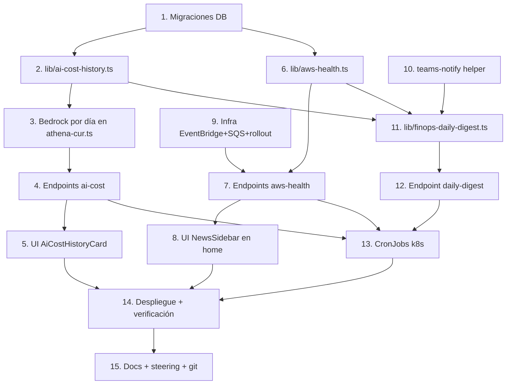

# Implementation Plan

> Feature: FinOps AI Observability
> Las tareas se ejecutan de forma incremental. Cada una referencia los requisitos que cubre. El código en inglés, mensajes/UI en español. Build/deploy con el patrón canónico (`docker buildx ... :<tag>` → push → `kubectl -n n8n set image deploy/n8n-webhooks`).

## Overview

Plan de implementación para FinOps AI Observability, dividido en tres bloques que pueden avanzar en paralelo tras las migraciones iniciales: (a) histórico de coste IA (tareas 2-5), (b) novedades AWS vía EventBridge (tareas 6-9), y (c) digest diario a Teams (tareas 10-12). Los cronjobs (13), despliegue/verificación (14) y documentación (15) cierran el flujo. Cada tarea es incremental, deja el sistema en estado compilable y referencia sus requisitos.

## Task Dependency Graph



Olas de ejecución (tareas sin dependencias entre sí dentro de una ola pueden hacerse en paralelo):

```json
{
  "waves": [
    { "wave": 1, "tasks": [1, 10] },
    { "wave": 2, "tasks": [2, 6, 9] },
    { "wave": 3, "tasks": [3, 7, 11] },
    { "wave": 4, "tasks": [4, 8, 12] },
    { "wave": 5, "tasks": [5, 13] },
    { "wave": 6, "tasks": [14] },
    { "wave": 7, "tasks": [15] }
  ]
}
```

## Tasks

- [x] 1. Crear migraciones de base de datos
  - Crear `migrations/2026-06-03_ai_cost_daily.sql` con la tabla `ai_cost_daily` (campos: `snapshot_date UNIQUE`, `kiro_cost`, `bedrock_cost`, `total_ai_cost`, `kiro_by_plan` JSONB, `bedrock_by_model` JSONB, `by_account` JSONB, timestamps) + índice por fecha desc.
  - Crear `migrations/2026-06-03_aws_health_events.sql` con la tabla `aws_health_events` (PK `arn`, `service`, `region`, `event_type_code`, `category`, `status_code`, `severity`, tiempos, `affected_accounts` JSONB, `description`, `raw` JSONB, `first_seen`, `synced_at`) + índices por estado/última actualización.
  - Aplicar ambas migraciones contra la BD del portal y verificar que las tablas existen.
  - _Requirements: 1.1, 1.3, 3.4_

- [x] 2. Implementar `src/lib/ai-cost-history.ts`
  - Definir interfaces `AiCostDay`, `AiCostHistory`.
  - `computeAiCostForDate(date)`: combina `fetchKiroSummary(date,date)` (neto + por plan + por cuenta) con el coste Bedrock del día (de la tarea 3); devuelve `AiCostDay` con `byAccount` y totales redondeados.
  - `persistAiCostSnapshot(day)`: upsert en `ai_cost_daily` por `snapshot_date` (`ON CONFLICT DO UPDATE`).
  - `backfillAiCost(startDate,endDate)`: itera días y persiste; idempotente.
  - `getAiCostHistory(startDate,endDate,accountIds?)`: lee filas, recomputa totales filtrando por `by_account` si se pasan `accountIds`, calcula `anomalyDays` con `mean + 2*stddev && > 1.5*mean` (vacío con ≤1 día).
  - Factorizar helper puro `detectAiCostAnomalies(days)` para poder testearlo aislado.
  - _Requirements: 1.1, 1.2, 1.5, 1.6, 2.1, 2.3, 2.5_

- [x] 3. Añadir cálculo de coste Bedrock por día en `src/lib/athena-cur.ts`
  - Exportar `fetchBedrockCostByDay(date, accountIds)` que ejecuta una query Athena acotada a un día sobre `line_item_resource_id LIKE 'arn:aws:bedrock:%'`, agrupando por modelo (derivado del ARN) y cuenta, usando la conexión Athena existente (no recomputa `CurFullSnapshot`).
  - Devolver `Array<{ model, accountId, cost }>` con `cost` redondeado.
  - _Requirements: 1.1, 1.2_

- [x] 4. Crear endpoints de histórico de coste IA
  - `POST /api/finops/ai-cost/snapshot` (`requireInternalAuth`, `maxDuration=300`): body `{ date? }` (default ayer) o `{ startDate, endDate }` para backfill; llama a `computeAiCostForDate`/`persistAiCostSnapshot`/`backfillAiCost`.
  - `GET /api/finops/ai-cost/history` (`requireUserAuth(req,'desarrolladores')`): query `?startDate&endDate&accountIds=csv`; devuelve `AiCostHistory`.
  - Manejo de errores: 500 con mensaje en snapshot (cronjob reintenta), estado vacío válido en history.
  - _Requirements: 1.4, 1.5, 2.1, 2.6_

- [x] 5. Implementar UI `AiCostHistoryCard` e integrarla en la pestaña Costes
  - Crear `src/components/finops/ai-cost-history-card.tsx`: Recharts `AreaChart` apilada (Kiro + Bedrock), días anómalos resaltados, recibe `accountIds`, fetch a `/api/finops/ai-cost/history`, estado vacío informativo si no hay snapshots.
  - Integrar en `costs-dashboard.tsx` dentro de la sección "Costes de IA" (junto a `BedrockCard` y `KiroLicensesCard`), pasando `selectedAccountIds`.
  - Añadir claves i18n `finops.aiCost.*` en los 4 idiomas, con `const { t } = useI18n()` propio en el componente (gotcha #8).
  - _Requirements: 2.2, 2.3, 2.4, 2.5, 2.6_

- [x] 6. Implementar `src/lib/aws-health.ts`
  - Definir `AwsNewsItem`; `inferSeverity(category,statusCode)` (total: desconocido→`baja`); `normalizeHealthEvent(detail, accountNameMap)`.
  - `pollAwsHealthQueue({maxMessages?})`: `SQSClient` (eu-west-1, IRSA del portal) leyendo `AWS_HEALTH_QUEUE_URL`; long-poll `ReceiveMessage` (10 msgs, wait 5s) en bucle; parsea `body.detail` de cada evento EventBridge `aws.health`.
  - `syncAwsHealthEvents()`: upsert por `arn` (merge de `affected_accounts`, preserva `first_seen`), `DeleteMessage` solo de los procesados OK; degradación a `[]` sin tocar filas previas en error.
  - `getAwsNews({includeClosed?, sinceHours?})`: lee `aws_health_events` ordenado (abiertos/próximos primero, luego `last_updated` desc).
  - _Requirements: 3.2, 3.3, 3.4, 3.5, 3.6_

- [x] 7. Crear endpoints de novedades AWS
  - `POST /api/aws-health/sync` (`requireInternalAuth`, `maxDuration=120`): llama `syncAwsHealthEvents`.
  - `GET /api/aws-health/news` (`requireUserAuth(req,'admin')`): query `?includeClosed`; devuelve `AwsNewsItem[]` desde cache; 403 para no-admin (validado en servidor).
  - _Requirements: 3.2, 4.1, 4.2, 4.7_

- [x] 8. Implementar UI `NewsSidebar` en la home
  - Crear `src/components/home/news-sidebar.tsx`: render solo si `session.user.appRole === 'admin'`; lista `AwsNewsItem` con badges de severidad/categoría/estado, cuentas afectadas (nombres), toggle "ocultar cerrados", estado vacío "sin novedades de AWS"; fetch a `/api/aws-health/news`.
  - Integrar en `src/app/page.tsx`: ajustar el layout para mostrar la columna lateral cuando el rol es admin (grid con `max-w` ampliado).
  - Añadir claves i18n `home.news.*` en los 4 idiomas con `useI18n()` propio.
  - _Requirements: 4.1, 4.2, 4.3, 4.4, 4.5, 4.6, 4.7_

- [x] 9. Provisionar infraestructura EventBridge + SQS y script de rollout
  - Crear en dp-tooling (eu-west-1): cola SQS `portal-aws-health-events` (+ policy que permite a EventBridge `sqs:SendMessage`), bus `portal-aws-health` con resource policy `events:PutEvents` condicionada por `PrincipalOrgID`, y regla en ese bus con pattern `{"source":["aws.health"]}` → target la SQS.
  - Añadir policy inline `AwsHealthQueueReader` (3 acciones SQS sobre la cola) al rol IRSA `portal-inventory-irsa`.
  - Crear `ops/apply-aws-health-eventbridge.sh` (idempotente, itera perfiles AWS como `apply-infra-live-policy.sh`): en cada cuenta crea la regla `aws.health` en el `default` bus con target el ARN del bus de dp-tooling + el rol de `PutEvents` cross-account.
  - Guardar manifiestos/JSON de policies en `ops/` (`ops/aws-health-bus-policy.json`, `ops/aws-health-sqs-policy.json`).
  - Ejecutar el rollout en las 22 cuentas y verificar recepción de un evento de prueba en la cola.
  - _Requirements: 3.1, 3.6, 3.7, 6.4_

- [x] 10. Implementar helper `src/lib/teams-notify.ts`
  - `sendTeamsCard(card, webhookUrl)`: POST con timeout, devuelve bool, warn si webhook vacío.
  - `buildDigestCard({title, markdownSummary, facts, linkUrl})`: construye MessageCard/Adaptive Card coherente con el formato del portal, con enlace al dashboard FinOps.
  - _Requirements: 5.4, 5.6, 5.9_

- [x] 11. Implementar `src/lib/finops-daily-digest.ts`
  - `runDailyFinOpsDigest()`: alcance = todas las cuentas vivas (`filterLiveAwsAccounts`); ventana mes-a-fecha; llama `runFinOpsAdvisorAnalysis` (locale `es`); obtiene `getAwsNews({sinceHours:24})`.
  - Construye 1 o 2 cards según `FINOPS_DIGEST_MODE` (`single`|`split`, default `split`); trunca el análisis a tamaño seguro de Teams + enlace.
  - Envía vía `sendTeamsCard(..., FINOPS_TEAMS_WEBHOOK_URL)`; si el análisis falla pero hay novedades, envía solo novedades; nunca lanza por fallo parcial; devuelve `DigestResult`.
  - _Requirements: 5.1, 5.2, 5.3, 5.4, 5.5, 5.6, 5.8, 5.9_

- [x] 12. Crear endpoint del digest diario
  - `POST /api/finops/daily-digest` (`requireInternalAuth`, `maxDuration=300`): llama `runDailyFinOpsDigest`, devuelve `DigestResult`.
  - _Requirements: 5.1, 5.7_

- [x] 13. Crear los CronJobs de Kubernetes
  - `ops/k8s/ai-cost-snapshot-cronjob.yaml` (`0 2 * * *`) → `POST /api/finops/ai-cost/snapshot`.
  - `ops/k8s/aws-health-sync-cronjob.yaml` (`*/15 * * * *`) → `POST /api/aws-health/sync`.
  - `ops/k8s/finops-daily-digest-cronjob.yaml` con `spec.timeZone: "Europe/Madrid"` y `schedule: "20 10 * * *"` (fallback UTC documentado) → `POST /api/finops/daily-digest`.
  - Patrón `curlimages/curl` + `INTERNAL_API_SECRET` desde `platformportal-secrets`, target `http://n8n-webhooks.n8n.svc.cluster.local:3000`, igual que `infra-live-check-cronjob.yaml`.
  - _Requirements: 1.4, 5.1, 5.7, 6.3, 6.4_

- [x] 14. Configurar secretos, build, despliegue y verificación end-to-end
  - Añadir `FINOPS_TEAMS_WEBHOOK_URL` (el webhook facilitado) y `AWS_HEALTH_QUEUE_URL` al secret `platformportal-secrets`/env del deployment; opcional `FINOPS_DIGEST_MODE`.
  - Build standalone (AWS SDK top-level imports, gotcha #5), push, `kubectl -n n8n set image deploy/n8n-webhooks ...`, aplicar los CronJobs, `rollout status`.
  - Verificar: backfill de unos días en `ai-cost/snapshot` → gráfica en Costes; `aws-health/sync` puebla la sidebar; ejecución manual del digest (`kubectl create job --from=cronjob/finops-daily-digest`) llega al canal Teams; `aws-health/news` 200 admin / 403 no-admin.
  - _Requirements: 2.4, 4.1, 5.4, 6.1, 6.2, 6.3_

- [x] 15. Documentación y subida a GitLab
  - Actualizar `.kiro/steering/portal-architecture.md` (sección 3 datos/observabilidad + sección 8 variables de entorno + cronjobs) y `docs/PORTAL_DOCUMENTATION.md` con el histórico de IA, la ingesta `aws.health` y el digest diario.
  - Actualizar Confluence (página 994476033) con el procedimiento.
  - Commit con convención `[SRE-XXX] feat: ...` y push a `feat/SRE-001`.
  - _Requirements: 6.5_

## Notes

- **Secretos**: `FINOPS_TEAMS_WEBHOOK_URL` (webhook facilitado) y `AWS_HEALTH_QUEUE_URL` van en `platformportal-secrets`/env del deployment. Nunca hardcodear el webhook (req 6.1).
- **Gotchas aplicables**: #5 (AWS SDK imports top-level con Next standalone), #8 (i18n closures con `useI18n()` propio), #14 (verificar `kubectl config current-context` antes de cualquier aplicación sobre clusters).
- **AWS Health vía EventBridge**: verificado que root está en Basic Support; la Health API de pago no se usa. Los eventos `aws.health` se emiten por EventBridge en cada cuenta sin coste.
- **Rollout multi-cuenta**: `ops/apply-aws-health-eventbridge.sh` sigue el patrón idempotente de `ops/apply-infra-live-policy.sh` (algunas cuentas sin sesión válida se omiten con log).
- **Tests**: la lógica pura (`detectAiCostAnomalies`, `inferSeverity`, `normalizeHealthEvent`, truncado de cards, agregación `byAccount`) se diseña sin I/O para validar las propiedades de corrección del diseño; la integración AWS se verifica manualmente (tarea 14).
- **Idempotencia**: tanto `ai_cost_daily` (por `snapshot_date`) como `aws_health_events` (por `arn`) usan upsert; reejecutar snapshots/sync no duplica.
