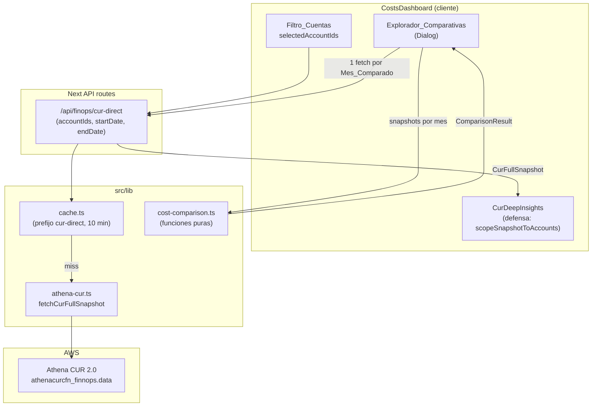
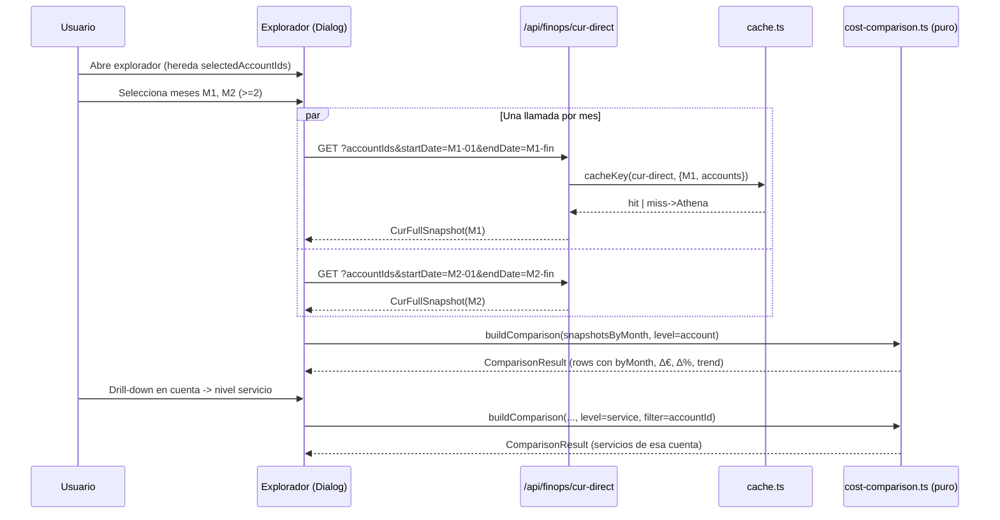

# Design Document

## Overview

Este diseño cubre las dos partes de la funcionalidad descrita en el documento de requisitos, ambas dentro de la pestaña **Costes** del módulo FinOps del Platform Portal (`/finops`, `CostsDashboard`):

- **PARTE A — Corrección de alcance por cuenta (bug de scoping).** Garantizar que TODO lo que se renderiza en la pestaña Costes — y en particular el apartado "Optimización y costes ocultos" (`CurDeepInsights`) y la tabla `EC2_Fleet` — queda ceñido exactamente al conjunto de cuentas seleccionado en el `Filtro_Cuentas` (`selectedAccountIds`). El arreglo se hace **en el origen** (las sub-queries de `src/lib/athena-cur.ts` y el endpoint `/api/finops/cur-direct`) y se refuerza con **defensa en cliente** en `cur-deep-insights.tsx`.

- **PARTE B — Explorador de comparativas FinOps (nueva capacidad).** Un `Explorador_Comparativas` lanzado como modal accesible (shadcn `Dialog`) desde `CostsDashboard`, que compara dos o más meses con drill-down jerárquico cuenta → servicio → objeto, mostrando por fila el importe de cada mes, la variación absoluta (Δ€), la porcentual (Δ%) y la tendencia, con tabla + gráficas (Recharts). Reutiliza la ruta de datos del CUR existente (`/api/finops/cur-direct` + `src/lib/athena-cur.ts`) y respeta el mismo `Filtro_Cuentas` que el resto del dashboard.

### Principios de diseño

1. **Arreglar en el origen, defender en el cliente.** El scoping por cuenta se garantiza primero en la capa de datos (WHERE `line_item_usage_account_id IN (...)` en cada sección + dimensión de cuenta en cada fila) y, como red de seguridad, con un filtro puro en el cliente sobre `selectedAccountIds`.
2. **Reutilizar, no duplicar, la fuente de datos.** El Explorador NO introduce una fuente nueva: obtiene cada `Mes_Comparado` vía `/api/finops/cur-direct` (una llamada por mes), aprovechando su caché de 10 min (`src/lib/cache.ts`, prefijo `cur-direct`) y el role chain IRSA → AssumeRole → CUR ya establecido.
3. **Lógica comparativa pura y testeable.** El cálculo de filas comparativas, Δ€/Δ%, tratamiento de entidades ausentes como 0, orden cronológico y progresión multi-mes vive en funciones puras sin dependencias de red ni de React, lo que las hace el núcleo de las Correctness Properties.
4. **Convenciones del portal.** Caché con prefijo, RBAC FinOps (`desarrolladores` mínimo en los endpoints CUR), salida `standalone` de Next (imports AWS SDK top-level), `prettyServiceName`/`formatAwsServiceName` para traducir los códigos opacos del CUR (`cg*` → "Marketplace (contrato)", inference-profile → "Bedrock (GenAI)").

## Architecture

### Diagnóstico raíz de la PARTE A

Auditando `fetchCurFullSnapshot` en `src/lib/athena-cur.ts`, casi todas las sub-queries ya incluyen `AND line_item_usage_account_id IN (${idsStr})`. El problema de scoping persiste por dos motivos concretos y verificables:

1. **`ec2Fleet` no lleva dimensión de cuenta.** La query #12 agrupa solo por `product_instance_type` (`GROUP BY 1`), por lo que cada fila de `ec2Fleet` (`{ instanceType, resourceCount, cost }`) **no contiene `accountId`**. Aunque la query filtre por cuenta en el `WHERE`, el resultado no es verificable ni defendible: ni el endpoint ni el cliente pueden comprobar que una fila pertenece al conjunto seleccionado. Cualquier desalineación (caché previa, fallback a nivel org) se renderiza sin posibilidad de detección.
2. **Fallback a nivel org en el endpoint.** En `/api/finops/cur-direct`, si `accountIds` llega ausente, vacío o `"all"`, el endpoint cae a `liveAccounts.map(a => a.id)` (TODAS las cuentas vivas). Esto es correcto para usos "toda la organización", pero significa que cualquier ruta que no propague `selectedAccountIds` produce datos org-wide. El cliente (`CurDeepInsights`) renderiza el snapshot **sin re-filtrar por `selectedAccountIds`**, así que no hay red de seguridad.

El arreglo es por tanto en tres frentes: (1) añadir dimensión de cuenta y `WHERE` explícito a las secciones afectadas en `athena-cur.ts`; (2) garantizar a nivel de endpoint que la respuesta solo contiene cuentas del conjunto pedido; (3) defensa en cliente que descarta cualquier fila fuera de `selectedAccountIds`.



### Flujo PARTE B (Explorador)



### Decisión clave: reutilizar `cur-direct` por mes vs endpoint dedicado

| Opción | Descripción | Pros | Contras |
|--------|-------------|------|---------|
| **A. Reusar `/api/finops/cur-direct` por mes (ELEGIDA)** | Una llamada por `Mes_Comparado`, con `startDate`/`endDate` = límites del mes y los mismos `accountIds`. Construir la comparativa en cliente con funciones puras a partir de los `CurFullSnapshot`. | Cumple Req 10.1 (misma ruta de datos, sin nueva fuente) y Req 10.2 (caché existente de 10 min, compartida con la navegación normal del dashboard). Aislamiento natural de fallo parcial por mes (Req 10.4). Cero SQL nuevo. Los tres niveles ya vienen en el snapshot: `byAccount[].services[]` (cuenta y servicio) y `topResources[]` (objeto). | Recalcula el snapshot completo por mes en frío (≈23 queries). Mitigado por caché y porque los meses recientes suelen estar calientes por el uso normal del dashboard. `topResources` está limitado a 200 filas globales (cola larga del nivel objeto incompleta). |
| B. Endpoint dedicado `/api/finops/cost-comparison` | Una sola pasada Athena agregando por `(mes, cuenta, servicio, recurso)`. | Una query, menos datos escaneados, nivel objeto completo. | Introduce una ruta nueva fuera de la "ruta de datos del CUR existente" que los requisitos nombran explícitamente (`cur-direct` + `athena-cur.ts`), arranca con caché en frío para el explorador, y duplica la lógica de scoping. |

**Se elige la opción A** por fidelidad a los requisitos 10.1/10.2/10.4 y por reaprovechamiento de caché. La opción B queda documentada como evolución futura si el coste/latencia de Athena lo justifica o si el nivel objeto necesita cobertura completa más allá del top-200; en ese caso se añadiría `fetchCostComparison()` en el MISMO `athena-cur.ts` (sigue siendo CUR, no una fuente distinta).

## Components and Interfaces

### PARTE A — Scoping

#### 1. `src/lib/athena-cur.ts` (capa de datos)

- **`ec2Fleet` con dimensión de cuenta.** La query #12 pasa a `GROUP BY product_instance_type, line_item_usage_account_id` y la fila incluye `accountId`. El tipo `CurFullSnapshot["ec2Fleet"]` se amplía a `Array<{ instanceType: string; accountId: string; accountName: string; resourceCount: number; cost: number }>`. El `WHERE` mantiene `line_item_usage_account_id IN (${idsStr})`.
- **Helper de aserción de scoping.** Nueva función pura `assertSnapshotScoped(snapshot, accountIds)` (interna, dev/test) que recorre toda sección con dimensión de cuenta y comprueba que no hay cuentas fuera del conjunto; lanza en test, loguea warning en runtime.
- **Auditoría de filtro.** Se confirma y documenta que cada sub-query con dimensión de cuenta (`byAccount`, `topResources`, `cloudwatchLogs`, `natGateways`, `bedrock.byModel`, `gp2Detail`, `extendedSupportDetail`, `aiCostDaily`) lleva `line_item_usage_account_id IN (${idsStr})`.

#### 2. `src/app/api/finops/cur-direct/route.ts` (endpoint)

- Tras obtener el snapshot, aplica `scopeSnapshotToAccounts(snapshot, accountIds)` (función pura compartida) cuando `accountIdsParam` es explícito, garantizando que la respuesta solo contiene cuentas pedidas incluso si una query futura olvidara el filtro. El fallback org-wide (`"all"`/ausente) se mantiene pero se marca explícito.

#### 3. `src/lib/finops-scope.ts` (NUEVO — funciones puras)

```ts
export type AccountScoped = { accountId?: string; account?: string };

/** Devuelve true si la fila pertenece al conjunto (o no tiene cuenta asociable). */
export function rowInScope(row: AccountScoped, accountIds: ReadonlySet<string>): boolean;

/** Filtra, sección a sección, un CurFullSnapshot para dejar solo filas en scope.
 *  Las filas sin dimensión de cuenta se conservan solo si la sección no es
 *  identificable por cuenta (defensa conservadora documentada por sección). */
export function scopeSnapshotToAccounts(
  snapshot: CurFullSnapshot,
  accountIds: string[],
): CurFullSnapshot;
```

#### 4. `src/components/finops/cur-deep-insights.tsx` (defensa en cliente)

- Antes de renderizar, envuelve `data` con `scopeSnapshotToAccounts(data, selectedAccountIds)`. Para ello recibe `selectedAccountIds` como prop desde `CostsDashboard` (hoy `CurDeepInsights` no la recibe). `Ec2FleetCard` muestra la columna cuenta (`accountName`) y queda doblemente protegida.

### PARTE B — Explorador

#### 5. `src/components/finops/comparison-explorer.tsx` (NUEVO)

- `ComparisonExplorerDialog` (shadcn `Dialog`): título accesible, cierre por teclado (Radix lo provee por defecto: `Esc`, foco atrapado, `role="dialog"`, `aria-labelledby`).
- Estado interno: `selectedMonths: MonthKey[]` (selección pendiente), `committedMonths: MonthKey[]` (lo que realmente se consulta), `level: ComparisonLevel`, `drillPath: { accountId?, service? }`, `snapshotsByMonth`, `monthErrors: Record<MonthKey,string>`, `loading`.
- **Disparo explícito (refinamiento post-test):** el fetch NO se lanza al togglear cada mes (eso encadenaba una `cur-direct` por mes y, al seleccionar rápido, las peticiones se solapaban y Athena devolvía 500). En su lugar el usuario selecciona y pulsa **«Comparar»** (`handleGenerate`), que vuelca `selectedMonths → committedMonths`; el hook sólo consulta `committedMonths`. Un aviso «pulsa Comparar para actualizar» indica selección sin aplicar.
- Sub-componentes: `MonthPicker` (selección ≥2 meses) + botón «Comparar», `ComparisonBreadcrumb` (volver al nivel superior), `ComparisonTable` (shadcn table con `<th scope>`), `ComparisonChart` (Recharts: barras agrupadas para 2 meses, líneas para progresión multi-mes) con tabla alternativa accesible.
- **Columnas Δ€/Δ%/Tendencia (refinamiento post-test):** sólo se muestran al comparar **exactamente 2 meses** (`showDelta = months.length === 2`). Con >2 meses la comparación es una progresión, así que esas tres columnas se ocultan y mandan los importes por mes + la gráfica de líneas (coherente con Req 6.4 vs 6.5).

#### 6. `src/components/finops/costs-dashboard.tsx`

- Botón "Comparar meses" que abre el `ComparisonExplorerDialog` pasando `selectedAccountIds`. Cerrar el diálogo no muta `selectedAccountIds`/`startDate`/`endDate`.

#### 7. `src/lib/cost-comparison.ts` (NUEVO — funciones puras, núcleo testeable)

```ts
export type MonthKey = string; // "YYYY-MM"
export type ComparisonLevel = "account" | "service" | "resource";
export type Trend = "up" | "down" | "flat";

export interface EntityCost { key: string; label: string; cost: number; }

export interface ComparisonRow {
  key: string;
  label: string;
  byMonth: Record<MonthKey, number>; // SIEMPRE una entrada por mes (ausente => 0)
  deltaAbs: number;                   // mes más reciente - mes más antiguo
  deltaPct: number | null;            // null si base (mes antiguo) es 0
  trend: Trend;
}

export interface ComparisonResult {
  level: ComparisonLevel;
  months: MonthKey[];                 // orden cronológico ascendente
  rows: ComparisonRow[];              // orden descendente por |deltaAbs| (configurable)
  drill: { accountId?: string; service?: string };
}

// Conversión mes <-> rango de fechas para las llamadas a cur-direct
export function monthRange(month: MonthKey): { startDate: string; endDate: string };
export function sortMonths(months: MonthKey[]): MonthKey[];

// Extracción de entidades de un snapshot según nivel y filtro de drill-down
export function extractEntities(
  snapshot: CurFullSnapshot,
  level: ComparisonLevel,
  drill: { accountId?: string; service?: string },
): EntityCost[];

// Núcleo: combina entidades por mes en filas comparativas
export function buildComparisonRows(
  perMonth: Record<MonthKey, EntityCost[]>,
  months: MonthKey[],
): ComparisonRow[];

// Δ€/Δ%/trend a partir de la serie ordenada
export function computeDelta(
  byMonth: Record<MonthKey, number>,
  months: MonthKey[],
): { deltaAbs: number; deltaPct: number | null; trend: Trend };

// Orquestador puro (sin red): snapshots -> ComparisonResult
export function buildComparison(
  snapshotsByMonth: Record<MonthKey, CurFullSnapshot>,
  level: ComparisonLevel,
  drill: { accountId?: string; service?: string },
): ComparisonResult;
```

#### 8. `src/hooks/use-cost-comparison.ts` (NUEVO — orquestación de red)

- Hook que, dado `selectedAccountIds` y `selectedMonths`, dispara una llamada `fetch('/api/finops/cur-direct?...')` por mes en paralelo (`Promise.allSettled`), guarda `snapshotsByMonth` y `monthErrors` (fallo aislado por mes, Req 10.4), y expone `buildComparison(...)` memoizado.

## Data Models

### Tipos modificados (PARTE A)

```ts
// CurFullSnapshot.ec2Fleet — AÑADE dimensión de cuenta
ec2Fleet: Array<{
  instanceType: string;
  accountId: string;     // NUEVO
  accountName: string;   // NUEVO (resuelto vía accountNameMap)
  resourceCount: number;
  cost: number;
}>;
```

El resto de secciones con cuenta (`byAccount`, `topResources`, `hiddenCosts.cloudwatchLogs.topGroups[].account`, `hiddenCosts.natGateways.topConsumers[].account`, `hiddenCosts.bedrock.byModel[].account`, `hiddenCosts.gp2Detail[].account`, `hiddenCosts.extendedSupportDetail[].account`, `aiCostDaily.days[].byAccount[]`) ya identifican la cuenta; el diseño solo garantiza su filtrado y la defensa en cliente.

### Tipos nuevos (PARTE B)

`MonthKey`, `ComparisonLevel`, `Trend`, `EntityCost`, `ComparisonRow`, `ComparisonResult` (ver interfaces arriba).

**Mapeo nivel → fuente dentro de `CurFullSnapshot`:**

| Nivel | Fuente | `key` | `label` |
|-------|--------|-------|---------|
| `account` | `byAccount[]` | `accountId` | `accountName` |
| `service` | `byAccount[accountId].services[]` | `service` (code) | `formatAwsServiceName(service)` |
| `resource` | `topResources[]` filtrado por `accountId` + `service` | `resourceId` | `shortRid(resourceId)` |

**Invariantes del modelo:**

- `byMonth` contiene **exactamente** una entrada por cada mes de `months` (entidades ausentes en un mes ⇒ `0`, Req 9).
- `months` está siempre en orden cronológico ascendente.
- `deltaAbs = byMonth[months[last]] - byMonth[months[0]]`.
- `deltaPct = base === 0 ? null : (deltaAbs / base) * 100`, con `base = byMonth[months[0]]`.
- `trend = deltaAbs > 0 ? "up" : deltaAbs < 0 ? "down" : "flat"`.

## Correctness Properties

*Una propiedad es una característica o comportamiento que debe cumplirse en todas las ejecuciones válidas del sistema — esencialmente, una afirmación formal sobre lo que el sistema debe hacer. Las propiedades sirven de puente entre las especificaciones legibles por humanos y las garantías de correctitud verificables por máquina.*

El núcleo testeable de esta funcionalidad son funciones puras: el **scoping por cuenta** (`src/lib/finops-scope.ts`) y la **lógica comparativa** (`src/lib/cost-comparison.ts`). La orquestación de red, el render y la accesibilidad se validan con tests de ejemplo/integración (ver Testing Strategy), no con propiedades.

### Property 1: Scoping estricto por cuenta

*Para todo* `CurFullSnapshot` y *todo* conjunto de cuentas seleccionado `S`, tras aplicar `scopeSnapshotToAccounts(snapshot, S)`, ninguna fila con dimensión de cuenta (en cualquier sección: `byAccount`, `topResources`, `ec2Fleet`, y todas las sub-secciones de `hiddenCosts` con cuenta, `aiCostDaily.days[].byAccount`) pertenece a una cuenta fuera de `S`. Si `S` no intersecta ninguna fila de una sección, esa sección queda vacía (cardinalidad 0), nunca con datos de otras cuentas.

**Validates: Requirements 1.1, 1.2, 1.3, 1.4, 2.2, 2.3, 2.4, 8.1, 8.3**

### Property 2: Determinismo del scoping (sin residuos del conjunto previo)

*Para todo* `CurFullSnapshot` y *todo* par de conjuntos `A`, `B`, el resultado de `scopeSnapshotToAccounts(snapshot, B)` no depende de haber aplicado antes `A`: `scopeSnapshotToAccounts(scopeSnapshotToAccounts(snapshot, A), B)` contiene exactamente las filas de `snapshot` cuya cuenta está en `A ∩ B`, y `scopeSnapshotToAccounts(snapshot, B)` contiene las que están en `B`. El recálculo al cambiar de cuentas refleja exclusivamente el nuevo conjunto.

**Validates: Requirements 1.5**

### Property 3: Completitud y relleno con cero de `byMonth`

*Para toda* colección de entidades por mes `perMonth` y *todo* conjunto de meses `months`, cada `ComparisonRow` producida por `buildComparisonRows` tiene `keys(byMonth)` exactamente igual al conjunto `months`, y para cada mes en el que la entidad no aparecía, `byMonth[mes] === 0`. En consecuencia, una entidad presente solo en el mes más reciente tiene `0` en el más antiguo (alta), y una presente solo en el más antiguo tiene `0` en el más reciente (baja).

**Validates: Requirements 6.1, 9.1, 9.2, 9.3**

### Property 4: Cálculo de variación (Δ€, Δ%, tendencia)

*Para toda* `ComparisonRow` con meses en orden cronológico `months` (primero = más antiguo, último = más reciente):
- `deltaAbs === byMonth[months[last]] - byMonth[months[0]]` (usando `0` para meses sin datos);
- si `byMonth[months[0]] === 0`, entonces `deltaPct === null` (nunca `Infinity` ni `NaN`); en caso contrario `deltaPct === (deltaAbs / byMonth[months[0]]) * 100`;
- `trend === "up"` si `deltaAbs > 0`, `"down"` si `deltaAbs < 0`, `"flat"` si `deltaAbs === 0`.

**Validates: Requirements 6.2, 6.3, 6.4, 6.6, 9.4**

### Property 5: Orden cronológico de los meses

*Para todo* conjunto de meses dado en cualquier orden, `ComparisonResult.months` es su ordenación cronológica ascendente, y la progresión de importes de cada fila se recorre en ese mismo orden (independiente del orden de selección del usuario).

**Validates: Requirements 6.5**

### Property 6: Coherencia del drill-down

*Para todo* `CurFullSnapshot`, *toda* cuenta `a` y *todo* servicio `s`:
- `extractEntities(snapshot, "service", { accountId: a })` devuelve únicamente servicios cuyo coste proviene de la cuenta `a`;
- `extractEntities(snapshot, "resource", { accountId: a, service: s })` devuelve únicamente recursos cuyo `accountId === a` y `service === s`.

**Validates: Requirements 5.2, 5.3**

### Property 7: Invariancia de meses y cuentas al navegar

*Para toda* secuencia de operaciones de drill-down y vuelta atrás sobre un `ComparisonResult`, el conjunto de meses (`months`) y el conjunto de cuentas en alcance permanecen invariantes; solo cambian el `level` y el `drill`.

**Validates: Requirements 5.5**

### Property 8: Aislamiento de fallo parcial por mes

*Para todo* conjunto de meses solicitados y *todo* subconjunto de ellos cuya recuperación falla, los meses recuperados con éxito quedan disponibles en `snapshotsByMonth`, los fallidos quedan registrados en `monthErrors`, y `buildComparison` produce un `ComparisonResult` válido sobre los meses disponibles sin lanzar.

**Validates: Requirements 10.4**

### Property 9: Consistencia de agregación jerárquica

*Para todo* dataset crudo de costes por `(mes, cuenta, servicio, recurso)`, y para cada mes: la suma de los costes a nivel objeto de un `(cuenta, servicio)` es igual (salvo redondeo a 2 decimales) al coste de ese servicio en esa cuenta, y la suma de los costes de los servicios de una cuenta es igual al coste de esa cuenta.

**Validates: Requirements 5.2, 5.3, 6.1**

## Error Handling

| Escenario | Capa | Manejo | Requisito |
|-----------|------|--------|-----------|
| `accountIds` ausente/`"all"` en `cur-direct` | Endpoint | Fallback explícito a cuentas vivas (org-wide), documentado; el cliente del dashboard nunca lo usa (envía siempre `selectedAccountIds`). | 2.1, 2.2 |
| Snapshot llega con filas fuera de scope (regresión de query) | `finops-scope.ts` + cliente | `scopeSnapshotToAccounts` descarta filas fuera del conjunto; en dev/test `assertSnapshotScoped` lanza para detectar la regresión. | 1.1–1.4, 2.3 |
| `ec2Fleet` sin `accountId` (datos antiguos en caché) | Cliente | Fila sin cuenta asociable se trata conservadoramente: si la sección es identificable por cuenta y la fila no la trae, se oculta (no se asume in-scope). | 1.3 |
| Selección con < 2 meses | Explorador (cliente) | `canGenerate=false`, botón deshabilitado y mensaje "Selecciona al menos dos meses" (`role="alert"`). | 4.2 |
| Fallo de Athena/red al pedir un mes | `use-cost-comparison` | `Promise.allSettled`; el mes fallido se marca en `monthErrors[mes]` con mensaje; los demás se renderizan. Nunca lanza el conjunto. | 10.4 |
| Todos los meses fallan | Explorador (cliente) | Estado de error global con opción de reintentar; no se renderiza tabla/gráfica vacía engañosa. | 10.4 |
| Base del mes antiguo = 0 (división) | `cost-comparison.ts` | `deltaPct = null`; la UI muestra "n/a" en lugar de un valor numérico erróneo. | 6.6 |
| Entidad ausente en un mes | `cost-comparison.ts` | Importe del mes = `0` (alta/baja), nunca `undefined`. | 9.1–9.4 |
| Recuperación en curso | Explorador (cliente) | Indicador de carga (`Loader2`) hasta que los meses estén disponibles. | 10.3 |
| RBAC insuficiente | Endpoint `cur-direct` | 401 sin sesión / 403 si `< desarrolladores` (comportamiento existente, sin cambios). | — |
| Códigos de servicio opacos del CUR | UI | `formatAwsServiceName`/`prettyServiceName` traducen `cg*`→"Marketplace (contrato)", inference-profile→"Bedrock (GenAI)". | 5.3, 6.1 |

## Testing Strategy

Enfoque dual: **property-based** para la lógica pura (scoping + comparativa) y **ejemplo/integración** para wiring de red, render y accesibilidad.

### Property-based tests (núcleo)

- **Librería**: `fast-check` sobre el runner del portal `node:test` (vía `tsx`, con `c8` para cobertura — consistente con `*.property.test.ts` existentes, p.ej. `finops-daily-digest.property.test.ts`).
- **Mínimo 100 iteraciones** por propiedad (`fc.assert(fc.property(...), { numRuns: 100 })`).
- **Generadores**:
  - `arbCurFullSnapshot`: genera snapshots con `byAccount`/`topResources`/`ec2Fleet`/`hiddenCosts` poblados con un universo de cuentas aleatorio (incluye cuentas que estarán dentro y fuera del conjunto seleccionado, cuentas repetidas, secciones vacías, caracteres no-ASCII en labels).
  - `arbAccountSet`: subconjuntos del universo de cuentas (incluye conjunto vacío, disjunto y total).
  - `arbPerMonth`: meses desordenados (incl. saltos de año), entidades dispares por mes (altas/bajas), costes con `0` y negativos (créditos), para ejercitar base 0.
- **Cada test etiquetado** con: `// Feature: finops-cost-comparison-explorer, Property N: <texto>`.
- **Ficheros**:
  - `src/lib/__tests__/finops-scope.property.test.ts` → Property 1, Property 2.
  - `src/lib/__tests__/cost-comparison.property.test.ts` → Property 3, Property 4, Property 5, Property 6, Property 7, Property 9.
  - `src/hooks/__tests__/use-cost-comparison.property.test.ts` (con `fetch` inyectado/mock) → Property 8.

### Unit / ejemplo

- `monthRange`: ejemplos de límites de mes (febrero, diciembre→enero, año bisiesto).
- Estado vacío de `Ec2FleetCard` y de secciones de `CurDeepInsights` cuando el scope deja 0 filas (Req 1.4).
- Validación `< 2 meses` del `MonthPicker` (Req 4.2).
- `extractEntities` con cuenta/servicio inexistente → `[]`.

### Integración (Athena/fetch mockeado o fixtures)

- `cur-direct` con Athena mockeado: para un `accountIds` dado, la respuesta no contiene cuentas fuera del conjunto y `ec2Fleet` trae `accountId` (Req 2.2, 1.3).
- `use-cost-comparison`: una llamada a `/api/finops/cur-direct` por mes con `accountIds` y rango correctos (Req 4.3, 8.2, 10.1); segunda llamada con misma key servida de caché sin invocar Athena (Req 10.2); fallo de un mes aislado (Req 10.4).
- Dashboard: `fetch` invocado con `accountIds = selectedAccountIds.join(",")` (Req 2.1).

### UI / accesibilidad (ejemplo, React Testing Library)

- Botón "Comparar meses" presente y abre el `Dialog` (Req 3.1, 3.2); cerrar no muta `selectedAccountIds`/fechas (Req 3.4).
- `Dialog` con `role="dialog"` + `aria-labelledby`, cierre con `Esc` (Req 11.1, 11.2).
- Tabla comparativa con `<th scope="col">`/`scope="row">` (Req 11.3); cada gráfica acompañada de tabla/alternativa textual (Req 11.4); controles de drill activables por teclado (Req 11.5, 5.4).
- Drill-down actualiza tabla y gráfica al nivel activo (Req 7.1, 7.2); cambiar meses actualiza la gráfica (Req 7.3).

### Nota sobre cobertura PBT

El scoping (PARTE A) y la lógica comparativa (PARTE B) son funciones puras con espacio de entrada amplio (combinaciones de cuentas, meses, altas/bajas, base 0): caso ideal de property-based testing. El resto — render React, modal Radix, wiring de `fetch` y caché — se cubre con ejemplos/integración porque su comportamiento no varía de forma reveladora con la entrada y/o depende de servicios externos ya probados.
