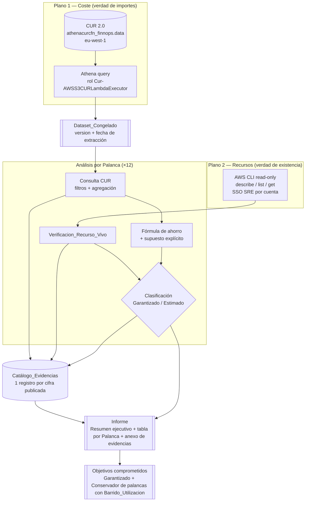

# Documento de Diseño — Estudio FinOps de Ahorro AWS

## Naturaleza de este documento

Este es un entregable **analítico**, no software de aplicación. Por tanto, el "diseño" aquí
no describe una arquitectura de código: describe la **metodología rigurosa y reproducible**
que produce un Informe de ahorro AWS **defendible** ante dirección.

La prioridad número uno es la **fiabilidad**. Cada cifra publicada debe poder reconstruirse
desde su consulta CUR (con mes de referencia y fecha de extracción) y, cuando aplica, desde el
recurso real que la origina, verificado contra AWS en vivo. El diseño documenta el "porqué"
exacto de cada número: qué consulta lo produce, qué supuesto lo transforma en ahorro, cómo se
verifica y en qué categoría de confianza cae.

> Convención del documento: las cifras de **mayo 2026** que aparecen a lo largo del diseño se
> usan como **ejemplo trabajado** de la metodología (no como resultado final del Informe). Cada
> una lleva su consulta y debe re-validarse contra el Dataset_Congelado en la fase de ejecución.

## Overview

El Estudio evalúa el ahorro AWS direccionable sobre las ~30 cuentas de IskayPet tomando
**mayo 2026** (periodo `2026-05`, 1–31 de mayo, zona horaria de facturación AWS UTC) como
Mes_Referencia. La fuente única de verdad de coste es el **CUR 2.0** consultado vía Athena; la
fuente de verdad de **existencia y características de recursos** es AWS en vivo, leído solo con
operaciones de descripción (describe/list/get).

El método se apoya en cuatro pilares:

1. **Atribución contable exhaustiva.** Cada partida del CUR del Mes_Referencia se asigna a
   exactamente uno de dos conjuntos: dentro del alcance de ahorro técnico, o fuera (Tax,
   Palanca_Comercial, suscripciones de tarifa plana). No hay partidas sin clasificar.
2. **Trazabilidad total.** Cada cifra publicada tiene un registro en el Catálogo_Evidencias con
   su consulta, su mes, su fecha de extracción y su(s) recurso(s) o la marca "no atribuible".
3. **Clasificación honesta de confianza.** El ahorro se separa en **Ahorro_Garantizado**
   (desperdicio puro verificado en vivo, cifra única) y **Ahorro_Estimado** (sujeto a supuestos,
   expresado como rango Conservador–Agresivo).
4. **Reproducibilidad.** Toda consulta y toda verificación se documentan de forma re-ejecutable,
   ancladas a un Dataset_Congelado identificado por versión y fecha de extracción.

### Línea base contable del Mes_Referencia (ejemplo trabajado)

La descomposición del coste total de la organización por tipo de cargo es el cimiento del
Estudio, porque determina qué es "infraestructura AWS direccionable" frente a lo que no lo es.
Cifras de mayo 2026 (a re-validar contra el Dataset_Congelado):

| Grupo (charge type) | Importe (USD) | Tratamiento |
|---------------------|---------------|-------------|
| Total org bruto / neto | $159.6k / $147.6k | Marco de referencia (30 cuentas) |
| Fee — contrato Marketplace (`cgdwha66labso75ke7c05fbaz`, `Global-SoftwareUsage-Contracts`) | $85.3k | **Palanca_Comercial** (fuera del ahorro técnico) |
| Marketplace PAYG mismo producto (`MP:payg-Units`) | $6.7k (Usage) | Señalado como tier mal dimensionado |
| Usage (infra AWS) | $55.0k | Dentro del alcance técnico |
| Tax | $9.4k | Fuera del alcance |
| SavingsPlanCoveredUsage | $8.0k (neto 0, compensado por SavingsPlanNegation −$8.0k) | Cobertura de compromiso EC2 |
| SavingsPlanRecurringFee | $1.94k | Compromiso vigente |
| FlatRateSubscription (Kiro) | $0.9k | Fuera del alcance (suscripción tarifa plana) |
| SppDiscount | −$3.8k | Descuento |
| BundledDiscount | −$0.2k | Descuento |

**Infraestructura AWS pura ≈ $46k/mes.** Este es el denominador sobre el que se mide la
oportunidad técnica de ahorro. Los cinco grupos exigidos por el alcance (infra AWS, contrato
Marketplace, PAYG del mismo producto, Tax, suscripciones tarifa plana) se presentan siempre
como importes independientes en USD.

### Top servicios por Usage (ejemplo trabajado)

| Servicio | Importe (USD) | Notas |
|----------|---------------|-------|
| EC2 | $19.4k | Palanca de compromiso + rightsizing + Spot |
| RDS | $13.5k | Compromiso + Extended Support + storage |
| Marketplace PAYG (`cgdwha66...`) | $6.7k | Tier mal dimensionado |
| CloudWatch | $3.8k | Logs (incl. WAF) |
| S3 | $3.5k | Lifecycle / tiering |
| VPC | $3.2k | NAT, VPN, endpoints, IPv4 |
| CloudFront | $2.8k | — |
| Bedrock (`7g37zhparap7eesm9k78jrzqc`, Claude Haiku 4.5) | $2.2k | Inference profiles, cuentas `iskaypet-data` (200300400500) + `data-dev` (100200300400) |

## Principios de metodología

Estos principios gobiernan cada decisión del Estudio y son la traducción operativa de la
exigencia de fiabilidad.

1. **Ninguna cifra sin evidencia.** Si una cifra no puede vincularse a una consulta CUR
   documentada, a un recurso identificable o a un registro "no atribuible", se excluye del
   Informe o se marca explícitamente como no verificada (Req 2.6).
2. **CUR para coste, AWS en vivo para existencia.** El coste lo dice el CUR; que el recurso
   exista y tenga las características asumidas lo dice una Verificacion_Recurso_Vivo de solo
   lectura. Nunca se contabiliza un Ahorro_Garantizado sin verificación en vivo (Req 5.1).
3. **Conservador por defecto.** Ante dos supuestos defendibles, el objetivo comprometido usa el
   más prudente (Rango_Conservador). Lo agresivo se muestra, pero no se compromete.
4. **Separar desperdicio de optimización.** El desperdicio puro (recurso ocioso, motor EOL) es
   Garantizado; la optimización sujeta a perfil de uso o tasa de descuento es Estimado. Una
   Palanca mixta se parte en Sub_Palancas (Req 3.4).
5. **No comprometer estimados sin barrido.** Un Ahorro_Estimado solo se eleva a objetivo
   comprometido tras un Barrido_Utilizacion completo registrado en el Catálogo_Evidencias
   (Req 18).
6. **Sin doble conteo.** Cada unidad de coste (cada hora de cómputo, cada GiB, cada recurso) se
   asigna a una sola Palanca. Las palancas que compiten por el mismo gasto (p. ej. compromiso vs
   Spot sobre las mismas horas EC2) se reparten el gasto de forma disjunta (Req 8.8).
7. **Lectura no mutante, siempre.** Toda verificación usa exclusivamente describe/list/get.
   Ninguna operación create/update/delete/modify forma parte del Estudio (Req 5.1).
8. **Anualización con advertencia.** Toda cifra anual es el mensual × 12, acompañada siempre de
   la advertencia de que asume mes representativo y no captura estacionalidad (Req 6.3, 6.4).
9. **Una moneda, redondeo definido.** Todo en USD, 2 decimales, redondeo half-up, sumando antes
   de redondear el total (Req 6.7).

## Architecture

**Arquitectura de acceso a datos.** El Estudio combina dos planos de datos independientes y un
plano de salida (el Informe).

### Plano 1 — Coste (CUR 2.0 vía Athena)

| Parámetro | Valor |
|-----------|-------|
| Base de datos Athena | `athenacurcfn_finnops`, tabla `data` (CUR 2.0) |
| Región | `eu-west-1` |
| Salida de resultados | `s3://finnops-iskaypet/athena-query-results/` |
| Cuenta CUR | `600700800900` (root-iskaypet) |
| Acceso | rol `arn:aws:iam::600700800900:role/Cur-AWSS3CURLambdaExecutor-Y5pT9wqNQaur` (vía AssumeRole desde el IRSA del portal `portal-inventory-irsa`), o el perfil `root-iskaypet` directamente |
| Cobertura temporal | CUR abarca 2025-07 → 2026-06; Mes_Referencia = **2026-05** (último mes completo) |

### Plano 2 — Existencia de recursos (AWS CLI de solo lectura)

| Parámetro | Valor |
|-----------|-------|
| Operaciones | describe/list/get exclusivamente (jamás create/update/delete/modify) |
| Credenciales | sesión SSO SRE (`sso_start_url=https://iskaypet.awsapps.com/start`, `sso_role_name=SRE`) por cuenta; perfiles por cuenta en `portal-architecture.md` §7; `root-iskaypet` para CUR/Identity Store |
| Región por defecto | `eu-west-1` |
| Excepción de región | `us-east-1` para recursos globales facturados allí: WAF de CloudFront, CloudFront (Req 5.2, 11.2) |
| Cobertura | `n8n-cost-reader-role` existe en 22 cuentas; **no** existe en `log` (400600800100), `pruebas` (100300500700), las 4 sandbox ni root. En esas cuentas la verificación en vivo puede no estar disponible → se marca "verificación en vivo no disponible" (Req 1.8, 5.4) |

### Columnas CUR relevantes

Columnas reales usadas a lo largo de la metodología (de `athena-cur.ts`):

`line_item_usage_account_id`, `line_item_product_code`, `line_item_usage_type`,
`line_item_line_item_type` (valores: `Usage` / `Tax` / `Fee` / `SavingsPlanCoveredUsage` /
`SavingsPlanRecurringFee` / `SavingsPlanNegation` / `DiscountedUsage` / `RIFee` /
`FlatRateSubscription` / `SppDiscount` / `BundledDiscount`), `line_item_unblended_cost`,
`line_item_net_unblended_cost`, `line_item_usage_amount`, `line_item_resource_id`,
`product_instance_type`, `pricing_public_on_demand_cost`, `savings_plan_savings_plan_a_r_n`,
`reservation_reservation_a_r_n`, `line_item_usage_start_date`.

> Nota CUR 2.0: NO existen `product_volume_api_name`, `product_database_engine` ni
> `product_storage_class`. La clase de volumen, el motor de BD y la clase de almacenamiento se
> **derivan parseando `line_item_usage_type`** (p. ej. `%VolumeUsage.gp2%`, `%ExtendedSupport%`).

### Diagrama de flujo de datos



El flujo es unidireccional: el Dataset_Congelado fija los importes; las verificaciones en vivo
confirman los recursos; cada Palanca produce registros de evidencia; el Informe se construye
exclusivamente desde el Catálogo_Evidencias; y los objetivos se derivan por una regla cerrada
(ver "Derivación de objetivos").

## Dataset_Congelado y reproducibilidad

La reproducibilidad exige que dos personas que ejecuten la misma consulta documentada sobre el
mismo Dataset_Congelado obtengan **la misma cifra** (diferencia de 0,00 USD, Req 7.3). Esto se
consigue anclando todas las cifras base a una instantánea identificada.

### Definición del Dataset_Congelado

- **Identificador de versión.** Cada ejecución del Estudio fija una versión, p. ej.
  `frozen-2026-05@2026-06-15` (Mes_Referencia `@` fecha de extracción). Se registra en cada
  registro de evidencia (Req 2.5).
- **Fecha de extracción.** Fecha y hora (con zona horaria) en que se ejecutó la batería de
  consultas. El CUR recibe datos de llegada tardía y reexpresiones; la fecha de extracción es lo
  que hace determinista la cifra.
- **Filtro temporal canónico.** Todas las consultas base acotan
  `line_item_usage_start_date >= TIMESTAMP '2026-05-01 00:00:00'` y
  `< TIMESTAMP '2026-06-01 00:00:00'` (semiabierto, evita solapes de día).

### Manejo de datos de llegada tardía (drift del CUR)

Si una re-ejecución usa un CUR con datos de llegada tardía o reexpresados respecto a la fecha de
extracción anclada (Req 7.4):

- La comparación se fija a la fecha de extracción del Dataset_Congelado.
- Se acepta una **varianza relativa máxima del 1%** por cifra. Por debajo del umbral, la cifra
  se considera reproducida; por encima, se marca como **discrepante** y se re-ancla en una nueva
  versión del Dataset_Congelado.

### Completitud del mes

Si en la fecha de extracción el CUR de mayo 2026 está incompleto (Req 1.9), el Estudio indica el
grado de completitud (días cubiertos respecto a 31) y se abstiene de presentar como definitiva
cualquier cifra base afectada hasta disponer del mes cerrado. La completitud se comprueba con:

```sql
SELECT COUNT(DISTINCT date(line_item_usage_start_date)) AS dias_cubiertos
FROM data
WHERE line_item_usage_start_date >= TIMESTAMP '2026-05-01 00:00:00'
  AND line_item_usage_start_date <  TIMESTAMP '2026-06-01 00:00:00';
-- dias_cubiertos esperado = 31
```

### Reproducibilidad de la verificación en vivo

Las llamadas describe/list/get se documentan de forma re-ejecutable, **referenciando las
credenciales por nombre de rol o perfil** (nunca incrustando credenciales ni tokens, Req 7.5).
El drift del recurso vivo entre la verificación original y una re-ejecución posterior (reflejado
en las marcas temporales) se trata como **esperado** y no invalida las cifras de coste ancladas
al Dataset_Congelado (Req 7.6): el coste lo fija el CUR congelado, no el estado vivo actual.

## Data Models

**Esquema del Catálogo_Evidencias.** El Catálogo_Evidencias mantiene una correspondencia
**uno-a-uno al 100%** entre cada cifra publicada en el Informe y su registro de evidencia
(Req 2.7). Cada registro tiene estos campos:

| Campo | Descripción | Obligatorio |
|-------|-------------|-------------|
| `id_evidencia` | Identificador único del registro | Sí |
| `cifra_publicada` | El número exacto tal como aparece en el Informe (USD, 2 decimales) | Sí |
| `descripcion` | Qué representa la cifra (p. ej. "coste EC2 on-demand cubrible por SP") | Sí |
| `consulta_cur` | SQL exacto re-ejecutable contra `athenacurcfn_finnops.data` | Sí (o "no aplica" si es derivada) |
| `mes_referencia` | Mes en formato `AAAA-MM` (= `2026-05`) | Sí |
| `fecha_extraccion` | Marca temporal con zona horaria de la ejecución de la consulta | Sí |
| `version_dataset` | Identificador del Dataset_Congelado (p. ej. `frozen-2026-05@2026-06-15`) | Sí |
| `moneda` | Siempre `USD` | Sí |
| `recurso_ids` | Lista de identificadores reales (ARN completo / id de instancia / id de volumen) o `["no atribuible a recurso"]` | Sí |
| `dimension_agregacion` | Cuando agrega varios recursos: dimensión y valor de agregación aplicados | Cuando aplica |
| `verificacion_vivo` | Sub-registro de Verificacion_Recurso_Vivo (ver abajo) o `null` | Cuando aplica |
| `clasificacion` | `garantizado` / `estimado` / `comercial` / `fuera_alcance` / `no_verificada` | Sí |

### Sub-registro de Verificacion_Recurso_Vivo

| Campo | Descripción |
|-------|-------------|
| `comando` | La llamada describe/list/get re-ejecutable, con credenciales referenciadas por nombre de rol/perfil |
| `cuenta` | Cuenta AWS consultada (id + nombre amigable) |
| `region` | Región consultada (`eu-west-1`, o `us-east-1` para WAF/CloudFront) |
| `fecha_hora_utc` | Marca temporal de la verificación en UTC |
| `estado` | `confirmado` / `excluido` / `no_verificable` |
| `motivo` | Motivo de exclusión o de no-verificabilidad cuando el estado no es `confirmado` |

### Reglas de integridad del catálogo

- **Atribución obligatoria.** Toda cifra atribuida a un recurso lleva su identificador explícito
  (Req 2.2); toda cifra que agrega varios recursos lleva la lista + dimensión (Req 2.3); toda
  cifra no atribuible (Tax, descuentos, totales) se etiqueta "no atribuible a recurso" con su
  consulta (Req 2.4).
- **Frescura de Garantizado.** Una Palanca clasificada como Ahorro_Garantizado exige una
  Verificacion_Recurso_Vivo con `estado = confirmado` y frescura ≤ 30 días respecto a la fecha
  de publicación del Informe (Req 3.2).
- **Reclasificación ante fallo.** Si la verificación de una Palanca Garantizada falla, se
  reclasifica a Estimado o se retira del ahorro contabilizado, registrando el motivo (Req 3.5,
  5.3, 5.4).

## Modelo de confianza y clasificación

### Garantizado vs Estimado (exhaustivo y mutuamente excluyente)

Cada Palanca pertenece a **exactamente una** categoría (Req 3.1):

- **Ahorro_Garantizado** — desperdicio puro, eliminable sin pérdida de capacidad, **verificado
  en vivo**. Se expresa como **cifra única**. Ejemplos: volúmenes EBS huérfanos confirmados
  `available`, Extended Support de motor EOL (condicionado a upgrade), recursos de red ociosos
  confirmados.
- **Ahorro_Estimado** — depende de supuestos (tasa de descuento, % direccionable, perfil de
  uso). Se expresa **siempre como rango** Rango_Conservador–Rango_Agresivo, cumpliendo la
  invariante `0 < Conservador ≤ Agresivo` (Req 3.3). Nunca como cifra única.

Una Palanca **mixta** se divide en Sub_Palancas: la parte de desperdicio puro va a Garantizado y
la parte sujeta a supuestos a Estimado (Req 3.4). Ejemplo: EBS gp2 → la migración gp2→gp3 es
Estimado (% neto), pero los volúmenes huérfanos `available` son una Sub_Palanca Garantizada.

### Origen del supuesto de descuento

Cada supuesto de descuento declara su origen: **"precio público AWS"** o **"tarifa negociada"**,
con la fecha del dato (Req 4.3). Los porcentajes de SP/RI usados como ejemplo trabajado proceden
de precio público AWS y deben re-confirmarse contra la calculadora vigente en la fecha de
extracción.

### Anualización

- Cifra anual = cifra mensual del Mes_Referencia × 12 (Req 6.3), **siempre** acompañada de la
  advertencia: *"asume que el Mes_Referencia es representativo y no captura estacionalidad"*
  (Req 6.4).
- Para compromisos de **captura progresiva**, el primer año se presenta como **captura parcial
  prorrateada** según los meses efectivos de aplicación, diferenciada de la cifra en régimen
  estacionario, indicando el supuesto de prorrateo (Req 6.5).

### Redondeo y moneda

Todo en **USD**, 2 decimales, **redondeo half-up**, **sumando antes de redondear** el total
(Req 6.7). Los rangos totales se presentan como suma de Conservadores y suma de Agresivos, nunca
como cifra puntual (Req 6.6).

### Definición de "uso estable"

Para las palancas de compromiso, **uso estable** = uso presente en ≥ 90% de las horas dentro de
una ventana de observación de ≥ 30 días (Req 8.4). El % direccionable de una palanca de
compromiso se basa en la porción estable; lo intermitente/ráfaga se enruta a Spot/scheduling
(Req 8.6), garantizando que ninguna hora se cuenta dos veces (Req 8.8).

## Components and Interfaces

**Metodología por Palanca.** Cada Palanca es un componente de análisis con una interfaz bien
definida (consulta CUR de entrada → ahorro clasificado de salida). Se documenta con la misma
plantilla: **(a)** forma de la consulta CUR con filtros, **(b)** fórmula de ahorro con su
supuesto y origen (público/negociado), **(c)** llamadas de Verificacion_Recurso_Vivo,
**(d)** clasificación Garantizado/Estimado, **(e)** responsable. Las cifras de mayo 2026 son el
ejemplo trabajado.

> Cada Palanca declara además los campos obligatorios de documentación (Req 4): supuesto de
> descuento/reducción (0–100, 1 decimal), % direccionable (0–100, 1 decimal) + coste base
> mensual afectado en USD, origen del supuesto + fecha, riesgo (bajo/medio/alto), esfuerzo
> (bajo/medio/alto) y owner por correo corporativo. Campo no evaluable → "pendiente" (Req 4.7).

### Palanca 1 — Compromiso EC2 (Savings Plans)

**Consulta.** Particionar el gasto EC2 por opción de compra para separar lo ya cubierto de lo
direccionable:

```sql
SELECT
  CASE
    WHEN line_item_line_item_type = 'SavingsPlanCoveredUsage' THEN 'sp_covered'
    WHEN line_item_usage_type LIKE '%SpotUsage%'              THEN 'spot'
    ELSE 'on_demand'
  END AS purchase_option,
  SUM(line_item_unblended_cost)            AS unblended,
  SUM(pricing_public_on_demand_cost)       AS on_demand_equiv,
  SUM(line_item_usage_amount)              AS usage_hours
FROM data
WHERE line_item_product_code = 'AmazonEC2'
  AND (line_item_usage_type LIKE '%BoxUsage%' OR line_item_usage_type LIKE '%SpotUsage%')
  AND line_item_line_item_type IN ('Usage','SavingsPlanCoveredUsage','DiscountedUsage')
  AND line_item_usage_start_date >= TIMESTAMP '2026-05-01 00:00:00'
  AND line_item_usage_start_date <  TIMESTAMP '2026-06-01 00:00:00'
GROUP BY 1;
```

**Ejemplo trabajado.** SP-cubierto (equiv. on-demand $8.0k, 41.151 h) · OnDemand $7.2k
(24.959 h) · Spot $3 (25 h). **Cobertura ≈ 62%.**

**Fórmula y supuesto.** Sobre la porción on-demand **estable** (744 h/mes, uso ≥ 90%):
Compute SP ≈ **28%** (flexible) como Conservador; EC2 Instance SP ≈ **37%** como Agresivo.
Origen: precio público AWS (fecha de extracción). La porción ráfaga/intermitente se **excluye**
y se enruta a la Palanca 10 (Spot/scheduling), evitando doble conteo (Req 8.6, 8.8).

**Verificación en vivo.** `aws ce get-savings-plans-coverage` / `describe-savings-plans` para
confirmar cobertura vigente y fechas de expiración (Req 8.7); `ec2 describe-instances` para
confirmar familias estables. Región `eu-west-1`.

**Clasificación.** Estimado (rango). **Owner:** pendiente (SRE/Plataforma).

### Palanca 2 — Compromiso RDS (Reserved Instances)

**Consulta.** Aislar el cómputo de instancia RDS y su cobertura:

```sql
SELECT
  line_item_usage_account_id AS account,
  SUM(line_item_unblended_cost) AS instance_compute,
  SUM(CASE WHEN reservation_reservation_a_r_n <> '' THEN line_item_unblended_cost ELSE 0 END) AS covered
FROM data
WHERE line_item_product_code = 'AmazonRDS'
  AND line_item_usage_type LIKE '%InstanceUsage%'
  AND line_item_usage_start_date >= TIMESTAMP '2026-05-01 00:00:00'
  AND line_item_usage_start_date <  TIMESTAMP '2026-06-01 00:00:00'
GROUP BY 1;
```

**Ejemplo trabajado.** Cómputo de instancia $6.6k, **0% de cobertura RI/SP**. Storage gp3 $4.76k
(mayoritariamente ya migrado) y gp2 $0.44k (pequeño) se separan del cómputo (Req 8.2).

**Fórmula y supuesto.** Sobre la porción **prod estable**: RDS RI 1 año no-upfront ≈ **34%**.
Origen: precio público AWS. Declarar plazo (1 y 3 años) y opción de pago (Req 8.5).

**Verificación en vivo.** `rds describe-db-instances` (confirmar instancias prod 24/7),
`rds describe-reserved-db-instances` (confirmar 0 cobertura). Región `eu-west-1`.

**Clasificación.** Estimado (rango). **Owner:** pendiente (Digital + SRE).

### Palanca 3 — Extended Support de motores EOL (RDS)

**Consulta.** Coste total de Extended Support, desglosado por tramo de precio anual:

```sql
SELECT line_item_usage_account_id AS account,
       line_item_resource_id      AS resource,
       SUM(line_item_unblended_cost) AS extended_support_cost
FROM data
WHERE line_item_product_code = 'AmazonRDS'
  AND line_item_usage_type LIKE '%ExtendedSupport%'
  AND line_item_usage_start_date >= TIMESTAMP '2026-05-01 00:00:00'
  AND line_item_usage_start_date <  TIMESTAMP '2026-06-01 00:00:00'
GROUP BY 1, 2;
```

**Ejemplo trabajado.** **$1.17k/mes**, 100% PostgreSQL 13. Recursos: `digital-prod`
(payments-api + oms), `dp-tooling` (postgres-oms-general), `digital-dev` (payments-api + oms),
`digital-uat` (oms + payments-api). Desglosar Año 1–2 vs Año 3 (Req 9.2).

**Fórmula y supuesto.** Eliminación del cargo al actualizar el motor (PG13 → 15/16). El ahorro
es el coste íntegro de Extended Support.

**Verificación en vivo.** `rds describe-db-instances` para registrar por instancia: id, cuenta,
motor, versión y fecha de fin de soporte estándar (Req 9.3). Región `eu-west-1`.

**Clasificación.** **Garantizado condicionado** a la actualización de motor y a la validación
previa de compatibilidad de la aplicación con la versión destino (Req 9.4, 9.5). Riesgo:
compatibilidad de aplicación (alto). Si el upgrade está **bloqueado** por dependencia, se excluye
de Garantizado y se reclasifica como no realizable a corto plazo, identificando la dependencia
(Req 9.6). **Owner:** pendiente (Digital).

### Palanca 4 — Logs de CloudWatch y WAF

**Consulta.** Aislar logs vendidos por región y tipo:

```sql
SELECT line_item_usage_account_id AS account,
       product_region_code        AS region,
       line_item_usage_type       AS usage_type,
       SUM(line_item_unblended_cost) AS cost
FROM data
WHERE line_item_product_code = 'AmazonCloudWatch'
  AND line_item_usage_type LIKE '%VendedLog%'
  AND line_item_usage_start_date >= TIMESTAMP '2026-05-01 00:00:00'
  AND line_item_usage_start_date <  TIMESTAMP '2026-06-01 00:00:00'
GROUP BY 1, 2, 3;
```

**Ejemplo trabajado.** WAF logs en `us-east-1` (`USE1-VendedLog-Bytes-WAFLogs`) **$2.17k**
(cuenta `digital-ecommerce` 888899990000, WAF de CloudFront) + VendedLog EU **$0.57k**.

**Fórmula y supuesto.** Redirección de logging de WAF a S3 + muestreo. Distinguir la reducción
atribuible a **redirección a S3**, a **muestreo** y a **metric filters**, cada una con su
supuesto y % direccionable (Req 11.4). Un log group con retención obligatoria de
compliance/seguridad se marca **no eliminable** y solo se considera redirección/muestreo
(Req 11.3).

**Verificación en vivo.** En `us-east-1` (Req 11.2): `wafv2 list-logging-configurations`,
`logs describe-log-groups` para confirmar destino y volumen. Región `us-east-1`.

**Clasificación.** Estimado (rango). **Owner:** pendiente (Digital ecommerce + SRE).

### Palanca 5 — Aurora no productivo de Helios

**Consulta.** Coste Aurora PostgreSQL de las cuentas Helios no-prod:

```sql
SELECT line_item_usage_account_id AS account,
       line_item_resource_id      AS resource,
       SUM(line_item_unblended_cost) AS cost
FROM data
WHERE line_item_product_code = 'AmazonRDS'
  AND line_item_usage_type LIKE '%InstanceUsage%'
  AND line_item_usage_account_id IN ('555566667777','666677778888') -- helios-dev, helios-uat
  AND line_item_usage_start_date >= TIMESTAMP '2026-05-01 00:00:00'
  AND line_item_usage_start_date <  TIMESTAMP '2026-06-01 00:00:00'
GROUP BY 1, 2;
```

**Ejemplo trabajado (verificado en vivo).** `helios-dev` + `helios-uat`, cada una con
2× `db.r6g.large` aurora-postgresql (writer + reader), `MultiAZ=false`, **24/7**, **$851/mes
combinado**.

**Fórmula y supuesto.** Eliminar el reader / downsize / scheduling fuera de horario. Rango según
agresividad de la acción (solo reader vs reader+downsize+schedule).

**Verificación en vivo.** `rds describe-db-clusters` + `rds describe-db-instances` con perfiles
`helios-dev` / `helios-uat` (ya ejecutado: confirma writer+reader, clase y 24/7). Región
`eu-west-1`.

**Clasificación.** Estimado (rango), **pero resource-verified** (el recurso está confirmado; lo
estimado es el % de reducción según el patrón de uso, que requiere Barrido_Utilizacion).
**Owner:** pendiente (Helios).

### Palanca 6 — EBS: gp2→gp3, huérfanos y snapshots

Palanca **mixta** → Sub_Palancas.

**Sub_Palanca 6a — Migración gp2→gp3 (Estimado).**

```sql
SELECT line_item_usage_account_id AS account,
       SUM(line_item_unblended_cost) AS gp2_cost
FROM data
WHERE line_item_product_code = 'AmazonEC2'
  AND line_item_usage_type LIKE '%VolumeUsage.gp2%'
  AND line_item_usage_start_date >= TIMESTAMP '2026-05-01 00:00:00'
  AND line_item_usage_start_date <  TIMESTAMP '2026-06-01 00:00:00'
GROUP BY 1;
```

Ejemplo: gp2 **$1.01k/mes**, ahorro **neto ~20%**. La línea base gp3 incluye 3000 IOPS y
125 MiB/s gratis; si un gp2 tiene rendimiento aprovisionado por encima de esa base, se **resta**
del ahorro neto el coste del rendimiento extra a aprovisionar en gp3 (Req 10.2). Origen: precio
público AWS.

**Sub_Palanca 6b — Snapshots EBS (Estimado, separar elegibles).**

```sql
SELECT SUM(line_item_unblended_cost) AS snapshot_cost
FROM data
WHERE line_item_product_code = 'AmazonEC2'
  AND line_item_usage_type LIKE '%SnapshotUsage%'
  AND line_item_usage_start_date >= TIMESTAMP '2026-05-01 00:00:00'
  AND line_item_usage_start_date <  TIMESTAMP '2026-06-01 00:00:00';
```

Ejemplo: **$403**. Separar snapshots **elegibles** de los **no elegibles**: un snapshot que
respalda una AMI o está cubierto por política de retención es **no elegible** y se excluye
(Req 10.4, 10.5).

**Sub_Palanca 6c — Volúmenes huérfanos (Garantizado).** Identificar volúmenes en estado
`available` por verificación en vivo (Req 10.3). Ejemplo verificado: `eks-dev` 14 vols /
1830 GiB available; `eks-tooling` 33 GiB. Un huérfano confirmado **sin** etiquetas warm-spare /
forense / retención → **Garantizado** (Req 10.6); con esas etiquetas → pendiente de confirmación
manual, excluido de Garantizado (Req 10.7).

**Verificación en vivo.** `ec2 describe-volumes --filters Name=status,Values=available` (cuenta,
id, tamaño GiB, antigüedad desde desasociación) + `ec2 describe-snapshots` / `describe-images`
para elegibilidad. Región `eu-west-1`.

**Owner:** pendiente (SRE por cuenta).

### Palanca 7 — S3 lifecycle e Intelligent-Tiering

**Consulta.** Coste por clase de almacenamiento (derivada de `usage_type`):

```sql
SELECT line_item_usage_type AS usage_type,
       SUM(line_item_unblended_cost) AS cost
FROM data
WHERE line_item_product_code = 'AmazonS3'
  AND line_item_usage_type LIKE '%TimedStorage%'
  AND line_item_usage_start_date >= TIMESTAMP '2026-05-01 00:00:00'
  AND line_item_usage_start_date <  TIMESTAMP '2026-06-01 00:00:00'
GROUP BY 1;
```

**Ejemplo trabajado.** Standard **$2.36k**, IT/Glacier **~$0** (oportunidad de tiering aún sin
explotar). Comparar Standard frente a IT/Glacier (Req 12.1).

**Fórmula y supuesto.** Declarar el supuesto de transición de clase, **respetar la duración
mínima de almacenamiento** de IA/Glacier y el % direccionable (Req 12.4). Excluir objetos de
acceso frecuente donde la cuota de monitorización de IT supere el ahorro (Req 12.2). Considerar
el impacto de versionado y MPU incompletas en el almacenamiento facturable (Req 12.3).

**Verificación en vivo.** `s3api get-bucket-lifecycle-configuration`,
`get-bucket-versioning`, `list-multipart-uploads`. Región del bucket.

**Clasificación.** Estimado (rango). **Owner:** pendiente.

### Palanca 8 — Red: NAT, VPN, EIP y VPC endpoints

**Consulta.** Coste de red ocioso por tipo:

```sql
SELECT line_item_usage_type AS usage_type,
       SUM(line_item_unblended_cost) AS cost
FROM data
WHERE line_item_usage_type LIKE '%NatGateway%'
   OR line_item_usage_type LIKE '%VPN%'
   OR line_item_usage_type LIKE '%VpcEndpoint%'
   OR line_item_usage_type LIKE '%PublicIPv4%'
  AND line_item_usage_start_date >= TIMESTAMP '2026-05-01 00:00:00'
  AND line_item_usage_start_date <  TIMESTAMP '2026-06-01 00:00:00'
GROUP BY 1;
```

**Ejemplo trabajado.** TransitGateway $1.38k · VPN ipsec $707 · VPC endpoints $383 ·
IPv4 InUse $332 · **IPv4 Idle $33 (Garantizado pequeño)**. NAT modesto.

**Fórmula y supuesto.** Un NAT Gateway que da egress a subredes privadas en uso es **necesario**
(no desperdicio); solo los NAT ociosos/duplicados cuentan (Req 14.3). Un túnel VPN de
backup/DR, o redundancia intencionada de VPC endpoints por AZ, se **excluye** con motivo
(Req 14.4). IPv4 idle es desperdicio directo.

**Verificación en vivo.** `ec2 describe-nat-gateways`, `describe-addresses` (EIP sin asociar),
`ec2 describe-vpn-connections`, `ec2 describe-vpc-endpoints`. Región `eu-west-1`.

**Clasificación.** Mixta: IPv4 idle y recursos confirmados ociosos → **Garantizado** (Req 14.5);
reducción de NAT/endpoints sujeta a rediseño → Estimado. **Owner:** pendiente (SRE).

### Palanca 9 — Rightsizing y Graviton por utilización real

**Consulta.** Identificar candidatos por familia y horas (744 h = 24/7):

```sql
SELECT line_item_resource_id AS resource,
       product_instance_type AS instance_type,
       SUM(line_item_usage_amount) AS hours,
       SUM(line_item_unblended_cost) AS cost
FROM data
WHERE line_item_product_code = 'AmazonEC2'
  AND line_item_usage_type LIKE '%BoxUsage%'
  AND line_item_usage_start_date >= TIMESTAMP '2026-05-01 00:00:00'
  AND line_item_usage_start_date <  TIMESTAMP '2026-06-01 00:00:00'
GROUP BY 1, 2;
```

**Ejemplo trabajado.** `m5.xlarge` y familia `t2` corriendo 744 h; SAP `r6a.4xlarge` +
`m6i.4xlarge` + `c5a.2xlarge` ≈ $3k 24/7; infra familia `t2`.

**Fórmula y supuesto.** El rightsizing se basa en **utilización real (p95 CPU/RAM)**, no solo en
el coste del CUR (Req 13.1). Como hay **VPA desplegado** en EKS, se usa el p95 de Grafana/VPA
(`quantile_over_time(0.95, ...)[7d:5m]`). Sin métricas → **no** se propone rightsizing; se marca
pendiente de Barrido_Utilizacion (Req 13.2). Familias burstable (`t`) ya son de bajo coste → se
modera la oportunidad (Req 13.4). Graviton declara como riesgo la compatibilidad arm64
(Req 13.3).

**Verificación en vivo.** `ec2 describe-instances` + métricas p95 vía Grafana/VPA (lectura).
Región `eu-west-1`.

**Clasificación.** **Estimado** siempre (Req 13.6). Requiere Barrido_Utilizacion. **Owner:**
pendiente (por squad dueño de cada instancia).

### Palanca 10 — Entornos no productivos: scheduling y Spot

**Consulta.** Horas 24/7 en cuentas no-prod + uso actual de Spot:

```sql
SELECT line_item_usage_account_id AS account,
       CASE WHEN line_item_usage_type LIKE '%SpotUsage%' THEN 'spot' ELSE 'on_demand' END AS option,
       SUM(line_item_usage_amount) AS hours,
       SUM(line_item_unblended_cost) AS cost
FROM data
WHERE line_item_product_code = 'AmazonEC2'
  AND (line_item_usage_type LIKE '%BoxUsage%' OR line_item_usage_type LIKE '%SpotUsage%')
  AND line_item_usage_start_date >= TIMESTAMP '2026-05-01 00:00:00'
  AND line_item_usage_start_date <  TIMESTAMP '2026-06-01 00:00:00'
GROUP BY 1, 2;
```

**Ejemplo trabajado.** Spot prácticamente sin usar (**$3**). Gran recorrido en apagado/scheduling
de no-prod.

**Fórmula y supuesto.** Declarar supuesto de horas reducidas y riesgo (Req 15.5). Un no-prod que
debe estar 24/7 (QA compartido, jobs nocturnos) se **excluye** con motivo (Req 15.2). Workloads
stateful o que no toleran interrupción se excluyen de Spot (Req 15.4). Las horas aquí son
**disjuntas** de las de la Palanca 1 (compromiso solo sobre lo estable de prod).

**Verificación en vivo.** `ec2 describe-instances` en cuentas no-prod (tags de entorno, perfil de
uso). Región `eu-west-1`.

**Clasificación.** **Estimado** siempre (Req 15.6). **Owner:** pendiente (SRE + squads).

### Palanca 11 — Bedrock (IA generativa)

**Consulta.** Coste Bedrock por cuenta y modelo (resource_id = inference profile ARN):

```sql
SELECT line_item_usage_account_id AS account,
       line_item_resource_id      AS inference_profile,
       line_item_usage_type       AS usage_type,
       SUM(line_item_unblended_cost) AS cost
FROM data
WHERE (line_item_resource_id LIKE 'arn:aws:bedrock:%' OR line_item_product_code = '7g37zhparap7eesm9k78jrzqc')
  AND line_item_usage_start_date >= TIMESTAMP '2026-05-01 00:00:00'
  AND line_item_usage_start_date <  TIMESTAMP '2026-06-01 00:00:00'
GROUP BY 1, 2, 3;
```

**Ejemplo trabajado.** **$2.2k** Claude Haiku 4.5, cuentas `iskaypet-data` (200300400500) +
`data-dev` (100200300400), inference profiles cross-region. El coste está guiado por **output
tokens** (Req 16.3).

**Fórmula y supuesto.** Optimización vía prompt caching o cambio de modelo, con % direccionable
(Req 16.4). Al ser producto **propiedad del squad Data**, se señala que optimizar puede afectar
la calidad del modelo (Req 16.2).

**Verificación en vivo.** No aplica recurso físico; se confirma cuenta/modelo desde el CUR
(resource_id) y, si procede, `bedrock list-inference-profiles` (lectura). Región del profile.

**Clasificación.** **Estimado** siempre (Req 16.5). **Owner:** Data (pendiente de correo
concreto).

### Palanca 12 (comercial) — Contrato Marketplace

**Consulta.** Separar contrato y PAYG del mismo producto:

```sql
SELECT line_item_line_item_type AS charge_type,
       line_item_usage_type     AS usage_type,
       SUM(line_item_unblended_cost) AS cost
FROM data
WHERE (line_item_product_code LIKE 'cg%'
       OR line_item_usage_type = 'Global-SoftwareUsage-Contracts'
       OR line_item_usage_type LIKE 'MP:%')
  AND line_item_usage_start_date >= TIMESTAMP '2026-05-01 00:00:00'
  AND line_item_usage_start_date <  TIMESTAMP '2026-06-01 00:00:00'
GROUP BY 1, 2;
```

**Ejemplo trabajado.** Contrato **$85k/mes (~$1.02M/año)** + PAYG **$6.7k/mes** del mismo
producto. El PAYG se señala como indicador de un tier de infraestructura mal dimensionado
(Req 17.2).

**Clasificación.** **Palanca_Comercial** — separada del total de ahorro técnico y **no
contabilizada** como ahorro técnico (Req 17.3). Su realización depende de renegociación o ajuste
en renovación (Req 17.5). Fecha de renovación desconocida → "pendiente" (Req 17.4). **Owner:**
pendiente (dirección + Compras).

## Correctness Properties

**Propiedades de Correctitud (invariantes de contabilidad y reproducibilidad).** Al ser este un
entregable **analítico**, no hay código de aplicación que someter a tests de propiedades. Sin
embargo, la fiabilidad del Informe se puede formalizar como un conjunto de **invariantes
contables y de reproducibilidad** que deben cumplirse para *toda* cifra, *toda* Palanca y *toda*
re-ejecución. Son propiedades universalmente cuantificadas: la "prueba" no es un test unitario
sino una **auditoría re-ejecutable** sobre el Catálogo_Evidencias y el Dataset_Congelado. Si
alguna invariante se viola, el Informe no es defendible y debe corregirse.

*Una propiedad es una característica que debe cumplirse en todas las ejecuciones válidas del
sistema: aquí, en todas las cifras y palancas del Estudio. Sirven de puente entre la
especificación legible y una garantía de correctitud verificable.*

### Property 1: Conservación contable del coste total

*Para toda* extracción del CUR del Mes_Referencia, la suma de las partidas asignadas a "dentro
del alcance de ahorro técnico" más la suma de las asignadas a "fuera del alcance" es igual al
coste total del CUR, y cada partida pertenece a exactamente uno de los dos conjuntos; además, los
cinco grupos declarados (infra AWS, contrato Marketplace, PAYG del mismo producto, Tax,
suscripciones de tarifa plana) suman el total bruto sin solapes ni huecos.

**Validates: Requirements 1.4, 1.6, 17.3**

### Property 2: Biyección cifra publicada ↔ evidencia

*Para toda* cifra publicada en el Informe existe exactamente un registro en el
Catálogo_Evidencias, y *para todo* registro del Catálogo_Evidencias existe exactamente una cifra
publicada que lo referencia (correspondencia uno-a-uno al 100%).

**Validates: Requirements 2.7, 19.5**

### Property 3: Completitud del esquema de evidencia

*Para todo* registro del Catálogo_Evidencias, los campos obligatorios están presentes y no
vacíos: consulta CUR (o "no aplica" justificado), Mes_Referencia en formato `AAAA-MM`, fecha de
extracción con marca temporal y zona horaria, versión del Dataset_Congelado, moneda `USD`, y
o bien identificador(es) de recurso explícito(s) o bien la etiqueta "no atribuible a recurso".

**Validates: Requirements 2.1, 2.2, 2.3, 2.4, 2.5**

### Property 4: Clasificación exhaustiva y mutuamente excluyente

*Para toda* Palanca de ahorro técnico, su clasificación es exactamente una de
{Ahorro_Garantizado, Ahorro_Estimado} (las Palancas_Comerciales y las partidas fuera de alcance
no son Palancas de ahorro técnico y quedan excluidas del total técnico).

**Validates: Requirements 3.1, 17.3**

### Property 5: Invariante de rango del Ahorro_Estimado

*Para toda* Palanca clasificada como Ahorro_Estimado, su ahorro se expresa como un par
(Rango_Conservador, Rango_Agresivo) en USD que cumple `0 < Rango_Conservador ≤ Rango_Agresivo`,
nunca como cifra única.

**Validates: Requirements 3.3, 6.1**

### Property 6: Frescura de la verificación del Ahorro_Garantizado

*Para toda* Palanca clasificada como Ahorro_Garantizado existe una Verificacion_Recurso_Vivo con
`estado = confirmado` cuya antigüedad respecto a la fecha de publicación del Informe es ≤ 30
días; si la verificación falla o no es confirmable, la Palanca no permanece como Garantizado.

**Validates: Requirements 3.2, 3.5, 5.3**

### Property 7: Ausencia de doble conteo

*Para toda* Palanca dividida en Sub_Palancas, la suma de los costes base de las Sub_Palancas es
igual al coste base de la Palanca; y *para todo* par de Palancas que compiten por el mismo gasto
(p. ej. compromiso EC2 vs Spot/scheduling sobre las mismas horas), los conjuntos de unidades de
coste asignadas (horas de cómputo, GiB, recursos) son disjuntos.

**Validates: Requirements 3.4, 8.8**

### Property 8: Anualización por multiplicación directa

*Para toda* cifra anualizada del Informe, el valor anual es igual al ahorro mensual del
Mes_Referencia multiplicado por doce, y la cifra va acompañada de la advertencia explícita de que
el método asume mes representativo y no captura estacionalidad.

**Validates: Requirements 6.3, 6.4**

### Property 9: Redondeo half-up sumando antes de redondear

*Para todo* total presentado, su valor es el resultado de sumar los importes sin redondear y
redondear el resultado a 2 decimales con redondeo half-up (es decir, `redondear(Σ xᵢ)`, no
`Σ redondear(xᵢ)`), y todos los importes se expresan en USD.

**Validates: Requirements 6.6, 6.7**

### Property 10: Reproducibilidad de las cifras base

*Para toda* consulta documentada re-ejecutada sobre el mismo Dataset_Congelado y la misma fecha
de extracción, la cifra producida es igual a la publicada en el Informe (diferencia de 0,00 USD);
si la re-ejecución usa un CUR con datos de llegada tardía o reexpresados, la diferencia relativa
permanece ≤ 1% o la cifra se marca como discrepante.

**Validates: Requirements 7.3, 7.4**

### Property 11: Verificación estrictamente de solo lectura

*Para toda* Verificacion_Recurso_Vivo registrada, todos sus comandos pertenecen al conjunto de
operaciones de solo lectura (describe/list/get) y ninguno es una operación mutante
(create/update/delete/modify).

**Validates: Requirements 5.1, 7.5**

### Property 12: Derivación cerrada de los objetivos

*Para toda* edición del Informe, el objetivo de ahorro comprometido es igual a la suma del total
de Ahorro_Garantizado más la suma de los Rango_Conservador de las Palancas Estimado **con
Barrido_Utilizacion completado**, y excluye toda Palanca Estimado sin Barrido_Utilizacion y toda
Palanca_Comercial.

**Validates: Requirements 18.2, 19.4, 19.6**

### Casos límite (totalidad: nunca un hueco silencioso)

Estas condiciones se verifican como casos concretos; cada una debe producir un **marcador
explícito** y mantener la entidad en el alcance, en lugar de omitirla:

- Cuenta con cero filas en el CUR → coste base `0,00 USD` + "sin datos de coste en el
  Mes_Referencia" (Req 1.7).
- Cuenta sin acceso a verificación en vivo → cifras solo-CUR + "verificación en vivo no
  disponible" (Req 1.8).
- Campo de Palanca no evaluable (riesgo/esfuerzo/owner) → "pendiente" (Req 4.7).
- Verificación que deniega permisos → candidato "no verificable", excluido del ahorro, causa
  registrada (Req 5.4).
- Fecha de renovación del contrato Marketplace desconocida → "pendiente" (Req 17.4).
- Verificación de WAF/CloudFront ejecutada en `us-east-1`, no en `eu-west-1` (Req 5.2, 11.2).

## Error Handling

**Manejo de errores y degradación.** Como el Estudio depende de dos planos de datos externos
(Athena/CUR y AWS en vivo), el diseño define cómo se degrada **sin romper la fiabilidad** del
Informe. La regla rectora: ante cualquier dato faltante, **marcar explícitamente y mantener en el
alcance**, jamás omitir en silencio.

| Situación | Tratamiento | Requisito |
|-----------|-------------|-----------|
| CUR de mayo 2026 incompleto en la fecha de extracción | Indicar días cubiertos / 31; no presentar como definitiva ninguna cifra afectada hasta el mes cerrado | 1.9 |
| Cuenta del alcance con 0 filas en el CUR | Registrar coste base `0,00 USD` + "sin datos de coste en el Mes_Referencia"; mantener en alcance | 1.7 |
| Sin acceso a una cuenta para verificación en vivo (p. ej. `log`, `pruebas`, sandbox, root) | Derivar cifras solo del CUR; marcar "verificación en vivo no disponible"; mantener en alcance | 1.8 |
| Verificación deniega permisos de solo lectura | Candidato "no verificable"; excluido del ahorro contabilizado; causa registrada | 5.4 |
| Verificación de Garantizado falla (recurso no existe / características distintas) | Reclasificar a Estimado o retirar del ahorro; registrar motivo en el Catálogo_Evidencias | 3.5, 5.3 |
| Datos de llegada tardía en re-ejecución | Fijar comparación a la fecha de extracción anclada; aceptar varianza ≤ 1%; marcar discrepante si se supera | 7.4 |
| Drift del recurso vivo entre verificación original y re-ejecución | Esperado; no invalida cifras de coste ancladas al Dataset_Congelado | 7.6 |
| Upgrade de motor (Extended Support) bloqueado por dependencia | Excluir de Garantizado; reclasificar como no realizable a corto plazo; identificar la dependencia | 9.6 |
| Volumen huérfano con etiqueta warm-spare/forense/retención | Pendiente de confirmación manual; excluido de Garantizado | 10.7 |
| Campo de documentación de Palanca no evaluable | Registrar "pendiente"; no omitir el campo | 4.7 |

**Riesgo de la metodología (no del coste):** el mayor riesgo es el **falso ahorro garantizado**
(contabilizar como desperdicio algo que cumple función). Se mitiga con la regla de que todo
Garantizado exige verificación en vivo confirmada y reciente (≤30 días) y con las exclusiones
explícitas (NAT en uso, VPN de DR, redundancia intencionada, QA 24/7, snapshots de AMI/retención).

## Testing Strategy

**Estrategia de verificación del Estudio.** No hay tests de propiedades de código (entregable
analítico). La verificación del Estudio es una **auditoría re-ejecutable** que comprueba las
invariantes de la sección "Correctness Properties" sobre el Catálogo_Evidencias y el
Dataset_Congelado. Se ejecuta antes de publicar el Informe y en cualquier re-ejecución
independiente.

### Auditoría de reproducibilidad (cifras)

- Re-ejecutar **cada** consulta documentada del Catálogo_Evidencias contra
  `athenacurcfn_finnops.data` (eu-west-1) sobre el Dataset_Congelado anclado.
- Comparar la cifra obtenida con la publicada: exigir diferencia `0,00 USD`; con datos de llegada
  tardía, exigir varianza relativa ≤ 1% o marcar discrepante (Propiedad 10).

### Auditoría contable (sin huecos, sin doble conteo)

- Verificar la Propiedad 1 (conservación): `Σ dentro + Σ fuera = total CUR` y unión de 5 grupos =
  total bruto, con una consulta de control que reparta el 100% del coste por
  `line_item_line_item_type` y por la regla de separación Marketplace
  (`product_code LIKE 'cg%' OR usage_type = 'Global-SoftwareUsage-Contracts' OR usage_type LIKE 'MP:%'`).
- Verificar la Propiedad 7 (anti-doble-conteo): cruzar los conjuntos de `line_item_resource_id`
  y de horas asignados a palancas que comparten servicio (EC2 compromiso vs Spot/scheduling vs
  rightsizing) y confirmar disyunción.

### Auditoría de trazabilidad y clasificación

- Recorrer el Informe y el Catálogo_Evidencias confirmando la biyección (Propiedad 2) y la
  completitud de campos (Propiedad 3).
- Para cada Palanca: confirmar clasificación única (Propiedad 4), invariante de rango si es
  Estimado (Propiedad 5), y verificación confirmada y fresca si es Garantizado (Propiedad 6).

### Auditoría de cálculo y de seguridad

- Recalcular cada total sumando antes de redondear con half-up (Propiedad 9) y cada cifra anual
  como mensual × 12 con su advertencia (Propiedad 8).
- Auditar que todos los comandos de verificación registrados son describe/list/get (Propiedad 11)
  y que las verificaciones de WAF/CloudFront usan `us-east-1`.

### Auditoría de la derivación de objetivos

- Recalcular el objetivo comprometido = `Σ Garantizado + Σ Conservador(Estimado con Barrido
  completado)` y confirmar que excluye Palancas sin Barrido y Palancas_Comerciales (Propiedad 12,
  Req 18, 19.4, 19.6).

## Estructura del Informe y derivación de objetivos

### Estructura (Req 19.1)

1. **Resumen ejecutivo.** Presenta (Req 19.2): coste total de la organización, coste de
   infraestructura direccionable (≈ $46k/mes en el ejemplo), total de Ahorro_Garantizado, y el
   rango de Ahorro_Estimado (suma de Conservadores – suma de Agresivos). Cada cifra referencia su
   evidencia en el Catálogo_Evidencias (Req 19.5).
2. **Tabla por Palanca.** Una fila por Palanca con (Req 19.3): clasificación, ahorro mensual y
   anualizado, supuesto (% con 1 decimal) + origen (público/negociado) + fecha, % direccionable +
   coste base mensual afectado, riesgo (bajo/medio/alto), esfuerzo (bajo/medio/alto), responsable
   (correo o equipos), y estado de Barrido_Utilizacion (completado / pendiente, Req 18.5, 19.6).
3. **Anexo de evidencias.** El Catálogo_Evidencias completo: por cada cifra, su consulta CUR, mes,
   fecha de extracción, versión del Dataset_Congelado, recurso(s) o "no atribuible", y el
   sub-registro de Verificacion_Recurso_Vivo cuando aplica.

### Tabla por Palanca — esqueleto (ejemplo trabajado, a re-validar)

| # | Palanca | Clasif. | Mensual (USD) | Anual ×12 (USD) | Supuesto | % direcc. | Riesgo | Esfuerzo | Owner | Barrido |
|---|---------|---------|---------------|------------------|----------|-----------|--------|----------|-------|---------|
| 1 | Compromiso EC2 | Estimado | rango | rango | SP 28–37% (público) | sobre estable | medio | medio | pendiente | pendiente |
| 2 | Compromiso RDS | Estimado | rango | rango | RI 34% 1y (público) | prod estable | medio | medio | pendiente | pendiente |
| 3 | Extended Support PG13 | Garantizado* | $1.17k | $14.0k | elimina cargo | 100% | alto | alto | pendiente | n/a |
| 4 | Logs CloudWatch/WAF | Estimado | rango | rango | redirección+muestreo | por fuente | bajo | medio | pendiente | pendiente |
| 5 | Aurora no-prod Helios | Estimado | ≤$851 | ≤$10.2k | reader/schedule | verificado | medio | bajo | pendiente | pendiente |
| 6a | EBS gp2→gp3 | Estimado | ~20% de $1.01k | ×12 | neto público | por volumen | bajo | bajo | pendiente | pendiente |
| 6b | Snapshots EBS | Estimado | de $403 elegible | ×12 | retención | elegibles | bajo | bajo | pendiente | pendiente |
| 6c | EBS huérfanos | Garantizado | verificado | ×12 | ociosos | 100% elegible | bajo | bajo | pendiente | n/a |
| 7 | S3 lifecycle/IT | Estimado | rango | rango | transición clase | por bucket | bajo | medio | pendiente | pendiente |
| 8 | Red (NAT/VPN/EIP/endpoints) | Mixta | rango/garant. | ×12 | ociosos vs rediseño | por recurso | bajo | medio | pendiente | parcial |
| 9 | Rightsizing/Graviton | Estimado | rango | rango | p95 reducción | por recurso | medio/alto | medio | pendiente | requerido |
| 10 | Scheduling/Spot no-prod | Estimado | rango | rango | horas reducidas | no-prod | medio | medio | pendiente | requerido |
| 11 | Bedrock | Estimado | de $2.2k | ×12 | caching/modelo | output tokens | medio | bajo | Data | pendiente |
| 12 | Contrato Marketplace | **Comercial** | $85k (señalado) | ~$1.02M | renegociación | n/a | — | — | pendiente | n/a |

\* Garantizado **condicionado** a upgrade de motor + validación de compatibilidad de aplicación.

### Regla de derivación de objetivos (Req 18, 19.4, 19.6)

```
Objetivo_Comprometido =  Σ Ahorro_Garantizado
                       +  Σ Rango_Conservador( Palancas Estimado CON Barrido_Utilizacion completado )

Excluidos del objetivo comprometido:
  - Palancas Estimado SIN Barrido_Utilizacion completado  → se muestran solo como rango estimado
  - Palancas Estimado con Barrido PARCIAL                  → tratadas como pendientes de barrido
  - Palancas_Comerciales (contrato Marketplace)            → señaladas aparte, nunca en el objetivo técnico
```

El Informe identifica explícitamente qué Palancas tienen Barrido_Utilizacion completado y cuáles
quedan pendientes (y por tanto fuera de los objetivos comprometidos), de modo que un Ahorro_
Estimado nunca se presente como objetivo comprometido sin su barrido (Req 18.2, 18.5, 19.6).

## Trazabilidad de requisitos

| Requisito | Dónde se aborda en el diseño |
|-----------|------------------------------|
| 1 Alcance y mes de referencia | Overview (línea base), Arquitectura (cobertura), Manejo de errores (0 filas / sin acceso) |
| 2 Trazabilidad | Esquema del Catálogo_Evidencias, Propiedades 2 y 3 |
| 3 Garantizado vs Estimado | Modelo de confianza, Propiedades 4, 5, 6 |
| 4 Documentación por palanca | Metodología por Palanca (plantilla), Tabla por Palanca |
| 5 Verificación en vivo | Arquitectura (Plano 2), sub-registro de verificación, Propiedad 11 |
| 6 Confianza y anualización | Modelo de confianza, Propiedades 8 y 9 |
| 7 Reproducibilidad | Dataset_Congelado, Propiedad 10, Estrategia de verificación |
| 8 Cobertura de compromiso | Palancas 1, 2 (+ ElastiCache/OpenSearch/Fargate/Lambda por Compute SP), Propiedad 7 |
| 9 Extended Support | Palanca 3 |
| 10 EBS | Palanca 6 (Sub_Palancas a/b/c) |
| 11 Logs CloudWatch/WAF | Palanca 4 |
| 12 S3 lifecycle/IT | Palanca 7 |
| 13 Rightsizing/Graviton | Palanca 9 |
| 14 Red | Palanca 8 |
| 15 No-prod scheduling/Spot | Palanca 10 |
| 16 Bedrock | Palanca 11 |
| 17 Palanca comercial Marketplace | Palanca 12, Overview (línea base), Propiedad 1 |
| 18 No comprometer estimados sin barrido | Derivación de objetivos, Propiedad 12, Tabla (col. Barrido) |
| 19 Informe final y objetivos | Estructura del Informe, Derivación de objetivos, Propiedad 2 |

> Nota sobre Req 8.3: la cobertura de compromiso de **ElastiCache, OpenSearch y el cómputo de
> Fargate/Lambda** cubrible por Compute Savings Plans se trata con el mismo patrón que las
> Palancas 1 y 2 (consulta por `product_code` correspondiente + `usage_type` de cómputo,
> separando cubierto de on-demand). Se integra en la Palanca de compromiso como sub-análisis y se
> añade a la tabla cuando el importe lo justifique.
