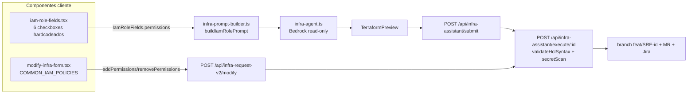
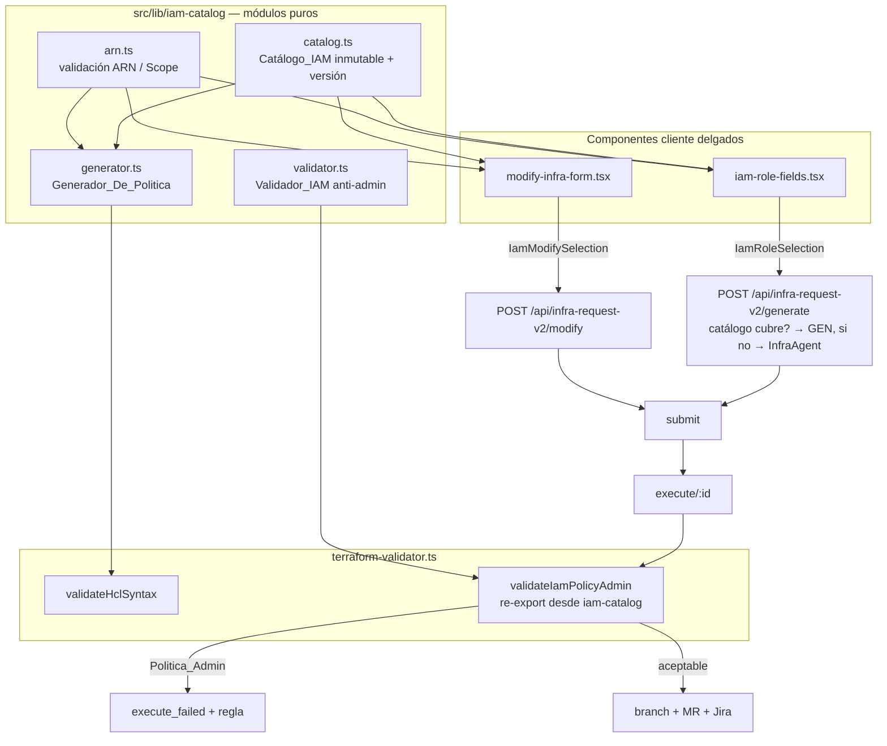

# Diseño — IAM Role Least Privilege

## Overview

Esta feature rediseña el flujo self-service de **creación** y **modificación** de roles IAM del
Platform Portal (`/infra-requests`) para reemplazar las 6 categorías de servicio de grano grueso
(hoy inyectadas como texto en el prompt de un agente Bedrock) por un **catálogo curado, versionado y
determinista** de ~40 presets de permiso de mínimo privilegio, scoped a ARNs concretos, y con un
**validador duro anti-admin** que rechaza cualquier política amplia con independencia de lo que
genere el modelo.

El principio rector es el mismo que ya rige `src/lib/squad-infra/` (plantillas deterministas
`templates.ts` / `validators.ts` / `render.ts`): **la lógica decidible vive en módulos puros bajo
`src/lib/`**, importables por componentes cliente, rutas API y tests; los componentes de formulario
son delgados y no contienen listas de permisos hardcodeadas. El agente Bedrock (`InfraAgent`) se
reserva exclusivamente como respaldo para requisitos de permiso no representables por el catálogo.

Cuatro piezas nuevas, todas puras salvo los puntos de integración:

1. **Catálogo_IAM** (`src/lib/iam-catalog/`) — estructura de datos inmutable y versionada con los
   presets de permiso por servicio y nivel de acceso. Única fuente de verdad compartida por el
   formulario de creación y el de modificación.
2. **Generador_De_Politica** (`src/lib/iam-catalog/generator.ts`) — transforma una selección de
   presets + Scope_De_Recurso en HCL IRSA determinista (byte-idéntico, orden-independiente) que
   pasa `validateHclSyntax`. Sin IA.
3. **Validador_IAM** (extensión de `src/lib/terraform-validator.ts`) — veredicto total
   `{ aceptable | Politica_Admin }`, default-deny, sobre políticas generadas y ARNs de managed
   policy. Invocado en el `execute` de crear y modificar antes de tocar el repositorio.
4. **Validación de ARNs / Scope_De_Recurso** (`src/lib/iam-catalog/arn.ts`) — validación pura de
   formato ARN, coherencia servicio↔ARN, comodines por preset y límite de 50.

La UI (`iam-role-fields.tsx` y `modify-infra-form.tsx`) pasa a leer del Catálogo_IAM como única
fuente, eliminando `PERMISSION_OPTIONS` (6 checkboxes) y `COMMON_IAM_POLICIES`. El flujo de
aprobación/ejecución existente (submit → approve → execute con claim atómico, self-approval,
rollback de branch, MR y Jira) se reutiliza sin cambios estructurales.

### Objetivos y no-objetivos

**Objetivos**
- ≥40 presets sobre ≥22 servicios AWS en dos familias (aplicación/microservicio y Data & Analytics).
- Generación determinista y reproducible del HCL IRSA nativo.
- Guardarraíl duro anti-admin, independiente del prompt del agente.
- Scoping a ARNs con validación de formato y coherencia.

**No-objetivos**
- No se corrige la incoherencia de la opción "RDS" del plano de datos (steering §19): el catálogo
  simplemente **no expone** presets de datos RDS. El rediseño de esa opción queda fuera de alcance.
- No se sustituye el `InfraAgent` para RDS/S3; sólo se le retira la generación de la política IAM
  cuando el catálogo la cubre.

## Architecture

### Situación actual (a modificar)



Hoy es el modelo Bedrock quien decide las acciones IAM concretas → resultado no determinista,
percibido como "tipo admin", con el único guardarraíl siendo texto en el system prompt.

### Situación objetivo



### Decisiones de arquitectura y su justificación

- **Módulo puro versionado, no base de datos.** El catálogo es código (como `squad-catalog.ts` y
  `rds/version-catalog.ts`), no una tabla. Motivo: es una decisión curada por SRE que se revisa por
  MR, se testea con PBT y se despliega con el binario; no cambia en runtime ni lo edita el usuario.
  El requisito 1.6 (estructura inmutable que ningún consumidor puede modificar) se garantiza con
  `readonly`/`as const` + `Object.freeze` recursivo en el punto de publicación.

- **Generación determinista con plantillas TS, IA como fallback.** Igual que squad-infra decidió no
  usar IA para SQS/DynamoDB/etc., un rol IRSA con una policy scoped es plenamente plantillable. El
  determinismo (byte-idéntico, orden-independiente) es un requisito duro (4.2) que la IA no puede
  satisfacer. El `InfraAgent` sólo se invoca cuando la selección referencia un permiso no cubierto
  por el catálogo (4.5).

- **Validador como extensión de `terraform-validator.ts`.** El punto de invocación en `execute`
  ya importa de ese módulo (`validateHclSyntax`, `validateRdsPasswordRotation`). Añadir ahí
  `validateIamPolicyAdmin` (re-exportado desde `iam-catalog/validator.ts` para mantener la lógica
  con el resto del catálogo) minimiza el cambio en la ruta y sigue el patrón "belt-and-suspenders"
  ya existente (validateHcl → rotación → secretos → **IAM anti-admin**).

- **Determinismo del orden.** Todas las colecciones (acciones, ARNs, statements, presets) se
  **ordenan lexicográficamente y se deduplican** antes de emitir HCL. Así la misma selección
  semántica (independientemente del orden en que el usuario marque los presets o pegue los ARNs)
  produce el mismo texto byte a byte.

### Patrón IRSA nativo generado

El Generador_De_Politica emite el patrón nativo verificado en `iac/services/roles.tf` (respeta el
steering, NO usa módulos IAM):

```hcl
resource "aws_iam_role" "<role_id>" {
  count = contains(["dev", "uat"], var.environment) ? 1 : 0   # sólo si NO son todos los entornos
  name  = "<role-name>"
  assume_role_policy = templatefile("role_templates/iskaypet_dh_access.json.tmpl", {
    AWS_ACCOUNT_ID    = var.oms_account_id
    OIDC_PROVIDER_URL = var.dp_eks_oidc_provider_url
    NAMESPACE         = "<namespace>"
  })
}

resource "aws_iam_policy" "<role_id>" {
  count  = contains(["dev", "uat"], var.environment) ? 1 : 0
  name   = "<role-name>-policy"
  policy = jsonencode({
    Version = "2012-10-17"
    Statement = [ /* un Statement por preset, acciones y Resource ordenados */ ]
  })
}

resource "aws_iam_role_policy_attachment" "<role_id>" {
  count      = contains(["dev", "uat"], var.environment) ? 1 : 0
  role       = aws_iam_role.<role_id>[0].name
  policy_arn = aws_iam_policy.<role_id>[0].arn
}
```

Cuando los entornos destino son los tres (`dev`, `uat`, `prod`) se omite `count` y las referencias
no llevan `[0]` (4.8).

## Components and Interfaces

### 1. Catálogo_IAM — `src/lib/iam-catalog/catalog.ts`

```typescript
/** Nivel de acceso de un preset (Nivel_De_Acceso). */
export type AccessLevel = "read-only" | "read-write" | "custom-actions"

/** Identificador de servicio AWS soportado por el catálogo. */
export type AwsService =
  // Familia aplicación/microservicio (14)
  | "s3" | "sqs" | "sns" | "eventbridge" | "dynamodb" | "secretsmanager"
  | "ssm" | "logs" | "cloudwatch" | "kinesis" | "lambda" | "states" | "ses" | "bedrock"
  // Familia Data & Analytics (9)
  | "athena" | "glue" | "lakeformation" | "firehose" | "redshift-data"
  | "elasticmapreduce" | "kafka" | "sagemaker" | "s3-datalake"

export type ServiceFamily = "application" | "data-analytics"

/** Entrada del catálogo (Preset_IAM). Inmutable. */
export interface IamPreset {
  /** Identificador único y estable, inmutable entre versiones. p.ej. "s3-read-only". */
  readonly id: string
  readonly service: AwsService
  readonly family: ServiceFamily
  readonly accessLevel: AccessLevel
  /** Etiqueta i18n-key para la UI (no texto literal). */
  readonly labelKey: string
  /** 1..50 acciones IAM, sin duplicados. p.ej. ["s3:GetObject", "s3:ListBucket"]. */
  readonly actions: readonly string[]
  /** Plantilla de ARN por defecto (no vacía). p.ej. "arn:aws:s3:::*". */
  readonly defaultArnTemplate: string
  /** Si admite Scope_De_Recurso (ARNs concretos) o usa siempre el default. */
  readonly scopable: boolean
  /** Comodines permitidos en el Scope_De_Recurso de este preset. */
  readonly allowWildcards: boolean
}

/** Versión de esquema: entero monotónicamente creciente iniciado en 1. */
export const CATALOG_SCHEMA_VERSION = 1 as const

/**
 * Colección publicada del Catálogo_IAM. Ha pasado por `buildPublishedCatalog`
 * (reglas de integridad + Object.freeze recursivo). Es la ÚNICA fuente de verdad.
 */
export const IAM_CATALOG: readonly IamPreset[] // = buildPublishedCatalog(RAW_PRESETS)

/** Índice por id para lookup O(1) durante la generación. */
export function getPresetById(id: string): IamPreset | undefined
export function listPresetsByFamily(family: ServiceFamily): readonly IamPreset[]
export function listServices(): readonly AwsService[]
```

**Reglas de integridad — `buildPublishedCatalog(raw): readonly IamPreset[]`** (puro):
Filtra de la colección publicada (no lanza) todo preset que:
- comparta `id` con otro (excluye todos los que colisionan) (1.9),
- tenga `actions` vacía o con duplicados (1.9),
- tenga `defaultArnTemplate` vacío,
- sea `read-only` y contenga alguna acción que no sea de nivel List/Read (1.5),
- incluya alguna acción del plano de datos RDS (`rds-db:*`, `rds-data:*`, `rds:Connect*`) (1.7).

Tras filtrar, congela cada preset y la colección (`Object.freeze`) para garantizar 1.6, y valida
en tiempo de carga (aserción de arranque, no runtime del usuario) que se cumplen 1.2/1.3
(≥2 presets por servicio con al menos read-only + read-write; ≥40 presets; ≥22 servicios).

**Clasificación de acciones (para 1.5)** — `src/lib/iam-catalog/action-levels.ts`:
Mapa curado `Record<string, "List" | "Read" | "Write" | "Permissions" | "Tagging">` con las acciones
usadas por los presets (derivado de la AWS IAM reference). `isReadOnlyAction(a)` ⇔ nivel ∈ {List, Read}.

#### Presets concretos por servicio (≥40 presets, 23 servicios)

> Cada preset con id estable, nivel de acceso y acciones representativas. `default ARN` es la
> plantilla scoped por defecto; `scope=sí` indica que admite Scope_De_Recurso.

**Familia aplicación/microservicio (14 servicios)**

| Servicio | Preset id | Nivel | Acciones (resumen) | scope |
|----------|-----------|-------|--------------------|-------|
| S3 | `s3-read-only` | read-only | `s3:GetObject`, `s3:ListBucket`, `s3:GetBucketLocation` | sí |
| S3 | `s3-read-write` | read-write | + `s3:PutObject`, `s3:DeleteObject`, `s3:AbortMultipartUpload` | sí |
| SQS | `sqs-consumer` | read-write | `sqs:ReceiveMessage`, `DeleteMessage`, `GetQueueAttributes`, `GetQueueUrl`, `ChangeMessageVisibility` | sí |
| SQS | `sqs-producer` | read-write | `sqs:SendMessage`, `GetQueueUrl`, `GetQueueAttributes` | sí |
| SQS | `sqs-read-only` | read-only | `sqs:GetQueueAttributes`, `GetQueueUrl`, `ListQueues` | sí |
| SNS | `sns-publisher` | read-write | `sns:Publish`, `GetTopicAttributes` | sí |
| SNS | `sns-read-only` | read-only | `sns:GetTopicAttributes`, `ListSubscriptionsByTopic` | sí |
| EventBridge | `eventbridge-publisher` | read-write | `events:PutEvents` | sí |
| EventBridge | `eventbridge-read-only` | read-only | `events:DescribeRule`, `ListRules`, `ListTargetsByRule` | sí |
| DynamoDB | `dynamodb-read-only` | read-only | `dynamodb:GetItem`, `BatchGetItem`, `Query`, `Scan`, `DescribeTable` | sí |
| DynamoDB | `dynamodb-read-write` | read-write | + `PutItem`, `UpdateItem`, `DeleteItem`, `BatchWriteItem` | sí |
| Secrets Manager | `secrets-read-only` | read-only | `secretsmanager:GetSecretValue`, `DescribeSecret` | sí |
| Secrets Manager | `secrets-read-write` | read-write | + `PutSecretValue`, `UpdateSecret` | sí |
| SSM Param Store | `ssm-params-read-only` | read-only | `ssm:GetParameter`, `GetParameters`, `GetParametersByPath` | sí |
| SSM Param Store | `ssm-params-read-write` | read-write | + `ssm:PutParameter` | sí |
| CloudWatch Logs | `logs-writer` | read-write | `logs:CreateLogStream`, `PutLogEvents`, `DescribeLogStreams` | sí |
| CloudWatch Logs | `logs-read-only` | read-only | `logs:GetLogEvents`, `FilterLogEvents`, `DescribeLogGroups` | sí |
| CloudWatch Metrics | `cloudwatch-metrics-publisher` | read-write | `cloudwatch:PutMetricData` | no |
| CloudWatch Metrics | `cloudwatch-metrics-read-only` | read-only | `cloudwatch:GetMetricData`, `ListMetrics`, `GetMetricStatistics` | no |
| Kinesis | `kinesis-consumer` | read-write | `kinesis:GetRecords`, `GetShardIterator`, `DescribeStream`, `ListShards` | sí |
| Kinesis | `kinesis-producer` | read-write | `kinesis:PutRecord`, `PutRecords`, `DescribeStream` | sí |
| Lambda | `lambda-invoker` | read-write | `lambda:InvokeFunction` | sí |
| Lambda | `lambda-read-only` | read-only | `lambda:GetFunction`, `ListFunctions`, `GetFunctionConfiguration` | sí |
| Step Functions | `states-executor` | read-write | `states:StartExecution`, `DescribeExecution`, `StopExecution` | sí |
| Step Functions | `states-read-only` | read-only | `states:DescribeExecution`, `ListExecutions`, `GetExecutionHistory` | sí |
| SES | `ses-sender` | read-write | `ses:SendEmail`, `SendRawEmail` | sí |
| SES | `ses-read-only` | read-only | `ses:GetSendQuota`, `ListIdentities`, `GetIdentityVerificationAttributes` | no |
| Bedrock | `bedrock-invoke` | read-write | `bedrock:InvokeModel`, `InvokeModelWithResponseStream` | sí |
| Bedrock | `bedrock-read-only` | read-only | `bedrock:ListFoundationModels`, `GetFoundationModel` | no |

**Familia Data & Analytics (9 servicios)**

| Servicio | Preset id | Nivel | Acciones (resumen) | scope |
|----------|-----------|-------|--------------------|-------|
| Athena | `athena-read-only` | read-only | `athena:GetQueryExecution`, `GetQueryResults`, `ListQueryExecutions`, `GetWorkGroup` | sí |
| Athena | `athena-query-runner` | read-write | + `athena:StartQueryExecution`, `StopQueryExecution` | sí |
| Glue | `glue-catalog-read-only` | read-only | `glue:GetDatabase`, `GetTable`, `GetTables`, `GetPartitions` | sí |
| Glue | `glue-job-runner` | read-write | `glue:StartJobRun`, `GetJobRun`, `GetJobRuns`, `BatchStopJobRun` | sí |
| Lake Formation | `lakeformation-read-only` | read-only | `lakeformation:GetDataAccess`, `GetResourceLFTags`, `SearchTablesByLFTags` | no |
| Kinesis Firehose | `firehose-producer` | read-write | `firehose:PutRecord`, `PutRecordBatch`, `DescribeDeliveryStream` | sí |
| Redshift Data API | `redshift-data-read-only` | read-only | `redshift-data:GetStatementResult`, `DescribeStatement`, `ListStatements` | sí |
| Redshift Data API | `redshift-data-query-runner` | read-write | + `redshift-data:ExecuteStatement`, `BatchExecuteStatement` | sí |
| EMR | `emr-read-only` | read-only | `elasticmapreduce:DescribeCluster`, `ListClusters`, `ListSteps` | sí |
| EMR | `emr-job-submitter` | read-write | + `elasticmapreduce:AddJobFlowSteps`, `TerminateJobFlows` | sí |
| MSK/Kafka (IAM auth) | `kafka-consumer` | read-write | `kafka-cluster:Connect`, `DescribeGroup`, `ReadData`, `DescribeTopic` | sí |
| MSK/Kafka (IAM auth) | `kafka-producer` | read-write | `kafka-cluster:Connect`, `WriteData`, `DescribeTopic`, `WriteDataIdempotently` | sí |
| SageMaker | `sagemaker-read-only` | read-only | `sagemaker:DescribeEndpoint`, `ListEndpoints`, `DescribeModel` | sí |
| SageMaker | `sagemaker-invoker` | read-write | `sagemaker:InvokeEndpoint` | sí |
| Datalake (S3) | `s3-datalake-read-only` | read-only | `s3:GetObject`, `ListBucket`, `GetBucketLocation` (acotado al bucket datalake) | sí |
| Datalake (S3) | `s3-datalake-read-write` | read-write | + `s3:PutObject`, `DeleteObject` (acotado al bucket datalake) | sí |

Total: **45 presets** sobre **23 servicios** (14 + 9), cumpliendo 1.2 (≥2 por servicio con
read-only + read-write; los servicios con una sola variante razonable — p.ej. CloudWatch Metrics
publisher/read-only — aportan de todos modos dos niveles), 1.3 (≥40 presets / ≥22 servicios).

### 2. Validación de ARNs / Scope_De_Recurso — `src/lib/iam-catalog/arn.ts`

```typescript
export interface ArnParts {
  partition: string   // "aws"
  service: string     // "s3", "sqs", ...
  region: string      // puede ir vacío (servicios globales)
  account: string     // 12 dígitos, o vacío (servicios globales como S3)
  resource: string    // no vacío
}

/** Parseo puro de un ARN a sus segmentos, o null si no cumple el formato base. */
export function parseArn(arn: string): ArnParts | null

/** Resultado de validar un único ARN contra un preset. */
export interface ArnValidation {
  valid: boolean
  /** Código estable para i18n. p.ej. "bad_format", "cross_service", "wildcard_not_allowed". */
  code?: "bad_format" | "empty" | "bad_account" | "cross_service" | "wildcard_not_allowed"
  arn: string
}

/**
 * Valida el FORMATO de un ARN: arn:aws:<servicio>:<region>:<cuenta>:<recurso>
 *  - servicio no vacío
 *  - region/cuenta pueden ir vacías para servicios globales (p.ej. S3)
 *  - cuenta de 12 dígitos cuando exista
 *  - recurso no vacío
 * (Requirement 3.3)
 */
export function validateArnFormat(arn: string): ArnValidation

/**
 * Valida un ARN CONTRA un preset: formato + coherencia servicio↔ARN (3.5) +
 * comodines permitidos por el preset (3.6). El servicio del preset se mapea a
 * su prefijo de ARN (p.ej. "states" → "states", "logs" → "logs", "s3-datalake" → "s3").
 */
export function validateArnForPreset(arn: string, preset: IamPreset): ArnValidation

export interface ScopeValidation {
  /** ARNs aceptados, deduplicados y ordenados determinísticamente. */
  accepted: string[]
  /** ARNs rechazados con su motivo (se conservan para feedback; 3.3/3.5). */
  rejected: ArnValidation[]
  /** true si se superó el límite de 50 (3.7). */
  tooMany: boolean
}

/**
 * Valida y normaliza una lista de ARNs para un preset:
 *  - ARNs en blanco / sólo espacios se tratan como ausencia (3.4).
 *  - >50 ARNs → tooMany, conservando los 50 dentro del límite (3.7).
 *  - dedup + orden lexicográfico determinista (3.2).
 * Longitud por ARN 1..2048 (3.1).
 */
export function validateScope(arns: readonly string[], preset: IamPreset): ScopeValidation

export const MAX_ARNS_PER_PRESET = 50
export const MAX_ARN_LENGTH = 2048
```

### 3. Generador_De_Politica — `src/lib/iam-catalog/generator.ts`

```typescript
/** Selección de un preset con su scope opcional. */
export interface PresetSelection {
  presetId: string
  /** ARNs concretos; vacío / ausente ⇒ usar defaultArnTemplate del preset (3.4). */
  resourceArns?: readonly string[]
}

export interface GenerateIamRoleInput {
  roleName: string
  namespace: string
  selections: readonly PresetSelection[]
  targetEnvironments: readonly string[]   // subconjunto de ["dev","uat","prod"] o ["tooling"]
}

export type GenerateResult =
  | { ok: true; hcl: string; filePath: "iac/services/roles.tf"; actionsCount: number }
  | { ok: false; code: "unknown_preset" | "empty_selection" | "invalid_scope"; detail: string }

/**
 * Genera HCL IRSA determinista a partir de la selección.
 *  - Aborta con `unknown_preset` si algún presetId no existe (4.9).
 *  - Un Statement por preset (Effect:Allow), acciones ORDENADAS y deduplicadas (4.2, 4.4).
 *  - Resource = ARNs validados+ordenados, o [defaultArnTemplate] si no hay scope (3.2, 3.4).
 *  - count = contains([envs], var.environment) ? 1 : 0 si NO son todos los entornos (4.6);
 *    omitido y sin [0] si son todos (4.8).
 *  - Salida byte-idéntica para la misma selección semántica, sea cual sea el orden de
 *    entrada de presets/ARNs (4.2).
 *  - El HCL resultante pasa validateHclSyntax (4.7).
 */
export function generateIamRoleHcl(input: GenerateIamRoleInput): GenerateResult

/** Determina si una selección está totalmente cubierta por el catálogo (4.1 vs 4.5). */
export function isCoveredByCatalog(selections: readonly PresetSelection[]): boolean
```

**Orden determinista** (clave para 4.2): las acciones dentro de un Statement se ordenan con
`localeCompare`-independiente (comparación de code points, `[...].sort()`); los Statements se ordenan
por `presetId`; los ARNs por orden lexicográfico; el HCL usa `JSON.stringify` con claves en orden
fijo (`Version`, `Statement`, y dentro `Sid`, `Effect`, `Action`, `Resource`). Los entornos del
`count` se emiten en el orden canónico `["dev","uat","prod"]` filtrado, no en el orden de entrada.

### 4. Validador_IAM anti-admin — `src/lib/iam-catalog/validator.ts` (+ re-export en `terraform-validator.ts`)

```typescript
export type IamVerdict = "aceptable" | "Politica_Admin"

export interface IamValidationResult {
  verdict: IamVerdict
  /** Regla concreta que disparó Politica_Admin (para el error, 5.3). */
  rule?:
    | "empty_or_malformed"
    | "managed_full_access"
    | "managed_administrator"
    | "wildcard_action_on_all_resources"
    | "invalid_managed_arn"
  detail?: string
}

/**
 * Valida un documento de política IAM (HCL o el objeto de política ya parseado)
 * o un ARN de managed policy. TOTAL y default-deny:
 *  - entrada vacía/malformada / ARN inválido → Politica_Admin (5.2).
 *  - segmento tras la última "/" termina en "FullAccess" (case-insensitive) → Politica_Admin (5.4).
 *  - segmento tras la última "/" contiene "Administrator" (case-insensitive) → Politica_Admin (5.5).
 *  - Statement Effect:Allow con Action "*" o "<svc>:*" sobre Resource "*"
 *    (Action/Resource como string o elemento de lista) → Politica_Admin (5.6).
 *  - en cualquier otro caso → aceptable.
 * NUNCA lanza excepción (5.1, 5.2).
 */
export function validateIamPolicyAdmin(input: string): IamValidationResult

/** Valida específicamente un ARN de managed policy (usado por modify, 6.4/6.5). */
export function validateManagedPolicyArn(arn: string): IamValidationResult
```

En `terraform-validator.ts` se añade un re-export para que el `execute` lo consuma junto al resto:

```typescript
export { validateIamPolicyAdmin } from "./iam-catalog/validator"
```

### 5. Prompt builder — `src/lib/infra-prompt-builder.ts`

`IamRoleFields` se amplía para transportar la selección estructurada (retrocompatible: `permissions`
se conserva para el camino fallback del agente):

```typescript
export interface IamRoleFields {
  roleName: string
  servicePrincipal: string
  policyType: 'irsa' | 'standard'
  namespace?: string
  /** Legacy / fallback: texto libre de servicios para el InfraAgent. */
  permissions: string[]
  /** NUEVO: selección de presets del catálogo (camino determinista). */
  presetSelections?: PresetSelection[]
}
```

### 6. UI — `iam-role-fields.tsx` (creación)

- Elimina `PERMISSION_OPTIONS` (los 6 checkboxes hardcodeados).
- Lee `IAM_CATALOG` agrupado por `family` → `service`; renderiza cada preset como opción
  seleccionable con su `labelKey` traducido (i18n es/en/pt/fr).
- Por cada preset seleccionado con `scopable`, muestra un editor de ARNs (textarea multi-línea o
  chips) validado en cliente con `validateScope`; los ARNs rechazados se marcan con el `code`
  traducido, conservando los válidos (3.3/3.5/3.7).
- Si `IAM_CATALOG` está vacío (defensivo, 2.6), muestra error y bloquea el submit.
- Emite `IamRoleFields.presetSelections` al padre.

### 7. UI — `modify-infra-form.tsx` (modificación)

- Elimina `COMMON_IAM_POLICIES`.
- La sección IAM presenta los presets del catálogo (misma fuente y orden que creación, 2.5) para
  **añadir** (con scope por preset, 6.3).
- Para **quitar**: lista los permisos actuales del rol como elementos seleccionables (6.2). Los
  permisos actuales se obtienen del recurso listado (`list-resources` ya devuelve el recurso; se
  extiende para parsear los `Sid`/preset-ids presentes en la policy actual).
- El campo de ARN de managed policy personalizado se conserva pero cada ARN añadido se somete a
  `validateManagedPolicyArn` en cliente (feedback inmediato) y de nuevo en servidor (6.4/6.5).

## Data Models

### Esquema del Catálogo_IAM

```typescript
// Preset_IAM (entrada del catálogo)
interface IamPreset {
  readonly id: string                    // único, estable, inmutable entre versiones (1.1)
  readonly service: AwsService           // uno de los 23 servicios (1.3)
  readonly family: ServiceFamily         // "application" | "data-analytics"
  readonly accessLevel: AccessLevel      // "read-only" | "read-write" | "custom-actions" (1.1)
  readonly labelKey: string              // clave i18n para la UI
  readonly actions: readonly string[]    // 1..50, sin duplicados (1.1)
  readonly defaultArnTemplate: string    // no vacío (1.1)
  readonly scopable: boolean             // admite Scope_De_Recurso (3.1)
  readonly allowWildcards: boolean       // comodines permitidos en el scope (3.6)
}

// Versión de esquema (1.4, 1.8)
const CATALOG_SCHEMA_VERSION: number     // entero ≥1, se incrementa al cambiar presets/estructura
```

### Documento de política generado (forma canónica)

```jsonc
{
  "Version": "2012-10-17",
  "Statement": [
    {
      "Sid": "s3readonly",             // derivado del preset id (alfanumérico)
      "Effect": "Allow",
      "Action": ["s3:GetObject", "s3:ListBucket"],   // ordenadas, deduplicadas (4.2, 4.4)
      "Resource": ["arn:aws:s3:::my-bucket", "arn:aws:s3:::my-bucket/*"]  // ordenados (3.2)
    }
  ]
}
```

### Modelo de selección (entrada UI → API)

```typescript
interface IamRoleSelection {           // creación
  roleName: string
  namespace: string
  targetEnvironments: string[]         // subconjunto de dev/uat/prod, o ["tooling"] (7.3, 7.4)
  selections: PresetSelection[]
}

interface PresetSelection {
  presetId: string
  resourceArns?: string[]              // 0..50, 1..2048 chars cada uno (3.1)
}

interface IamModifySelection {         // modificación
  addSelections: PresetSelection[]     // presets a añadir (6.3)
  removePresetIds: string[]            // presets/Sid actuales a quitar (6.2, 6.7)
  addManagedArns: string[]             // ARNs de managed policy custom (6.4)
}
```

### Persistencia

No hay tablas nuevas. La `Solicitud_Infra` se persiste en `infra_requests` como hoy
(`resource_type = "iam_role"`), con la `IamRoleSelection` dentro de `payload` y el HCL en
`terraform_preview.content`. Estados sin cambios: `pending → approved → executing → executed`
(+ `rejected`, `cancelled`, `execute_failed`) (7.1).

## Correctness Properties

*Una propiedad es una característica o comportamiento que debe cumplirse en todas las ejecuciones
válidas de un sistema — esencialmente, una afirmación formal sobre lo que el sistema debe hacer.
Las propiedades son el puente entre las especificaciones legibles por humanos y las garantías de
correctción verificables por máquina.*

La lógica pura de esta feature (catálogo, validación de ARN, generación determinista de HCL y
validador anti-admin) tiene espacios de entrada amplios (strings, listas de acciones, ARNs
arbitrarios, selecciones en cualquier orden), ideales para property-based testing con `fast-check`.

Las propiedades siguientes se derivan del análisis de los criterios de aceptación. Los criterios de
integración (5.7, 5.8, 5.9, 6.4, 7.1, 7.2, 7.5, 7.6, 7.7) se cubren con tests example/integración
(ver Testing Strategy), no con PBT, porque verifican el cableado de la ruta y la máquina de estados,
no lógica que varíe con el input.

### Property 1: Integridad estructural de todo preset publicado

*Para todo* Preset_IAM de la colección publicada `IAM_CATALOG`, su `id` es no vacío, su lista de
`actions` tiene entre 1 y 50 elementos sin duplicados, su `defaultArnTemplate` es no vacío, su
`service` pertenece al conjunto soportado y su `accessLevel` es uno de {read-only, read-write,
custom-actions}. Además, ningún preset publicado contiene acciones del plano de datos RDS.

**Validates: Requirements 1.1, 1.7**

### Property 2: read-only sólo contiene acciones de lectura

*Para todo* Preset_IAM publicado con `accessLevel = "read-only"` y *para toda* acción de su lista,
la acción se clasifica como nivel AWS List o Read (nunca Write, Permissions management ni Tagging).

**Validates: Requirements 1.5**

### Property 3: buildPublishedCatalog descarta lo inválido

*Para toda* lista cruda de presets, la colección publicada por `buildPublishedCatalog` no contiene
identificadores duplicados, ni presets con lista de acciones vacía, ni presets con alguna acción del
plano de datos RDS. Los presets válidos que no colisionan se conservan.

**Validates: Requirements 1.9, 1.7**

### Property 4: cobertura mínima de servicios y niveles

*Para todo* Servicio_AWS presente en la colección publicada, existen al menos dos Preset_IAM y los
niveles `read-only` y `read-write` están representados para ese servicio.

**Validates: Requirements 1.2**

### Property 5: opciones de formulario deterministas e idénticas entre flujos

*Para todo* catálogo, `buildFormOptions(catálogo)` produce exactamente los presets del catálogo (los
mismos identificadores), en un orden estable; por tanto las opciones presentadas por el
Formulario_Creacion y el Formulario_Modificacion (que consumen la misma función sobre el mismo
catálogo) son idénticas en contenido y orden.

**Validates: Requirements 2.4, 2.5**

### Property 6: aceptación de scope dentro de los límites

*Para toda* lista de 1 a 50 ARNs con formato válido para un preset scopable, cada uno de 1 a 2048
caracteres, `validateScope` los acepta todos y no marca `tooMany`.

**Validates: Requirements 3.1**

### Property 7: Resource canónico (scope presente o ausente)

*Para toda* selección de un preset y su Scope_De_Recurso, el campo `Resource` de la
Politica_Generada es: (a) el conjunto de ARNs válidos **deduplicado y ordenado
determinísticamente** cuando hay al menos un ARN no vacío; o (b) exactamente `[defaultArnTemplate]`
del preset cuando el scope está ausente o todos los ARNs son blancos/whitespace. El resultado es
reproducible entre ejecuciones y entradas permutadas.

**Validates: Requirements 3.2, 3.4**

### Property 8: validación de ARN total, con conservación y anti-cross-service

*Para todo* string de entrada, `validateArnFormat` devuelve un veredicto (nunca lanza) y rechaza con
un `code` los ARNs que no cumplen el formato `arn:aws:<servicio>:<region>:<cuenta>:<recurso>`
(cuenta de 12 dígitos cuando exista; recurso no vacío). *Para todo* ARN cuyo servicio difiere del
Servicio_AWS del preset, `validateArnForPreset` lo rechaza con `cross_service`. En una lista mixta,
los ARNs válidos se conservan en `accepted` y los inválidos se listan en `rejected` con su motivo.

**Validates: Requirements 3.3, 3.5**

### Property 9: comodines permitidos según el preset

*Para todo* preset y *para todo* ARN con formato correcto que contenga un comodín, la validación lo
acepta si y sólo si `preset.allowWildcards` es verdadero.

**Validates: Requirements 3.6**

### Property 10: límite de 50 ARNs

*Para toda* lista de más de 50 ARNs válidos, `validateScope` marca `tooMany` y no produce
generación, conservando como máximo 50 ARNs dentro del límite; *para toda* lista de 50 o menos, no
marca `tooMany`.

**Validates: Requirements 3.7**

### Property 11: cobertura del catálogo decide el camino

*Para toda* selección cuyos identificadores pertenecen todos al Catálogo_IAM,
`isCoveredByCatalog` es verdadero (se usa el Generador_De_Politica sin invocar al Infra_Agent);
*para toda* selección que incluye algún identificador ausente, `isCoveredByCatalog` es falso (se
delega en el Infra_Agent).

**Validates: Requirements 4.1, 4.5**

### Property 12: generación byte-idéntica e independiente del orden

*Para toda* selección de presets con su scope, generar el HCL dos veces —permutando el orden de los
presets y de los ARNs de entrada— produce cadenas byte-idénticas.

**Validates: Requirements 4.2**

### Property 13: el HCL generado sigue el Patrón IRSA

*Para toda* selección válida cubierta por el catálogo, el HCL generado contiene un `aws_iam_role`
con `assume_role_policy = templatefile("role_templates/iskaypet_dh_access.json.tmpl", ...)`, un
`aws_iam_policy` scoped y un `aws_iam_role_policy_attachment`.

**Validates: Requirements 4.3**

### Property 14: la política sólo contiene acciones de los presets seleccionados

*Para toda* selección válida, el conjunto de acciones IAM que aparecen en la Politica_Generada es
exactamente la unión de las acciones declaradas por los presets seleccionados — ni más, ni menos.

**Validates: Requirements 4.4**

### Property 15: expresión count según los entornos destino

*Para todo* subconjunto propio no vacío de {dev, uat, prod}, cada recurso condicionado del HCL
incluye la expresión exacta `count = contains([<entornos_destino_canónicos>], var.environment) ? 1 : 0`;
*para* el conjunto completo de entornos, el HCL no incluye ninguna expresión `count` ni referencias
`[0]`.

**Validates: Requirements 4.6, 4.8**

### Property 16: el HCL generado supera validateHclSyntax

*Para toda* selección válida cubierta por el catálogo, `validateHclSyntax` del HCL generado devuelve
`valid = true`.

**Validates: Requirements 4.7**

### Property 17: identificador de preset inexistente aborta la generación

*Para toda* selección que referencie al menos un identificador de preset ausente del Catálogo_IAM,
`generateIamRoleHcl` devuelve `{ ok: false, code: "unknown_preset" }` con un `detail` que identifica
el identificador inexistente, sin producir HCL.

**Validates: Requirements 4.9**

### Property 18: el Validador_IAM es total y default-deny

*Para todo* input (incluidos vacíos, no-JSON, políticas malformadas y ARNs inválidos),
`validateIamPolicyAdmin` devuelve un veredicto que es exactamente uno de {aceptable, Politica_Admin}
sin lanzar excepción, y emite `Politica_Admin` para toda entrada vacía o malformada (default-deny).
Siempre que el veredicto es `Politica_Admin`, el resultado incluye la `rule` que lo disparó.

**Validates: Requirements 5.1, 5.2, 5.3**

### Property 19: toda Politica_Admin se detecta

*Para todo* ARN de managed policy cuyo segmento tras la última `/` termina en `FullAccess`
(comparación insensible a mayúsculas/minúsculas) o contiene `Administrator`, y *para todo* documento
de política con un `Statement` `Effect: Allow` que conceda `Action` `"*"` o `"<servicio>:*"` sobre
`Resource` `"*"` (con `Action` y `Resource` tanto como cadena como elemento de lista), el veredicto
es `Politica_Admin`.

**Validates: Requirements 5.4, 5.5, 5.6**

### Property 20: round-trip de permisos actuales (generar → parsear)

*Para toda* selección de presets, parsear el HCL generado para extraer los permisos actuales del rol
recupera exactamente el conjunto de identificadores de preset seleccionados, de modo que el
Formulario_Modificacion puede presentarlos como elementos seleccionables para quitar.

**Validates: Requirements 6.2**

### Property 21: partición de ARNs managed por veredicto

*Para toda* lista de ARNs de managed policy, la partición en aceptados/rechazados coincide
exactamente, ARN a ARN, con el veredicto de `validateManagedPolicyArn`: los clasificados como
`Politica_Admin` se rechazan (con su motivo) y el resto de la selección se conserva sin cambios.

**Validates: Requirements 6.5**

### Property 22: quitar permisos preserva el complemento exacto

*Para todo* conjunto de permisos actuales y *para todo* subconjunto seleccionado para quitar, el HCL
resultante de la modificación contiene exactamente los permisos actuales menos los seleccionados
para quitar, y nada más (los no seleccionados se conservan sin cambios).

**Validates: Requirements 6.7**

### Property 23: detección total de acciones del plano de datos RDS

*Para toda* acción IAM o ARN de entrada, `isRdsDataPlaneAction` es total (no lanza) y devuelve
verdadero para toda acción de datos RDS (`rds-db:*`, `rds-data:*`, `rds:Connect*`), de modo que una
modificación que solicite datos RDS se rechaza.

**Validates: Requirements 6.8**

### Property 24: campos obligatorios de la solicitud

*Para todo* input de solicitud de rol, la validación falla si `roleName`, `namespace` o los entornos
destino están ausentes o vacíos, y pasa cuando los tres están presentes y son válidos.

**Validates: Requirements 7.3**

## Error Handling

### Catálogo y opciones de formulario

- **Catálogo vacío o ilegible (2.6):** `buildFormOptions` devuelve una lista vacía; el componente lo
  detecta, muestra un mensaje i18n ("Las opciones de permiso no están disponibles") y **bloquea el
  submit**. No existe ninguna lista hardcodeada a la que recurrir (se eliminan `PERMISSION_OPTIONS`
  y `COMMON_IAM_POLICIES`).
- **Aserciones de arranque del catálogo:** `buildPublishedCatalog` valida en carga (no en runtime
  de usuario) los invariantes de cobertura (1.2/1.3). Un fallo aquí rompe el build/los tests, no una
  petición de usuario.

### Validación de ARN / Scope

- Cada ARN se valida individualmente; los rechazados se devuelven en `rejected` con un `code`
  estable mapeado a mensaje i18n (`bad_format`, `empty`, `bad_account`, `cross_service`,
  `wildcard_not_allowed`). **No se genera** la Politica_Generada mientras haya ARNs rechazados
  (3.3/3.5); los válidos se conservan para que el usuario corrija sólo los erróneos.
- Exceso de 50 ARNs → `tooMany`, mensaje de límite, sin generación (3.7).

### Generación

- `unknown_preset` (4.9): se aborta sin HCL y se devuelve el id inexistente. En la ruta se traduce a
  un 422 con detalle.
- `empty_selection` / `invalid_scope`: 422 con el motivo; la UI mantiene el estado del usuario.
- Selección no cubierta (4.5): no es un error; `isCoveredByCatalog=false` deriva la petición al
  `InfraAgent` por el camino existente.

### Ejecución (execute) — orden de guardarraíles

En `POST /api/infra-assistant/execute/[id]`, tras el claim atómico `approved → executing` y **antes**
de crear branch/MR, la cadena de validación queda (extendiendo la existente):

```
validateHclSyntax  →  validateRdsPasswordRotation (solo RDS)  →  scanForSecrets  →
validateIamPolicyAdmin (solo iam_role)   ← NUEVO
```

- Para **creación** de rol IAM (5.7): se invoca `validateIamPolicyAdmin` sobre el
  `terraform_preview.content`. Veredicto `Politica_Admin` (5.9) → se detiene, `execute_failed` con
  la `rule` concreta persistida en `error_message` (reutilizando `handleExecuteFailure` con un
  `explicitCode` nuevo `iam_policy_admin`), y **no** se crea branch/MR/Jira.
- Para **modificación** que añade permisos (5.8): se valida cada permiso añadido (cada ARN managed
  con `validateManagedPolicyArn`, y el documento generado con `validateIamPolicyAdmin`) antes de
  tocar el repo. Veredicto admin en cualquiera → mismo tratamiento `execute_failed` con la regla.
- **Modificación con datos RDS (6.8):** `isRdsDataPlaneAction` detecta el intento; la ruta rechaza
  con 422, sin branch/MR, mensaje de motivo.
- El rollback de branch (7.7) y el claim atómico (7.5) se reutilizan tal cual del flujo existente.

### Totalidad del validador

`validateIamPolicyAdmin` y `validateArnFormat` nunca lanzan: cualquier excepción interna (JSON
malformado, tipos inesperados) se captura y se traduce a `Politica_Admin` / `valid: false`
respectivamente (default-deny, 5.2).

## Testing Strategy

### Enfoque dual

- **Property tests** (fast-check): la lógica pura del catálogo, la validación de ARN, la generación
  determinista de HCL y el validador anti-admin — espacios de entrada amplios, ideales para PBT.
- **Unit / example tests**: casos concretos, edge cases y los invariantes globales de conteo del
  catálogo (1.3, 1.4), inmutabilidad (1.6) y el caso vacío (2.6).
- **Integration / example tests**: puntos de cableado de la ruta `execute` y `modify` (5.7, 5.8,
  5.9, 6.4), la máquina de estados y el flujo de aprobación/ejecución (7.1, 7.2, 7.5, 7.6, 7.7) y el
  comportamiento condicional de UI para Tooling (7.4). Estos NO son PBT porque verifican el cableado
  y la orquestación, no lógica que varíe con el input.

### Configuración de property-based testing

- **Librería:** `fast-check` (ya usada en el repo). NO se implementa PBT desde cero.
- **Runner y convenciones del repo:** `node:test` + `node:assert/strict`, ejecutado con `tsx`; los
  tests viven en `src/lib/__tests__/*.property.test.ts` y consumen los módulos puros de
  `src/lib/iam-catalog/`.
- **Iteraciones:** mínimo `{ numRuns: 100 }` por propiedad (el estándar del repo).
- **Etiquetado:** cada test property lleva un comentario con el formato
  `// Feature: iam-role-least-privilege, Property {número}: {texto de la propiedad}`.
- **Un test property por propiedad de correctción** (24 propiedades → 24 property tests, en ficheros
  agrupados por módulo: `iam-catalog.property.test.ts`, `iam-arn.property.test.ts`,
  `iam-generator.property.test.ts`, `iam-validator.property.test.ts`).

### Generadores fast-check previstos

- **Presets crudos:** `fc.record` que combina servicios, niveles, listas de acciones (incluyendo
  duplicados, vacías y acciones RDS data-plane) para ejercer `buildPublishedCatalog` (Props 1–4).
- **ARNs:** generador que produce ARNs bien formados por servicio, ARNs de otro servicio
  (cross-service), ARNs malformados (segmentos faltantes, cuenta ≠ 12 dígitos), con y sin comodines,
  y listas de longitud 0..60 con duplicados y blancos (Props 6–10).
- **Selecciones:** listas de `PresetSelection` con ids reales del catálogo (y algún id inexistente),
  scopes variados, permutaciones para el determinismo (Props 11–17), y subconjuntos de entornos.
- **Documentos de política / ARNs managed:** generador que sintetiza documentos con Statements
  `Allow` de wildcard sobre `Resource "*"` en las 4 combinaciones string/lista, y nombres de managed
  policy con `FullAccess`/`Administrator` en distintos casings y prefijos de path (Props 18–19, 21).

### Ejecución

Los property tests corren dentro de `npm run test` / `npm run test:coverage` (quality gate
bloqueante del pipeline del portal, ver steering §1). No requieren red ni AWS: toda la lógica bajo
prueba es pura.
