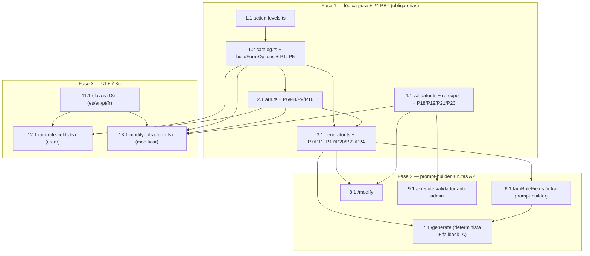

# Implementation Plan: iam-role-least-privilege

## Overview

Este plan implementa el catálogo curado de presets IAM de mínimo privilegio, la validación de ARNs,
la generación determinista de HCL IRSA y el validador duro anti-admin, siguiendo el principio rector
del diseño: **toda la lógica decidible vive en módulos puros bajo `src/lib/iam-catalog/`**, importable
por componentes cliente, rutas API y tests; los componentes de formulario son delgados y no contienen
listas de permisos hardcodeadas (se eliminan `PERMISSION_OPTIONS` y `COMMON_IAM_POLICIES`).

Estrategia de ejecución (igual que el spec `session-nav-hardening` del repo):

- **Fase 1 (lógica pura, PBT primero).** Se implementan los 4 módulos puros
  (`iam-catalog/catalog.ts` + `action-levels.ts`, `arn.ts`, `generator.ts`, `validator.ts`) y el
  re-export en `terraform-validator.ts`, y se cubren con las **24 Correctness Properties** del diseño
  mapeadas **1:1** a tareas **obligatorias** (sin `*`) usando `fast-check` con `{ numRuns: 100 }`,
  **un fichero por propiedad** bajo `src/lib/__tests__/*.property.test.ts`. Cada test lleva el
  comentario canónico `// Feature: iam-role-least-privilege, Property N: <título>` y la línea
  `**Validates: Requirements X.Y**`.
- **Fase 2 (prompt-builder + rutas API).** Ampliación de `IamRoleFields` en `infra-prompt-builder.ts`
  e integración determinista + fallback IA en `POST /api/infra-request-v2/generate` y
  `POST /api/infra-request-v2/modify`, más el validador anti-admin en la cadena de
  `POST /api/infra-assistant/execute/[id]`. Los tests de integración de ruta van marcados `*`.
- **Fase 3 (UI crear/modificar + i18n).** Rediseño de `iam-role-fields.tsx` y `modify-infra-form.tsx`
  leyendo del Catálogo_IAM como única fuente, más las claves i18n en los 4 locales (es/en/pt/fr). Sus
  tests de componente van marcados `*` (opcionales).
- **Fase 4 (checkpoint final).** `npm test` en verde (incluidas las 24 property tests) + `tsc` limpio.

Ubicación de tests (sin ampliar el glob de `npm test`): las property tests viven en
`src/lib/__tests__/*.property.test.ts` (ya cubiertas por el glob `src/lib/__tests__/`) y los tests de
componente/integración en `src/components/__tests__/*.test.tsx` / `src/app/api/**/__tests__` según
corresponda (ya cubiertos). **No hace falta ampliar el glob.**

Gotchas de steering respetados: patrón IRSA **nativo** (`aws_iam_role` + trust
`role_templates/iskaypet_dh_access.json.tmpl` + `aws_iam_policy` scoped + `aws_iam_role_policy_attachment`,
NO módulos IAM), prohibición dura de `*FullAccess`/`Administrator`, **cero plano de datos RDS**
(`rds-db:*`/`rds-data:*`/`rds:Connect*`), i18n en los 4 locales, y `verifyModifyScope()`/execute
consumen string HCL (`result.terraformPreview.content`, gotcha §9).

Convenciones git del repo: rama `feat/SRE-<n>` (sin descripción), commits `[SRE-<n>] <type>: <desc>`
(2–70 chars ASCII).

## Grafo de dependencias



## Tasks

- [x] 1. Catálogo_IAM — módulo puro versionado
  - [x] 1.1 Implementar `src/lib/iam-catalog/action-levels.ts`
    - Mapa curado `Record<string, "List" | "Read" | "Write" | "Permissions" | "Tagging">` con todas las acciones IAM usadas por los presets (derivado de la AWS IAM reference)
    - `isReadOnlyAction(action: string): boolean` ⇔ nivel ∈ {List, Read}
    - `isRdsDataPlaneAction(action: string): boolean` — total, nunca lanza; true para `rds-db:*`, `rds-data:*`, `rds:Connect*`
    - Módulo puro sin dependencias de React ni `node:*`
    - _Requirements: 1.5, 1.7_

  - [x] 1.2 Implementar `src/lib/iam-catalog/catalog.ts`
    - Tipos `AccessLevel`, `AwsService` (23 servicios), `ServiceFamily`, `IamPreset` (todo `readonly`)
    - Constante `RAW_PRESETS` con los **45 presets sobre 23 servicios** de las dos familias (aplicación/microservicio y Data & Analytics) según la tabla del diseño
    - `CATALOG_SCHEMA_VERSION = 1 as const` (entero monotónico)
    - `buildPublishedCatalog(raw): readonly IamPreset[]` — filtra ids duplicados, acciones vacías/duplicadas, `defaultArnTemplate` vacío, `read-only` con acciones no List/Read, y presets con acciones del plano de datos RDS; `Object.freeze` recursivo de cada preset y de la colección
    - `IAM_CATALOG = buildPublishedCatalog(RAW_PRESETS)` (única fuente de verdad, inmutable)
    - Lookups: `getPresetById`, `listPresetsByFamily`, `listServices`
    - `buildFormOptions(catalog): readonly {...}[]` — opciones de formulario deterministas, mismo contenido y orden para creación y modificación
    - Aserción de arranque (no runtime de usuario) de cobertura 1.2/1.3 (≥2 presets por servicio con read-only+read-write; ≥40 presets; ≥22 servicios)
    - _Requirements: 1.1, 1.2, 1.3, 1.4, 1.6, 1.8, 1.9, 2.1, 2.2, 2.3, 2.5_

  - [x] 1.3 Property test de integridad estructural de todo preset publicado
    - Fichero `src/lib/__tests__/iam-catalog-structural-integrity.property.test.ts`, `fast-check` `{ numRuns: 100 }`
    - Comentario: `// Feature: iam-role-least-privilege, Property 1: Integridad estructural de todo preset publicado`
    - Recorre `IAM_CATALOG`: id no vacío, `actions` 1..50 sin duplicados, `defaultArnTemplate` no vacío, `service`/`accessLevel` en dominios soportados, ninguna acción RDS data-plane
    - **Property 1: Integridad estructural de todo preset publicado**
    - **Validates: Requirements 1.1, 1.7**

  - [x] 1.4 Property test de read-only sólo contiene acciones de lectura
    - Fichero `src/lib/__tests__/iam-catalog-readonly-actions.property.test.ts`, `fast-check` `{ numRuns: 100 }`
    - Comentario: `// Feature: iam-role-least-privilege, Property 2: read-only sólo contiene acciones de lectura`
    - Para todo preset `read-only` y toda acción, `isReadOnlyAction` es true (nivel List/Read)
    - **Property 2: read-only sólo contiene acciones de lectura**
    - **Validates: Requirements 1.5**

  - [x] 1.5 Property test de que `buildPublishedCatalog` descarta lo inválido
    - Fichero `src/lib/__tests__/iam-catalog-build-published.property.test.ts`, `fast-check` `{ numRuns: 100 }`
    - Comentario: `// Feature: iam-role-least-privilege, Property 3: buildPublishedCatalog descarta lo inválido`
    - Generador de listas crudas con ids duplicados, acciones vacías y acciones RDS data-plane; verifica que la colección publicada no los contiene y conserva los válidos que no colisionan
    - **Property 3: buildPublishedCatalog descarta lo inválido**
    - **Validates: Requirements 1.9, 1.7**

  - [x] 1.6 Property test de cobertura mínima de servicios y niveles
    - Fichero `src/lib/__tests__/iam-catalog-coverage.property.test.ts`, `fast-check` `{ numRuns: 100 }`
    - Comentario: `// Feature: iam-role-least-privilege, Property 4: cobertura mínima de servicios y niveles`
    - Para todo servicio presente en la colección publicada: ≥2 presets y niveles read-only + read-write representados
    - **Property 4: cobertura mínima de servicios y niveles**
    - **Validates: Requirements 1.2**

  - [x] 1.7 Property test de opciones de formulario deterministas e idénticas entre flujos
    - Fichero `src/lib/__tests__/iam-catalog-form-options.property.test.ts`, `fast-check` `{ numRuns: 100 }`
    - Comentario: `// Feature: iam-role-least-privilege, Property 5: opciones de formulario deterministas e idénticas entre flujos`
    - `buildFormOptions(catálogo)` produce exactamente los presets del catálogo (mismos ids) en orden estable; dos invocaciones son idénticas en contenido y orden (fuente compartida crear/modificar)
    - **Property 5: opciones de formulario deterministas e idénticas entre flujos**
    - **Validates: Requirements 2.4, 2.5**

  - [x] 1.8 Unit tests de invariantes globales del catálogo
    - Fichero `src/lib/__tests__/iam-catalog.test.ts`
    - Conteos exactos (≥40 presets, ≥22 servicios, `CATALOG_SCHEMA_VERSION` entero ≥1), inmutabilidad (`Object.isFrozen` sobre colección y presets; intento de mutación no altera el estado), y caso de catálogo vacío para `buildFormOptions`
    - _Requirements: 1.3, 1.4, 1.6, 2.6_

- [x] 2. Validación de ARNs / Scope_De_Recurso — módulo puro
  - [x] 2.1 Implementar `src/lib/iam-catalog/arn.ts`
    - `ArnParts`, `ArnValidation` (con `code` estable para i18n), `ScopeValidation`
    - `parseArn(arn): ArnParts | null` — parseo puro de los 6 segmentos
    - `validateArnFormat(arn): ArnValidation` — total, nunca lanza; servicio no vacío, region/cuenta vacías permitidas (servicios globales), cuenta 12 dígitos cuando exista, recurso no vacío
    - `validateArnForPreset(arn, preset): ArnValidation` — formato + coherencia servicio↔ARN (mapea `states→states`, `logs→logs`, `s3-datalake→s3`, etc.) + comodines según `preset.allowWildcards`
    - `validateScope(arns, preset): ScopeValidation` — blancos/whitespace tratados como ausencia; `>50 → tooMany` conservando 50; dedup + orden lexicográfico determinista; longitud 1..2048 por ARN
    - Constantes `MAX_ARNS_PER_PRESET = 50`, `MAX_ARN_LENGTH = 2048`
    - _Requirements: 3.1, 3.2, 3.3, 3.4, 3.5, 3.6, 3.7_

  - [x] 2.2 Property test de aceptación de scope dentro de los límites
    - Fichero `src/lib/__tests__/iam-arn-scope-accept.property.test.ts`, `fast-check` `{ numRuns: 100 }`
    - Comentario: `// Feature: iam-role-least-privilege, Property 6: aceptación de scope dentro de los límites`
    - Generador de 1..50 ARNs bien formados para un preset scopable, cada uno 1..2048 chars; `validateScope` los acepta todos y `tooMany === false`
    - **Property 6: aceptación de scope dentro de los límites**
    - **Validates: Requirements 3.1**

  - [x] 2.3 Property test de validación de ARN total, conservación y anti-cross-service
    - Fichero `src/lib/__tests__/iam-arn-total-validation.property.test.ts`, `fast-check` `{ numRuns: 100 }`
    - Comentario: `// Feature: iam-role-least-privilege, Property 8: validación de ARN total, con conservación y anti-cross-service`
    - Generadores: ARNs válidos, malformados (segmentos faltantes, cuenta ≠ 12 dígitos, recurso vacío), y de otro servicio; verifica que `validateArnFormat` nunca lanza, rechaza con `code`, `validateArnForPreset` marca `cross_service`, y en lista mixta los válidos van a `accepted` y los inválidos a `rejected`
    - **Property 8: validación de ARN total, con conservación y anti-cross-service**
    - **Validates: Requirements 3.3, 3.5**

  - [x] 2.4 Property test de comodines permitidos según el preset
    - Fichero `src/lib/__tests__/iam-arn-wildcards.property.test.ts`, `fast-check` `{ numRuns: 100 }`
    - Comentario: `// Feature: iam-role-least-privilege, Property 9: comodines permitidos según el preset`
    - Para todo preset y todo ARN bien formado con comodín: aceptado sii `preset.allowWildcards === true` (si no, `wildcard_not_allowed`)
    - **Property 9: comodines permitidos según el preset**
    - **Validates: Requirements 3.6**

  - [x] 2.5 Property test del límite de 50 ARNs
    - Fichero `src/lib/__tests__/iam-arn-limit.property.test.ts`, `fast-check` `{ numRuns: 100 }`
    - Comentario: `// Feature: iam-role-least-privilege, Property 10: límite de 50 ARNs`
    - Listas de >50 ARNs válidos → `tooMany` y ≤50 conservados; listas de ≤50 → `tooMany === false`
    - **Property 10: límite de 50 ARNs**
    - **Validates: Requirements 3.7**

- [x] 3. Generador_De_Politica — módulo puro determinista
  - [x] 3.1 Implementar `src/lib/iam-catalog/generator.ts`
    - Tipos `PresetSelection`, `GenerateIamRoleInput`, `GenerateResult`
    - `generateIamRoleHcl(input): GenerateResult` — patrón IRSA nativo; un `Statement` por preset (Effect:Allow), acciones ordenadas y deduplicadas; `Resource` = ARNs validados+ordenados o `[defaultArnTemplate]`; `count = contains([<envs canónicos>], var.environment) ? 1 : 0` si NO son todos los entornos (omitido y sin `[0]` si son todos); salida byte-idéntica orden-independiente; aborta con `unknown_preset` si algún id no existe
    - `isCoveredByCatalog(selections): boolean` — true sii todos los ids pertenecen al catálogo
    - `parseRolePresetIds(hcl): string[]` — extrae del HCL generado (por `Sid`) los ids de preset presentes (round-trip para el flujo de modificación)
    - `applyRemoval(currentPresetIds, removePresetIds): string[]` — complemento exacto (conserva los no seleccionados)
    - `validateRequiredRoleFields(input): boolean` — `roleName`, `namespace` y entornos destino presentes y no vacíos
    - Orden determinista: comparación por code points (`[...].sort()`), Statements por `presetId`, claves JSON en orden fijo (`Version`, `Statement`; `Sid`, `Effect`, `Action`, `Resource`), entornos en orden canónico `["dev","uat","prod"]` filtrado
    - _Requirements: 3.2, 3.4, 4.1, 4.2, 4.3, 4.4, 4.5, 4.6, 4.7, 4.8, 4.9, 6.2, 6.6, 6.7, 7.3_

  - [x] 3.2 Property test del Resource canónico (scope presente o ausente)
    - Fichero `src/lib/__tests__/iam-generator-resource.property.test.ts`, `fast-check` `{ numRuns: 100 }`
    - Comentario: `// Feature: iam-role-least-privilege, Property 7: Resource canónico (scope presente o ausente)`
    - `Resource` = ARNs válidos deduplicados+ordenados si hay ≥1 no vacío, o `[defaultArnTemplate]` si scope ausente/blanco; reproducible entre ejecuciones y entradas permutadas
    - **Property 7: Resource canónico (scope presente o ausente)**
    - **Validates: Requirements 3.2, 3.4**

  - [x] 3.3 Property test de que la cobertura del catálogo decide el camino
    - Fichero `src/lib/__tests__/iam-generator-covered.property.test.ts`, `fast-check` `{ numRuns: 100 }`
    - Comentario: `// Feature: iam-role-least-privilege, Property 11: cobertura del catálogo decide el camino`
    - Selección con todos los ids del catálogo → `isCoveredByCatalog === true`; con algún id ausente → `false`
    - **Property 11: cobertura del catálogo decide el camino**
    - **Validates: Requirements 4.1, 4.5**

  - [x] 3.4 Property test de generación byte-idéntica e independiente del orden
    - Fichero `src/lib/__tests__/iam-generator-deterministic.property.test.ts`, `fast-check` `{ numRuns: 100 }`
    - Comentario: `// Feature: iam-role-least-privilege, Property 12: generación byte-idéntica e independiente del orden`
    - Permuta el orden de presets y de ARNs de entrada; el HCL resultante es idéntico byte a byte
    - **Property 12: generación byte-idéntica e independiente del orden**
    - **Validates: Requirements 4.2**

  - [x] 3.5 Property test de que el HCL generado sigue el Patrón IRSA
    - Fichero `src/lib/__tests__/iam-generator-irsa.property.test.ts`, `fast-check` `{ numRuns: 100 }`
    - Comentario: `// Feature: iam-role-least-privilege, Property 13: el HCL generado sigue el Patrón IRSA`
    - Contiene `aws_iam_role` con `assume_role_policy = templatefile("role_templates/iskaypet_dh_access.json.tmpl", ...)`, `aws_iam_policy` scoped y `aws_iam_role_policy_attachment`
    - **Property 13: el HCL generado sigue el Patrón IRSA**
    - **Validates: Requirements 4.3**

  - [x] 3.6 Property test de que la política sólo contiene acciones de los presets seleccionados
    - Fichero `src/lib/__tests__/iam-generator-actions.property.test.ts`, `fast-check` `{ numRuns: 100 }`
    - Comentario: `// Feature: iam-role-least-privilege, Property 14: la política sólo contiene acciones de los presets seleccionados`
    - El conjunto de acciones en la Politica_Generada = unión exacta de las acciones de los presets seleccionados (ni más, ni menos)
    - **Property 14: la política sólo contiene acciones de los presets seleccionados**
    - **Validates: Requirements 4.4**

  - [x] 3.7 Property test de la expresión count según los entornos destino
    - Fichero `src/lib/__tests__/iam-generator-count.property.test.ts`, `fast-check` `{ numRuns: 100 }`
    - Comentario: `// Feature: iam-role-least-privilege, Property 15: expresión count según los entornos destino`
    - Subconjunto propio no vacío de {dev,uat,prod} → cada recurso condicionado incluye `count = contains([<entornos canónicos>], var.environment) ? 1 : 0`; conjunto completo → sin `count` ni referencias `[0]`
    - **Property 15: expresión count según los entornos destino**
    - **Validates: Requirements 4.6, 4.8**

  - [x] 3.8 Property test de que el HCL generado supera validateHclSyntax
    - Fichero `src/lib/__tests__/iam-generator-hcl-syntax.property.test.ts`, `fast-check` `{ numRuns: 100 }`
    - Comentario: `// Feature: iam-role-least-privilege, Property 16: el HCL generado supera validateHclSyntax`
    - Para toda selección válida cubierta, `validateHclSyntax(hcl).valid === true`
    - **Property 16: el HCL generado supera validateHclSyntax**
    - **Validates: Requirements 4.7**

  - [x] 3.9 Property test de que un identificador de preset inexistente aborta la generación
    - Fichero `src/lib/__tests__/iam-generator-unknown-preset.property.test.ts`, `fast-check` `{ numRuns: 100 }`
    - Comentario: `// Feature: iam-role-least-privilege, Property 17: identificador de preset inexistente aborta la generación`
    - Selección con ≥1 id ausente → `{ ok: false, code: "unknown_preset" }` con `detail` que identifica el id, sin HCL
    - **Property 17: identificador de preset inexistente aborta la generación**
    - **Validates: Requirements 4.9**

  - [x] 3.10 Property test del round-trip de permisos actuales (generar → parsear)
    - Fichero `src/lib/__tests__/iam-generator-roundtrip.property.test.ts`, `fast-check` `{ numRuns: 100 }`
    - Comentario: `// Feature: iam-role-least-privilege, Property 20: round-trip de permisos actuales (generar → parsear)`
    - `parseRolePresetIds(generateIamRoleHcl(sel))` recupera exactamente el conjunto de ids seleccionados
    - **Property 20: round-trip de permisos actuales (generar → parsear)**
    - **Validates: Requirements 6.2**

  - [x] 3.11 Property test de que quitar permisos preserva el complemento exacto
    - Fichero `src/lib/__tests__/iam-generator-removal.property.test.ts`, `fast-check` `{ numRuns: 100 }`
    - Comentario: `// Feature: iam-role-least-privilege, Property 22: quitar permisos preserva el complemento exacto`
    - Para todo conjunto de permisos actuales y todo subconjunto a quitar, el HCL resultante contiene exactamente los actuales menos los seleccionados (los no seleccionados sin cambios)
    - **Property 22: quitar permisos preserva el complemento exacto**
    - **Validates: Requirements 6.7**

  - [x] 3.12 Property test de los campos obligatorios de la solicitud
    - Fichero `src/lib/__tests__/iam-generator-required-fields.property.test.ts`, `fast-check` `{ numRuns: 100 }`
    - Comentario: `// Feature: iam-role-least-privilege, Property 24: campos obligatorios de la solicitud`
    - `validateRequiredRoleFields` falla si `roleName`, `namespace` o entornos destino ausentes/vacíos, y pasa cuando los tres son válidos
    - **Property 24: campos obligatorios de la solicitud**
    - **Validates: Requirements 7.3**

- [x] 4. Validador_IAM anti-admin — módulo puro + re-export
  - [x] 4.1 Implementar `src/lib/iam-catalog/validator.ts` y re-export en `terraform-validator.ts`
    - Tipos `IamVerdict`, `IamValidationResult` (con `rule` concreta)
    - `validateIamPolicyAdmin(input: string): IamValidationResult` — total y default-deny; vacío/malformado → `Politica_Admin` (`empty_or_malformed`); segmento tras la última `/` termina en `FullAccess` (case-insensitive) → `managed_full_access`; contiene `Administrator` → `managed_administrator`; `Statement` Effect:Allow con `Action` `"*"`/`"<svc>:*"` sobre `Resource` `"*"` (string o elemento de lista) → `wildcard_action_on_all_resources`; en otro caso → `aceptable`; NUNCA lanza (captura interna → default-deny)
    - `validateManagedPolicyArn(arn: string): IamValidationResult` — ARN inválido → `invalid_managed_arn` (`Politica_Admin`)
    - Reutiliza `isRdsDataPlaneAction` de `action-levels.ts`
    - Añadir `export { validateIamPolicyAdmin, validateManagedPolicyArn } from "./iam-catalog/validator"` en `src/lib/terraform-validator.ts`
    - _Requirements: 5.1, 5.2, 5.3, 5.4, 5.5, 5.6, 6.5, 6.8_

  - [x] 4.2 Property test de que el Validador_IAM es total y default-deny
    - Fichero `src/lib/__tests__/iam-validator-total.property.test.ts`, `fast-check` `{ numRuns: 100 }`
    - Comentario: `// Feature: iam-role-least-privilege, Property 18: el Validador_IAM es total y default-deny`
    - Generadores: strings vacíos, no-JSON, políticas malformadas, ARNs inválidos; veredicto siempre ∈ {aceptable, Politica_Admin} sin lanzar; vacío/malformado → `Politica_Admin`; todo `Politica_Admin` incluye `rule`
    - **Property 18: el Validador_IAM es total y default-deny**
    - **Validates: Requirements 5.1, 5.2, 5.3**

  - [x] 4.3 Property test de que toda Politica_Admin se detecta
    - Fichero `src/lib/__tests__/iam-validator-admin-detection.property.test.ts`, `fast-check` `{ numRuns: 100 }`
    - Comentario: `// Feature: iam-role-least-privilege, Property 19: toda Politica_Admin se detecta`
    - Generadores: nombres de managed policy con `FullAccess`/`Administrator` en distintos casings y prefijos de path; documentos con `Statement` Allow wildcard sobre `Resource "*"` en las 4 combinaciones string/lista → siempre `Politica_Admin`
    - **Property 19: toda Politica_Admin se detecta**
    - **Validates: Requirements 5.4, 5.5, 5.6**

  - [x] 4.4 Property test de la partición de ARNs managed por veredicto
    - Fichero `src/lib/__tests__/iam-validator-managed-partition.property.test.ts`, `fast-check` `{ numRuns: 100 }`
    - Comentario: `// Feature: iam-role-least-privilege, Property 21: partición de ARNs managed por veredicto`
    - Para toda lista de ARNs managed, la partición aceptados/rechazados coincide ARN a ARN con `validateManagedPolicyArn`; los `Politica_Admin` se rechazan (con motivo) y el resto se conserva
    - **Property 21: partición de ARNs managed por veredicto**
    - **Validates: Requirements 6.5**

  - [x] 4.5 Property test de la detección total de acciones del plano de datos RDS
    - Fichero `src/lib/__tests__/iam-validator-rds-dataplane.property.test.ts`, `fast-check` `{ numRuns: 100 }`
    - Comentario: `// Feature: iam-role-least-privilege, Property 23: detección total de acciones del plano de datos RDS`
    - Para toda acción/ARN, `isRdsDataPlaneAction` es total (no lanza) y devuelve true para `rds-db:*`, `rds-data:*`, `rds:Connect*`
    - **Property 23: detección total de acciones del plano de datos RDS**
    - **Validates: Requirements 6.8**

- [-] 5. Checkpoint — lógica pura y 24 propiedades
  - Ensure all tests pass, ask the user if questions arise.

- [x] 6. Prompt builder — transporte de la selección estructurada
  - [x] 6.1 Ampliar `IamRoleFields` en `src/lib/infra-prompt-builder.ts`
    - Añadir el campo opcional `presetSelections?: PresetSelection[]` (importado de `iam-catalog/generator.ts`), conservando `permissions: string[]` como camino legacy/fallback del agente
    - `buildIamRolePrompt` incluye la selección estructurada cuando está presente; retrocompatible con el texto libre
    - _Requirements: 4.1, 4.5_

- [x] 7. Ruta de generación — determinista + fallback IA
  - [x] 7.1 Integrar el Generador_De_Politica en `POST /api/infra-request-v2/generate`
    - Aceptar `IamRoleSelection` (roleName, namespace, targetEnvironments, selections)
    - Si `isCoveredByCatalog(selections)` → `generateIamRoleHcl` (sin InfraAgent); si no → delegar en `InfraAgent` por el camino existente
    - Traducir `unknown_preset`/`empty_selection`/`invalid_scope` a 422 con detalle; validar campos obligatorios (`validateRequiredRoleFields`); fijar entorno `tooling` no editable cuando el equipo es Tooling
    - _Requirements: 4.1, 4.5, 4.9, 7.3, 7.4_

  - [x] 7.2 Test de integración de la ruta generate
    - Fichero `src/app/api/infra-request-v2/generate/__tests__/route.test.ts`
    - Selección cubierta → HCL determinista sin InfraAgent; selección con id ausente → 422; selección no cubierta → delega en InfraAgent (mock); campos obligatorios ausentes → 422
    - _Requirements: 4.1, 4.5, 4.9, 7.3_

- [x] 8. Ruta de modificación — catálogo de presets + scope
  - [x] 8.1 Integrar el catálogo en `POST /api/infra-request-v2/modify`
    - Aceptar `IamModifySelection` (`addSelections`, `removePresetIds`, `addManagedArns`)
    - Añadir presets cubiertos → `generateIamRoleHcl` determinista; quitar → `applyRemoval` sobre los ids parseados (`parseRolePresetIds`) del `.tf` actual; ARNs managed custom → `validateManagedPolicyArn` (rechaza sólo los `Politica_Admin`, conserva el resto); rechazar (422) toda modificación con datos RDS (`isRdsDataPlaneAction`)
    - `verifyModifyScope()` recibe string HCL (`result.terraformPreview.content`, gotcha §9)
    - _Requirements: 6.1, 6.2, 6.3, 6.5, 6.6, 6.7, 6.8_

  - [x] 8.2 Test de integración de la ruta modify
    - Fichero `src/app/api/infra-request-v2/modify/__tests__/route.test.ts`
    - Añadir preset cubierto → HCL determinista; quitar preset → complemento exacto; ARN managed admin → rechazado con motivo conservando el resto; datos RDS → 422 sin branch/MR
    - _Requirements: 6.5, 6.7, 6.8_

- [x] 9. Ruta de ejecución — validador anti-admin en la cadena
  - [x] 9.1 Invocar `validateIamPolicyAdmin` en `POST /api/infra-assistant/execute/[id]`
    - Extender la cadena existente tras el claim atómico `approved → executing` y antes de crear branch/MR: `validateHclSyntax → validateRdsPasswordRotation → scanForSecrets → validateIamPolicyAdmin` (sólo `resource_type = iam_role`)
    - Creación (5.7): validar `terraform_preview.content`; modificación que añade permisos (5.8): validar cada ARN managed (`validateManagedPolicyArn`) y el documento generado
    - Veredicto `Politica_Admin` → detener, `execute_failed` con la `rule` concreta en `error_message` (`handleExecuteFailure` con `explicitCode` `iam_policy_admin`), sin branch/MR/Jira; reutilizar rollback de branch (7.7) y claim atómico (7.5)
    - _Requirements: 5.7, 5.8, 5.9, 7.5, 7.7_

  - [x] 9.2 Test de integración de la ruta execute
    - Fichero `src/app/api/infra-assistant/execute/__tests__/route.test.ts`
    - Creación con política aceptable → branch/MR/Jira; política admin (`*FullAccess`/wildcard) → `execute_failed` con la regla, sin branch/MR/Jira (5.7/5.9); modificación con ARN managed admin → `execute_failed` (5.8); claim atómico no permite doble ejecución (7.5)
    - _Requirements: 5.7, 5.8, 5.9, 7.5, 7.7_

- [~] 10. Checkpoint — prompt-builder y rutas API
  - Ensure all tests pass, ask the user if questions arise.

- [x] 11. Claves i18n del catálogo IAM (4 locales)
  - [x] 11.1 Añadir las claves i18n en `es`/`en`/`pt`/`fr`
    - Editar `src/i18n/es.json`, `en.json`, `pt.json`, `fr.json`
    - `labelKey` de los 45 presets (etiquetas de servicio + nivel de acceso), códigos de rechazo de ARN (`bad_format`, `empty`, `bad_account`, `cross_service`, `wildcard_not_allowed`), mensaje de límite de 50, mensaje de catálogo no disponible (2.6), y motivos del validador anti-admin (por `rule`)
    - Todos los valores no vacíos en los 4 locales
    - _Requirements: 2.6, 3.3, 3.5, 3.7, 5.3_

- [x] 12. UI de creación — `iam-role-fields.tsx`
  - [x] 12.1 Rediseñar `src/components/infra-request-v2/iam-role-fields.tsx`
    - Eliminar `PERMISSION_OPTIONS` (6 checkboxes hardcodeados)
    - Leer `IAM_CATALOG` vía `buildFormOptions`, agrupado por `family → service`; render de cada preset con su `labelKey` traducido
    - Por preset `scopable`, editor de ARNs validado en cliente con `validateScope`; ARNs rechazados marcados con el `code` traducido, conservando los válidos (3.3/3.5/3.7)
    - Catálogo vacío (defensivo, 2.6) → mensaje i18n y bloqueo del submit; emitir `IamRoleFields.presetSelections` al padre; entorno `tooling` fijo no editable cuando equipo Tooling (7.4)
    - _Requirements: 2.1, 2.3, 2.6, 3.1, 3.3, 3.5, 3.7, 7.4_

  - [x] 12.2 Test de componente de iam-role-fields
    - Fichero `src/components/__tests__/iam-role-fields.test.tsx`
    - Opciones pobladas desde el catálogo (sin lista hardcodeada); ARN inválido marcado conservando válidos; catálogo vacío bloquea submit (2.6); entorno Tooling no editable (7.4)
    - _Requirements: 2.1, 2.6, 3.3, 7.4_

- [x] 13. UI de modificación — `modify-infra-form.tsx`
  - [x] 13.1 Rediseñar `src/components/infra-request-v2/modify-infra-form.tsx`
    - Eliminar `COMMON_IAM_POLICIES`
    - Sección IAM: presets del catálogo (misma fuente y orden que creación, 2.5) para **añadir** con scope por preset (6.3); permisos actuales del rol como elementos seleccionables para **quitar** (6.2, parseando los `Sid`/preset-ids de la policy actual vía `list-resources`)
    - Campo de ARN managed custom con `validateManagedPolicyArn` en cliente (feedback inmediato), revalidado en servidor (6.4/6.5)
    - _Requirements: 2.2, 2.5, 6.1, 6.2, 6.3, 6.4, 6.5_

  - [x] 13.2 Test de componente de modify-infra-form
    - Fichero `src/components/__tests__/modify-infra-form.test.tsx`
    - Presets desde el catálogo sin `COMMON_IAM_POLICIES` (2.2); permisos actuales seleccionables para quitar (6.2); ARN managed admin marcado en cliente conservando el resto (6.5)
    - _Requirements: 2.2, 6.2, 6.5_

- [~] 14. Checkpoint — UI e i18n
  - Ensure all tests pass, ask the user if questions arise.

- [~] 15. Checkpoint final — suite y tipos en verde
  - Ejecutar `npm test` y confirmar que toda la suite (incluidas las **24 property tests**) está en verde
  - Ejecutar `tsc` (p.ej. `npx tsc --noEmit`) y confirmar que no hay errores de tipos en los ficheros cambiados
  - Confirmar que el glob de `npm test` no requiere ampliación (property tests en `src/lib/__tests__/`, tests de componente en `src/components/__tests__/`)
  - Ensure all tests pass, ask the user if questions arise.

## Notes

- Las tareas marcadas con `*` son opcionales (tests de integración de ruta y de componente) y pueden
  omitirse para un MVP más rápido. Las **24 property tests NO llevan `*`**: son obligatorias y mapean
  1:1 las Correctness Properties del diseño.
- Cada property test lleva el comentario canónico `// Feature: iam-role-least-privilege, Property N: <título>`
  y la línea `**Validates: Requirements X.Y**`, se ejecuta con `fast-check` a `{ numRuns: 100 }` como
  mínimo, y vive en su propio fichero bajo `src/lib/__tests__/*.property.test.ts` (un fichero por propiedad).
- Los property tests (`src/lib/__tests__/`) y los tests de componente/integración
  (`src/components/__tests__/`, `src/app/api/**/__tests__`) ya están cubiertos por el glob de `npm test`,
  por lo que **no hace falta ampliar el glob** en `package.json`.
- Gotchas de steering respetados: patrón IRSA nativo (no módulos IAM), prohibición dura de
  `*FullAccess`/`Administrator`, cero plano de datos RDS, i18n en 4 locales, `verifyModifyScope()`/execute
  con string HCL (§9).
- Cada tarea referencia las cláusulas de requisito que cubre para trazabilidad; los checkpoints
  garantizan validación incremental por fase.

## Task Dependency Graph

```json
{
  "waves": [
    { "id": 0, "tasks": ["1.1", "2.1", "4.1", "11.1"] },
    { "id": 1, "tasks": ["1.2", "2.2", "2.3", "2.4", "2.5", "4.2", "4.3", "4.4", "4.5"] },
    { "id": 2, "tasks": ["1.3", "1.4", "1.5", "1.6", "1.7", "1.8", "3.1"] },
    { "id": 3, "tasks": ["3.2", "3.3", "3.4", "3.5", "3.6", "3.7", "3.8", "3.9", "3.10", "3.11", "3.12", "6.1"] },
    { "id": 4, "tasks": ["7.1", "8.1", "9.1", "12.1", "13.1"] },
    { "id": 5, "tasks": ["7.2", "8.2", "9.2", "12.2", "13.2"] }
  ]
}
```
