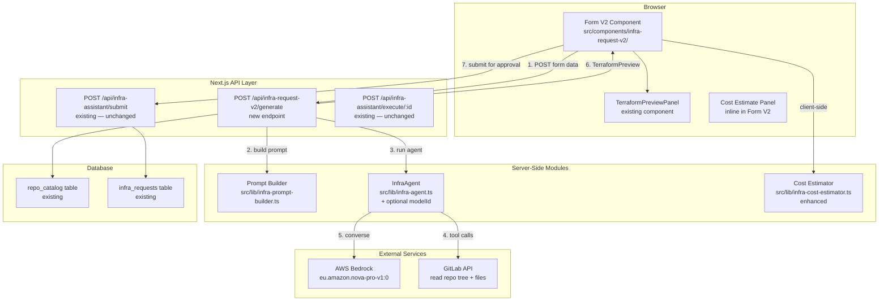
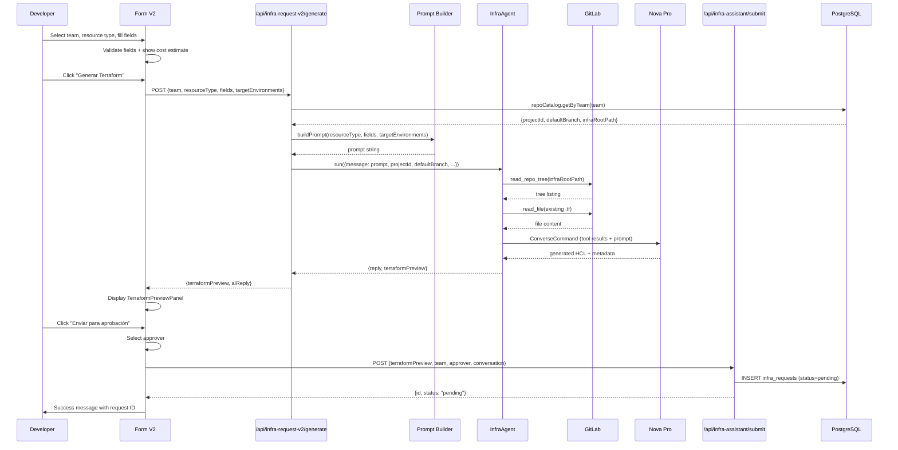

# Design Document: Infrastructure Request Form V2

## Overview

The Infrastructure Request Form V2 replaces the existing `InfraRequestForm` component and the AI chat interface (`ChatPanel`) with a single wizard-style form at `/create-infra`. Instead of free-text chat or rigid templates, developers select a team, pick a resource type (RDS, S3, or IAM Role), fill in resource-specific fields with validation and defaults, and click "Generar Terraform". The system constructs a deterministic AI prompt from the structured fields, runs the existing `InfraAgent` tool-use loop against Amazon Nova Pro (`eu.amazon.nova-pro-v1:0`), and returns a `TerraformPreview` displayed via the existing `TerraformPreviewPanel`.

The design is additive on the backend — the existing Submit API, Execute API, approval flow, notifications, and `infra_requests` table are reused unchanged. The key new pieces are:

1. **Prompt Builder** (`src/lib/infra-prompt-builder.ts`) — deterministic prompt construction from form fields
2. **Generate API** (`POST /api/infra-request-v2/generate`) — accepts form data, builds prompt, runs InfraAgent with Nova Pro
3. **Form V2 component** (`src/components/infra-request-v2/`) — wizard-style form with resource-specific field panels
4. **InfraAgent modification** — accept an optional `modelId` parameter to override the env-based default
5. **Cost Estimator enhancement** — extend `estimateInfraCost` to accept the new granular RDS fields (instance class, storage GB, Multi-AZ)

---

## Architecture



### Data Flow Sequence



---

## Components and Interfaces

### 1. Prompt Builder (`src/lib/infra-prompt-builder.ts`)

Deterministic module that constructs the AI prompt from structured form fields. No free-text user input is ever included.

```typescript
// ── Types ────────────────────────────────────────────────────────────────────

interface RdsFields {
  identifier: string
  dbName: string
  instanceClass: string       // "db.t4g.micro" | "db.t4g.small" | "db.t4g.medium" | "db.t4g.large"
  storageGb: number           // 20–1000
  multiAz: boolean
}

interface S3Fields {
  bucketName: string
  versioning: boolean
  encryptionType: "AES-256" | "aws:kms"
  lifecycleRules?: string     // optional free-form lifecycle config
}

interface IamRoleFields {
  roleName: string
  servicePrincipal: string
  policyType: "irsa" | "standard"
  namespace?: string          // required when policyType === "irsa"
  permissions: string[]       // subset of ["s3", "secrets_manager", "sqs", "sns", "eventbridge", "rds"]
}

type ResourceFields = RdsFields | S3Fields | IamRoleFields

interface BuildPromptInput {
  resourceType: "rds" | "s3" | "iam_role"
  fields: ResourceFields
  targetEnvironments: string[]
}

// ── Public API ───────────────────────────────────────────────────────────────

function buildPrompt(input: BuildPromptInput): string
```

Each resource type has a prompt template that includes:
- The resource type and all field values
- Target environments list
- Instruction to read the team's repo tree and existing `.tf` files first
- Instruction to use the `count = contains(var.target_environments, var.environment) ? 1 : 0` pattern
- Instruction to follow existing naming conventions and module versions

**RDS prompt template** (example output):
```
Genera un archivo Terraform para una instancia RDS PostgreSQL con los siguientes parámetros:
- Identificador: payments-db
- Nombre de base de datos: payments
- Clase de instancia: db.t4g.medium
- Almacenamiento: 50 GB
- Multi-AZ: sí
- Entornos destino: dev, prod

INSTRUCCIONES:
1. Primero lee el árbol del repositorio del equipo para entender la estructura.
2. Lee al menos un archivo .tf existente en el directorio de bases de datos para copiar convenciones.
3. Lee el README del rds-module para entender los inputs requeridos.
4. Usa el patrón: count = contains(var.target_environments, var.environment) ? 1 : 0
5. Sigue exactamente las convenciones de nombres, versiones de módulos y referencias a variables que observes.
```

### 2. Generate API (`POST /api/infra-request-v2/generate`)

New API route at `src/app/api/infra-request-v2/generate/route.ts`.

```typescript
// Request body
interface GenerateRequest {
  team: string
  resourceType: "rds" | "s3" | "iam_role"
  fields: ResourceFields
  targetEnvironments: string[]
}

// Response body (200)
interface GenerateResponse {
  terraformPreview: TerraformPreview | null
  aiReply: string
}

// Error responses:
// 400 — invalid resourceType
// 401 — not authenticated
// 422 — team not found in repo_catalog
// 500 — agent error
```

**Behavior:**
1. `requireUserAuth(request)` — enforce authentication
2. Validate `resourceType` ∈ `{"rds", "s3", "iam_role"}`, return 400 if invalid
3. `repoCatalog.getByTeam(team)` — return 422 if not found
4. `buildPrompt({resourceType, fields, targetEnvironments})` — construct prompt
5. Create `InfraAgent` with `projectId`, `defaultBranch`, and `modelId: "eu.amazon.nova-pro-v1:0"`
6. Call `agent.run()` with the constructed prompt, empty history, and `inferenceConfig: { temperature: 0.2, maxTokens: 32000 }`
7. Return `{ terraformPreview, aiReply: result.reply }`

### 3. InfraAgent Modification

The existing `InfraAgent` class needs a small change: accept an optional `modelId` and optional `inferenceConfig` overrides in the constructor or run options.

```typescript
// Modified constructor
interface InfraAgentOptions {
  projectId: number
  defaultBranch: string
  modelId?: string              // overrides env-based default
  temperature?: number          // overrides default 0.3
  maxTokens?: number            // overrides default 32000
}

class InfraAgent {
  constructor(opts: InfraAgentOptions)
  // ... existing methods unchanged
}
```

The `resolveModelId()` private method changes to:
```typescript
private resolveModelId(): string {
  return (
    this.modelId ||                              // constructor override (highest priority)
    process.env.AWS_BEDROCK_MODEL_ID?.trim() ||
    process.env.BEDROCK_MODEL_ID?.trim() ||
    'anthropic.claude-3-5-sonnet-20241022-v2:0'
  )
}
```

This is backward-compatible — existing callers that don't pass `modelId` continue using the env variable.

### 4. Form V2 Component (`src/components/infra-request-v2/`)

Component structure:
```
src/components/infra-request-v2/
├── infra-request-form-v2.tsx    # Main wizard form
├── rds-fields.tsx               # RDS-specific field panel
├── s3-fields.tsx                # S3-specific field panel
├── iam-role-fields.tsx          # IAM Role-specific field panel
└── cost-estimate-panel.tsx      # Cost display panel
```

**Main form interface:**
```typescript
// infra-request-form-v2.tsx
interface InfraRequestFormV2Props {}

// Internal state machine:
// "form" → "generating" → "preview" → "submitting" → "success"
type FormStep = "form" | "generating" | "preview" | "submitting" | "success"
```

**Form state (Zod schema):**
```typescript
const formSchema = z.object({
  team: z.string().min(1),
  resourceType: z.enum(["rds", "s3", "iam_role"]),
  // RDS fields
  rdsIdentifier: z.string().optional(),
  rdsDbName: z.string().optional(),
  rdsInstanceClass: z.string().optional(),
  rdsStorageGb: z.number().optional(),
  rdsMultiAz: z.boolean().optional(),
  // S3 fields
  s3BucketName: z.string().optional(),
  s3Versioning: z.boolean().optional(),
  s3EncryptionType: z.string().optional(),
  s3LifecycleRules: z.string().optional(),
  // IAM Role fields
  iamRoleName: z.string().optional(),
  iamServicePrincipal: z.string().optional(),
  iamPolicyType: z.enum(["irsa", "standard"]).optional(),
  iamNamespace: z.string().optional(),
  iamPermissions: z.array(z.string()).optional(),
  // Common
  targetEnvironments: z.array(z.string()).min(1),
}).superRefine(/* resource-type-specific validation */)
```

**Validation rules (per requirements):**
- RDS identifier: `/^[a-z][a-z0-9-]{2,62}$/`
- RDS db name: `/^[a-z][a-z0-9_]{0,62}$/`
- S3 bucket name: `/^[a-z0-9][a-z0-9.-]{1,61}[a-z0-9]$/`
- IAM role name: `/^[a-zA-Z][a-zA-Z0-9_-]{2,63}$/`
- IAM namespace: `/^[a-z][a-z0-9-]{0,62}$/`

### 5. Cost Estimator Enhancement (`src/lib/infra-cost-estimator.ts`)

The existing `estimateInfraCost` function uses `size: "small" | "medium" | "large"`. The V2 form uses explicit instance classes and storage sizes. We add a new function:

```typescript
interface RdsCostParams {
  instanceClass: string   // "db.t4g.micro" | "db.t4g.small" | "db.t4g.medium" | "db.t4g.large"
  storageGb: number
  multiAz: boolean
  targetEnvironments: string[]
}

function estimateRdsCostV2(params: RdsCostParams): CostEstimate

// The existing estimateInfraCost remains for backward compatibility
```

### 6. Page Replacement (`src/app/create-infra/page.tsx`)

The page component is updated to import `InfraRequestFormV2` instead of `InfraRequestForm`. Layout stays consistent: back button, title, card wrapper.

---

## Data Models

### Generate API Request/Response

```typescript
// POST /api/infra-request-v2/generate — request body
interface GenerateRequest {
  team: string                              // e.g. "Digital"
  resourceType: "rds" | "s3" | "iam_role"
  fields: RdsFields | S3Fields | IamRoleFields
  targetEnvironments: string[]              // e.g. ["dev", "prod"]
}

// POST /api/infra-request-v2/generate — response body (200)
interface GenerateResponse {
  terraformPreview: TerraformPreview | null  // null if agent needs more info
  aiReply: string                            // agent's text response
}
```

### TerraformPreview (existing, unchanged)

```typescript
interface TerraformPreview {
  filePath: string
  content: string
  resourceType: string
  resourceName: string
  targetEnvironments: string[]
  estimatedCostMonthly: number | null
}
```

### Resource Field Types

```typescript
interface RdsFields {
  identifier: string
  dbName: string
  instanceClass: "db.t4g.micro" | "db.t4g.small" | "db.t4g.medium" | "db.t4g.large"
  storageGb: number
  multiAz: boolean
}

interface S3Fields {
  bucketName: string
  versioning: boolean
  encryptionType: "AES-256" | "aws:kms"
  lifecycleRules?: string
}

interface IamRoleFields {
  roleName: string
  servicePrincipal: string
  policyType: "irsa" | "standard"
  namespace?: string
  permissions: ("s3" | "secrets_manager" | "sqs" | "sns" | "eventbridge" | "rds")[]
}
```

### Submit API Payload (reusing existing)

The Form V2 calls the existing Submit API with the same shape. The `conversation` array is constructed client-side from the prompt and AI reply:

```typescript
// Constructed by Form V2 before calling Submit API
const conversation: ConversationMessage[] = [
  { role: "user", content: constructedPrompt, timestamp: new Date().toISOString() },
  { role: "assistant", content: aiReply, timestamp: new Date().toISOString() },
]
```

### Database — No Schema Changes

The existing `infra_requests` table and `repo_catalog` table are used as-is. No migrations needed.


---

## Correctness Properties

*A property is a characteristic or behavior that should hold true across all valid executions of a system — essentially, a formal statement about what the system should do. Properties serve as the bridge between human-readable specifications and machine-verifiable correctness guarantees.*

### Property 1: Field validation accepts valid inputs and rejects invalid inputs

*For any* resource field name (RDS identifier, RDS db name, S3 bucket name, IAM role name, IAM namespace) and *for any* input string, the validation function SHALL accept the string if and only if it matches the field's specified regex pattern (`^[a-z][a-z0-9-]{2,62}$` for RDS identifier, `^[a-z][a-z0-9_]{0,62}$` for RDS db name, `^[a-z0-9][a-z0-9.-]{1,61}[a-z0-9]$` for S3 bucket name, `^[a-zA-Z][a-zA-Z0-9_-]{2,63}$` for IAM role name, `^[a-z][a-z0-9-]{0,62}$` for IAM namespace).

**Validates: Requirements 2.4, 2.5, 3.2, 4.2, 4.5**

### Property 2: Prompt Builder includes all field values for any resource type

*For any* valid resource type and *for any* valid set of resource-specific fields, the prompt returned by `buildPrompt()` SHALL contain every field value from the input (identifier, db name, instance class, storage size, Multi-AZ for RDS; bucket name, versioning, encryption type for S3; role name, service principal, policy type, namespace, each selected permission for IAM Role) and all target environment names.

**Validates: Requirements 6.2, 6.3, 11.2, 11.3, 11.4**

### Property 3: Prompt Builder includes required instructions in every prompt

*For any* valid input to `buildPrompt()`, the returned prompt string SHALL contain an instruction to read the team's repo structure and existing `.tf` files, AND SHALL contain the string `count = contains(var.target_environments, var.environment) ? 1 : 0`.

**Validates: Requirements 11.5, 11.6**

### Property 4: Parsed TerraformPreview has all required fields populated

*For any* valid `<terraform_preview>` XML block containing HCL content and a JSON metadata block with `file_path`, `resource_type`, `resource_name`, and `target_environments`, the `parseTerraformPreview()` function SHALL return a `TerraformPreview` object with non-empty `filePath`, `content`, `resourceType`, `resourceName`, and a non-empty `targetEnvironments` array.

**Validates: Requirements 6.5**

### Property 5: Generate API rejects unknown teams with HTTP 422

*For any* team name that does not exist in the `repo_catalog` table, the Generate API SHALL return HTTP 422 with an error message.

**Validates: Requirements 10.2**

### Property 6: Generate API rejects invalid resource types with HTTP 400

*For any* `resourceType` string that is not one of `"rds"`, `"s3"`, or `"iam_role"`, the Generate API SHALL return HTTP 400 with an error message.

**Validates: Requirements 10.3**

---

## Error Handling

### Form Validation Errors

- All field validations run on blur and on submit
- Inline error messages appear below each invalid field in Spanish
- The "Generar Terraform" button remains disabled until all required fields pass validation
- When resource type changes, all resource-specific fields reset to defaults (no stale validation errors)

### Generate API Errors

| Scenario | HTTP Status | User-Facing Behavior |
|----------|-------------|---------------------|
| Not authenticated | 401 | Redirect to login |
| Invalid resource type | 400 | Dismissible alert with error message |
| Team not in repo_catalog | 422 | Dismissible alert: "Equipo no encontrado en el catálogo" |
| InfraAgent tool failure (e.g. GitLab 404) | 200 (with `terraformPreview: null`) | Agent reply explains the issue; user can retry |
| InfraAgent unrecoverable error | 500 | Dismissible alert: "Error generando Terraform. Inténtalo de nuevo." |
| Bedrock throttling / timeout | 500 | Same as above |

### Submit API Errors

The existing Submit API error handling is reused unchanged. On error, the Form V2 displays a dismissible alert with the error message and keeps the preview visible so the user can retry.

### Agent Tool Failures

If `read_repo_tree` or `read_file` returns an error (e.g. 404, token expired), the agent receives the error as the tool result and continues the conversation. The agent is instructed to tell the user it could not read the repo. The Generate API returns `terraformPreview: null` with the agent's reply text, and the Form V2 displays the reply as an informational message.

---

## Testing Strategy

### Unit Tests

- **Prompt Builder**: Test each resource type template with specific field values. Verify prompt contains all values and required instructions.
- **Field Validators**: Test each validation regex with valid and invalid inputs (boundary cases: min length, max length, invalid characters).
- **Cost Estimator V2**: Test `estimateRdsCostV2` with various instance class / storage / Multi-AZ / environment combinations.
- **Generate API route**: Mock `repoCatalog.getByTeam`, `InfraAgent.run`, and `requireUserAuth`. Test 200, 400, 401, 422, 500 paths.
- **Form V2 component**: Render tests for each resource type, field defaults, validation messages, loading/error/success states.

### Property-Based Tests (fast-check)

Property-based testing is appropriate for this feature because the Prompt Builder and field validators are pure functions with clear input/output behavior and large input spaces.

- **Library**: `fast-check` (already available in the project ecosystem)
- **Minimum iterations**: 100 per property
- **Tag format**: `Feature: infra-request-form-v2, Property {N}: {title}`

Each correctness property from the design document maps to a single property-based test:

1. **Property 1** → Generate random strings for each field type, verify validation function matches regex
2. **Property 2** → Generate random valid field objects for each resource type, verify prompt contains all values
3. **Property 3** → Generate random valid inputs, verify prompt contains required instruction strings
4. **Property 4** → Generate random valid terraform_preview XML blocks, verify parsed output has all required fields
5. **Property 5** → Generate random team names (not in catalog), verify 422 response
6. **Property 6** → Generate random strings (not in valid set), verify 400 response

### Integration Tests

- **Generate flow**: POST to `/api/infra-request-v2/generate` with mocked Bedrock → verify response shape
- **Submit flow**: Generate → Submit → verify `infra_requests` row created with correct data
- **End-to-end**: Form V2 → Generate → Preview → Submit → verify full flow with mocked APIs
