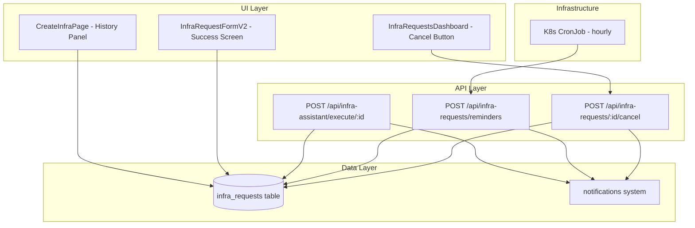

# Design Document: Infra Request Improvements

## Overview

This design covers six targeted improvements to the existing infrastructure request workflow in the Platform Portal. These are incremental enhancements to an already-working system — not a new architecture. The changes span UI (success screen, cancel button, history panel), backend (cancel endpoint, reminder job, validation, idempotency), and deployment (K8s CronJob).

**Key design decisions:**
- Reuse existing patterns (notifications, API auth, i18n, dashboard components)
- Minimal DB schema changes (one new column: `reminder_sent_at`)
- New status value `cancelled` added to the existing status enum
- Terraform validation uses regex-based HCL syntax checking (no external binary dependency)
- Reminder runs as an internal API route triggered by a K8s CronJob (same pattern as `snapshot-all-cronjob.yaml`)

## Architecture



## Components and Interfaces

### 1. Enhanced Success Screen

**File:** `src/components/infra-request-v2/infra-request-form-v2.tsx`

Modify the existing success state in `InfraRequestFormV2` to show:
- A summary card with: resource type, resource name, team, approver name, estimated cost
- A horizontal timeline component showing: Pendiente → Aprobación → Ejecución → MR Creado
- The "Pendiente" stage highlighted as active
- Existing action buttons preserved below

The form already has access to all needed data (`resourceType`, `team`, `approver`, `fieldState`) at the point where `step === "success"`. We pass these to the success view.

**New sub-component:** `src/components/infra-request-v2/success-timeline.tsx`
```typescript
interface SuccessTimelineProps {
  activeStage: 'pending' | 'approved' | 'executed' | 'mr_created'
}
```

### 2. Cancellation Flow

**New API route:** `src/app/api/infra-requests/[id]/cancel/route.ts`

```typescript
// POST /api/infra-requests/[id]/cancel
// Auth: requireUserAuth
// Logic:
//   1. Load request by ID
//   2. Verify request.requestor_email matches session user (403 if not)
//   3. Verify request.status === 'pending' (409 if not)
//   4. UPDATE status = 'cancelled'
//   5. Notify assigned approver via createNotification
//   6. Return 200
```

**Dashboard modification:** `src/components/infra-requests/infra-requests-dashboard.tsx`
- Add a "Cancelar" button for requests where `status === 'pending'` AND `requestor_email` matches current user
- Show a confirmation dialog (using existing UI patterns) before calling the endpoint
- Refresh the list after successful cancellation

### 3. 24-Hour Reminder

**New API route:** `src/app/api/infra-requests/reminders/route.ts`

```typescript
// POST /api/infra-requests/reminders
// Auth: requireInternalAuth (x-internal-secret header)
// Logic:
//   1. Query: SELECT * FROM infra_requests
//             WHERE status = 'pending'
//             AND created_at < NOW() - INTERVAL '24 hours'
//             AND reminder_sent_at IS NULL
//   2. For each result, send notification to approver (from payload or getNotifyList)
//   3. UPDATE reminder_sent_at = NOW() for processed rows
//   4. Return { reminded: count }
```

**New K8s CronJob:** `ops/k8s/infra-reminder-cronjob.yaml`
- Schedule: `0 * * * *` (every hour)
- Uses `curlimages/curl:latest` to POST to the internal API
- Same pattern as `ops/k8s/snapshot-all-cronjob.yaml`

**DB migration:** Add `reminder_sent_at TIMESTAMPTZ` column to `infra_requests`

### 4. Request History on Create Page

**File:** `src/app/create-infra/page.tsx`

Fetch the user's 5 most recent requests server-side using the existing DB query pattern (filter by `requestor_email`, `ORDER BY created_at DESC LIMIT 5`).

**New sub-component:** `src/components/infra-request-v2/recent-requests.tsx`
```typescript
interface RecentRequest {
  id: number
  resource_type: string
  team: string
  status: string
  created_at: string
}

interface RecentRequestsProps {
  requests: RecentRequest[]
}
```

Renders a compact list below the form card. Each item shows resource type icon, team, status badge, and relative time. Clicking navigates to `/infra-requests`.

If `requests.length === 0`, the component returns `null` (no section rendered).

### 5. Terraform Validation

**File:** `src/app/api/infra-assistant/execute/[id]/route.ts`

Add a validation step between loading the request and creating the branch:

```typescript
// New helper: src/lib/terraform-validator.ts
export function validateHclSyntax(content: string): { valid: boolean; error?: string }
```

The validator performs lightweight regex-based checks:
- Balanced braces `{}` 
- Valid block structure (`resource "type" "name" {`, `variable "name" {`, etc.)
- No obviously malformed lines (unclosed strings, invalid characters in identifiers)

This is NOT a full Terraform parser — it catches the most common AI generation errors (missing closing braces, malformed resource blocks) without requiring `terraform` binary in the container.

**Integration point:** Insert validation after `const content = preview?.content || ""` and before branch creation. If validation fails:
1. Set status to `execute_failed`
2. Notify requestor with error details
3. Return early (no branch, no commit, no MR)

### 6. Idempotent Execution

**File:** `src/app/api/infra-assistant/execute/[id]/route.ts`

Replace the current `executed_at !== null` check with a comprehensive status-based guard:

```typescript
// Current (incomplete):
if (row.executed_at !== null) { ... }

// New (covers both terminal states):
if (row.status === 'executed') {
  return NextResponse.json({ ok: true, message: "Already executed" }, { status: 200 });
}
if (row.status === 'execute_failed') {
  return NextResponse.json({ ok: true, message: "Previously failed", status: row.status }, { status: 200 });
}
if (row.status !== 'approved') {
  return NextResponse.json({ error: `Status is '${row.status}', must be 'approved'` }, { status: 403 });
}
```

This guard runs before any external operations (branch creation, file commits, MR creation).

## Data Models

### DB Schema Changes

**Migration:** `migrations/2026-XX-XX_infra_request_improvements.sql`

```sql
-- Add reminder tracking column
ALTER TABLE infra_requests ADD COLUMN IF NOT EXISTS reminder_sent_at TIMESTAMPTZ;

-- Add index for reminder query performance
CREATE INDEX IF NOT EXISTS idx_infra_requests_pending_reminder
  ON infra_requests (status, created_at)
  WHERE status = 'pending' AND reminder_sent_at IS NULL;
```

### Status Values

The `status` column now supports these values:
- `pending` — awaiting approval
- `approved` — approved, awaiting execution
- `rejected` — rejected by approver
- `cancelled` — cancelled by requestor (NEW)
- `executed` — successfully executed (branch + MR created)
- `execute_failed` — execution failed (validation error, GitLab error, etc.)

### Notification Types Used

| Event | Type | Recipient |
|-------|------|-----------|
| Request cancelled | `info` | Assigned approver |
| 24h reminder | `approval_request` | Assigned approver(s) |
| Terraform validation failed | `system` | Requestor |

## Correctness Properties

*A property is a characteristic or behavior that should hold true across all valid executions of a system — essentially, a formal statement about what the system should do. Properties serve as the bridge between human-readable specifications and machine-verifiable correctness guarantees.*

### Property 1: Cancellation authorization guard

*For any* user and any infra request, the cancellation endpoint succeeds (updating status to "cancelled") if and only if the authenticated user's email matches the request's `requestor_email` AND the request's current status is "pending". All other combinations must be rejected (403 for wrong user, 409 for wrong status).

**Validates: Requirements 2.4, 2.5, 2.6, 2.7, 2.8**

### Property 2: Cancellation triggers approver notification

*For any* successful cancellation, the system creates exactly one notification addressed to the assigned approver informing them the request was cancelled.

**Validates: Requirements 2.9**

### Property 3: Reminder targets exactly stale pending requests

*For any* set of infra requests in the database, the reminder job sends notifications only to approvers of requests where: status is "pending" AND `created_at` is older than 24 hours AND `reminder_sent_at` is NULL. After execution, those requests have `reminder_sent_at` set, preventing duplicate reminders on subsequent runs.

**Validates: Requirements 3.2, 3.3, 3.4**

### Property 4: Terraform validation gates execution

*For any* Terraform content string, if the HCL syntax validation fails, then no GitLab branch is created, no file is committed, no MR is created, the request status is set to "execute_failed", and the requestor is notified. If validation passes, execution proceeds normally.

**Validates: Requirements 5.1, 5.3, 5.4, 5.5, 5.6**

### Property 5: Idempotent execution for terminal statuses

*For any* infra request with status "executed" or "execute_failed", calling the execute handler returns HTTP 200 and performs zero side effects (no branch creation, no file operations, no MR creation, no Jira issue, no Teams webhook, no DB updates, no notifications).

**Validates: Requirements 6.1, 6.2, 6.3, 6.4**

### Property 6: Request history bounded and ordered

*For any* user with N infra requests (N ≥ 0), the create page history section displays min(N, 5) requests ordered by `created_at` descending, each showing resource_type, team, status, and created_at. When N = 0, the history section is not rendered.

**Validates: Requirements 4.1, 4.2, 4.4**

## Error Handling

| Scenario | Handling |
|----------|----------|
| Cancel endpoint: request not found | Return 404 |
| Cancel endpoint: user not owner | Return 403 with message |
| Cancel endpoint: status not pending | Return 409 with current status |
| Cancel endpoint: DB error | Return 500, log error |
| Reminder: DB connection error | Log error, return 500 (CronJob will retry on next hour) |
| Reminder: notification send failure | Log error per request, continue processing remaining |
| Terraform validation: empty content | Treat as invalid, fail with descriptive message |
| Execute handler: already executed/failed | Return 200 (idempotent, no error) |
| History fetch: DB error | Log error, render page without history section |

## Testing Strategy

### Property-Based Tests

**Library:** [fast-check](https://github.com/dubzzz/fast-check) (already standard for TypeScript PBT)

Each correctness property maps to a property-based test with minimum 100 iterations:

1. **Cancellation guard** — Generate random (user, request) pairs with varying statuses and emails. Assert cancellation logic returns correct HTTP status.
2. **Cancellation notification** — Generate valid cancellation scenarios. Assert notification is created for the approver.
3. **Reminder targeting** — Generate random sets of requests with varying ages, statuses, and reminder flags. Assert the query returns exactly the correct subset.
4. **Terraform validation gate** — Generate random strings (valid HCL, invalid HCL, edge cases). Assert the handler's behavior matches the property.
5. **Idempotent execution** — Generate requests with terminal statuses. Assert no side effects occur.
6. **History bounded and ordered** — Generate random request lists of varying lengths. Assert the output is bounded to 5 and sorted.

**Tag format:** `Feature: infra-request-improvements, Property {N}: {title}`

### Unit Tests (Example-Based)

- Success screen renders all summary fields
- Success screen timeline shows correct stages
- Cancel confirmation dialog appears on button click
- History section not rendered when empty
- Terraform validator catches specific known-bad patterns (unclosed braces, missing quotes)
- Terraform validator passes known-good HCL

### Integration Tests

- Cancel endpoint end-to-end with real DB
- Reminder endpoint end-to-end with real DB
- Execute handler with mocked GitLab client (validation + idempotency paths)

### i18n

New keys needed in all 4 locale files (es, en, fr, pt):
- `infra.status.cancelled`
- `infra.requests.cancel`
- `infra.requests.cancelConfirm`
- `infra.requests.cancelSuccess`
- `infra.requests.history`
- `infra.success.summary`
- `infra.success.timeline.*` (stage labels)
