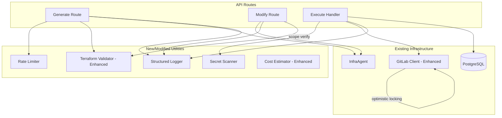

# Design Document: Infrastructure Request Robustness

## Overview

This design hardens the existing infra-request-v2 system by addressing reliability, security, and UX gaps. The changes span multiple modules — GitLab client, Terraform validator, cost estimator, execute handler, generate route, modify route, and a new structured logger — without altering the overall architecture or user-facing flow.

Key improvements:
- **Reliability**: Optimistic locking prevents concurrent overwrites of shared files; try/finally ensures branch cleanup on failure.
- **Security**: Secret scanning blocks credential commits; rate limiting protects AI compute; field validation catches naming errors early.
- **Correctness**: Enhanced Terraform validation catches more AI generation errors; modify scope verification prevents unintended changes.
- **Observability**: Structured JSON logging with request correlation replaces ad-hoc console.log calls.
- **UX**: Improved cost estimates include backup and data transfer costs; expanded modify options reduce the need for new requests.

## Architecture

The system architecture remains unchanged. All modifications are internal to existing modules or introduce new utility modules consumed by the same API routes.



## Components and Interfaces

### 1. Structured Logger (`src/lib/logger.ts`)

A lightweight JSON logger that outputs single-line JSON objects to stdout.

```typescript
interface LogEntry {
  timestamp: string       // ISO 8601
  level: 'info' | 'warn' | 'error'
  requestId: string       // UUID v4, generated per request
  userId: string          // authenticated user email
  action: string          // e.g. "execute.branch_created"
  message: string
  duration?: number       // milliseconds
  metadata?: Record<string, unknown>
}

class InfraLogger {
  constructor(action: string, userId: string)
  info(message: string, metadata?: Record<string, unknown>): void
  warn(message: string, metadata?: Record<string, unknown>): void
  error(message: string, metadata?: Record<string, unknown>): void
  done(message: string, metadata?: Record<string, unknown>): void  // includes duration
}
```

**Design decision**: No external logging library. The logger writes to stdout as single-line JSON, which is the standard for Kubernetes-based observability stacks (Fluentd/Fluent Bit picks up stdout JSON automatically).

### 2. Rate Limiter (`src/lib/rate-limiter.ts`)

In-memory sliding window rate limiter.

```typescript
interface RateLimiterConfig {
  maxRequests: number     // default: 10
  windowMs: number        // default: 3600000 (1 hour)
}

class RateLimiter {
  constructor(config?: Partial<RateLimiterConfig>)
  check(key: string): { allowed: boolean; remaining: number; retryAfterSeconds?: number }
  reset(key: string): void
}
```

**Design decision**: In-memory Map with timestamp arrays per key. Entries are lazily cleaned on access (filter out timestamps older than windowMs). No Redis needed — the system runs as a single pod, and losing state on restart is acceptable per requirements.

### 3. Secret Scanner (`src/lib/secret-scanner.ts`)

Regex-based scanner for common credential patterns.

```typescript
interface ScanResult {
  clean: boolean
  findings: Array<{
    patternType: string   // e.g. "aws_access_key", "aws_secret_key", "password", "bearer_token"
    line: number
  }>
}

function scanForSecrets(content: string): ScanResult
```

Patterns:
- AWS Access Key ID: `AKIA[0-9A-Z]{16}`
- AWS Secret Key: 40-char base64 string after `=` or `:`
- Password assignments: `password\s*=\s*"[^"]+"`  (excluding `var.` and `random_password` references)
- Bearer tokens: `Bearer\s+[A-Za-z0-9\-._~+/]+=*`

**Design decision**: The scanner intentionally excludes Terraform variable references (`var.password`, `random_password.xxx.result`) to avoid false positives on legitimate patterns.

### 4. Enhanced Terraform Validator (`src/lib/terraform-validator.ts`)

Extends the existing validator with additional checks:

```typescript
// New validation functions added to existing module
function validateVariableReferences(content: string): ValidationResult
function validateResourceNames(content: string): ValidationResult
function validateCountExpressions(content: string): ValidationResult

// Enhanced main function
function validateHclSyntax(content: string): { valid: boolean; errors: ValidationError[] }

interface ValidationError {
  line: number
  message: string
  rule: string  // e.g. "invalid_var_reference", "invalid_resource_name", "invalid_count_expression"
}
```

### 5. Modify Scope Verifier (within `src/app/api/infra-request-v2/modify/route.ts`)

Inline logic that compares resource blocks between original and modified content.

```typescript
function extractResourceBlocks(content: string): Map<string, string>
// Returns map of "resource_type.resource_name" -> block content

function verifyModifyScope(
  original: string,
  modified: string,
  targetResource: string
): { valid: boolean; unexpectedChanges: string[] }
```

**Design decision**: "Related resources" are identified by name prefix matching (e.g., target `my_db` allows changes to `my_db_subnet_group`, `my_db_security_group`, `my_db_policy_attachment`). This matches the naming convention used in the existing repo.

### 6. Enhanced GitLab Client (`src/lib/gitlab.ts`)

New method for optimistic locking:

```typescript
interface FileWithMeta {
  content: string
  lastCommitId: string
}

// New method
async getRepositoryFileWithMeta(
  projectId: number, filePath: string, ref: string
): Promise<FileWithMeta | null>

// Enhanced updateFile signature
async updateFile(
  projectId: number, filePath: string, branch: string,
  content: string, commitMessage: string,
  lastCommitId?: string  // optional for backward compatibility
): Promise<{ file_path: string; branch: string }>
```

**Design decision**: Uses GitLab's `/repository/files/:path` endpoint (non-raw) which returns `last_commit_id` in the response. The `updateFile` method conditionally includes `last_commit_id` in the PUT body when provided.

### 7. Enhanced Cost Estimator (`src/lib/infra-cost-estimator.ts`)

Updates to `estimateRdsCostV2` and `estimateS3Cost`:

- RDS: Add `backupStorageCost` = 30% of instance monthly cost as separate line item
- RDS: Add data transfer warning with $0.09/GB egress price
- S3: Change `monthlyCost` from 0 to a range indicator ($1-5) for typical usage

### 8. Field Validators (within `src/app/api/infra-request-v2/generate/route.ts`)

```typescript
function validateRdsFields(fields: Record<string, any>): string | null
function validateS3Fields(fields: Record<string, any>): string | null
function validateIamRoleFields(fields: Record<string, any>): string | null
```

Each returns `null` if valid, or a descriptive error string identifying the field and violated rule.

## Data Models

No new database tables or migrations are required. The existing `infra_requests` table already has `status` values that accommodate the new failure modes (`execute_failed`).

The only data model change is the in-memory rate limiter state:

```typescript
// Internal to RateLimiter class
private store: Map<string, number[]>  // key (email) -> array of request timestamps
```

## Correctness Properties

*A property is a characteristic or behavior that should hold true across all valid executions of a system — essentially, a formal statement about what the system should do. Properties serve as the bridge between human-readable specifications and machine-verifiable correctness guarantees.*

### Property 1: Variable reference validation

*For any* HCL content string containing `var.X` references, the Terraform validator SHALL accept the content only if every `X` matches `[a-zA-Z_][a-zA-Z0-9_]*`, and SHALL reject with a line number otherwise.

**Validates: Requirements 2.1, 2.4**

### Property 2: Resource name validation

*For any* HCL content string containing `resource "type" "name"` declarations, the Terraform validator SHALL accept the content only if every `name` matches `[a-zA-Z0-9_-]+`, and SHALL reject with a line number otherwise.

**Validates: Requirements 2.2, 2.4**

### Property 3: Count expression balanced parentheses

*For any* HCL content string containing `count = <expression>` lines, the Terraform validator SHALL reject the content if any expression has unbalanced parentheses, reporting the specific line number.

**Validates: Requirements 2.3, 2.4**

### Property 4: Resource block extraction

*For any* valid HCL content containing N resource/module blocks, the `extractResourceBlocks` function SHALL return exactly N entries with correct block names matching the pattern `type.name`.

**Validates: Requirements 3.2**

### Property 5: Scope verification rejects non-target changes

*For any* pair of original and modified HCL content where a resource block NOT matching the target resource's name prefix was added, removed, or had its body changed, the scope verifier SHALL report the change as invalid.

**Validates: Requirements 3.3**

### Property 6: RDS backup cost is 30% of instance cost

*For any* valid RDS cost estimation parameters (any instance class, any environment count, any Multi-AZ setting), the backup storage cost in the result SHALL equal exactly 30% of the base instance monthly cost.

**Validates: Requirements 5.1**

### Property 7: Data transfer warning for applicable resources

*For any* cost estimation call for resource types with data transfer potential (RDS, S3), the result SHALL include a warning string containing "$0.09/GB".

**Validates: Requirements 5.3**

### Property 8: Backup cost as separate line item

*For any* RDS cost estimation, the breakdown string SHALL contain a distinct substring identifying backup storage cost separately from compute and storage costs.

**Validates: Requirements 5.4**

### Property 9: RDS identifier validation

*For any* string used as an RDS identifier, the validator SHALL reject it if it starts with a hyphen, ends with a hyphen, or exceeds 63 characters, and SHALL accept it otherwise (given it contains only valid characters).

**Validates: Requirements 6.1**

### Property 10: S3 bucket name validation

*For any* string used as an S3 bucket name, the validator SHALL reject it if it contains "aws" or "amazon" (case-insensitive), is shorter than 3 or longer than 63 characters, or contains characters other than lowercase letters, numbers, hyphens, and periods.

**Validates: Requirements 6.2, 6.3**

### Property 11: Kubernetes namespace validation

*For any* string used as an IAM role namespace field, the validator SHALL reject it if it does not match the pattern: starts with a lowercase letter, contains only lowercase alphanumeric characters and hyphens, and is at most 63 characters long.

**Validates: Requirements 6.4**

### Property 12: Field validation error response format

*For any* invalid field value submitted to the Generate_Route validators, the returned error string SHALL contain both the field name and a description of the violated rule.

**Validates: Requirements 6.5**

### Property 13: Rate limiter enforces per-user threshold

*For any* sequence of N requests from the same user key where N > 10 within a 1-hour window, the rate limiter SHALL allow the first 10 and reject all subsequent requests, returning a positive `retryAfterSeconds` value.

**Validates: Requirements 9.1, 9.2**

### Property 14: Secret pattern detection

*For any* string containing an AWS access key ID (matching `AKIA[0-9A-Z]{16}`), an AWS secret key pattern, a hardcoded password assignment, or a bearer token, the secret scanner SHALL report `clean: false` with the correct `patternType`.

**Validates: Requirements 10.2**

### Property 15: Secret log does not leak values

*For any* detected secret in scanned content, the scanner's findings SHALL include the `patternType` and `line` number but SHALL NOT include the matched secret value itself.

**Validates: Requirements 10.4**

### Property 16: Structured log output correctness

*For any* log entry emitted by the InfraLogger, the output SHALL be a valid single-line JSON object containing `timestamp` (ISO 8601), `level`, `requestId` (valid UUID v4), `userId`, `action`, and `message` fields. When `done()` is called, the `duration` field SHALL be a non-negative number representing milliseconds since logger construction.

**Validates: Requirements 12.1, 12.5, 12.6**

## Error Handling

| Scenario | Behavior | User Impact |
|----------|----------|-------------|
| GitLab 409 on shared file update | Retry up to 3 times with fresh commit SHA | Transparent — user sees success or failure after retries |
| Secret detected in generated content | Reject with 422, mark `execute_failed`, notify user | User receives notification explaining rejection |
| Rate limit exceeded | Return 429 with `Retry-After` header | User sees "too many requests" message with wait time |
| Modify scope violation (1st attempt) | Retry AI generation with stricter prompt | Transparent |
| Modify scope violation (2nd attempt) | Return 422 with list of unexpected changes | User sees error with specific resource names |
| Branch deletion fails during rollback | Log error, continue with `execute_failed` status | User sees failure; orphaned branch may need manual cleanup |
| Terraform validation failure | Return 422 with specific error and line number | User sees validation error before any GitLab operations |
| Field validation failure | Return 400 with field name and rule | User sees immediate feedback on invalid input |

## Testing Strategy

### Property-Based Tests

The project uses TypeScript. Property-based tests will use **fast-check** as the PBT library.

- Minimum 100 iterations per property test
- Each test tagged with: `Feature: infra-robustness, Property {number}: {title}`
- Tests target pure functions: validators, scanner, rate limiter, cost estimator, resource extractor, logger

### Unit Tests (Example-Based)

- Execute handler retry logic (mock GitLab responses)
- Optimistic locking flow (mock 409 → re-read → success)
- Modify scope verification with real HCL samples
- Rate limiter expiration behavior
- Secret scanner false-positive avoidance (var.password, random_password)
- InfraAgent model ID resolution from env var

### Integration Tests

- Execute handler end-to-end with mocked GitLab/DB (verify try/finally cleanup)
- Generate route with rate limiting and field validation
- Modify route with scope verification and retry

### Test File Organization

```
src/lib/__tests__/
  terraform-validator.property.test.ts
  secret-scanner.property.test.ts
  rate-limiter.property.test.ts
  infra-cost-estimator.property.test.ts
  logger.property.test.ts
  field-validators.property.test.ts
  resource-scope-verifier.property.test.ts
```
