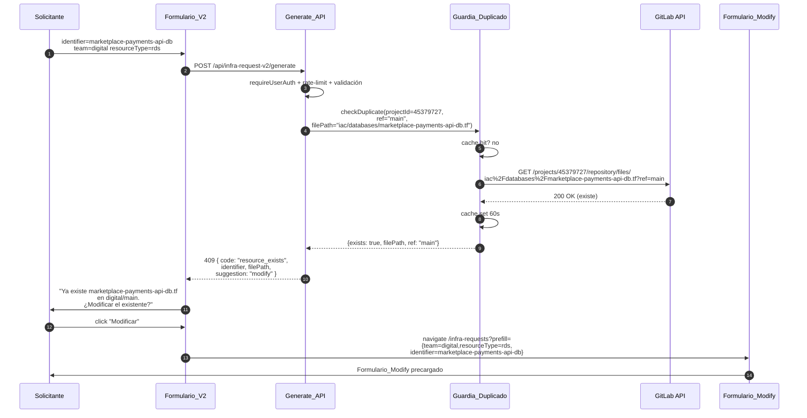
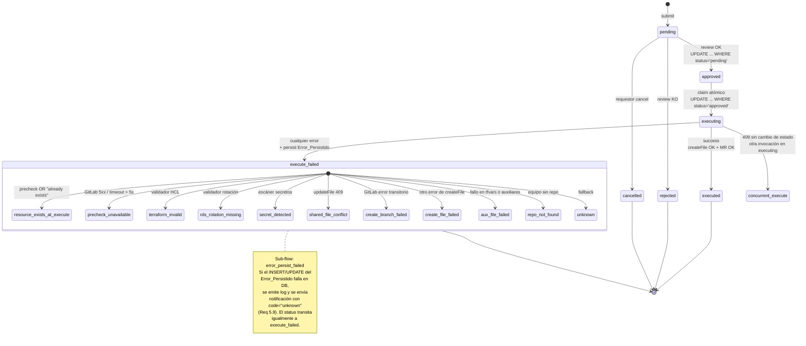

# Design Document — Infra Self-Service Hardening

> Feature: `infra-self-service-hardening`
> Workflow: requirements-first
> Baseline: `portal-prod v0.23.0-rc.1`
> Origen del incidente: request id=32 de Gonzalo, 24-jun-2026 (RDS duplicada detectada tarde en `createFile`).

## Overview

Esta feature endurece el flujo self-service de infraestructura del Platform Portal en cinco ejes verificables:

1. **Catálogo dinámico de engines RDS** — sustituir el catálogo estático `src/lib/rds/version-catalog.ts` por consultas a `rds:DescribeDBEngineVersions` con caché 24 h + fallback stale + fallthrough al estático durante la ventana de convivencia (Req 1, 10.3, 10.4).
2. **Guardia de duplicado en `generate`** — detectar colisiones de `identifier`/`bucketName`/`roleName` en la rama por defecto del Repositorio_Destino *antes* de invocar al Generador_RDS/InfraAgent, y responder HTTP 409 con enlace al Formulario_Modify (Req 2, 6.1).
3. **Salvaguarda de duplicado en `execute`** — precheck contra GitLab + clasificación determinista del error `"file already exists"` que hoy es fatal (Req 3, 6.2).
4. **Operación `targetEnvironments`** en `modify` — añadir/quitar entornos donde vive el recurso, byte-exacto en el resto del `.tf`, con warnings de destrucción (Req 4, 6.4).
5. **`Error_Persistido` + UI accionable** — columna JSONB nueva en `infra_requests`, clasificación en 10+ códigos, sugerencia determinista por código, botón "Copiar detalle" (Req 5, 6.3).

**Decisiones cerradas en esta fase de diseño** (marcadas como diferidas por el requirements):

- **Credenciales del Catalogo_Dinamico** → **IRSA directa** desde `portal-inventory-irsa`. `rds:DescribeDBEngineVersions` es global read-only y hoy todas las cuentas destino comparten el mismo pool de engines en `eu-west-1`; el AssumeRole cross-account a `n8n-cost-reader-role` añade una llamada STS y una superficie de fallo (`credentials_unavailable`) sin beneficio funcional. Reversible por variable de entorno si en el futuro necesitamos versiones por-cuenta.
- **Persistencia de `Error_Persistido`** → **columna nueva `error_message JSONB`** con índice GIN parcial sobre `error_message->>'code'`. Consultas de auditoría (top códigos, agrupación por `step`) son 10× más eficientes con columna dedicada; el `payload` ya lleva `terraformPreview`, `approver`, `targetEnvironments`, y no todos los tipos tienen la misma forma.
- **Métrica de "7 días verde" para retirar el catálogo estático** → **log estructurado `outcome=success|stale|error` en `InfraLogger` del módulo `aws-engine-catalog`**, agregado en Grafana Cloud (Loki) con `sum by (outcome) (count_over_time({module="aws-engine-catalog"}[7d]))`. Disparador manual (no cron), documentado en el steering §14.

**Ventana de convivencia y versión mínima**: la feature se activa por feature flag `ENABLE_INFRA_HARDENING_V1` (default `false`). Ninguna dependencia nueva requiere versión superior a `v0.23.0-rc.1` del portal ni chart `generic-chart` distinto de v0.7.0 (ya vivo). AWS SDK v3 `@aws-sdk/client-rds` es incremental sobre el `@aws-sdk/client-sts` que ya usamos.

---

## Architecture

### Component diagram — Flujo Generate reforzado

```mermaid
flowchart LR
    Browser[Formulario_V2<br/>navegador]
    Route[POST /api/infra-request-v2/generate<br/>route.ts]
    Auth[requireUserAuth<br/>+ rate-limiter]
    Validate[Validación payload<br/>invalid_identifier_charset<br/>unexpected_engine_field]
    SquadGate{resource_type<br/>empieza por squad-?}
    Guard[Guardia_Duplicado<br/>src/lib/infra/duplicate-guard.ts]
    GitLab[(GitLab API<br/>repo del equipo)]
    Catalog[Catalogo_Dinamico<br/>src/lib/rds/aws-engine-catalog.ts]
    AWS[(AWS RDS API<br/>DescribeDBEngineVersions)]
    RdsGen[Generador_RDS<br/>src/lib/rds/rds-generator.ts]
    Agent[InfraAgent<br/>Bedrock Sonnet 4]
    Response[TerraformPreview<br/>200 OK]

    Browser -->|POST| Route
    Route --> Auth
    Auth --> Validate
    Validate --> SquadGate
    SquadGate -->|yes| Agent
    SquadGate -->|no, rds/s3/iam_role| Guard
    Guard <-->|check + cache 60s| GitLab
    Guard -->|409 resource_exists| Browser
    Guard -->|503 duplicate_check_unavailable| Browser
    Guard -->|ok, rds| Catalog
    Guard -->|ok, s3/iam_role| Agent
    Catalog <-->|24h cache| AWS
    Catalog -->|EngineOption[]| RdsGen
    Catalog -->|CatalogError| RdsGen
    RdsGen -->|fallthrough a version-catalog.ts estático| RdsGen
    RdsGen --> Response
    Agent --> Response
```

**Reglas del gate**:
- `SquadGate` sale por `Agent` sin pasar por Guardia_Duplicado (Req 2.11): las rutas `squad-sqs`, `squad-dynamodb`, etc. tienen su propio flujo determinista en `src/lib/squad-infra/*`.
- La Guardia_Duplicado se ejecuta ANTES del Catalogo_Dinamico: no tiene sentido resolver engines de una RDS que ya existe.
- Para `s3` e `iam_role` no se invoca al Catalogo_Dinamico (Req 6.5).

### Sequence diagram — Incidente evitado (409 `resource_exists`)



### Sequence diagram — Operación `targetEnvironments`

```mermaid
sequenceDiagram
    autonumber
    participant U as Solicitante
    participant FM as Formulario_Modify
    participant ME as GET /modify/environments
    participant MW as POST /modify
    participant P as environments-parser<br/>(pure)
    participant R as render-rds<br/>upsertTfvarsEntries
    participant GL as GitLab API
    participant EX as Execute_API

    U->>FM: abre modify sobre RDS<br/>identifier=oms-events-db team=digital
    FM->>ME: GET /modify/environments?team=digital<br/>&resourceType=rds<br/>&identifier=oms-events-db
    ME->>GL: read iac/databases/oms-events-db.tf
    GL-->>ME: HCL content
    ME->>P: parseEnvironmentsExpression(hcl)
    P-->>ME: { current: ["dev"] }
    ME-->>FM: { current: ["dev"], available: ["dev","uat","prod"] }
    FM->>U: checkbox activo "dev";<br/>desmarcado "uat","prod"
    U->>FM: marca "uat" y "prod";<br/>Submit
    FM->>MW: POST /modify body={<br/>operation:"targetEnvironments",<br/>targetEnvironments:["dev","uat","prod"]}
    MW->>MW: validar (1-3 elementos únicos<br/>de {dev,uat,prod}); no-op check
    MW->>GL: read .tf actual
    MW->>P: parseEnvironmentsExpression(hcl)
    P-->>MW: { current: ["dev"] }
    MW->>P: rewriteEnvironmentsExpression(hcl,<br/>["dev","uat","prod"])
    P-->>MW: newHcl (byte-exacto salvo el<br/>literal contains([...]))
    MW->>R: upsertTfvarsEntries(<br/>{env:"uat",...},{env:"prod",...})
    R-->>MW: vars/uat.tfvars, vars/prod.tfvars nuevos
    MW-->>FM: TerraformPreview con warnings=[]<br/>(sólo warnings si se retira)
    U->>FM: aprobar (otro reviewer)
    FM->>EX: POST /execute/[id]
    EX->>GL: create branch + updateFile .tf<br/>+ upsert vars/{uat,prod}.tfvars<br/>+ createMR + createJira
    EX-->>U: notificación éxito
```

### State diagram — `infra_requests.status` con `Error_Persistido`



**Invariantes de idempotencia** (Req 3.5):
- `pending → approved` y `approved → executing` son transiciones atómicas con `UPDATE ... WHERE status=<origen>` y `rowCount === 1`.
- `executed` y `execute_failed` son terminales: prohibidas transiciones hacia `executing`.
- El `try/finally` de rollback de rama sigue vigente sin cambios.

---

## Components and Interfaces

### Módulos y responsabilidades

| Módulo | Estado | Tipo | Responsabilidad |
|--------|--------|------|-----------------|
| `src/lib/rds/aws-engine-catalog.ts` | **nuevo** | I/O + puro | `listRdsEngineOptions(engine, region)`, cache 24 h, fallback stale, error estructurado. AWS SDK v3 `@aws-sdk/client-rds`. Reusa `src/lib/cache.ts` prefijo `rds-catalog:`. |
| `src/lib/rds/version-catalog.ts` | **existente** | puro | Fallback estático durante la ventana de convivencia. Borrado planificado en Fase 6 (≥ 7 días con métrica verde, Req 10.3). |
| `src/lib/rds/rds-generator.ts` | **modificado** | puro | Pasa a consumir `aws-engine-catalog`. Fallthrough al estático (Req 10.4) cuando el dinámico devuelve `CatalogError`. Interfaces públicas intactas. |
| `src/lib/infra/duplicate-guard.ts` | **nuevo** | I/O | `checkDuplicate(projectId, ref, filePath)`. Cache 60 s por `(projectId, ref, filePath)`. Invalidación por Execute_API tras `createFile` OK. Usa `src/lib/gitlab.ts`. |
| `src/lib/infra/environments-parser.ts` | **nuevo** | puro | `parseEnvironmentsExpression(hcl)` y `rewriteEnvironmentsExpression(hcl, targetEnvironments)`. Byte-exacto en todo lo demás. Total: nunca lanza. |
| `src/lib/infra/error-classifier.ts` | **nuevo** | puro | `classifyExecuteError(err, step) → ErrorCode`. Mapping determinista. Tabla `code → suggestion` surjectiva. |
| `src/app/api/infra-request-v2/generate/route.ts` | **modificado** | route | Inserta Guardia_Duplicado antes del Generador_RDS/InfraAgent. Nuevos códigos: 409 `resource_exists`, 422 `invalid_identifier_charset`, 422 `unexpected_engine_field`, 503 `duplicate_check_unavailable`. Fallthrough `squad-*` intacto. |
| `src/app/api/infra-request-v2/modify/route.ts` | **modificado** | route | Añade operación `targetEnvironments` con validación completa del Req 4. |
| `src/app/api/infra-request-v2/modify/environments/route.ts` | **nuevo** | route | `GET ?team=&resourceType=&identifier=` para la lectura previa del criterio 4.11. |
| `src/app/api/infra-assistant/execute/[id]/route.ts` | **modificado** | route | Precheck (5 s timeout), clasificar errores GitLab, persistir Error_Persistido, invalidar cache Guardia_Duplicado tras `createFile` OK, 409 `concurrent_execute`. |
| `src/components/infra/*` | **modificado** | UI | Aviso `stale: true` en selector versión. Formulario `targetEnvironments`. Renderizado de `Error_Persistido` + botón "Copiar detalle". |
| `migrations/2026-07-06_infra_requests_error_message.sql` | **nuevo** | SQL | `ALTER TABLE ADD COLUMN IF NOT EXISTS error_message JSONB` + índice GIN parcial. |
| `PortalRdsCatalogReadOnly` policy | **nuevo** | IAM | Inline en `portal-inventory-irsa`. `rds:DescribeDBEngineVersions` `Resource: "*"`. Aplicada en TF `shared-general/iac/services/roles.tf`. |

### Interfaces TypeScript

```typescript
// src/lib/rds/aws-engine-catalog.ts

export interface EngineOption {
  version: string;               // p.ej. "15.4"
  family: string;                // literal DBParameterGroupFamily (Req 1.3)
  deprecated: boolean;           // filtro del Formulario_V2 (Req 1.4)
  defaultForEngine: boolean;
  /**
   * Presente solo cuando la respuesta se sirve como Fallback_Catalogo (Req 1.7).
   * En hit/miss frescos NO se emite (ausente en el JSON serializado al cliente).
   */
  stale?: true;
  /** Solo cuando stale=true. Timestamp ISO 8601 UTC del cache original. */
  staleSince?: string;
}

export type CatalogErrorCode =
  | "catalog_unavailable"      // AWS falla y no hay cache previa (Req 1.8)
  | "engine_not_supported"     // engine fuera de la whitelist (Req 1.11)
  | "credentials_unavailable"; // IRSA/STS falla (Req 8.6)

export interface CatalogError {
  code: CatalogErrorCode;
  engine?: string;
  region?: string;
}

export type CatalogResult =
  | { ok: true; options: EngineOption[] }
  | { ok: false; error: CatalogError };

export async function listRdsEngineOptions(
  engine: string,
  region: string
): Promise<CatalogResult>;

/**
 * TTL 24h (86_400_000 ms) por (engine, region). Prefijo cache-key: "rds-catalog:".
 * Timeout de la llamada AWS: 8_000 ms (Req 1.7).
 */
export const CATALOG_TTL_MS = 86_400_000;
export const AWS_CALL_TIMEOUT_MS = 8_000;
export const ENABLED_ENGINES: ReadonlyArray<string> = ["postgres"] as const; // extensible sin cambio de lógica
```

```typescript
// src/lib/infra/duplicate-guard.ts

export interface DuplicateCheckResult {
  exists: boolean;
  filePath?: string;
  ref: string;
  /**
   * Sólo poblado cuando la comprobación falló por causa transitoria (Req 2.7).
   * En ese caso exists es siempre false y el llamador decide qué hacer.
   */
  unavailable?: { reason: string };
}

export async function checkDuplicate(
  projectId: number,
  ref: string,
  filePath: string
): Promise<DuplicateCheckResult>;

/**
 * Invalidación explícita del cache tras un createFile exitoso (Req 2.10).
 * Devuelve true si había una entrada en cache, false si no.
 */
export function invalidateDuplicateCache(
  projectId: number,
  ref: string,
  filePath: string
): boolean;

export const DUPLICATE_CACHE_TTL_MS = 60_000;      // Req 2.6
export const DUPLICATE_CHECK_TIMEOUT_MS = 5_000;   // Req 2.7, 9.4
export const IDENTIFIER_PATTERN = /^[a-z0-9][a-z0-9-]{0,62}$/; // Req 2.8
```

```typescript
// src/lib/infra/environments-parser.ts

export type Env = "dev" | "uat" | "prod";

export type ParseResult =
  | { ok: true; current: Env[] }
  | { ok: false; error: "not_parseable" };

/**
 * Total. Nunca lanza. Devuelve `error: "not_parseable"` cuando no encuentra
 * el literal canónico `contains([...], var.environment)` ni un equivalente
 * documentado en la spec.
 */
export function parseEnvironmentsExpression(hcl: string): ParseResult;

/**
 * Sustituye ÚNICAMENTE el array literal dentro de `contains([...], var.environment)`.
 * Todo lo demás del HCL (whitespace, comentarios, orden de atributos, otros bloques)
 * se preserva byte-exacto. Idempotente: si el conjunto solicitado es el mismo que el
 * ya declarado, devuelve el input intacto.
 */
export function rewriteEnvironmentsExpression(
  hcl: string,
  targetEnvironments: Env[]
): string;
```

```typescript
// src/lib/infra/error-classifier.ts

export type ErrorCode =
  // Códigos originales (Req 5.1)
  | "terraform_invalid"
  | "rds_rotation_missing"
  | "secret_detected"
  | "resource_exists_at_execute"
  | "shared_file_conflict"
  | "create_branch_failed"
  | "create_file_failed"
  | "aux_file_failed"
  | "repo_not_found"
  | "unknown"
  // Códigos nuevos introducidos por esta feature
  | "precheck_unavailable"          // Req 3.3, 9.7
  | "concurrent_execute"            // Req 3.6
  | "error_persist_failed"          // Req 5.9
  | "credentials_unavailable"       // Req 8.6
  | "invalid_identifier_charset"    // Req 2.8
  | "invalid_target_environments"   // Req 4.2
  | "environments_expression_not_parseable" // Req 4.4
  | "no_op_target_environments"     // Req 4.7
  | "missing_tfvars_file"           // Req 4.8
  | "unexpected_engine_field"       // Req 6.6
  | "duplicate_check_unavailable"   // Req 2.7
  | "resource_exists"               // Req 2.4 (generate; execute usa resource_exists_at_execute)
  | "engine_not_supported"          // Req 1.11
  | "catalog_unavailable";          // Req 1.8

export type ExecuteStep =
  | "precheck"
  | "create_branch"
  | "create_file"
  | "update_file"
  | "aux_file"
  | "create_mr"
  | "create_jira"
  | "notify_teams"
  | "db_update";

export interface ErrorPersisted {
  code: ErrorCode;
  message: string;      // 10-500 chars (Req 5.2c)
  step: ExecuteStep;
  timestamp: string;    // ISO 8601 UTC (Req 5.2a)
}

/**
 * Total. Devuelve `"unknown"` sólo cuando ningún signature matchea (Req 5.1).
 */
export function classifyExecuteError(
  err: unknown,
  step: ExecuteStep
): ErrorCode;

/**
 * Sugerencia determinista en español por código (Req 5.3).
 * La tabla es surjectiva: TODOS los `ErrorCode` tienen sugerencia definida.
 */
export function suggestionForCode(code: ErrorCode): string;
```

```typescript
// src/app/api/infra-request-v2/modify — payload

export interface TargetEnvironmentsPayload {
  operation: "targetEnvironments";
  targetEnvironments: Env[]; // 1-3 elementos únicos del dominio {dev,uat,prod}
}

// GET /api/infra-request-v2/modify/environments
export interface EnvironmentsGetResponse {
  current: Env[];
  available: Env[]; // ["dev","uat","prod"] siempre
}
```

### Contratos de las rutas HTTP nuevas/modificadas

**`POST /api/infra-request-v2/generate`** — respuestas nuevas:

| Status | Body | Cuándo |
|--------|------|--------|
| 401 | (existente) | Sin sesión (Req 8.3) |
| 422 | `{ code: "invalid_identifier_charset" }` | Req 2.8 |
| 422 | `{ code: "unexpected_engine_field" }` | Req 6.6 (s3/iam_role con engine/family) |
| 429 | (existente) + `Retry-After` | Rate-limit (Req 9.1) |
| 409 | `{ code: "resource_exists", resourceType, identifier, filePath, suggestion: "modify" }` | Req 2.4 |
| 503 | `{ code: "duplicate_check_unavailable", detail }` | Req 2.7, 9.5 |

**`POST /api/infra-request-v2/modify`** — respuestas nuevas para `operation: "targetEnvironments"`:

| Status | Body | Cuándo |
|--------|------|--------|
| 400 | `{ code: "invalid_target_environments" }` | Req 4.2 |
| 400 | `{ code: "no_op_target_environments" }` | Req 4.7 |
| 403 | (existente) | `teamsApprovedBy` no cubre (Req 8.4) |
| 422 | `{ code: "environments_expression_not_parseable" }` | Req 4.4 |
| 422 | `{ code: "missing_tfvars_file", environment }` | Req 4.8 |

**`GET /api/infra-request-v2/modify/environments`** — nuevo endpoint:

```
GET /api/infra-request-v2/modify/environments?team=<slug>&resourceType=<rds|s3|iam_role>&identifier=<slug>
→ 200 { current: Env[], available: Env[] }
→ 404 si el recurso no existe en el repo
→ 422 { code: "environments_expression_not_parseable" }
```

**`POST /api/infra-assistant/execute/[id]`** — respuestas nuevas:

| Status | Body | Cuándo |
|--------|------|--------|
| 409 | `{ code: "concurrent_execute" }` | Req 3.6 |
| 500 | (existente, con `Error_Persistido` persistido) | Cualquier fallo de execute |

### AWS / IAM / IRSA

**Policy nueva `PortalRdsCatalogReadOnly`** (inline en `portal-inventory-irsa`):

```json
{
  "Version": "2012-10-17",
  "Statement": [
    {
      "Sid": "RdsEngineDescribe",
      "Effect": "Allow",
      "Action": "rds:DescribeDBEngineVersions",
      "Resource": "*"
    }
  ]
}
```

**Justificación del wildcard en `Resource`** (Req 8.2): la API `rds:DescribeDBEngineVersions` no soporta ARN-scoping (documentado por AWS IAM Service Authorization Reference). El `Action` NO es wildcard y NO es verbo de escritura. Cumple estrictamente Req 8.2.

**Aplicación**: Terraform en `iskaypetcom/sre-infra/platform-engineering/aws/shared-general` fichero `iac/services/roles.tf`, siguiendo el patrón ya establecido en steering §21 (`PortalExplorerS3Access`). Ejemplo:

```hcl
resource "aws_iam_role_policy" "portal_rds_catalog_read_only" {
  name = "PortalRdsCatalogReadOnly"
  role = aws_iam_role.portal_inventory_irsa.name
  policy = jsonencode({
    Version = "2012-10-17"
    Statement = [{
      Sid      = "RdsEngineDescribe"
      Effect   = "Allow"
      Action   = "rds:DescribeDBEngineVersions"
      Resource = "*"
    }]
  })
}
```

**Trust policy**: sin cambios. El SA `portal-sa` ya tiene el trust configurado para `n8n` y `platformportal`.

---

## Data Models

### Migración SQL

**Fichero**: `migrations/2026-07-06_infra_requests_error_message.sql`

```sql
-- Añade columna JSONB para persistir Error_Persistido (Req 5.6).
-- Aditiva y compatible ida/vuelta: código v0.23.0-rc.1 ignora la columna.
ALTER TABLE infra_requests
  ADD COLUMN IF NOT EXISTS error_message JSONB;

-- Índice GIN parcial para consultas de auditoría por código.
-- Ejemplo de query beneficiada:
--   SELECT error_message->>'code' AS code, count(*)
--   FROM infra_requests
--   WHERE error_message IS NOT NULL
--   GROUP BY 1 ORDER BY 2 DESC;
CREATE INDEX IF NOT EXISTS idx_infra_requests_error_message_code
  ON infra_requests ((error_message->>'code'))
  WHERE error_message IS NOT NULL;
```

**Por qué NO se altera ninguna columna existente** (contrato Req 10.1):

- La feature NO renombra `status`, `payload`, `requestor_email`, `approver_email` (esta última NO existe en `infra_requests`; el aprobador designado sigue en `payload.approver`), `team`, `resource_type` ni ninguna otra columna.
- La feature NO cambia tipos existentes.
- La feature NO borra columnas existentes.
- La feature NO modifica constraints ni índices existentes.
- La feature es reversible con `ALTER TABLE infra_requests DROP COLUMN IF EXISTS error_message` + `DROP INDEX IF EXISTS idx_infra_requests_error_message_code` sin pérdida funcional (sólo se pierde el histórico de `Error_Persistido`).

### Esquema de `Error_Persistido` en la columna `error_message`

```json
{
  "code": "resource_exists_at_execute",
  "message": "El fichero iac/databases/marketplace-payments-api-db.tf ya existe en la rama main del repo digital.",
  "step": "create_file",
  "timestamp": "2026-07-06T12:34:56.789Z"
}
```

**Constraints validados en aplicación (no en DB, para permitir rollback rápido)**:
- `code ∈ ErrorCode` (TypeScript enum).
- `step ∈ ExecuteStep`.
- `message.length ∈ [10, 500]` chars (Req 5.2c).
- `timestamp` ISO 8601 UTC (Req 5.2a).

### Nota sobre el `payload` existente

El `payload JSONB` de `infra_requests` sigue conteniendo `approver`, `targetEnvironments` (nuevo, cuando la request es de tipo `modify`+`targetEnvironments`), `terraformPreview` y demás claves ya vivas. La feature NO altera ninguna clave existente del `payload`.

### Estados del ciclo de vida (sin cambios de tabla)

`status` sigue siendo un `TEXT` con los mismos valores existentes: `pending`, `approved`, `executing`, `executed`, `execute_failed`, `rejected`, `cancelled`. No se añaden estados nuevos. Los códigos de error de la feature se persisten en `error_message`, no en `status`.

---
