# Implementation Plan: Infra Self-Service Hardening

## Overview

Plan incremental orientado a TDD/PBT para endurecer el flujo self-service de infraestructura
del Platform Portal (Formulario_V2 en `/infra-requests`, `POST /api/infra-request-v2/{generate,modify}`
y `POST /api/infra-assistant/execute/[id]`) sin cambiar arquitectura: implementa las decisiones
ya cerradas en `design.md` — IRSA directa para el Catalogo_Dinamico, columna nueva `error_message JSONB`
con índice GIN parcial, feature flag `ENABLE_INFRA_HARDENING_V1`, y ventana de convivencia con el
catálogo estático `src/lib/rds/version-catalog.ts` durante ≥7 días con métrica verde.

Siete fases secuenciales que consolidan cada una en una rama `feat/SRE-<n>` sin descripción y con
commits `[SRE-<n>] <type>: <desc>` (2–70 chars ASCII), según `.kiro/steering/git-conventions.md`:

1. **Fase 1 — Fundaciones puras + policy IAM + migración SQL**. Lógica pura sin dependencias
   externas (`environments-parser.ts`, `error-classifier.ts`, `duplicate-guard.ts` skeleton con
   `IDENTIFIER_PATTERN`), migración `migrations/2026-07-06_infra_requests_error_message.sql` y
   la policy Terraform `PortalRdsCatalogReadOnly` en el repo `shared-general`.
2. **Fase 2 — Catálogo dinámico AWS RDS**. `aws-engine-catalog.ts` con caché 24 h, timeout 8 s,
   fallback stale y error `catalog_unavailable`; `rds-generator.ts` pasa a consumirlo con
   fallthrough al estático `version-catalog.ts` (contrato Req 10.4).
3. **Fase 3 — Guardia de duplicado**. `duplicate-guard.ts` I/O con caché 60 s + invalidación;
   integración en `POST /api/infra-request-v2/generate` con `squad-*` fallthrough y validación
   `IDENTIFIER_PATTERN` previa (Req 2.8).
4. **Fase 4 — Operación `targetEnvironments`**. Nuevo endpoint `GET /modify/environments`,
   extensión de `POST /modify` con `parseEnvironmentsExpression` / `rewriteEnvironmentsExpression`
   e integración con `upsertTfvarsEntries` de `render-rds.ts`.
5. **Fase 5 — Execute reforzado**. Precheck 5 s, clasificación determinista de errores GitLab,
   persistencia de `Error_Persistido`, `concurrent_execute` (409) e invalidación de la caché de
   Guardia_Duplicado tras `createFile` OK.
6. **Fase 6 — UI del formulario y de `/infra-requests`**. Aviso `stale` en el selector de versión,
   formulario `targetEnvironments`, botón "Copiar detalle" del `Error_Persistido` y las cadenas
   i18n de `infra.status.execute_failed` en los 4 idiomas del portal (es/en/pt/fr).
7. **Fase 7 — Activación dev + observación 7 días + eliminación del catálogo estático**. Encender
   `ENABLE_INFRA_HARDENING_V1` en dev, observar `outcome=success` verde 7 días en Grafana Cloud/Loki
   y retirar `src/lib/rds/version-catalog.ts` (Req 10.3).

**Estrategia de tests**. Lógica pura cubierta con **`fast-check` `{ numRuns: 100 }`**, un fichero
por propiedad en `__tests__/` del módulo que contiene la lógica, comentario canónico obligatorio
`// Feature: infra-self-service-hardening, Property N: <título>`. Las 8 Correctness Properties del
diseño son **obligatorias** (sin `*`) y están mapeadas 1:1 a un test cada una.

**Persistencia**. Sólo la columna `error_message JSONB` + índice GIN parcial en `infra_requests`.
La migración es aditiva, reversible, y compatible ida/vuelta con `portal-prod v0.23.0-rc.1`.

**Baseline y compatibilidad**. Ninguna dependencia nueva exige versión superior a
`v0.23.0-rc.1` del portal ni chart distinto de `generic-chart v0.7.0`. `@aws-sdk/client-rds` es
incremental sobre el `@aws-sdk/client-sts` ya vivo.

## Dependency Graph (Mermaid)

```mermaid
flowchart TB
  %% Fase 1 — Fundaciones + policy + migración
  T11["1.1 SQL migration error_message"]
  T12["1.2 IAM policy PortalRdsCatalogReadOnly"]
  T13["1.3 environments-parser.ts"]
  T14["1.4 Property 1 parse round-trip"]
  T15["1.5 Property 2 rewrite byte-exact"]
  T16["1.6 Property 7 applyFilters idempotente"]
  T17["1.7 error-classifier.ts"]
  T18["1.8 Property 3 suggestionForCode total"]
  T19["1.9 Property 8 Error_Persistido invariants"]
  T1A["1.10 duplicate-guard skeleton + IDENTIFIER_PATTERN"]
  T1B["1.11 Property 4 IDENTIFIER_PATTERN"]

  %% Fase 2 — Catálogo dinámico AWS RDS
  T21["2.1 aws-engine-catalog.ts (listRdsEngineOptions)"]
  T22["2.2 Property 6 fallback contract"]
  T23["2.3 rds-generator.ts fallthrough estático"]
  T24["2.4 * unit tests fetcher AWS mock"]

  %% Fase 3 — Guardia de duplicado
  T31["3.1 duplicate-guard.ts I/O + cache 60s + invalidate"]
  T32["3.2 Property 5 checkDuplicate idempotencia cache"]
  T33["3.3 integrar Guardia en /generate + squad-* fallthrough"]
  T34["3.4 * unit tests route /generate (409/503)"]

  %% Fase 4 — Operación targetEnvironments
  T41["4.1 GET /modify/environments route"]
  T42["4.2 upsertTfvarsEntries multi-env (render-rds.ts)"]
  T43["4.3 extender POST /modify con targetEnvironments"]
  T44["4.4 * unit tests operación targetEnvironments"]

  %% Fase 5 — Execute reforzado
  T51["5.1 precheck 5s en execute/[id]"]
  T52["5.2 clasificación errores GitLab createFile"]
  T53["5.3 persistir Error_Persistido en infra_requests"]
  T54["5.4 concurrent_execute (409)"]
  T55["5.5 invalidación cache Guardia_Duplicado post-createFile"]
  T56["5.6 * unit tests execute route"]

  %% Fase 6 — UI
  T61["6.1 aviso stale en selector versión"]
  T62["6.2 formulario targetEnvironments"]
  T63["6.3 Error_Persistido UI + botón Copiar detalle"]
  T64["6.4 i18n infra.status.execute_failed 4 idiomas"]
  T65["6.5 * tests componentes UI"]

  %% Fase 7 — Activación + observación + eliminación
  T71["7.1 flag ENABLE_INFRA_HARDENING_V1 ON en dev"]
  T72["7.2 observación 7 días manual (no automatizable)"]
  T73["7.3 eliminar version-catalog.ts estático"]
  T74["7.4 steering §18 update"]

  %% Fase 1 deps
  T13 --> T14
  T13 --> T15
  T13 --> T16
  T17 --> T18
  T17 --> T19
  T1A --> T1B

  %% Fase 2 deps
  T13 --> T21
  T17 --> T21
  T21 --> T22
  T21 --> T23
  T21 --> T24

  %% Fase 3 deps
  T1A --> T31
  T17 --> T31
  T31 --> T32
  T31 --> T33
  T17 --> T33
  T33 --> T34

  %% Fase 4 deps
  T13 --> T41
  T13 --> T43
  T42 --> T43
  T41 --> T43
  T43 --> T44

  %% Fase 5 deps
  T11 --> T53
  T17 --> T52
  T17 --> T53
  T31 --> T55
  T51 --> T52
  T52 --> T53
  T53 --> T54
  T54 --> T55
  T55 --> T56

  %% Fase 6 deps
  T21 --> T61
  T41 --> T62
  T43 --> T62
  T53 --> T63
  T63 --> T64
  T62 --> T65
  T63 --> T65

  %% Fase 7 deps
  T23 --> T71
  T33 --> T71
  T43 --> T71
  T55 --> T71
  T63 --> T71
  T64 --> T71
  T71 --> T72
  T72 --> T73
  T73 --> T74
```



## Tasks

### Fase 1 — Fundaciones puras + policy IAM + migración SQL (ticket SRE_1, rama `feat/SRE-<n>`)

- [x] 1. Fundaciones deterministas y prerrequisitos de infra
  - [x] 1.1 Crear migración `migrations/2026-07-06_infra_requests_error_message.sql`
    - `ALTER TABLE infra_requests ADD COLUMN IF NOT EXISTS error_message JSONB`
    - `CREATE INDEX IF NOT EXISTS idx_infra_requests_error_message_code ON infra_requests ((error_message->>'code')) WHERE error_message IS NOT NULL`
    - Aditiva, reversible con `DROP COLUMN`/`DROP INDEX`; verificable con `\d infra_requests` desde un pod efímero (patrón steering §22)
    - _Requirements: 5.6, 5.9, 10.1_

  - [x] 1.2 Añadir policy Terraform `PortalRdsCatalogReadOnly` en `iskaypetcom/sre-infra/platform-engineering/aws/shared-general` fichero `iac/services/roles.tf`
    - Recurso `aws_iam_role_policy` inline sobre `portal-inventory-irsa` con `Action = "rds:DescribeDBEngineVersions"` y `Resource = "*"` (justificación: la acción no admite ARN-scoping)
    - Sin cambio de trust policy; siguiendo el patrón `PortalExplorerS3Access` de steering §22
    - MR `[SRE-<n>] feat: add PortalRdsCatalogReadOnly policy`
    - _Requirements: 1.10, 8.1, 8.2, 8.6_

  - [x] 1.3 Implementar `src/lib/infra/environments-parser.ts`
    - Tipo `Env = "dev" | "uat" | "prod"`; `ParseResult = { ok: true; current: Env[] } | { ok: false; error: "not_parseable" }`
    - `parseEnvironmentsExpression(hcl: string): ParseResult` **total** (nunca lanza), reconoce el literal canónico `count = contains([...], var.environment) ? 1 : 0` y sus equivalentes sintácticos documentados
    - `rewriteEnvironmentsExpression(hcl: string, targetEnvironments: Env[]): string` sustituye ÚNICAMENTE el array literal dentro de `contains([...], var.environment)`, preserva byte-exacto el resto (whitespace, comentarios, otros bloques)
    - `normalizeTargetEnvironments(input: unknown): Env[] | null` — dedupe + orden canónico `dev < uat < prod`; devuelve `null` si viola las restricciones Req 4.1
    - Puro, sin `fs` ni `net`
    - _Requirements: 4.1, 4.2, 4.3, 4.4, 4.5_

  - [x] 1.4 Test de propiedad: `parseEnvironmentsExpression` es total y round-trip contra `rewriteEnvironmentsExpression` es la identidad cuando `targetEnvironments === current`
    - **Feature: infra-self-service-hardening, Property 1: parseEnvironmentsExpression is total and rewrite round-trip is identity**
    - Fichero `src/lib/infra/__tests__/environments-parser.prop01.property.test.ts`, `fast-check`, `{ numRuns: 100 }`
    - `∀ hcl, targetEnvironments`: `parseEnvironmentsExpression(hcl)` nunca lanza; y `∀ hcl` cuya parse `ok=true` con `current`: `rewriteEnvironmentsExpression(hcl, current) === hcl` (identidad byte-exacta)
    - **Validates: Requirements 4.3, 4.4, 4.7**

  - [x] 1.5 Test de propiedad: `rewriteEnvironmentsExpression` preserva byte-exacto el resto del HCL
    - **Feature: infra-self-service-hardening, Property 2: rewriteEnvironmentsExpression preserves the rest of HCL byte-exact**
    - Fichero `src/lib/infra/__tests__/environments-parser.prop02.property.test.ts`, `fast-check`, `{ numRuns: 100 }`
    - Construye `hcl` sintético con prefijo/sufijo arbitrario (whitespace, comentarios `#`, comentarios `/* */`, atributos vecinos, otros bloques `resource`) y verifica que `rewriteEnvironmentsExpression(hcl, t)` sólo altera el array dentro de `contains([...], var.environment)`; el resto casa byte-a-byte
    - **Validates: Requirements 4.3, 4.5**

  - [x] 1.6 Test de propiedad: `normalizeTargetEnvironments` es idempotente y conmutativa
    - **Feature: infra-self-service-hardening, Property 7: applyFilters on TargetEnvironmentsPayload is idempotent and commutative**
    - Fichero `src/lib/infra/__tests__/environments-parser.prop07.property.test.ts`, `fast-check`, `{ numRuns: 100 }`
    - `normalizeTargetEnvironments(normalizeTargetEnvironments(x)) === normalizeTargetEnvironments(x)` (idempotencia); `∀ permutación π de x`: `normalizeTargetEnvironments(x) === normalizeTargetEnvironments(π(x))` (conmutatividad de la validación); mismo input rechazado ⇒ mismo `null`; mismo input aceptado ⇒ mismo array canónico
    - **Validates: Requirements 4.1, 4.2**

  - [x] 1.7 Implementar `src/lib/infra/error-classifier.ts`
    - Enum `ErrorCode` con los 21 códigos del diseño (10 originales del Req 5.1 + `precheck_unavailable`, `concurrent_execute`, `error_persist_failed`, `credentials_unavailable`, `invalid_identifier_charset`, `invalid_target_environments`, `environments_expression_not_parseable`, `no_op_target_environments`, `missing_tfvars_file`, `unexpected_engine_field`, `duplicate_check_unavailable`, `resource_exists`, `engine_not_supported`, `catalog_unavailable`)
    - Enum `ExecuteStep` con los 9 valores del Req 5.2b
    - Interfaz `ErrorPersisted { code, message, step, timestamp }`
    - `classifyExecuteError(err, step): ErrorCode` — total, `"unknown"` sólo como último fallback con log `error` que incluye stacktrace (Req 5.1)
    - `suggestionForCode(code): string` — tabla determinista **surjectiva** sobre `ErrorCode`, textos en español del Req 5.3
    - Puro, sin dependencias externas
    - _Requirements: 5.1, 5.2, 5.3_

  - [x] 1.8 Test de propiedad: `suggestionForCode` es total y `classifyExecuteError` cubre todos los `ErrorCode`
    - **Feature: infra-self-service-hardening, Property 3: classifyExecuteError covers all ErrorCode and suggestionForCode is total**
    - Fichero `src/lib/infra/__tests__/error-classifier.prop03.property.test.ts`, `fast-check`, `{ numRuns: 100 }`
    - `∀ code ∈ ErrorCode`: `suggestionForCode(code)` devuelve string con `length ≥ 10` (tabla surjectiva del Req 5.3); `∀ err, step`: `classifyExecuteError(err, step) ∈ ErrorCode` (nunca lanza, siempre miembro del enum); si `err instanceof Error` con `message` que contiene `"already exists"` y `step === "create_file"`, el código es `"resource_exists_at_execute"`
    - **Validates: Requirements 5.1, 5.3, 6.3**

  - [x] 1.9 Test de propiedad: `Error_Persistido` cumple invariantes de forma
    - **Feature: infra-self-service-hardening, Property 8: Error_Persistido satisfies structural invariants**
    - Fichero `src/lib/infra/__tests__/error-classifier.prop08.property.test.ts`, `fast-check`, `{ numRuns: 100 }`
    - Añadir helper `buildErrorPersisted(err, step, code?, now?): ErrorPersisted` en `error-classifier.ts` que aplica los invariantes; la propiedad verifica `∀ err, step`: `code ∈ ErrorCode`, `step ∈ ExecuteStep`, `message.length ∈ [10, 500]`, `timestamp` parseable por `Date.parse` como ISO 8601 UTC (termina en `Z` y `Date.parse(t) === new Date(t).getTime()`)
    - **Validates: Requirements 5.2, 5.9**

  - [x] 1.10 Crear esqueleto `src/lib/infra/duplicate-guard.ts` con `IDENTIFIER_PATTERN` y validación pura
    - Constante `export const IDENTIFIER_PATTERN = /^[a-z0-9][a-z0-9-]{0,62}$/` (Req 2.8)
    - Constantes `DUPLICATE_CACHE_TTL_MS = 60_000`, `DUPLICATE_CHECK_TIMEOUT_MS = 5_000`
    - Función pura `validateIdentifier(raw: string): { ok: true; value: string } | { ok: false }` — normaliza a lowercase + trim y verifica `IDENTIFIER_PATTERN`
    - Interfaz `DuplicateCheckResult` según design; **sin** implementación de `checkDuplicate` todavía (la I/O va en la Fase 3)
    - _Requirements: 2.8, 6.1_

  - [x] 1.11 Test de propiedad: `IDENTIFIER_PATTERN` acepta canónicos y rechaza inválidos
    - **Feature: infra-self-service-hardening, Property 4: IDENTIFIER_PATTERN accepts canonical identifiers and rejects invalid ones**
    - Fichero `src/lib/infra/__tests__/duplicate-guard.prop04.property.test.ts`, `fast-check`, `{ numRuns: 100 }`
    - Generador positivo (`fc.stringOf(fc.constantFrom(...chars), { minLength: 1, maxLength: 63 })` con primera letra `[a-z0-9]`) → SIEMPRE match; generadores negativos independientes (mayúsculas, `_` como primer char, longitud > 63, chars fuera de `[a-z0-9-]`) → NUNCA match
    - **Validates: Requirements 2.8, 6.1**

- [ ] 2. Checkpoint - Asegurar que pasan los tests de la Fase 1 (lógica pura + migración + policy)
  - Ensure all tests pass, ask the user if questions arise.

### Fase 2 — Catálogo dinámico AWS RDS (ticket SRE_2, rama `feat/SRE-<n>`)

- [ ] 3. Módulo Catalogo_Dinamico y su fallthrough al catálogo estático
  - [x] 3.1 Implementar `src/lib/rds/aws-engine-catalog.ts`
    - Tipos `EngineOption`, `CatalogError`, `CatalogResult` del design; constantes `CATALOG_TTL_MS = 86_400_000`, `AWS_CALL_TIMEOUT_MS = 8_000`, `ENABLED_ENGINES = ["postgres"]`
    - `listRdsEngineOptions(engine, region): Promise<CatalogResult>` — invoca `rds:DescribeDBEngineVersions` vía `@aws-sdk/client-rds` con credenciales por defecto (**IRSA directa** desde `portal-inventory-irsa`, sin AssumeRole; Req 1.10 opción por defecto + Req 8.1)
    - Cache 24 h por `(engine, region)` via `src/lib/cache.ts` prefijo `rds-catalog:` (Req 1.5, 1.6)
    - Timeout 8 000 ms + fallback stale (`stale: true`, `staleSince`) desde la última respuesta cacheada válida (Req 1.7); error estructurado `catalog_unavailable` cuando no hay cache previa (Req 1.8); `engine_not_supported` si `engine ∉ ENABLED_ENGINES` (Req 1.11); `credentials_unavailable` si STS/IRSA falla sin exponer ARNs ni tokens (Req 8.6)
    - `InfraLogger` estructurado con niveles `info` (hit), `warn` (stale), `error` (`catalog_unavailable`); log incluye `engine`, `region`, `outcome ∈ {hit,miss,stale,error}`, `latencyMs` (Req 1.12, 7.1)
    - Exponer sólo `version`, `family`, `deprecated`, `defaultForEngine`; descartar cualquier otro campo del payload AWS antes de serializar (Req 8.5)
    - _Requirements: 1.1, 1.5, 1.6, 1.7, 1.8, 1.10, 1.11, 1.12, 6.5, 7.1, 8.1, 8.5, 8.6, 9.2, 9.3_

  - [x] 3.2 Test de propiedad: `listRdsEngineOptions` respeta el contrato de fallback
    - **Feature: infra-self-service-hardening, Property 6: listRdsEngineOptions honours fallback contract**
    - Fichero `src/lib/rds/__tests__/aws-engine-catalog.prop06.property.test.ts`, `fast-check`, `{ numRuns: 100 }`
    - Inyectar un cliente AWS mockeado + reloj determinista; verificar los tres escenarios: (a) éxito AWS → `{ ok: true }` sin `stale`; (b) error AWS con cache previa < 24 h → `{ ok: true, options[k].stale === true, options[k].staleSince ∈ ISO8601 }`; (c) error AWS sin cache previa → `{ ok: false, error: { code: "catalog_unavailable", engine, region } }`; cache hit fresco no llama al cliente AWS (contadores del mock)
    - **Validates: Requirements 1.5, 1.6, 1.7, 1.8**

  - [x] 3.3 Adaptar `src/lib/rds/rds-generator.ts` para consumir el Catalogo_Dinamico con fallthrough al estático
    - Pasar a resolver `family` desde `EngineOption.family` (literal `DBParameterGroupFamily`, Req 1.3) en vez de calcularlo por concatenación
    - Si `listRdsEngineOptions()` devuelve `{ ok: false, error }` o `{ ok: true, options: [] }`, hacer fallthrough a `src/lib/rds/version-catalog.ts` con log `warn` que declare la fuente usada (Req 10.4)
    - Preservar el contrato del `TerraformPreview` byte-exacto en la ruta de éxito (Req 7.3)
    - _Requirements: 1.3, 6.5, 7.3, 10.4_

  - [x] 3.4* Unit tests del fetcher AWS con cliente mockeado
    - Fichero `src/lib/rds/__tests__/aws-engine-catalog.unit.test.ts`
    - Cubrir happy path, cache hit/miss, timeout 8 s → stale, timeout sin cache → `catalog_unavailable`, `engine_not_supported`, filtro de campos (Req 8.5), redondeo de `deprecated`, log sin tokens ni ARNs
    - _Requirements: 8.5, 8.6_

- [ ] 4. Checkpoint - Asegurar que pasan los tests de la Fase 2 (Catalogo_Dinamico + fallthrough)
  - Ensure all tests pass, ask the user if questions arise.

### Fase 3 — Guardia de duplicado (ticket SRE_3, rama `feat/SRE-<n>`)

- [ ] 5. Guardia_Duplicado I/O e integración en `POST /api/infra-request-v2/generate`
  - [x] 5.1 Completar la I/O de `src/lib/infra/duplicate-guard.ts`
    - `checkDuplicate(projectId, ref, filePath): Promise<DuplicateCheckResult>` — usa `src/lib/gitlab.ts` (`GET /projects/:id/repository/files/:path?ref` o `getRepositoryTree` recursivo)
    - Cache por `(projectId, ref, filePath)` TTL 60 s (Req 2.6) con `src/lib/cache.ts` prefijo `duplicate-guard:`
    - Timeout total 5 000 ms con `AbortController` (Req 2.7); status 404 sobre fichero compartido de S3/IAM tratado como "no duplicado" (Req 2.7)
    - Sólo consulta la rama por defecto resuelta desde `repo_catalog.getByTeam(team).default_branch` (Req 2.1, 2.9)
    - `invalidateDuplicateCache(projectId, ref, filePath): boolean` — invalidación explícita para el hook post-`createFile` (Req 2.10)
    - Log `InfraLogger` con `outcome ∈ {hit, miss, duplicate, error}` y `latencyMs` (Req 7.1)
    - _Requirements: 2.1, 2.2, 2.3, 2.6, 2.7, 2.9, 2.10, 6.1, 7.1_

  - [x] 5.2 Test de propiedad: `checkDuplicate` es idempotente respecto de la caché de 60 s
    - **Feature: infra-self-service-hardening, Property 5: checkDuplicate is idempotent within the 60s cache window**
    - Fichero `src/lib/infra/__tests__/duplicate-guard.prop05.property.test.ts`, `fast-check`, `{ numRuns: 100 }`
    - Inyectar un cliente GitLab mockeado (contador de llamadas) + reloj determinista; para cualquier tripleta `(projectId, ref, filePath)`, dos llamadas consecutivas dentro de la ventana de 60 s producen resultado **estructuralmente idéntico** y llaman al cliente GitLab **exactamente una vez**; al superar los 60 s el contador se incrementa; `invalidateDuplicateCache` fuerza la segunda llamada
    - **Validates: Requirements 2.6, 2.10**

  - [x] 5.3 Integrar Guardia_Duplicado en `src/app/api/infra-request-v2/generate/route.ts`
    - Insertar antes del `Generador_RDS`/`InfraAgent`, después de `requireUserAuth` + rate-limit + validación de payload
    - Fallthrough sin cambios para `resource_type` que empiece por `squad-` (Req 2.11); para el resto (`rds`, `s3`, `iam_role`) validar `IDENTIFIER_PATTERN` (Req 2.8 → 422 `invalid_identifier_charset`) y llamar a `checkDuplicate` con el `filePath` derivado del tipo de recurso: `iac/databases/<identifier>.tf` (rds), fichero compartido `iac/s3/s3.tf` con búsqueda del bloque `resource "aws_s3_bucket" "<bucket>"` (s3), `iac/roles/roles.tf` con búsqueda del bloque `resource "aws_iam_role" "<role>"` (iam_role)
    - Respuestas nuevas: 409 `{ code: "resource_exists", resourceType, identifier, filePath, suggestion: "modify" }` (Req 2.4); 503 `{ code: "duplicate_check_unavailable", detail }` (Req 2.7); 422 `{ code: "invalid_identifier_charset" }` (Req 2.8); 422 `{ code: "unexpected_engine_field" }` cuando `resourceType ∈ {s3, iam_role}` trae `engine|engineVersion|family` (Req 6.6)
    - Mantener `maxDuration`, rate-limit y auth existentes (Req 7.3, 8.3, 9.1)
    - _Requirements: 2.1, 2.2, 2.3, 2.4, 2.7, 2.8, 2.11, 6.1, 6.6, 7.3, 8.3, 9.1, 9.4, 9.5_

  - [x] 5.4* Unit tests del route handler `/generate`
    - Fichero `src/app/api/infra-request-v2/__tests__/generate.route.unit.test.ts`
    - Cubrir: 401 sin sesión, 422 `invalid_identifier_charset`, 422 `unexpected_engine_field`, 409 `resource_exists` (los tres tipos), 503 `duplicate_check_unavailable` con `detail`, 429 rate-limit intacto, fallthrough `squad-*` (no invoca Guardia_Duplicado), happy path invoca al Catalogo_Dinamico (rds) o al `InfraAgent` (s3/iam_role) sin tocar `TerraformPreview`
    - _Requirements: 2.4, 2.7, 2.8, 2.11, 6.6, 7.3_

- [ ] 6. Checkpoint - Asegurar que pasan los tests de la Fase 3 (Guardia_Duplicado + `/generate`)
  - Ensure all tests pass, ask the user if questions arise.

### Fase 4 — Operación `targetEnvironments` (ticket SRE_4, rama `feat/SRE-<n>`)

- [ ] 7. Endpoint de lectura previa y operación `targetEnvironments` en `/modify`
  - [x] 7.1 Implementar `src/app/api/infra-request-v2/modify/environments/route.ts` (`GET`)
    - Query params `team`, `resourceType ∈ {rds, s3, iam_role}`, `identifier`; valida `IDENTIFIER_PATTERN`
    - Resuelve `projectId` + `default_branch` via `repo_catalog.getByTeam(team)`; lee el fichero `.tf` del recurso desde GitLab; aplica `parseEnvironmentsExpression`
    - Responde `200 { current: Env[], available: ["dev","uat","prod"] }`; `404` si el recurso no existe; `422 { code: "environments_expression_not_parseable" }` si `parseEnvironmentsExpression` devuelve `ok: false`
    - `requireUserAuth` obligatorio; ese endpoint es lectura pura (no muta estado)
    - _Requirements: 4.4, 4.11, 6.4, 8.3_

  - [x] 7.2 Extender `src/lib/rds/render-rds.ts` `upsertTfvarsEntries` para operación multi-entorno
    - Nueva firma opcional `upsertTfvarsEntries(entries, { removeEnvironments?: Env[] })` — añade entradas para entornos nuevos y elimina entradas del recurso en los entornos retirados de `iac/databases/vars/<env>.tfvars`
    - Devuelve el conjunto de ficheros afectados (crear + actualizar + eliminar) para que el ejecutor los propague al MR
    - _Requirements: 4.6, 4.8, 6.4_

  - [x] 7.3 Extender `src/app/api/infra-request-v2/modify/route.ts` con `operation: "targetEnvironments"`
    - Validar payload con `normalizeTargetEnvironments` → 400 `invalid_target_environments` (Req 4.2)
    - Leer el `.tf` actual del recurso; llamar a `parseEnvironmentsExpression` → 422 `environments_expression_not_parseable` (Req 4.4)
    - No-op guard: si `targetEnvironments === current` como conjunto → 400 `no_op_target_environments` (Req 4.7)
    - Verificar existencia de `vars/<env>.tfvars` para cada entorno pedido; ausencia → 422 `missing_tfvars_file` (Req 4.8)
    - Llamar a `rewriteEnvironmentsExpression` para el `.tf`; para `rds` invocar `upsertTfvarsEntries` con la lista de removidos (Req 4.6); para `s3`/`iam_role` preservar byte-exacto el resto del fichero compartido (Req 4.5)
    - Emitir `warnings: [{ code: "environment_removal_warning", removedEnvironments, message: "El próximo terraform apply destruirá el recurso en estos entornos; verifica antes de aprobar." }]` cuando se retira un entorno activo (Req 4.9)
    - Validar `teamsApprovedBy` + no self-approval (Req 4.10, 8.4)
    - Persistir `payload.targetEnvironments` en `infra_requests` (sin alterar otras claves del payload)
    - _Requirements: 4.1, 4.2, 4.3, 4.4, 4.5, 4.6, 4.7, 4.8, 4.9, 4.10, 6.4, 8.4_

  - [x] 7.4* Unit tests de la operación `targetEnvironments`
    - Fichero `src/app/api/infra-request-v2/__tests__/modify.target-environments.unit.test.ts`
    - Cubrir validación de payload (array vacío, duplicados, fuera de dominio, tipo distinto), no-op, tfvars missing, warning de removal, byte-exact en s3/iam_role, RBAC `teamsApprovedBy`
    - _Requirements: 4.2, 4.7, 4.8, 4.9, 4.10_

- [ ] 8. Checkpoint - Asegurar que pasan los tests de la Fase 4 (`/modify/environments` + operación)
  - Ensure all tests pass, ask the user if questions arise.

### Fase 5 — Execute reforzado (ticket SRE_5, rama `feat/SRE-<n>`)

- [ ] 9. Precheck, clasificación, persistencia y concurrencia en `execute/[id]`
  - [x] 9.1 Añadir precheck 5 s en `src/app/api/infra-assistant/execute/[id]/route.ts`
    - Tras el claim atómico `approved → executing` y ANTES de `createFile`, para requests con `terraform_preview.isModification` `false`/ausente y `resource_type ∈ {rds, s3, iam_role}`, verificar existencia del `filePath` en la rama por defecto del Repositorio_Destino con timeout total 5 000 ms
    - `precheck` cuenta contra el `maxDuration=120` (Req 9.7); si supera 5 000 ms o GitLab responde 5xx → tratar como `precheck_unavailable` (Req 3.3)
    - _Requirements: 3.1, 3.3, 9.6, 9.7_

  - [x] 9.2 Aplicar `classifyExecuteError` en todas las transiciones a `execute_failed`
    - Envolver el `try`/`catch` del route con clasificación por `step` (`precheck`, `create_branch`, `create_file`, `update_file`, `aux_file`, `create_mr`, `create_jira`, `notify_teams`, `db_update`)
    - Reconocer específicamente el patrón GitLab `createFile` 400 con `"A file with this name already exists"` y otros status con `"already exists"` → `resource_exists_at_execute` (Req 3.4)
    - Mantener el `try/finally` de rollback de rama sin cambios (Req 3.5b)
    - _Requirements: 3.2, 3.4, 5.1, 6.2, 6.3_

  - [x] 9.3 Persistir `Error_Persistido` en `infra_requests.error_message` antes de notificar
    - Usar el helper `buildErrorPersisted` (task 1.9); `UPDATE infra_requests SET error_message = $1::jsonb, status = 'execute_failed' WHERE id = $2` en una sola sentencia
    - Si el `UPDATE` falla → log `error` con `code: "error_persist_failed"` y continuar con notificación `code: "unknown"` sin bloquear el rollback (Req 5.9)
    - La persistencia PRECEDE a la notificación al Solicitante (Req 5.8)
    - Notificación al Solicitante en <30 s vía `src/lib/notifications.ts` con `code`, sugerencia determinista de `suggestionForCode`, paso `step` y — cuando `code === "resource_exists_at_execute"` — enlace determinista `/infra-requests?prefill={team,resourceType,identifier}` (Req 5.3, 5.4)
    - Log `error` complementario con `code`, `step`, `requestId` (Req 7.2)
    - _Requirements: 3.2, 5.2, 5.3, 5.4, 5.5, 5.6, 5.8, 5.9, 6.3, 7.2_

  - [x] 9.4 Añadir gate de concurrencia `concurrent_execute` (409)
    - Si otra invocación del mismo `id` está en `executing`, responder HTTP 409 `{ code: "concurrent_execute" }` sin escribir en el Repositorio_Destino ni enviar notificaciones (Req 3.6)
    - El claim atómico `UPDATE infra_requests SET status='executing' WHERE id=$1 AND status='approved'` con `rowCount === 1` sigue siendo la fuente de verdad; `executed` y `execute_failed` prohibidos como transición hacia `executing` (Req 3.5a, 3.5c)
    - _Requirements: 3.5, 3.6_

  - [x] 9.5 Invalidar la caché de Guardia_Duplicado tras `createFile` exitoso
    - En el path de éxito, llamar a `invalidateDuplicateCache(projectId, ref, filePath)` (Req 2.10)
    - Sin cambios funcionales cuando el `createFile` falla (la caché de 60 s expira sola o se refresca en la siguiente invocación de la Guardia)
    - _Requirements: 2.10_

  - [x] 9.6* Unit tests del execute route con dependencias inyectadas
    - Fichero `src/app/api/infra-assistant/__tests__/execute.route.unit.test.ts`
    - Cubrir: precheck detecta fichero → `resource_exists_at_execute` + rollback + notificación con enlace prefill; precheck 5xx GitLab → `precheck_unavailable` + rollback; `createFile` "already exists" → `resource_exists_at_execute`; concurrencia 409; `error_persist_failed` no bloquea rollback; invalidación de cache post-createFile
    - _Requirements: 3.1, 3.2, 3.3, 3.4, 3.6, 5.9, 2.10_

- [ ] 10. Checkpoint - Asegurar que pasan los tests de la Fase 5 (execute reforzado)
  - Ensure all tests pass, ask the user if questions arise.

### Fase 6 — UI del formulario y de `/infra-requests` (ticket SRE_6, rama `feat/SRE-<n>`)

- [ ] 11. Componentes UI del formulario y de la lista de requests
  - [x] 11.1 Añadir aviso `stale` en el selector de versión de RDS
    - Modificar `src/components/infra/rds-form.tsx` (o el componente equivalente del Formulario_V2) para renderizar un `Alert` no bloqueante cuando la respuesta del Catalogo_Dinamico trae `options[k].stale === true`
    - Copy en español: "Estás viendo la última lista conocida (actualizada por última vez el {staleSince})"; formatear `staleSince` con locale `es-ES` (fecha + hora locales del navegador)
    - Permite seleccionar versión sin bloquear el submit (Req 1.9)
    - _Requirements: 1.9_

  - [x] 11.2 Añadir formulario `targetEnvironments` al Formulario_Modify
    - Modificar `src/components/infra/modify-form.tsx` (o el componente equivalente): al montar sobre un recurso `rds`/`s3`/`iam_role`, hace fetch a `GET /api/infra-request-v2/modify/environments?team=&resourceType=&identifier=`, muestra checkboxes para `dev`/`uat`/`prod` con los activos preseleccionados desde `current`
    - Al submit, POST a `/modify` con `{ operation: "targetEnvironments", targetEnvironments }`; muestra `warnings[]` del preview con mensaje literal del Req 4.9 en un `Alert` variant destructive
    - Manejo de 400/422/no-op con `toast` accionable
    - _Requirements: 4.9, 4.11, 6.4_

  - [x] 11.3 Renderizar `Error_Persistido` en la UI de `/infra-requests`
    - Modificar `src/components/infra/infra-requests-list.tsx` (o el componente equivalente) para que las filas en `execute_failed` muestren `code` + `suggestionForCode(code)` legibles a partir de `error_message`
    - Botón "Copiar detalle" que ejecuta `navigator.clipboard.writeText(JSON.stringify(error_message, null, 2))` (Req 5.7)
    - Fallback: si `error_message` es `null`/ausente/`trim() === ""`, mostrar literal i18n `infra.status.execute_failed` sin excepción cliente (Req 10.2)
    - _Requirements: 5.7, 6.3, 10.2_

  - [x] 11.4 Añadir claves i18n `infra.status.execute_failed` y `infra.status.executing`/`executed` allí donde falten
    - Ficheros: `messages/es.json`, `messages/en.json`, `messages/pt.json`, `messages/fr.json` (los 4 idiomas del portal)
    - Traducción canónica de `infra.status.execute_failed` en español: "Fallo al ejecutar"; en inglés: "Execution failed"; en portugués: "Falha na execução"; en francés: "Échec de l'exécution"
    - _Requirements: 10.2_

  - [x] 11.5* Tests de componentes UI
    - `src/components/infra/__tests__/rds-form.stale.test.tsx` — muestra `Alert` con `staleSince` formateado; no bloquea submit
    - `src/components/infra/__tests__/modify-form.target-environments.test.tsx` — fetch al montaje, preselecciona `current`, submit con payload correcto, warnings visibles al desmarcar entorno activo
    - `src/components/infra/__tests__/infra-requests-list.error-persisted.test.tsx` — muestra `code` + sugerencia, botón Copiar detalle llama a `navigator.clipboard.writeText`, fallback i18n cuando `error_message` está ausente
    - _Requirements: 1.9, 4.11, 5.7, 10.2_

- [ ] 12. Checkpoint - Asegurar que pasan los tests de la Fase 6 (UI completa)
  - Ensure all tests pass, ask the user if questions arise.

### Fase 7 — Activación en dev, smoke test dirigido, eliminación catálogo estático (ticket SRE_7, rama `feat/SRE-<n>`)

- [ ] 13. Activación progresiva y retirada del fallback estático
  - [x] 13.1 Activar `ENABLE_INFRA_HARDENING_V1 = true` en `.helm/values-dev.yaml`
    - Añadir la clave al feature flag file `src/lib/feature-flags.ts` (default `false`)
    - Sincronizar el GitOps_Repo `argocd/tooling` (`shared-apps/portal-dev/values.yaml`) para que ArgoCD reconcile en `portal-dev` (ns `platformportal`)
    - Verificar en Grafana Cloud (Loki) que el módulo `aws-engine-catalog` emite el log estructurado con `outcome ∈ {hit, miss, stale, error}`
    - _Requirements: 10.3_

  - [ ] 13.2 Smoke test dirigido en dev (sustituye la ventana pasiva de 7 días)
    - Motivación: las peticiones de RDS son esporádicas; una métrica pasiva de 7 días en Grafana daría verde por vacío, no por corrección. Se sustituye por 4 pruebas dirigidas que ejercitan las mismas superficies en <10 min.
    - Prerrequisitos:
      1. MR de `shared-general` con `PortalRdsCatalogReadOnly` mergeada y aplicada (`aws --profile eks-tooling iam get-role-policy --role-name portal-inventory-irsa --policy-name PortalRdsCatalogReadOnly` responde OK).
      2. Migración `2026-07-06_infra_requests_error_message.sql` aplicada a la RDS del portal-dev (pod efímero + `psql`, patrón steering §22).
      3. Portal-dev desplegado con `ENABLE_INFRA_HARDENING_V1=true` (`kubectl -n platformportal exec deploy/portal-dev -- env | grep HARDENING`).
    - **Prueba 1 — Catalogo_Dinamico via UI** (valida IRSA + AWS SDK + cache): abrir `/infra-requests`, form RDS motor `PostgreSQL`; DevTools Network debe mostrar `GET /api/infra-request-v2/rds-engines?engine=postgres` → 200. Logs (`kubectl -n platformportal logs deploy/portal-dev | grep aws-engine-catalog`): 1ª llamada `outcome=miss latencyMs<3000`; recarga → `outcome=hit latencyMs<50`.
    - **Prueba 2 — Guardia_Duplicado (409 `resource_exists`)**: en el mismo form, identifier = una RDS viva del repo (p.ej. `oms-events-db`); submit → 409 con code `resource_exists` y link deterministico `/infra-requests?prefill=...`.
    - **Prueba 3 — `targetEnvironments` (lectura previa)**: modo modify sobre la misma RDS → toggle "Modificar entornos"; `GET /modify/environments` responde 200 con `current` correcto y checkboxes marcados.
    - **Prueba 4 (opcional pero recomendada) — `Error_Persistido` UI**: forzar una request en `execute_failed` (p.ej. relanzar la id=32 de Gonzalo). La lista de `/infra-requests` debe mostrar el bloque rojo "Detalle del error" con `code` + `Paso` + sugerencia + botón "Copiar detalle".
    - Criterio de éxito: pruebas 1-3 verdes. La 4 confirma UI+persistencia pero no bloquea la retirada del estático.
    - Sin llamadas al catálogo estático desde `rds-generator.ts` en la ruta de éxito (Req 10.3, 10.4).
    - **Tarea manual, no automatizable por el agente**
    - _Requirements: 10.3, 10.4_

  - [ ] 13.3 Eliminar el catálogo estático `src/lib/rds/version-catalog.ts`
    - Precondición: task 13.2 completada — pruebas 1-3 del smoke test verdes.
    - Borrar el fichero, desguazar el fallthrough en `rds-generator.ts` (task 3.3) y sus imports; el Catalogo_Dinamico queda como fuente única
    - _Requirements: 10.3, 10.4_

  - [ ] 13.4 Actualizar el steering `portal-architecture.md` §18 (flujo IaC self-service)
    - Documentar el Catalogo_Dinamico como fuente única, la Guardia_Duplicado (409 `resource_exists`), la operación `targetEnvironments` y la columna `error_message JSONB`
    - Añadir gotcha nuevo a §10 si aplica (p.ej. "la Guardia_Duplicado se omite para `squad-*`") y decisión de IRSA directa a §21/§22
    - _Requirements: 6.3, 6.4, 10.3_

- [ ] 14. Checkpoint final - Toda la suite verde, sin imports rotos y flag activado en dev
  - Ensure all tests pass, ask the user if questions arise.

## Notes

- Las 8 Correctness Properties del diseño están cubiertas por tests **obligatorios** (sin `*`) en las Fases 1, 2 y 3: P1 (1.4), P2 (1.5), P3 (1.8), P4 (1.11), P5 (5.2), P6 (3.2), P7 (1.6), P8 (1.9).
- Cada test de propiedad usa `fast-check` con `{ numRuns: 100 }` y el comentario canónico `// Feature: infra-self-service-hardening, Property N: <título>`; un test por propiedad, un fichero por propiedad, en el subdirectorio `__tests__/` del módulo con la lógica.
- Las sub-tareas marcadas con `*` son opcionales (tests unitarios adicionales, tests de componentes UI) y pueden omitirse para un MVP más rápido; el agente NO las implementa salvo petición explícita.
- Persistencia: única columna nueva `error_message JSONB` en `infra_requests` con índice GIN parcial (migración `2026-07-06_infra_requests_error_message.sql`). Aditiva y reversible (steering §7 sobre modelo de datos).
- Convenciones git (`.kiro/steering/git-conventions.md`): cada fase consolida en una rama `feat/SRE-<n>` sin descripción, commits `[SRE-<n>] <type>: <desc>` (2–70 chars ASCII). No hay scope, sólo `!` opcional para breaking change.
- La task 13.2 (smoke test dirigido en dev) es explícitamente **manual (no automatizable por el agente)** y bloquea la retirada del catálogo estático (13.3). Sustituye la ventana pasiva de 7 días originalmente propuesta en el diseño porque el tráfico real de creación de RDS es esporádico y una métrica pasiva daría verde por vacío, no por corrección. El agente debe pedir confirmación al humano de que las pruebas 1-3 pasaron antes de continuar con 13.3.
- La task 1.2 (policy IAM `PortalRdsCatalogReadOnly`) toca un repo distinto (`iskaypetcom/sre-infra/platform-engineering/aws/shared-general`, fichero `iac/services/roles.tf`) — el patrón está establecido en steering §22 (`PortalExplorerS3Access`).
- Baseline: `portal-prod v0.23.0-rc.1`. Ninguna dependencia nueva requiere versión superior. El feature flag `ENABLE_INFRA_HARDENING_V1` (default `false`) permite rollback inmediato sin migración inversa.

## Task Dependency Graph

```json
{
  "waves": [
    { "id": 0, "tasks": ["1.1", "1.2", "1.3", "1.7", "1.10"] },
    { "id": 1, "tasks": ["1.4", "1.5", "1.6", "1.8", "1.9", "1.11", "3.1", "7.2"] },
    { "id": 2, "tasks": ["3.2", "3.3", "3.4", "5.1", "7.1"] },
    { "id": 3, "tasks": ["5.2", "5.3", "5.4", "7.3"] },
    { "id": 4, "tasks": ["7.4", "9.1"] },
    { "id": 5, "tasks": ["9.2"] },
    { "id": 6, "tasks": ["9.3"] },
    { "id": 7, "tasks": ["9.4"] },
    { "id": 8, "tasks": ["9.5", "9.6"] },
    { "id": 9, "tasks": ["11.1", "11.2", "11.3", "11.4"] },
    { "id": 10, "tasks": ["11.5", "13.1"] },
    { "id": 11, "tasks": ["13.2"] },
    { "id": 12, "tasks": ["13.3"] },
    { "id": 13, "tasks": ["13.4"] }
  ]
}
```
