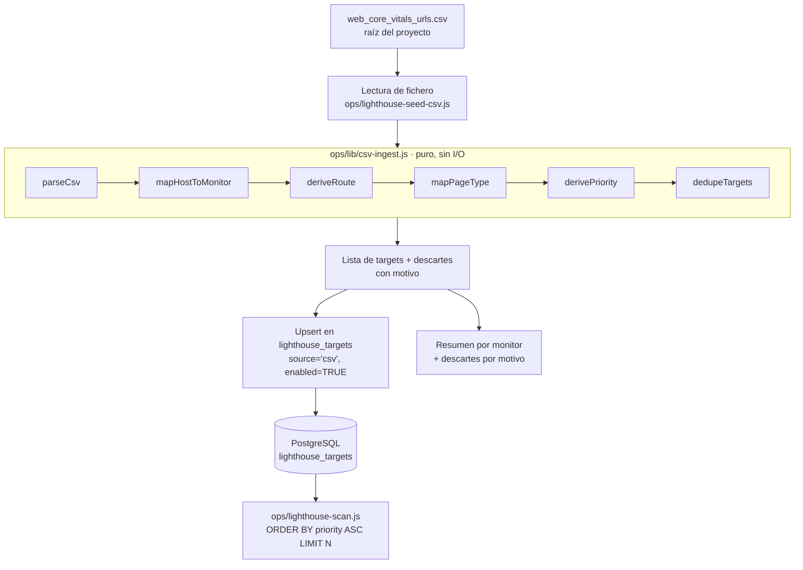

# Documento de Diseño

## Overview

Esta feature añade un **ingester de CSV** que carga el listado curado
`web_core_vitals_urls.csv` (~599 filas) en la tabla `lighthouse_targets`, de modo que
el escáner Lighthouse existente (`ops/lighthouse-scan.js`) audite muchas más URLs por
marca sin reescribir el escáner ni el dashboard.

El núcleo del trabajo son **transformaciones puras y deterministas** (parseo, mapeo de
host a monitor, derivación de ruta, mapeo de tipo de página, derivación de prioridad y
deduplicación) más una capa fina de **I/O** (lectura del fichero y upsert en PostgreSQL).
El diseño separa estrictamente ambas responsabilidades para poder testear las
transformaciones con `node:test` + `tsx` y `fast-check` sin necesidad de base de datos
ni red, mientras el script de `ops/` se encarga únicamente de orquestar y escribir.

Además se documentan y cubren los aspectos de soporte:

- Etiquetado `source='csv'` para proteger las filas curadas del job de refresco de
  sitemap (que ya solo deshabilita filas `source='sitemap'`).
- Exclusión explícita de URLs en subdominios distintos (`tiendas.`, `magasin.`) con
  registro del motivo.
- Elevación del límite `MAX_ROUTES_PER_BRAND` en los cronjobs por marca, con el coste de
  escaneo estimado y el comportamiento de orden por prioridad cuando se aplica el límite.

### Alcance

- **Dentro de alcance**: nuevo script `ops/lighthouse-seed-csv.js`, módulo de funciones
  puras `ops/lib/csv-ingest.js`, tests de propiedades, ajuste de `MAX_ROUTES_PER_BRAND`
  en los values de GitOps y documentación operativa.
- **Fuera de alcance**: reescribir el escáner, cambiar el dashboard
  (`lighthouse-tab.tsx`), modificar el esquema de `lighthouse_targets` (la columna
  `source` ya admite texto arbitrario, `'csv'` no requiere migración).

### Hallazgos relevantes del código actual

- `lighthouse_targets` tiene `UNIQUE (monitor_id, route)`, `route` es un **path** que
  empieza por `/`, `priority` es `SMALLINT` (se usa en rango 1..5), `source` es `TEXT`
  libre y `enabled` es `BOOLEAN`. No hace falta migración.
- `ops/lighthouse-scan.js` lee `WHERE monitor_id=$1 AND enabled=TRUE ORDER BY priority
  ASC, page_type ASC, route ASC LIMIT MAX_ROUTES_PER_BRAND` y construye la URL como
  `monitor.url.replace(/\/$/,"") + route`. Esto confirma que `route` debe ser path
  (+query) y que el orden por prioridad ascendente decide qué se audita bajo el límite.
- `ops/lighthouse-targets-refresh.js` solo deshabilita filas con `source='sitemap'`
  (`WHERE ... AND source = 'sitemap' AND last_seen_at < NOW() - INTERVAL '14 days'`), por
  lo que las filas `source='csv'` ya quedan protegidas sin ningún cambio.
- Convención de tests del repo: `node:test` + `tsx`, glob `npm test` =
  `tsx --test src/lib/__tests__/*.test.ts`, propiedades con `fast-check`.
- La imagen `lighthouse-scanner` se construye con contexto `ops/` y se ejecuta como Node
  plano (sin paso de build TS en runtime).

## Architecture

### Flujo de datos



### Decisión clave: dónde viven las funciones puras

El requisito pide funciones puras testeables de forma determinista, pero los scripts de
`ops/` son **Node plano con `require` (CommonJS)** y la imagen `lighthouse-scanner` se
construye con contexto `ops/` **sin paso de compilación TypeScript en runtime**.

Se evaluaron dos opciones:

1. **`src/lib/lighthouse/csv-ingest.ts` (TypeScript)** consumido por el script de `ops/`.
   - Problema: el contexto de build de la imagen es `ops/`, por lo que `src/lib` no entra
     en la imagen; y aunque entrara, el runtime no transpila TS (`require` de `.ts`
     falla). Requeriría un paso de build/bundling adicional solo para este script,
     rompiendo el patrón del resto de scripts de `ops/`.

2. **`ops/lib/csv-ingest.js` (CommonJS plano)** — **elegida**.
   - Es `require`-able tal cual por `ops/lighthouse-seed-csv.js` en runtime (cero build),
     entra en la imagen por estar bajo `ops/`, y es **igualmente testeable** desde
     `src/lib/__tests__/` porque `tsx` importa módulos CommonJS `.js` sin problema.
   - Las funciones son puras (entrada → salida, sin DB ni red ni `Date.now()`), así que el
     test de propiedades las ejercita de forma totalmente determinista.

> El "standalone Next constraint" (imports AWS SDK top-level) **no aplica** aquí: esto es
> un script de `ops/`, no la app Next. No hay interacción con el bundler de Next.

Para mantener la traza con la convención del repo (tests en `src/lib/__tests__/*.test.ts`),
el test de propiedades vive en
`src/lib/__tests__/lighthouse-csv-ingest.property.test.ts` e importa el módulo puro por
ruta relativa (`../../../ops/lib/csv-ingest.js`). Así `npm test` (glob existente) lo
recoge sin cambios en el script de test.

### Componentes

| Componente | Fichero | Responsabilidad | Pureza |
|------------|---------|-----------------|--------|
| Funciones de transformación | `ops/lib/csv-ingest.js` | parse, map host, derive route, map type, derive priority, dedupe | **Puro** |
| Ingester (orquestador + I/O) | `ops/lighthouse-seed-csv.js` | leer CSV, cargar monitores, invocar puros, upsert, resumen | Impuro (FS + DB) |
| Test de propiedades | `src/lib/__tests__/lighthouse-csv-ingest.property.test.ts` | validar las propiedades de corrección | — |
| Config de cronjobs | `argocd/tooling` values (GitOps) | elevar `MAX_ROUTES_PER_BRAND` por marca | — |

## Components and Interfaces

Todas las firmas siguientes son del módulo puro `ops/lib/csv-ingest.js`. El estilo de
error es **resultado estructurado** (no excepciones) para poder acumular descartes y
seguir procesando.

### Tipos lógicos (documentados con JSDoc en JS)

```js
/**
 * @typedef {Object} CsvRecord
 * @property {string} url   - URL completa (trim aplicado)
 * @property {string} type  - tipo de página del CSV (trim aplicado)
 * @property {number} n     - peso entero
 */

/**
 * @typedef {Object} Target
 * @property {number} monitorId
 * @property {string} route       - path (+ query), empieza por "/"
 * @property {string} pageType    - home|plp|pdp|brand|blog|store_locator|services|other
 * @property {number} priority    - 1..5
 * @property {string} source      - siempre "csv"
 */

/**
 * @typedef {Object} Discard
 * @property {string} reason  - "duplicate"|"cross_subdomain"|"invalid_format"|"unrecognized_type"
 * @property {string} detail  - contexto legible (host, valor, línea)
 */
```

### `parseCsv(text)` — Req 1, 12

```js
/**
 * @param {string} text  - contenido bruto del CSV
 * @returns {{ records: CsvRecord[], errors: Discard[] }}
 */
function parseCsv(text)
```

- Separador único `;`. Cabecera `url;type;n` (tras trim) se descarta.
- Líneas vacías o solo-espacios se omiten sin error (Req 1.8).
- Líneas con ≠ 3 campos → error `invalid_format`, se preservan las válidas (Req 1.6).
- `n` no entero (rango `0..2147483647`) → error `invalid_format` (Req 1.5, 1.7).
- Aplica trim a los tres campos (Req 1.4).
- Función inversa `serializeCsv(records)` para la propiedad de ida y vuelta (Req 1.9).

### `mapHostToMonitor(url, monitors)` — Req 2

```js
/**
 * @param {string} url
 * @param {{ id:number, host:string }[]} monitors  - host = Monitor_Base_Host normalizado
 * @returns {{ monitorId:number }|{ crossSubdomain:true, host:string }|{ error:string }}
 */
function mapHostToMonitor(url, monitors)
```

- Extrae host con `new URL(url)`; lo normaliza a minúsculas.
- Coincidencia exacta con un `Monitor_Base_Host` → `monitorId` (Req 2.1, 2.2).
- Host que no coincide con ninguno (apex sin `www.`, `tiendas.`, `magasin.`) →
  `crossSubdomain` (Req 2.3).
- URL mal formada / sin host → `error` (Req 2.4).
- El mapa de hosts se deriva de los monitores cargados de `synthetic_monitors`
  (1..5), normalizando el host de `synthetic_monitors.url`. Como `monitor.url` es del
  estilo `https://www.tiendanimal.es`, el `Monitor_Base_Host` es `www.tiendanimal.es`.

### `deriveRoute(url)` — Req 3, 12

```js
/**
 * @param {string} url
 * @returns {{ route:string }|{ error:string }}
 */
function deriveRoute(url)
```

- `route` = `pathname` (preservado tal cual, incluida barra final) + `search` (query con
  `?`, orden y contenido preservados); fragmento `#...` excluido (Req 3.1–3.4).
- pathname vacío → `route = "/"` (Req 3.2).
- Dos URLs que difieren solo en query → dos rutas distintas (Req 3.6).
- Query mal formada (p. ej. múltiples `?` como en `marca?brand=x?new=true`) → `error`
  `invalid_format` (Req 12.2). Esquema distinto de `http`/`https` → `error` (Req 12.1).

### `mapPageType(type)` — Req 4

```js
/**
 * @param {string} type
 * @returns {{ pageType:string, recognized:boolean }}
 */
function mapPageType(type)
```

- Normaliza: trim + minúsculas (Req 4.4).
- Mapa: `home→home`, `plp→plp`, `pdp→pdp`, `blog→blog`, `brand→brand`,
  `store locator→store_locator`, `servicios→services`, `new pdp→pdp` (Req 4.1, 4.2).
- No reconocido / vacío → `other` con `recognized=false` para registrar evento
  (Req 4.3, 4.5).

### `derivePriority(record)` y `derivePriorityFromWeight(n)` — Req 5

```js
/**
 * Núcleo monótono basado solo en el peso.
 * @param {number} n
 * @returns {{ priority:number, classified:boolean }}
 */
function derivePriorityFromWeight(n)

/**
 * Aplica además la regla de negocio de página: home => 1.
 * @param {{ n:number, pageType:string }} record
 * @returns {{ priority:number, classified:boolean }}
 */
function derivePriority(record)
```

- `derivePriorityFromWeight` es **monótona no creciente** en `n`: mayor peso ⇒ número de
  prioridad menor o igual (Req 5.2), determinista para el mismo `n` (Req 5.3), siempre en
  `1..5` (Req 5.1). Mapeo concreto (acorde a los pesos reales del CSV, que son 2, 3 y 5):

  | `n` | priority |
  |-----|----------|
  | ≥ 5 | 1 |
  | 4   | 2 |
  | 3   | 3 |
  | 2   | 4 |
  | 0–1 | 5 |
  | ausente / fuera de rango / no entero | 5 (`classified=false`) |

- `derivePriority` aplica encima la regla `home ⇒ priority=1` (Req 5.4). Como `home`
  representa la página de mayor importancia y en el dataset lleva el peso máximo (`n=5`,
  que ya mapea a 1), la regla es consistente con la monotonía global (1 es el mínimo
  posible). El test de monotonía (Req 5.2) ejercita el núcleo `derivePriorityFromWeight`
  y la regla `home` se cubre con un test de ejemplo.
- Sin `n` o fuera de rango → `priority=5`, `classified=false`, y se continúa (Req 5.5).

### `dedupeTargets(targets)` — Req 6

```js
/**
 * @param {Target[]} targets
 * @returns {Target[]}
 */
function dedupeTargets(targets)
```

- Agrupa por par `(monitorId, route)` y conserva exactamente uno (Req 6.1).
- Ante prioridad distinta conserva el de **menor** valor `priority` (Req 6.2).
- Idempotente: aplicar sobre un conjunto ya deduplicado devuelve el mismo conjunto
  (Req 6.3). El orden de salida es determinista (orden estable por `monitorId`, `route`).

### `buildTargets(records, monitors)` — orquestación pura — Req 2, 3, 7, 13

```js
/**
 * Combina map host -> derive route -> map type -> derive priority -> dedupe,
 * acumulando descartes con su motivo.
 * @returns {{ targets:Target[], discards:Discard[] }}
 */
function buildTargets(records, monitors)
```

- Aplica el pipeline a cada registro; un registro inválido no aborta el resto (Req 12.3).
- URLs cross-subdominio → descarte `cross_subdomain` con el host afectado (Req 7.1, 7.2).
- Las URLs de localizador de tiendas cuyo host **sí** es un `Monitor_Base_Host` (p. ej.
  `www.kiwoko.com/tiendas?...`, `www.kiwoko.com/kiwoko-...-barcelona.html`) se procesan
  como cualquier otra (Req 7.3).
- Devuelve la lista final deduplicada y el desglose de descartes por motivo para el
  resumen (Req 13.2).

### Ingester `ops/lighthouse-seed-csv.js` (impuro)

Interfaz de línea de comandos / env:

- `DATABASE_URL` (requerido).
- `CSV_PATH` (opcional, por defecto `web_core_vitals_urls.csv` en la raíz).
- `DRY_RUN=1` (opcional): ejecuta todo el pipeline y el resumen **sin** escribir en DB.

Pasos:

1. Lee el CSV (`fs.readFileSync`).
2. Carga monitores `SELECT id, url FROM synthetic_monitors WHERE id IN (1,2,3,4,5)`,
   normaliza host.
3. `parseCsv` → `buildTargets` (puro).
4. Upsert por cada target (sentencia idempotente, ver Data Models).
5. Emite el resumen: filas upsertadas por `monitor_id` y descartes por motivo
   (Req 13.1, 13.2).

## Data Models

### Tabla `lighthouse_targets` (existente, sin cambios)

Columnas relevantes: `monitor_id INT`, `route TEXT`, `page_type TEXT`,
`priority SMALLINT` (usada 1..5), `source TEXT` (`'csv'` para esta feature),
`enabled BOOLEAN`, `UNIQUE (monitor_id, route)`. No requiere migración: `source` es texto
libre y `priority` ya admite 1..5.

### Mapa de hosts de monitores

| monitor_id | nombre | Monitor_Base_Host |
|------------|--------|-------------------|
| 1 | animalis | `www.animalis.com` |
| 2 | kiwoko-es | `www.kiwoko.com` |
| 3 | kiwoko-pt | `www.kiwoko.pt` |
| 4 | tiendanimal-es | `www.tiendanimal.es` |
| 5 | tiendanimal-pt | `www.tiendanimal.pt` |

El monitor 6 (Comerzzia) queda excluido (ningún host del CSV mapea a él).

### Mapa de tipo de página

| `type` CSV (normalizado) | `page_type` |
|--------------------------|-------------|
| `home` | `home` |
| `plp` | `plp` |
| `pdp` | `pdp` |
| `blog` | `blog` |
| `brand` | `brand` |
| `store locator` | `store_locator` |
| `servicios` | `services` |
| `new pdp` | `pdp` |
| (otro / vacío) | `other` |

### Sentencia de upsert (idempotente) — Req 8, 10

```sql
INSERT INTO lighthouse_targets
  (monitor_id, route, page_type, priority, source, enabled, last_seen_at)
VALUES ($1, $2, $3, $4, 'csv', TRUE, NOW())
ON CONFLICT (monitor_id, route) DO UPDATE SET
  page_type = EXCLUDED.page_type,
  priority  = EXCLUDED.priority,
  source    = 'csv',
  enabled   = TRUE,
  last_seen_at = NOW();
```

- Fija `source='csv'` y `enabled=TRUE` en insert y update (Req 8.2, 8.3).
- `ON CONFLICT (monitor_id, route)` evita duplicados y violaciones de clave única en
  reejecución (Req 8.4, 10.1, 10.2).
- Como la entrada (CSV) y la derivación son deterministas, dos ejecuciones consecutivas
  dejan el mismo estado en las filas `source='csv'` (Req 10.1).

### Interacción con el escáner y el límite por marca — Req 11

El escáner lee `ORDER BY priority ASC, page_type ASC, route ASC LIMIT
MAX_ROUTES_PER_BRAND`. Por tanto, bajo límite, se auditan primero las rutas de menor
número de prioridad (las más importantes): `home` (1) y el resto según peso. La
derivación de prioridad garantiza que las páginas de mayor peso `n` queden con menor
número y se cubran antes (Req 11.2).

**Conteo de filas habilitadas por marca tras la ingesta** (estimación a partir del CSV,
excluidas cross-subdominio y deduplicadas; el bloque del CSV aparece duplicado para
kiwoko-es, lo que la deduplicación colapsa):

| Marca | URLs CSV aprox. (válidas, dedup) |
|-------|----------------------------------|
| tiendanimal-es | ~75 (incluye 12 `NEW PDP` que colapsan con sus PDP equivalentes salvo query `?new=true`) |
| kiwoko-es | ~70 |
| kiwoko-pt | ~50 |
| tiendanimal-pt | ~40 |
| animalis | ~40 |

Todas superan el valor por defecto `MAX_ROUTES_PER_BRAND=50` en al menos una marca, así
que se eleva el límite.

**Coste de escaneo** (Req 11.3): el escáner usa `timeout: 120_000` (2 min máx/página) y
las cronjobs corren `0 3 */2 * *` (cada 2 días, 03:00). Coste máximo por marca ≈
`N_rutas × 2 min`. Para `N=100` el peor caso es ≈ 200 min (3h20) por marca; en la
práctica la mayoría de páginas tardan 15–40 s, situando una ejecución típica en 25–70
min. Como cada marca tiene su propio cronjob (ejecución independiente y paralela entre
marcas), no se acumulan.

**Valor recomendado**: `MAX_ROUTES_PER_BRAND=120`. Cubre la marca más grande
(tiendanimal-es ~75) con margen para el crecimiento del sitemap-refresh, manteniendo el
peor caso teórico (~4 h) dentro de una ventana de 2 días entre ejecuciones. Se configura
como env de cada cronjob por marca en los values de GitOps (`argocd/tooling`,
`shared-apps/portal-prod`), sin tocar el escáner.

## Correctness Properties

*Una propiedad es una característica o comportamiento que debe cumplirse en todas las
ejecuciones válidas del sistema: en esencia, un enunciado formal sobre lo que el sistema
debe hacer. Las propiedades sirven de puente entre las especificaciones legibles por
personas y las garantías de corrección verificables por máquina.*

Esta feature se compone de **funciones puras y deterministas** (parseo, derivación de
ruta, derivación de prioridad y deduplicación), por lo que es un caso idóneo para
property-based testing. Las propiedades siguientes se derivan de los criterios de
aceptación marcados como testables en el prework (round-trips, invariantes e
idempotencia). La capa de I/O (lectura de fichero y upsert en PostgreSQL) no se cubre con
propiedades sino con tests de integración / mocks (ver Testing Strategy).

### Property 1: Round-trip de parseo CSV

*For any* lista de registros CSV válidos (`url`, `type`, `n`), serializar la lista a
formato CSV con `serializeCsv` y volver a parsearla con `parseCsv` SHALL producir una
lista de registros equivalente a la original (sin pérdida ni alteración de campos tras el
trim).

**Validates: Requirements 1.9** (y por extensión 1.2, 1.4, 1.6, 1.7 a través de los
generadores que mezclan líneas válidas e inválidas)

### Property 2: Round-trip de derivación de ruta

*For any* URL `http(s)` válida cuyo host coincide con un `Monitor_Base_Host`, concatenar
ese `Monitor_Base_Host` (sin barra final) con el resultado de `deriveRoute(url).route`
SHALL reconstruir una URL equivalente a la de origen una vez excluido el fragmento
(`#...`), preservando pathname (incluida la barra final) y query string (orden y
contenido). En consecuencia, dos URLs del mismo monitor que difieran únicamente en su
query string producen dos rutas distintas.

**Validates: Requirements 3.1, 3.2, 3.3, 3.4, 3.5, 3.6**

### Property 3: Invariantes de derivación de prioridad

*For any* peso `n` (entero, negativo, fuera de rango o no entero), `derivePriorityFromWeight(n)`
SHALL devolver un valor `priority` entero en el rango `1..5` (invariante de rango), SHALL
ser monótona no creciente respecto a `n` (para `n1 > n2`, `priority(n1) <= priority(n2)`)
y SHALL ser determinista (dos invocaciones con el mismo `n` devuelven el mismo `priority`).

**Validates: Requirements 5.1, 5.2, 5.3** (la regla `home ⇒ priority=1` del Req 5.4 se
cubre con un test de ejemplo; el `priority=5` no clasificado del Req 5.5 queda dentro del
invariante de rango)

### Property 4: Deduplicación conserva unicidad y prioridad mínima

*For any* conjunto de targets, `dedupeTargets(targets)` SHALL devolver exactamente un
target por cada par `(monitorId, route)` presente en la entrada, y para los pares con
duplicados SHALL conservar el target con el **menor** valor `priority`.

**Validates: Requirements 6.1, 6.2**

### Property 5: Idempotencia de la deduplicación y de la ingesta pura

*For any* conjunto de targets, aplicar la deduplicación dos veces SHALL producir el mismo
resultado que aplicarla una vez (`dedupeTargets(dedupeTargets(t)) ≡ dedupeTargets(t)`).
Análogamente, *for any* lista de registros y conjunto de monitores, ejecutar
`buildTargets(records, monitors)` dos veces consecutivas SHALL producir un conjunto de
targets equivalente (la capa pura del Req 10 es idempotente porque la derivación y la
deduplicación son deterministas).

**Validates: Requirements 6.3, 10.1**

## Error Handling

La estrategia de errores del módulo puro es de **resultado estructurado (sin
excepciones)**: cada función devuelve el dato válido o un objeto de error/descarte, de
modo que un registro inválido **nunca aborta** el procesamiento del resto (Req 12.3). Los
descartes se acumulan con su motivo y se agregan en el resumen final (Req 13.2).

| Condición de error | Detección | Tratamiento | Motivo (`Discard.reason`) | Req |
|--------------------|-----------|-------------|---------------------------|-----|
| Línea con ≠ 3 campos | `parseCsv` | Se excluye la línea, se preservan las válidas | `invalid_format` | 1.6 |
| `n` no entero / fuera de `0..2147483647` | `parseCsv` | Se excluye la línea y se continúa | `invalid_format` | 1.5, 1.7 |
| Línea vacía o solo espacios | `parseCsv` | Se omite **sin** registrar error | — | 1.8 |
| Esquema distinto de `http`/`https` | `deriveRoute` | Se excluye la línea y se registra el motivo | `invalid_format` | 12.1 |
| Query mal formada (múltiples `?`) | `deriveRoute` | Se excluye la línea y se registra el motivo | `invalid_format` | 12.2 |
| URL mal formada / sin host | `mapHostToMonitor` | Se excluye la URL y se continúa | `invalid_format` | 2.4 |
| Host cross-subdominio (`tiendas.`, `magasin.`, apex sin `www.`) | `mapHostToMonitor` | Se excluye de la inserción, se registra host afectado | `cross_subdomain` | 2.3, 7.1, 7.2 |
| Tipo de página no reconocido / vacío | `mapPageType` | Se asigna `other` y se registra evento (no se descarta la fila) | `unrecognized_type` | 4.3, 4.5 |
| Peso `n` ausente / fuera de rango | `derivePriority` | Se asigna `priority=5`, `classified=false`, se continúa | — | 5.5 |
| Par `(monitorId, route)` duplicado | `dedupeTargets` | Se conserva uno (menor `priority`) | `duplicate` | 6.1, 6.2 |

A nivel de **I/O del ingester** (`ops/lighthouse-seed-csv.js`):

- **Fichero CSV ausente o ilegible**: el ingester aborta con código de salida distinto de
  cero y un mensaje claro (es una precondición, no un descarte por fila).
- **`DATABASE_URL` ausente**: aborta antes de procesar (fail-fast de configuración).
- **Error de upsert por fila**: se registra (log) y **no aborta** la ejecución; el resto
  de filas continúan. La sentencia `ON CONFLICT (monitor_id, route) DO UPDATE` evita
  violaciones de clave única en reejecución (Req 8.4, 10.2).
- **Resumen final**: el ingester emite siempre el desglose de filas upsertadas por
  `monitor_id` y de descartes por motivo, incluso si hubo errores parciales (Req 13.1,
  13.2).

## Testing Strategy

### Enfoque dual

- **Tests de propiedades** (property-based): validan las propiedades universales del
  módulo puro `ops/lib/csv-ingest.js` (round-trips, invariantes, idempotencia).
- **Tests unitarios / de ejemplo**: cubren mapeos concretos (cada `Monitor_Base_Host`,
  cada entrada del mapa de tipos, la regla `home ⇒ priority=1`) y casos límite (apex sin
  `www.`, query mal formada, esquema no http(s), tipo vacío).
- **Tests de integración / mocks**: cubren la capa de I/O (upsert idempotente, resumen)
  que no es amenable a PBT.

### Herramientas y convención del repo

- Runner: **`node:test` + `tsx`** (convención existente del portal), aserciones con
  `fast-check` para las propiedades. No se implementa PBT desde cero; se usa la librería.
- Ubicación del test de propiedades:
  `src/lib/__tests__/lighthouse-csv-ingest.property.test.ts`, que importa el módulo puro
  CommonJS por ruta relativa (`../../../ops/lib/csv-ingest.js`). `tsx` importa `.js`
  CommonJS sin problema.
- El glob existente de `npm test` (`tsx --test src/lib/__tests__/*.test.ts`) recoge el
  fichero automáticamente, sin cambios en el script de test.

### Configuración de los tests de propiedades

- Mínimo **100 iteraciones** por propiedad (`fast-check` `numRuns: 100` o superior).
- Cada test de propiedad lleva un comentario que referencia la propiedad del diseño con el
  formato: **Feature: lighthouse-url-expansion, Property {número}: {texto}**.
- Cada propiedad de la sección Correctness Properties se implementa con **un único** test
  de propiedad:

  | Propiedad | Test | Generadores clave |
  |-----------|------|-------------------|
  | Property 1 (round-trip CSV) | round-trip `parseCsv(serializeCsv(records)) ≡ records` | listas de `CsvRecord` válidos (url http(s), type arbitrario sin `;`, n entero) |
  | Property 2 (round-trip ruta) | reconstrucción host+route ≡ URL sin fragmento | URLs válidas con path/barra final/query/fragment variados |
  | Property 3 (invariantes prioridad) | rango 1..5 + monotonía + determinismo sobre `derivePriorityFromWeight` | pares de pesos `n` (enteros, negativos, fuera de rango) |
  | Property 4 (dedupe unicidad+min) | unicidad de `(monitorId, route)` y `priority` mínima | listas de `Target` con pares repetidos y prioridades distintas |
  | Property 5 (idempotencia) | `dedupe∘dedupe ≡ dedupe` y `buildTargets` dos veces ≡ | targets con colisiones / registros + monitores |

### Pureza y aislamiento

- Las funciones bajo test son puras (entrada → salida, sin DB, red ni `Date.now()`), por
  lo que las propiedades se ejercitan de forma totalmente determinista y reproducible.
- La capa de I/O del ingester se prueba mediante la ruta **`DRY_RUN=1`** (ejecuta todo el
  pipeline y el resumen sin escribir en DB) y/o **dependencias inyectadas** (cliente de DB
  y lectura de fichero simulados), permitiendo verificar el upsert idempotente y el
  resumen por monitor y por motivo sin una base de datos real.

### Por qué no PBT en ciertas áreas

El upsert en PostgreSQL, la protección frente al refresco de sitemap (Req 9), el límite
`MAX_ROUTES_PER_BRAND` (Req 11, configuración GitOps) y el orden de auditoría del escáner
son comportamiento de I/O, configuración o de un componente existente: no varían de forma
significativa con la entrada ni testean la lógica pura de esta feature, por lo que se
cubren con tests de integración (1-3 ejemplos representativos, con DRY_RUN/mock) y
verificación de configuración, no con property-based testing.
