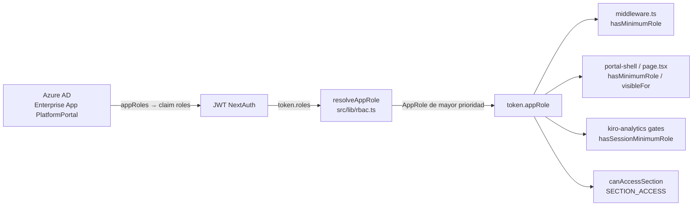
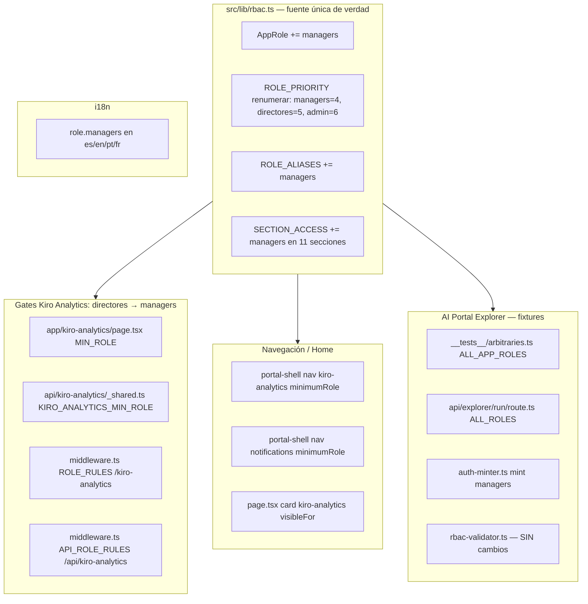

# Design Document

## Overview

Esta feature introduce un nuevo rol RBAC `managers` en el Platform Portal (Next.js 14 App Router, TypeScript). El rol se sitúa entre `staff` y `directores` en la jerarquía lineal y otorga exactamente:

- **Todo lo que ve `staff`** (secciones staff-equivalentes: `home`, `metrics`, `finops`, `create-infra`, `access-management`, `incidents`, `requests`, `sonarqube`, `synthetics`), **MÁS**
- **Kiro Analytics** (`/kiro-analytics`), **MÁS**
- **La visibilidad del buzón de aprobaciones** (`/infra-requests`).

No otorga el panel de administración ni ninguna otra capacidad exclusiva de `directores`. Y —punto crítico de seguridad— **no otorga la capacidad de aprobar**: aprobar sigue gobernado por las listas de aprobadores por email/equipo (`src/lib/team-approvers.ts`, `src/lib/infra-approvers.ts`). El rol solo aporta la *visibilidad* del buzón.

La jerarquía resultante, con la renumeración de `ROLE_PRIORITY`, es:

```
externos(1) < desarrolladores(2) < staff(3) < managers(4) < directores(5) < admin(6)
```

### Modelo dual de acceso (clave para entender el diseño)

El portal usa **dos mecanismos de control de acceso independientes**, y esta feature debe tratarlos de forma coherente:

1. **Modelo por sección** — `SECTION_ACCESS` + `canAccessSection(role, section)`. Es una lista explícita de roles permitidos por sección. Lo consumen la navegación (`portal-shell.tsx`), las tarjetas de home (`page.tsx`) y el `rbac-validator.ts` del AI Portal Explorer.
2. **Modelo por rol mínimo** — `hasMinimumRole(role, minimum)`. Compara prioridades en `ROLE_PRIORITY`. Lo consumen `middleware.ts` (`ROLE_RULES` para páginas, `API_ROLE_RULES` para APIs) y los gates de Kiro Analytics (página + API + middleware).

Los dos modelos NO son equivalentes en general (por diseño: una sección puede estar abierta a `externos` y `staff` pero no a `desarrolladores`, algo que un umbral lineal no puede expresar). Pero para **Kiro Analytics** los hacemos **equivalentes por construcción**:

- Modelo por sección: `SECTION_ACCESS["kiro-analytics"] = {managers, directores, admin}`.
- Modelo por rol mínimo: gate `hasMinimumRole(role, "managers")`, que con la jerarquía nueva produce exactamente `{managers, directores, admin}`.

Ambos conjuntos coinciden. Esta equivalencia es una invariante que un property test verificará (P4). No se introduce ninguna semántica de "denegar si discrepan" ni ningún OR entre modelos: simplemente se eligen los valores para que coincidan.

### Alcance de los cambios

La feature abarca dos planos:

1. **Aprovisionamiento en Azure AD**: nuevo `appRole` `managers` en la Enterprise App "PlatformPortal", nueva security group `platformmanagers-analytics`, asignación grupo→appRole y población de miembros.
2. **Código del portal**: tipo de rol, jerarquía, aliases, mapa de secciones, gates de Kiro Analytics, navegación, tarjetas de home, fixtures/fuente única de verdad del AI Portal Explorer, e i18n.

No hay migración de base de datos. La feature es puramente aditiva.

## Architecture

### Flujo de resolución de rol (sin cambios estructurales)



`resolveAppRole` selecciona el rol de mayor prioridad presente en el claim `roles` según `ROLE_PRIORITY`, mapeando cada valor crudo a un `AppRole` vía `ROLE_ALIASES` (o `externos` si no reconoce ninguno). La incorporación de `managers` es transparente para este flujo: solo hay que declarar el rol en las cuatro estructuras (`AppRole`, `ROLE_PRIORITY`, `ROLE_ALIASES`, `SECTION_ACCESS`).

Nota de compatibilidad: `session-role.getSessionRole` normaliza `session.user.appRole` con `.toLowerCase()` directo, de modo que un valor de Azure AD capitalizado (`"Managers"`) resuelve a `"managers"` sin cambios adicionales. `roleFromTokenData` (usado por `middleware.ts` y `auth.ts`) ya pasa por `ROLE_ALIASES`, que tras el cambio incluye `managers`.

### Puntos de cambio (mapa completo)



## Components and Interfaces

Cada punto de cambio con la edición exacta.

### 1. `src/lib/rbac.ts` — fuente única de verdad

**1.1 `AppRole`** — añadir `managers`:

```typescript
export type AppRole = "admin" | "directores" | "managers" | "staff" | "desarrolladores" | "externos";
```

**1.2 `ROLE_PRIORITY`** — renumerar insertando `managers=4`, empujando `directores` a 5 y `admin` a 6. El orden relativo de los roles preexistentes se conserva (Req 10.4):

```typescript
const ROLE_PRIORITY: Record<AppRole, number> = {
    externos: 1,
    desarrolladores: 2,
    staff: 3,
    managers: 4,
    directores: 5,
    admin: 6,
};
```

**1.3 `ROLE_ALIASES`** — añadir la entrada `managers` (los aliases legacy existentes se conservan intactos, Req 10.2):

```typescript
const ROLE_ALIASES: Record<string, AppRole> = {
    admin: "admin",
    directores: "directores",
    managers: "managers",   // ← nuevo
    staff: "staff",
    desarrolladores: "desarrolladores",
    externos: "externos",
    // Legacy aliases (sin cambios):
    editor: "staff",
    viewer: "externos",
    write: "staff",
    contributor: "staff",
    administrator: "admin",
    owner: "admin",
    superadmin: "admin",
    read: "externos",
    readonly: "externos",
    "read-only": "externos",
};
```

**1.4 `SECTION_ACCESS`** — añadir `managers` a 11 secciones (todas salvo `admin`). Filas resultantes:

```typescript
const SECTION_ACCESS: Record<PortalSection, AppRole[]> = {
    home: ["admin", "directores", "managers", "staff", "desarrolladores", "externos"],
    metrics: ["admin", "directores", "managers", "staff", "desarrolladores", "externos"],
    finops: ["admin", "directores", "managers", "staff", "desarrolladores"],
    "create-infra": ["admin", "directores", "managers", "staff"],
    "access-management": ["admin", "directores", "managers", "staff"],
    incidents: ["admin", "directores", "managers", "staff", "desarrolladores", "externos"],
    requests: ["admin", "directores", "managers", "staff", "desarrolladores", "externos"],
    sonarqube: ["admin", "directores", "managers", "staff", "desarrolladores", "externos"],
    synthetics: ["admin", "directores", "managers", "staff", "desarrolladores", "externos"],
    "infra-requests": ["admin", "directores", "managers"],   // ← managers añadido
    "kiro-analytics": ["admin", "directores", "managers"],    // ← managers añadido
    admin: ["admin"],                                          // ← SIN cambios
};
```

Con esto, `getAccessibleSections("managers")` devuelve exactamente `getAccessibleSections("staff") ∪ {kiro-analytics, infra-requests}` (Req 3.7), y `canAccessSection("managers", "admin") === false` (Req 3.6, 9.1).

`canAccessSection` y `getAccessibleSections` **no requieren cambios de código**: derivan de `SECTION_ACCESS`.

### 2. `src/app/kiro-analytics/page.tsx` — gate de página

`MIN_ROLE` pasa de `directores` a `managers`. El literal del redirect se actualiza para reflejar el mínimo real:

```typescript
const MIN_ROLE = "managers" as const;
// ...
if (!hasSessionMinimumRole(session, MIN_ROLE)) {
    redirect("/?forbidden=managers");
}
```

### 3. `src/app/api/kiro-analytics/_shared.ts` — gate de API

`KIRO_ANALYTICS_MIN_ROLE` pasa de `directores` a `managers`. Es la constante que consume `guard()` en todos los endpoints bajo `/api/kiro-analytics`:

```typescript
export const KIRO_ANALYTICS_MIN_ROLE: AppRole = "managers";
```

Al cambiar la constante, `guard()` responde 401 sin sesión y 403 a `staff`/`desarrolladores`/`externos`, permitiendo `managers`/`directores`/`admin` (Req 4.5, 4.7).

### 4. `middleware.ts` — gates de edge

Dos reglas pasan de `directores` a `managers`:

```typescript
const ROLE_RULES: RoleRule[] = [
    // ...
    { prefix: "/kiro-analytics", minimumRole: "managers" },   // ← era directores
    // ...
];

const API_ROLE_RULES: RoleRule[] = [
    // ...
    { prefix: "/api/kiro-analytics", minimumRole: "managers" },   // ← era directores
    // ...
];
```

**`/infra-requests` NO está en `middleware.ts`.** El buzón de aprobaciones se gobierna por el modelo por sección (`SECTION_ACCESS["infra-requests"]`) y por el ítem de navegación `notifications`, no por `ROLE_RULES`. Por tanto **no hay cambio de middleware para el buzón**: su visibilidad se resuelve exclusivamente con el cambio de `SECTION_ACCESS` (§1.4) y de navegación (§5). Las rutas `/admin` y `/api/admin` permanecen en `admin`, cerrando la escalada (Req 9.1).

> Nota (fuera de alcance, se preserva tal cual): varias reglas de `API_ROLE_RULES` usan `minimumRole: "editor"`, que no es un `AppRole` ni una clave de `ROLE_PRIORITY`; `hasMinimumRole` evalúa `ROLE_PRIORITY["editor"] ?? 0 = 0`, de modo que cualquier usuario autenticado las supera. Este comportamiento no cambia con la renumeración (P5), porque `editor` no está en `ROLE_PRIORITY`.

### 5. `src/components/portal-shell.tsx` — navegación

Dos ítems de `NAV_ITEMS` bajan su `minimumRole` de `directores` a `managers`:

```typescript
{ id: "kiro-analytics", labelKey: "nav.kiroAnalytics", href: "/kiro-analytics", icon: Sparkles, minimumRole: "managers", sectionKey: "nav.section.operations" },
// ...
{ id: "notifications", labelKey: "nav.notifications", href: "/infra-requests", icon: Bell, minimumRole: "managers", sectionKey: "nav.section.admin" },
```

El filtro de visibilidad es `NAV_ITEMS.filter((item) => !item.hidden && hasMinimumRole(role, item.minimumRole))`. Cada ítem se gatea de forma **independiente** según su propio `minimumRole` (Req 6.8): un `managers` verá `kiro-analytics` y `notifications` (ambos ahora a `managers`), además de todos los ítems de nivel `staff` o inferior; el ítem `admin` (mínimo `admin`) sigue oculto (Req 6.6). No hay lógica de "todo o nada": el filtro es por ítem, así que rebajar un ítem no oculta ni condiciona a los demás.

Los ítems exclusivos de manager quedan **completamente restringidos** para `staff`/`desarrolladores`/`externos` (Req 6.7): con `minimumRole: "managers"`, `hasMinimumRole("staff", "managers")` es falso, así que ni `kiro-analytics` ni `notifications` aparecen para esos roles.

### 6. `src/app/page.tsx` — tarjeta de home

El filtro es `features.filter((f) => !f.hidden && f.visibleFor.includes(currentRole))`. **`visibleFor` es una lista explícita de roles por tarjeta**, un modelo independiente de `SECTION_ACCESS`. Al introducir el rol NUEVO `managers`, todas las listas `visibleFor` que enumeran roles individuales quedan obsoletas y **hay que añadir `managers` a cada tarjeta que un `staff` ve**, no solo a `kiro-analytics`:

- `kiro-analytics`: `visibleFor: ["managers", "directores", "admin"]` (rebajada a `managers`).
- Tarjetas staff-equivalentes — `create-repository`, `request-infrastructure`, `access-management`, `incidents`, `requests`, `dora-metrics`, `synthetic-monitoring`, `notifications`, `my-tickets`, `finops-analytics` (y `jira-dashboard`, aunque hoy esté oculta por flag): añadir `managers` (insertado entre `staff` y `directores`).
- `admin-activity` y `automations`: se mantienen en `visibleFor: ["admin"]` — `managers` NO se añade (Req 6.6, 9.1).

> ⚠️ **Corrección post-implementación (bug detectado en runtime).** La primera implementación solo añadió `managers` a la tarjeta `kiro-analytics` y asumió erróneamente que `notifications` "ya era visible para todos" — pero `visibleFor` es una lista cerrada y `managers`, al ser un rol nuevo, NO estaba en ninguna otra lista. Resultado: en la home un `managers` **solo veía la tarjeta de Kiro Analytics** (verificado con el usuario "Jaime"). El fix propaga `managers` a todas las tarjetas staff-equivalentes. La navegación lateral (`portal-shell.tsx`) NO tenía este bug porque deriva de `canAccessSection`/`SECTION_ACCESS` (sí actualizado). Lección: al añadir un rol, revisar **ambos** modelos — `SECTION_ACCESS` (nav) y `visibleFor` (home).

### 7. AI Portal Explorer — fixtures y fuente única de verdad

**7.1 `src/lib/explorer/__tests__/arbitraries.ts`** — `ALL_APP_ROLES` debe ser espejo exacto de `AppRole` (Req 7.4). Añadir `managers`:

```typescript
export const ALL_APP_ROLES: readonly AppRole[] = [
  "admin",
  "directores",
  "managers",
  "staff",
  "desarrolladores",
  "externos",
] as const;
```

`arbAppRole = fc.constantFrom(...ALL_APP_ROLES)` incorporará `managers` automáticamente, de modo que **todos los property tests del Explorer que iteran sobre roles cubrirán `managers` sin más cambios**.

**7.2 `src/app/api/explorer/run/route.ts`** — el array `ALL_ROLES` que enumera los roles a barrer añade `managers`:

```typescript
const ALL_ROLES: AppRole[] = ["admin", "directores", "managers", "staff", "desarrolladores", "externos"];
```

(El runner del job `ops/portal-explorer/run.ts` debe mantenerse consistente si declara su propia lista; el diseño exige que toda enumeración de roles del Explorer incluya `managers` — Req 7.2.)

**7.3 `src/lib/explorer/auth-minter.ts`** — el minter acuña una sesión sintética por rol reutilizando `encode` de `next-auth/jwt` con `NEXTAUTH_SECRET`. **No requiere cambios de código**: `mintSyntheticSession(role)` y `buildSyntheticClaims(role)` son genéricos sobre `AppRole`. Al llamarse con `role="managers"` produce un JWE con `roles:["managers"]`, `appRole:"managers"`, identidad reservada `explorer+managers@synthetic.invalid` y `synthetic:true`. Ese JWE round-trips con el `decode`/`getToken` de `middleware.ts` y `api-auth.ts` (mismo secreto, mismo cifrado), de forma que el crawler navega el portal como un `managers` real sin pasar por Azure AD/MFA. La cobertura de `managers` en el minter se obtiene, pues, con solo añadir el rol a las listas de §7.1/§7.2 (Req 7.3).

**7.4 `src/lib/explorer/rbac-validator.ts`** — **SIN cambios**. Deriva `expectedAccess` de `canAccessSection` (fuente única de verdad) y fuerza exhaustividad de `PortalSection` con `ALL_SECTIONS_MAP: Record<PortalSection, true>`. Como no mantiene ninguna lista paralela de roles, el rol `managers` se propaga automáticamente y su expectativa por sección coincide siempre con `canAccessSection` (Req 7.5).

### 8. i18n — etiqueta del rol

**Estado actual:** el nombre del rol se muestra hoy en la UI como el string crudo del `appRole` capitalizado con la utilidad CSS `capitalize` (`portal-shell.tsx`: `<div className="… capitalize">{role}</div>`; `page.tsx`: `<span className="… capitalize">{currentRole}</span>`). **No existe ninguna clave i18n `role.*`** en `src/i18n/{es,en,pt,fr}.json`; los roles no se traducen actualmente.

**Decisión de diseño:** Req 8 es condicional (*WHERE el nombre del rol se muestra en la interfaz*). Para satisfacerlo de forma consistente y dejar la puerta abierta a renderizar el rol vía i18n, se introduce la clave **`role.managers`** en los cuatro locales, con la misma clave en todos (Req 8.2):

| Locale | Clave | Valor |
|--------|-------|-------|
| es | `role.managers` | `"Managers"` |
| en | `role.managers` | `"Managers"` |
| pt | `role.managers` | `"Managers"` |
| fr | `role.managers` | `"Managers"` |

Se documenta que, dado que hoy la UI capitaliza el string crudo, `"managers"` ya se renderiza como `"Managers"` sin la clave; la clave se añade para cumplir la trazabilidad de Req 8 y como base para una futura migración a etiquetas i18n de rol (path canónico `role.<appRole>`). No se cambia el mecanismo de render en esta feature para no ampliar el alcance.

## Data Models

Esta feature **no introduce ni modifica tablas de base de datos**. Los "modelos de datos" relevantes son las estructuras de tipos puras de `src/lib/rbac.ts`:

### `AppRole` (unión de literales)

```
"admin" | "directores" | "managers" | "staff" | "desarrolladores" | "externos"
```

Los seis miembros deben aparecer en las cuatro estructuras (`AppRole`, `ROLE_PRIORITY`, `ROLE_ALIASES` como valores, `SECTION_ACCESS` como elementos de las listas). `ROLE_PRIORITY` es `Record<AppRole, number>`, por lo que **el compilador exige exhaustividad**: omitir `managers` en `ROLE_PRIORITY` no compila (Req 11.5).

### `ROLE_PRIORITY` (jerarquía lineal)

| Rol | Prioridad |
|-----|-----------|
| externos | 1 |
| desarrolladores | 2 |
| staff | 3 |
| **managers** | **4** |
| directores | 5 |
| admin | 6 |

### `PortalSection` y `SECTION_ACCESS`

`PortalSection` no cambia (12 secciones). `SECTION_ACCESS: Record<PortalSection, AppRole[]>` gana `managers` en 11 de las 12 listas (todas menos `admin`). Conjunto accesible por rol tras el cambio:

| Rol | Secciones accesibles |
|-----|----------------------|
| externos | home, metrics, incidents, requests, sonarqube, synthetics |
| desarrolladores | + finops |
| staff | + create-infra, access-management (staff-equivalente: home, metrics, finops, create-infra, access-management, incidents, requests, sonarqube, synthetics) |
| **managers** | **= staff ∪ {kiro-analytics, infra-requests}** |
| directores | + infra-requests, kiro-analytics (todo salvo admin) |
| admin | todo (incluye admin) |

Nótese que `managers ⊊ admin` (subconjunto propio: `managers` carece de `admin`) — Req 9.4.

### Fixtures de test (fuente única de verdad de roles)

`ALL_APP_ROLES` (en `arbitraries.ts`) es una constante que **debe** ser espejo exacto del conjunto de miembros de `AppRole`. Esta igualdad es una invariante verificable (P6).

## Azure AD provisioning design

El claim `roles` del JWT proviene de los `appRoles` de la Enterprise App "PlatformPortal". Para que un usuario reciba el valor `managers`, hace falta: (1) un `appRole` con `value: "managers"` en el App Registration, (2) una security group nueva `platformmanagers-analytics`, (3) un `appRoleAssignment` que ligue la group al `appRole` sobre el Service Principal de PlatformPortal, y (4) poblar la membresía de la group con los aprobadores actuales. Este flujo **replica el patrón existente** group→appRole que ya usan `staff`/`directores`/etc. (grupos `platformstaff`, `platformmanagers`→`directores`, etc.).

**Datos fijos (verificados):**

- App Registration / Enterprise App: **PlatformPortal**, appId `ac7af294-f64a-4345-924b-5bfc652b639d`, tenant `19e73cc9-78d1-4540-862c-5a89572ef80e`.
- App usada para llamar a Graph: **iskaypet-automation-n8n**, appId `bbca2c99-4520-44a8-8108-cb00333e5792`, con los permisos ya concedidos (`Application.ReadWrite.All`/`Application.Read.All`, `AppRoleAssignment.ReadWrite.All`, `Group.ReadWrite.All`/`GroupMember.ReadWrite.All`, `Directory.Read.All`). El portal la consume vía `AZURE_AD_GRAPH_CLIENT_ID` / `AZURE_AD_GRAPH_CLIENT_SECRET` (secretos vivos hasta 2028, patrón steering §15).
- Autenticación Graph: `client_credentials` (tenant fijo), como `src/lib/graph-client.ts`.

> **Los secretos NO se hardcodean.** Se leen en tiempo de ejecución del cluster dp-tooling (ns `n8n`, secret `portal-env`, claves `AZURE_AD_GRAPH_CLIENT_ID`/`AZURE_AD_GRAPH_CLIENT_SECRET`) o de las variables de entorno del script. Ningún GUID de secreto aparece en el repo.

### Paso 1 — Crear el appRole `managers` en el App Registration

Los `appRoles` viven en el recurso `application` (no en el service principal). Se hace un **PATCH que reemplaza la colección `appRoles` completa** (Graph no permite append parcial), añadiendo un nuevo elemento con un GUID `id` generado (v4) y `value: "managers"`. Hay que leer primero la colección actual y reenviarla íntegra con el nuevo elemento apilado (idempotencia: si ya existe un appRole con `value:"managers"`, no añadir otro).

```
# 1. Resolver el object id del Application por appId
GET https://graph.microsoft.com/v1.0/applications?$filter=appId eq 'ac7af294-f64a-4345-924b-5bfc652b639d'
    → applications[0].id  (objectId del App Registration)

# 2. Leer los appRoles actuales
GET https://graph.microsoft.com/v1.0/applications/{appObjectId}?$select=appRoles

# 3. PATCH reemplazando la colección con el nuevo appRole apilado
PATCH https://graph.microsoft.com/v1.0/applications/{appObjectId}
Content-Type: application/json
{
  "appRoles": [
    <... todos los appRoles existentes tal cual ...>,
    {
      "id": "<NUEVO-GUID-v4>",
      "allowedMemberTypes": ["User"],
      "description": "Managers: staff + Kiro Analytics + visibilidad del buzón de aprobaciones",
      "displayName": "Managers",
      "value": "managers",
      "isEnabled": true
    }
  ]
}
```

`allowedMemberTypes: ["User"]` permite asignar usuarios y **grupos de seguridad** (los grupos se asignan como principal de tipo directorio; el patrón `platformmanagers`→`directores` ya funciona así). `value` debe ser exactamente `managers` (Req 2.1) porque es lo que llega al claim `roles` y lo que `ROLE_ALIASES` mapea.

### Paso 2 — Crear la security group `platformmanagers-analytics`

Se crea **de forma independiente e incondicional**, sin tocar la group existente `platformmanagers` (que mapea a `directores`) ni su asignación (Req 2.5). El nombre debe ser exactamente `platformmanagers-analytics` (Req 2.2).

```
POST https://graph.microsoft.com/v1.0/groups
{
  "displayName": "platformmanagers-analytics",
  "mailEnabled": false,
  "mailNickname": "platformmanagers-analytics",
  "securityEnabled": true,
  "description": "Portal: rol managers (staff + Kiro Analytics + visibilidad buzón aprobaciones)"
}
    → group.id  (objectId de la nueva group)
```

Idempotencia: antes del POST, comprobar `GET /groups?$filter=displayName eq 'platformmanagers-analytics'`; si ya existe, reutilizar su `id`. **No** buscar/crear por prefijo que pueda colisionar con `platformmanagers`: el filtro por `displayName` exacto evita tocar la group de `directores`.

### Paso 3 — Asignar la group al appRole `managers` (appRoleAssignment)

La asignación se crea sobre el **Service Principal** de PlatformPortal (no sobre el App Registration), con `principalId` = la group nueva, `resourceId` = el SP de PlatformPortal, `appRoleId` = el GUID del appRole creado en el Paso 1.

```
# Resolver el SP de PlatformPortal por appId
GET https://graph.microsoft.com/v1.0/servicePrincipals?$filter=appId eq 'ac7af294-f64a-4345-924b-5bfc652b639d'
    → servicePrincipals[0].id  (spObjectId)

# Crear la asignación grupo → appRole
POST https://graph.microsoft.com/v1.0/groups/{groupId}/appRoleAssignments
{
  "principalId": "{groupId}",
  "resourceId": "{spObjectId}",
  "appRoleId": "{nuevoAppRoleGuidDelPaso1}"
}
```

(Equivalentemente `POST /servicePrincipals/{spObjectId}/appRoleAssignedTo` con el mismo cuerpo.) Idempotencia: `GET /groups/{groupId}/appRoleAssignments` y saltar si ya existe una con ese `appRoleId`+`resourceId`.

### Paso 4 — Poblar la membresía con los aprobadores actuales

Añadir como miembros de `platformmanagers-analytics` a los usuarios aprobadores de hoy (los que figuran en las listas de `src/lib/team-approvers.ts` / `src/lib/infra-approvers.ts`). Resolver cada email a su `directoryObject` y añadirlo con `$ref` (idempotente: 400/`already exist` se ignora):

```
# Resolver el objectId del usuario por email (contemplar dominios @iskaypet.com / @emefinpetcare.com)
GET https://graph.microsoft.com/v1.0/users/{email}

# Añadir miembro a la group
POST https://graph.microsoft.com/v1.0/groups/{groupId}/members/$ref
{ "@odata.id": "https://graph.microsoft.com/v1.0/directoryObjects/{userObjectId}" }
```

### Patrón de ejecución (scripts `ops/azuread/*`)

Siguiendo el estilo de los scripts existentes (`ops/azuread/*`, `ops/list-argocd-groups.js`, `ops/migrate-legacy-argocd-groups.js` — Node + Graph, token `client_credentials`, idempotentes), el aprovisionamiento se implementa como un script Node idempotente (p.ej. `ops/azuread/provision-managers-role.js`) que ejecuta los 4 pasos en orden, leyendo `AZURE_AD_GRAPH_CLIENT_ID`/`AZURE_AD_GRAPH_CLIENT_SECRET`/`AZURE_AD_TENANT_ID` del entorno (nunca del repo). Alternativamente puede hacerse por Terraform en el repo `azuread` (`iac/`), replicando el patrón de `argocd_app_role_assignments.tf` (steering §15/§16): recurso `azuread_application_app_role` para el appRole, `azuread_group` para la group, `azuread_app_role_assignment` para el binding. En ambos casos:

- El appRole se crea **antes** que la asignación (la asignación referencia su GUID).
- La group se crea con `displayName` exacto y sin tocar `platformmanagers`.
- Ningún secreto se escribe en el repo.

### Propagación

`authOptions.session.maxAge` y `jwt.maxAge` son **30 minutos** (`src/lib/auth.ts`). Un usuario recién añadido a `platformmanagers-analytics` recibirá el claim `managers` en su **próximo login** (o al renovar el JWT), no de forma instantánea sobre una sesión viva (Req 2.6).

## Correctness Properties

*Una propiedad es una característica o comportamiento que debe cumplirse en todas las ejecuciones válidas del sistema — esencialmente, una afirmación formal sobre lo que el software debe hacer. Las propiedades son el puente entre la especificación legible por humanos y las garantías de corrección verificables por máquina.*

Esta feature es lógica RBAC pura (`resolveAppRole`, `hasMinimumRole`, `canAccessSection`, `getAccessibleSections` son funciones puras y totales), por lo que el property-based testing es plenamente aplicable. Los criterios de valores de configuración (gates, `minimumRole`, `visibleFor`, claves i18n) y de UI/aprobación se cubren con tests de ejemplo (ver Testing Strategy), no con properties.

### Property 1: Totalidad de `resolveAppRole`

*Para todo* array de cadenas arbitrario (incluidos vacíos, basura, mayúsculas, espacios y valores no reconocidos), `resolveAppRole` devuelve un `AppRole` válido (uno de los seis miembros) sin lanzar; y cuando el array contiene `managers` (en cualquier capitalización) y ningún alias de prioridad estrictamente superior, el resultado es `managers`.

**Validates: Requirements 1.4, 11.1**

### Property 2: Monotonía de la jerarquía

*Para todo* par de roles `(a, b)`, `hasMinimumRole(a, b)` es verdadero si y solo si el índice de `a` es mayor o igual que el índice de `b` en el orden exacto `externos < desarrolladores < staff < managers < directores < admin`. En particular, para todo rol `r`, `hasMinimumRole(r, r)` es verdadero (reflexividad), y el orden relativo de los roles preexistentes se conserva respecto al baseline.

**Validates: Requirements 1.2, 1.5, 1.6, 1.7, 1.8, 10.4, 10.5**

### Property 3: Conjunto de secciones de `managers`

*Para todo* recorrido de las secciones del portal, el conjunto `getAccessibleSections("managers")` es exactamente igual a `getAccessibleSections("staff") ∪ {"kiro-analytics", "infra-requests"}`; además `canAccessSection("managers", "admin")` es falso, el conjunto de `managers` es un subconjunto **propio** del de `admin`, y `"admin"` no pertenece a `SECTION_ACCESS[s]` para ninguna sección accesible por `managers`. Iterar `canAccessSection(role, section)` sobre todos los roles y todas las secciones nunca lanza y siempre devuelve un booleano (totalidad).

**Validates: Requirements 3.1, 3.2, 3.3, 3.4, 3.5, 3.6, 3.7, 9.4, 11.2**

### Property 4: Equivalencia por construcción en Kiro Analytics

*Para todo* `AppRole` `r`, `canAccessSection(r, "kiro-analytics")` es idéntico a `hasMinimumRole(r, "managers")`; y el conjunto de roles que satisfacen cualquiera de los dos es exactamente `{managers, directores, admin}`, que coincide con `SECTION_ACCESS["kiro-analytics"]`. No existe semántica de denegación por discrepancia ni lógica OR entre modelos: la igualdad se cumple por los valores elegidos.

**Validates: Requirements 4.5, 11.3, 11.4**

### Property 5: Compatibilidad hacia atrás de roles preexistentes

*Para todo* rol preexistente `r ∈ {externos, desarrolladores, staff, directores, admin}`, el conjunto `getAccessibleSections(r)` es exactamente igual al baseline congelado previo a la introducción de `managers`; y *para todo* array de cadenas que no contenga (tras normalizar) el valor `managers`, `resolveAppRole` devuelve el mismo `AppRole` que el baseline previo (incluidos los aliases legacy `editor`, `viewer`, `write`, `contributor`, `administrator`, `owner`, `superadmin`, `read`, `readonly`, `read-only`).

**Validates: Requirements 10.1, 10.2, 10.3**

### Property 6: Fuente única de verdad de roles

*Para todo* miembro de `AppRole` y *para todo* elemento de `ALL_APP_ROLES`, el conjunto de valores de `ALL_APP_ROLES` es exactamente igual al conjunto de miembros de `AppRole` (misma cardinalidad, sin duplicados, sin sobrantes ni faltantes). En consecuencia, ninguna de las estructuras `AppRole`, `ROLE_PRIORITY`, `ROLE_ALIASES` y `SECTION_ACCESS` omite `managers`.

**Validates: Requirements 7.1, 7.4, 11.5**

### Property 7: No escalada de privilegios

*Para todo* recorrido, `canAccessSection("managers", "admin")` es falso; y *para todo* umbral de rol mínimo `m` estrictamente superior a `directores`… (no existe ninguno superior a `admin`, por lo que la restricción operativa es: para todo umbral `m ∈ {directores, admin}`, `hasMinimumRole("managers", m)` es falso), garantizando que `managers` no supera ningún gate de rol mínimo `directores` o superior. La única sección/gate rebajada a alcance de `managers` es `kiro-analytics`; el buzón de aprobaciones se concede solo por el modelo por sección, no por un gate de rol mínimo `directores+`.

**Validates: Requirements 9.1, 9.2**

## Error Handling

- **`resolveAppRole` ante entrada arbitraria**: nunca lanza. Filtra no-cadenas, normaliza (`trim().toLowerCase()`), mapea por `ROLE_ALIASES` y cae a `externos` si no reconoce ninguno (Property 1). Este es el único punto donde una entrada externa (claim JWT) entra al modelo de roles.
- **`getSessionRole` ante `appRole` capitalizado o desconocido**: `.toLowerCase()` normaliza `"Managers"→"managers"`. Si Azure AD enviara un `appRole` fuera del tipo, el valor se propaga como string; los consumidores (`hasMinimumRole`) tratan un rol desconocido con prioridad `?? 0` (acceso mínimo), fallando de forma segura (deny).
- **Gates de Kiro Analytics**: sin sesión → 401 (API) / redirect a `/` (página); rol insuficiente → 403 (API) / redirect a `/?forbidden=managers` (página). El mensaje de error de la API no filtra SQL ni credenciales (comportamiento existente de `_shared.errorResponse`).
- **Aprovisionamiento Graph**: los scripts son idempotentes (GET de comprobación antes de cada POST/PATCH; se ignoran conflictos `already exists`). Un fallo en un paso no debe dejar estado inconsistente para el siguiente porque el orden es appRole → group → assignment → membership y cada paso reconsulta su precondición.
- **Ausencia de `NEXTAUTH_SECRET`** (solo relevante para el Explorer): `canMintSessions()` devuelve falso y el rol se omite; `mintSyntheticSession` lanza un error explícito si se invoca sin secreto (comportamiento existente, sin cambios).

## Testing Strategy

Stack de test del portal (steering §22): **`node:test` ejecutado con `tsx`**, property-based con **`fast-check`**. Los tests viven junto al módulo bajo `__tests__/` y corren con `npm test` / `npm run test:coverage` (glob incluye `src/lib/__tests__/*.test.ts` y `src/lib/explorer/__tests__/*.test.ts`).

### Property tests (fast-check)

- Un fichero por propiedad bajo el `__tests__/` del módulo (`src/lib/__tests__/` para las properties de `rbac.ts`).
- Configuración mínima **`fc.assert(fc.property(...), { numRuns: 100 })`** por property test.
- Comentario canónico de cabecera en cada test: **`// Feature: managers-role, Property N: <título>`**.
- Generadores: reutilizar/derivar un `arbAppRole` (equivalente al del Explorer, `fc.constantFrom(...)` sobre los seis roles) y `fc.string()`/`fc.array(fc.string())` para la totalidad de `resolveAppRole` (P1), incluyendo strings con mayúsculas/espacios/basura.
- Baseline para P5: congelar en el propio test el mapa `rol → conjunto de secciones` y `entrada → AppRole` previos (constantes literales en el test), y comparar contra el comportamiento actual. Así el test detecta cualquier deriva no intencionada.
- P1→Property 1, P2→Property 2, …, P7→Property 7. Cada test referencia su propiedad de diseño en el comentario de cabecera.

### Unit / example tests

- **Gates de Kiro Analytics** (Req 4.1-4.4, 4.6, 4.7): 
  - `_shared.guard()`: sin sesión → 401; `staff`/`desarrolladores`/`externos` → 403; `managers`/`directores`/`admin` → ok. 
  - Página `kiro-analytics/page.tsx`: rol insuficiente → redirect `/?forbidden=managers`. 
  - `middleware.ts`: `/kiro-analytics` y `/api/kiro-analytics` deniegan `staff-` y permiten `managers+` (simulando token). Verificar que la constante/regla es `managers`.
- **Navegación y home** (Req 6.1-6.7): 
  - `portal-shell` `NAV_ITEMS`: para `role="managers"`, `visibleItems` incluye `kiro-analytics` y `notifications` y **no** incluye `admin`; para `staff`/`desarrolladores`/`externos`, **no** incluye `kiro-analytics` ni `notifications`. 
  - `page.tsx` `features`: la card `kiro-analytics` es visible para `managers`/`directores`/`admin` y no para roles inferiores; `admin-activity` sigue solo para `admin`.
- **Aprobación vs visibilidad** (Req 5.*, 9.3): con un usuario `managers` **no** aprobador → el endpoint de review responde 403 y `GET /api/infra-requests` no expone el control de aprobación; con un `managers` que sí figura en las listas → aprobación permitida por las reglas vigentes. Estos tests validan que la capacidad depende de `isApprover`/`isTeamApprover`/`teamsApprovedBy` y no del `AppRole`.
- **i18n** (Req 8.1, 8.2): la clave `role.managers` existe en `src/i18n/{es,en,pt,fr}.json` y es la misma clave en los cuatro locales.
- **Explorer** (Req 7.2, 7.3, 7.5): 
  - El array `ALL_ROLES` de `api/explorer/run/route.ts` incluye `managers`. 
  - Round-trip del minter: `mintSyntheticSession("managers")` → `decode`/`getToken` → `appRole === "managers"` (test que requiere `NEXTAUTH_SECRET` de test). 
  - `rbac-validator`: `expectedAccess(role, section) === canAccessSection(role, section)` para todos los roles y secciones (consistencia con la fuente única de verdad).

### Impacto en tests existentes del Explorer

`arbAppRole` deriva de `ALL_APP_ROLES` (`fc.constantFrom(...ALL_APP_ROLES)`). Al añadir `managers` a `ALL_APP_ROLES`, **todos los property tests del Explorer que iteran roles empezarán a cubrir `managers` automáticamente**, sin edición. Hay que revisar y actualizar cualquier test que **hardcodee el número de roles o el conjunto exacto de roles**:

- Cualquier aserción del tipo `ALL_APP_ROLES.length === 5` → pasa a `6`.
- Cualquier test que enumere manualmente los cinco roles o compare contra un conjunto/snapshot fijo de roles (p.ej. tests de `rbac-validator` que esperen un número concreto de `RbacExpectation` = roles × secciones, o snapshots del barrido de roles) → actualizar el número esperado (`roles × 12 secciones`) y el conjunto.
- Tests del minter o del orquestador que iteren `ALL_APP_ROLES` deberán generar/manejar la sesión de `managers` (el minter ya lo soporta sin cambios).

No hay tests de base de datos ni de integración nuevos: la feature no toca persistencia.

## Migration / rollout & backward compatibility

- **Sin migración de BD.** La feature es puramente aditiva: añade un rol, no altera datos.
- **Orden de rollout:**
  1. **Merge del código** (rbac.ts, gates, nav, home, fixtures del Explorer, i18n) a `main` → pipeline CI/CD + GitOps despliega a dev y (tras corte manual) a prod. Desplegar el código antes de tener miembros en la group es seguro: sin usuarios con el claim `managers`, el rol simplemente no se asigna a nadie, y el gate de Kiro Analytics rebajado a `managers` mantiene el mismo conjunto efectivo `{directores, admin}` hasta que existan managers.
  2. **Aprovisionamiento Azure AD** en el orden estricto: **appRole `managers`** → **security group `platformmanagers-analytics`** → **appRoleAssignment** (group→appRole) → **membresía** (aprobadores actuales). El appRole primero porque la asignación referencia su GUID.
- **Propagación:** `session.maxAge`/`jwt.maxAge` = **30 min**. Los cambios de pertenencia a la group surten efecto en el **próximo login** del usuario (o renovación del JWT), no de forma instantánea sobre sesiones vivas.
- **Rollback:**
  - Código: revertir el commit de tag en `argocd/tooling` (`shared-apps/portal-{dev,prod}/values.yaml`) → ArgoCD vuelve a la versión previa (patrón steering §1). Revertir el rol restaura los gates a `directores`.
  - Azure AD: eliminar el `appRoleAssignment` (o vaciar la membresía) desactiva el rol para los usuarios sin borrar la group; opcionalmente `isEnabled: false` en el appRole. La group `platformmanagers` (→`directores`) nunca se toca, por lo que el rollback no afecta a `directores`.
- **Compatibilidad hacia atrás:** garantizada por Property 5 (conjuntos de secciones y resolución de rol de los roles preexistentes idénticos al baseline) y Property 2 (orden relativo preservado). La renumeración de `ROLE_PRIORITY` es segura porque `hasMinimumRole` compara prioridades de forma relativa; los valores absolutos no se exponen a ningún consumidor.
