# Implementation Plan: Rol `managers`

## Overview

Plan incremental orientado a TDD/PBT para introducir el nuevo rol RBAC `managers` en el Platform
Portal (Next.js 14 App Router, TypeScript), según las decisiones ya cerradas en `design.md`. La
feature es **puramente aditiva** (sin migración de BD): añade el rol a la fuente única de verdad
(`src/lib/rbac.ts`), rebaja el gate de Kiro Analytics de `directores` a `managers`, hace visibles
Kiro Analytics y el buzón de aprobaciones en navegación/home para `managers`, sincroniza las
fixtures y la enumeración de roles del AI Portal Explorer, añade la etiqueta i18n del rol y
aprovisiona el rol en Azure AD (appRole + security group + asignación + membresía).

Jerarquía resultante tras la renumeración de `ROLE_PRIORITY`:

```
externos(1) < desarrolladores(2) < staff(3) < managers(4) < directores(5) < admin(6)
```

Siete fases secuenciales. Cada fase consolida en una rama `feat/SRE-<n>` **sin descripción** y con
commits `[SRE-<n>] <type>: <desc>` (2–70 chars ASCII), según `.kiro/steering/git-conventions.md`.

1. **Fase 1 — Core RBAC (`src/lib/rbac.ts`) + las 7 Correctness Properties**. Añadir `managers` a
   `AppRole`, renumerar `ROLE_PRIORITY` (`managers=4`, `directores=5`, `admin=6`), añadir `managers`
   a `ROLE_ALIASES` y a las 11 filas de `SECTION_ACCESS` (todas menos `admin`). Las 7 properties del
   diseño son **obligatorias** (sin `*`) y están mapeadas 1:1.
2. **Fase 2 — Gates de Kiro Analytics (directores → managers)**: página, API `_shared.ts` y las dos
   reglas de `middleware.ts`.
3. **Fase 3 — Navegación + visibilidad en home**: `portal-shell.tsx` (ítems `kiro-analytics` y
   `notifications` a `managers`) y `page.tsx` (card `kiro-analytics` `visibleFor += managers`).
4. **Fase 4 — Fixtures del AI Portal Explorer + fuente única de verdad**: `ALL_APP_ROLES`, el array
   de roles de `run/route.ts`, y actualización de los tests del Explorer que hardcodean el nº de
   roles o `roles × secciones`.
5. **Fase 5 — i18n**: clave `role.managers` con valor `"Managers"` en `es`/`en`/`pt`/`fr`.
6. **Fase 6 — Aprovisionamiento Azure AD**: script `ops/azuread/provision-managers-role.js`
   idempotente (el agente lo **escribe**); su **ejecución** contra Azure AD es una **tarea
   manual/operador, no automatizable por el agente**.
7. **Fase 7 — Checkpoint final**: suite completa verde, `tsc` limpio sobre los ficheros cambiados,
   y nota del orden de rollout (código primero, Azure AD después) + propagación next-login (30 min).

**Estrategia de tests**. Lógica RBAC pura cubierta con **`fast-check` `{ numRuns: 100 }`**, un
fichero por propiedad bajo `src/lib/__tests__/`, comentario canónico obligatorio
`// Feature: managers-role, Property N: <título>`. Los tests del Explorer viven bajo
`src/lib/explorer/__tests__/`. El glob de `npm test` / `test:coverage` ya cubre
`src/lib/__tests__/*.test.ts` y `src/lib/explorer/__tests__/*.test.ts` (steering §22), por lo que
**ningún test de esta feature requiere ampliar el glob**. Las sub-tareas de tests de ejemplo/unit
están marcadas con `*` (opcionales); las 7 properties **no** llevan `*`.

**Persistencia**. Ninguna. La feature no toca base de datos.

**Compatibilidad hacia atrás**. Garantizada por P5 (conjuntos de secciones y resolución de rol de
los roles preexistentes idénticos al baseline congelado) y P2 (orden relativo preservado). La
renumeración de `ROLE_PRIORITY` es segura porque `hasMinimumRole` compara prioridades de forma
relativa.

## Dependency Graph (Mermaid)

```mermaid
flowchart TB
  %% Fase 1 — Core RBAC + properties
  T11["1.1 rbac.ts: AppRole + ROLE_PRIORITY + ROLE_ALIASES + SECTION_ACCESS"]
  T12["1.2 P1 resolveAppRole totality"]
  T13["1.3 P2 hierarchy monotonicity"]
  T14["1.4 P3 managers section set"]
  T15["1.5 P4 kiro-analytics equivalence"]
  T16["1.6 P5 backward-compat vs baseline"]
  T17["1.7 P6 single source of truth"]
  T18["1.8 P7 no privilege escalation"]

  %% Fase 2 — Gates Kiro Analytics
  T31["3.1 page.tsx MIN_ROLE managers + redirect"]
  T32["3.2 _shared.ts KIRO_ANALYTICS_MIN_ROLE"]
  T33["3.3 middleware.ts ROLE_RULES + API_ROLE_RULES"]
  T34["3.4 * unit guard() 401/403/ok"]
  T35["3.5 * unit middleware allow/deny"]

  %% Fase 3 — Nav + home
  T51["5.1 portal-shell nav kiro-analytics + notifications"]
  T52["5.2 page.tsx home card kiro-analytics visibleFor"]
  T53["5.3 * unit nav visibleItems por rol"]
  T54["5.4 * unit home features filter por rol"]

  %% Fase 4 — Explorer fixtures + SSOT
  T71["7.1 arbitraries.ts ALL_APP_ROLES += managers"]
  T72["7.2 run/route.ts ALL_ROLES += managers"]
  T73["7.3 actualizar tests Explorer (role count / roles×secciones)"]
  T74["7.4 * minter round-trip managers"]

  %% Fase 5 — i18n
  T91["9.1 role.managers en es/en/pt/fr"]
  T92["9.2 * test presencia + consistencia de clave"]

  %% Fase 6 — Azure AD
  TB1["11.1 escribir ops/azuread/provision-managers-role.js"]
  TB2["11.2 ejecutar provisioning en Azure AD (manual/operador)"]

  %% Fase 1 deps
  T11 --> T12
  T11 --> T13
  T11 --> T14
  T11 --> T15
  T11 --> T16
  T11 --> T17
  T11 --> T18

  %% Fase 2 deps
  T11 --> T31
  T11 --> T32
  T11 --> T33
  T32 --> T34
  T33 --> T35

  %% Fase 3 deps
  T11 --> T51
  T11 --> T52
  T51 --> T53
  T52 --> T54

  %% Fase 4 deps
  T11 --> T71
  T11 --> T72
  T71 --> T73
  T71 --> T74

  %% Fase 5 deps
  T91 --> T92

  %% Fase 6 deps
  TB1 --> TB2
  T11 --> TB2
```



## Tasks

### Fase 1 — Core RBAC (`src/lib/rbac.ts`) + Correctness Properties (rama `feat/SRE-<n>`)

- [x] 1. Declarar el rol `managers` en la fuente única de verdad y verificar las 7 properties
  - [x] 1.1 Modificar `src/lib/rbac.ts` para introducir el rol `managers`
    - `AppRole`: añadir el literal `"managers"` a la unión (queda `"admin" | "directores" | "managers" | "staff" | "desarrolladores" | "externos"`)
    - `ROLE_PRIORITY`: renumerar a `externos:1, desarrolladores:2, staff:3, managers:4, directores:5, admin:6` (preserva el orden relativo de los roles preexistentes)
    - `ROLE_ALIASES`: añadir la entrada `managers: "managers"` conservando **intactos** todos los aliases legacy (`editor`, `viewer`, `write`, `contributor`, `administrator`, `owner`, `superadmin`, `read`, `readonly`, `read-only`)
    - `SECTION_ACCESS`: añadir `managers` a las **11** filas salvo `admin` — a las 9 secciones staff-equivalentes (`home`, `metrics`, `finops`, `create-infra`, `access-management`, `incidents`, `requests`, `sonarqube`, `synthetics`) **más** `kiro-analytics` **más** `infra-requests`; la fila `admin` queda **sin cambios** (`["admin"]`)
    - `canAccessSection` y `getAccessibleSections` NO se tocan: derivan de `SECTION_ACCESS`. `Record<AppRole, number>` fuerza exhaustividad en compilación (omitir `managers` no compila)
    - _Requirements: 1.1, 1.2, 1.3, 3.1, 3.2, 3.3, 3.4, 10.2, 10.4, 11.5_

  - [x] 1.2 Test de propiedad: totalidad de `resolveAppRole`
    - **Feature: managers-role, Property 1: Totalidad de resolveAppRole**
    - Fichero `src/lib/__tests__/managers-role.prop01.property.test.ts`, `fast-check`, `{ numRuns: 100 }`
    - `∀ array de cadenas arbitrario` (vacíos, basura, mayúsculas, espacios, no reconocidos vía `fc.array(fc.string())`): `resolveAppRole(x)` nunca lanza y devuelve uno de los 6 `AppRole`; y `∀` array que contenga `managers` (en cualquier capitalización) sin alias de prioridad estrictamente superior ⇒ el resultado es `"managers"`
    - **Validates: Requirements 1.4, 11.1**

  - [x] 1.3 Test de propiedad: monotonía de la jerarquía
    - **Feature: managers-role, Property 2: Monotonía de la jerarquía**
    - Fichero `src/lib/__tests__/managers-role.prop02.property.test.ts`, `fast-check`, `{ numRuns: 100 }`
    - Definir en el test el orden literal `["externos","desarrolladores","staff","managers","directores","admin"]`; `∀ (a, b)`: `hasMinimumRole(a, b) === (index(a) >= index(b))`; incluye reflexividad `hasMinimumRole(r, r) === true` y los casos concretos del Req 1.5–1.8 (`managers≥staff`, `¬(managers≥directores)`, `directores≥managers`, `admin≥managers`, `¬(staff≥managers)`, etc.)
    - **Validates: Requirements 1.2, 1.5, 1.6, 1.7, 1.8, 10.4, 10.5**

  - [x] 1.4 Test de propiedad: conjunto de secciones de `managers`
    - **Feature: managers-role, Property 3: Conjunto de secciones de managers**
    - Fichero `src/lib/__tests__/managers-role.prop03.property.test.ts`, `fast-check`, `{ numRuns: 100 }`
    - `getAccessibleSections("managers")` (como conjunto) es exactamente `getAccessibleSections("staff") ∪ {"kiro-analytics","infra-requests"}`; `canAccessSection("managers","admin") === false`; el conjunto de `managers` es **subconjunto propio** del de `admin`; y `"admin" ∉ SECTION_ACCESS[s]` para toda sección `s` accesible por `managers`. Iterar `canAccessSection(role, section)` sobre todos los roles × todas las secciones nunca lanza y siempre devuelve booleano (totalidad)
    - **Validates: Requirements 3.1, 3.2, 3.3, 3.4, 3.5, 3.6, 3.7, 9.4, 11.2**

  - [x] 1.5 Test de propiedad: equivalencia por construcción en Kiro Analytics
    - **Feature: managers-role, Property 4: Equivalencia por construcción en Kiro Analytics**
    - Fichero `src/lib/__tests__/managers-role.prop04.property.test.ts`, `fast-check`, `{ numRuns: 100 }`
    - `∀ AppRole r`: `canAccessSection(r, "kiro-analytics") === hasMinimumRole(r, "managers")`; el conjunto de roles que satisfacen cualquiera de los dos es exactamente `{managers, directores, admin}` y coincide con `SECTION_ACCESS["kiro-analytics"]`. Sin semántica de denegación por discrepancia ni OR entre modelos
    - **Validates: Requirements 4.5, 11.3, 11.4**

  - [x] 1.6 Test de propiedad: compatibilidad hacia atrás de roles preexistentes
    - **Feature: managers-role, Property 5: Compatibilidad hacia atrás de roles preexistentes**
    - Fichero `src/lib/__tests__/managers-role.prop05.property.test.ts`, `fast-check`, `{ numRuns: 100 }`
    - Congelar en el propio test el baseline literal previo: mapa `rol → conjunto de secciones` para `{externos, desarrolladores, staff, directores, admin}` y mapa `entrada → AppRole` (incluidos los aliases legacy). `∀ r preexistente`: `getAccessibleSections(r)` == baseline; `∀` array de cadenas que (tras normalizar) NO contenga `managers`: `resolveAppRole(x)` == baseline previo
    - **Validates: Requirements 10.1, 10.2, 10.3**

  - [x] 1.7 Test de propiedad: fuente única de verdad de roles
    - **Feature: managers-role, Property 6: Fuente única de verdad de roles**
    - Fichero `src/lib/__tests__/managers-role.prop06.property.test.ts`, `fast-check`, `{ numRuns: 100 }`
    - El conjunto de valores de `ALL_APP_ROLES` (de `src/lib/explorer/__tests__/arbitraries.ts`) es exactamente igual al conjunto de miembros de `AppRole` (misma cardinalidad, sin duplicados, sin sobrantes ni faltantes); y `managers` está presente como clave/valor en `ROLE_PRIORITY`, `ROLE_ALIASES` y en al menos una lista de `SECTION_ACCESS`. Comprobar contra una lista literal de los 6 roles esperados fijada en el test
    - **Validates: Requirements 7.1, 7.4, 11.5**

  - [x] 1.8 Test de propiedad: no escalada de privilegios
    - **Feature: managers-role, Property 7: No escalada de privilegios**
    - Fichero `src/lib/__tests__/managers-role.prop07.property.test.ts`, `fast-check`, `{ numRuns: 100 }`
    - `canAccessSection("managers","admin") === false`; `∀ m ∈ {directores, admin}`: `hasMinimumRole("managers", m) === false` (no supera ningún gate de rol mínimo `directores+`); la única sección con gate rebajado a `managers` es `kiro-analytics`
    - **Validates: Requirements 9.1, 9.2**

- [x] 2. Checkpoint - Asegurar que pasan los tests de la Fase 1 (core RBAC + 7 properties)
  - Ensure all tests pass, ask the user if questions arise.

### Fase 2 — Gates de Kiro Analytics (directores → managers) (rama `feat/SRE-<n>`)

- [x] 3. Rebajar a `managers` los cuatro gates de Kiro Analytics
  - [x] 3.1 Fijar `MIN_ROLE = "managers"` en `src/app/kiro-analytics/page.tsx`
    - Cambiar el literal `MIN_ROLE` de `"directores"` a `"managers"` (`as const`)
    - Actualizar el redirect de acceso denegado a `redirect("/?forbidden=managers")` para reflejar el mínimo real
    - Mantener el resto del server component (`getServerSession` + `hasSessionMinimumRole`) intacto
    - _Requirements: 4.1, 4.6_

  - [x] 3.2 Fijar `KIRO_ANALYTICS_MIN_ROLE = "managers"` en `src/app/api/kiro-analytics/_shared.ts`
    - Cambiar la constante `KIRO_ANALYTICS_MIN_ROLE: AppRole` de `"directores"` a `"managers"`; `guard()` la consume en todos los endpoints bajo `/api/kiro-analytics` (sin sesión → 401; `staff`/`desarrolladores`/`externos` → 403; `managers`/`directores`/`admin` → ok)
    - _Requirements: 4.2, 4.5, 4.7_

  - [x] 3.3 Fijar las reglas de `middleware.ts` para Kiro Analytics a `managers`
    - En `ROLE_RULES`: la regla del prefijo `/kiro-analytics` pasa de `minimumRole: "directores"` a `"managers"`
    - En `API_ROLE_RULES`: la regla del prefijo `/api/kiro-analytics` pasa de `"directores"` a `"managers"`
    - **NO** tocar `/admin` ni `/api/admin` (permanecen en `admin`, cerrando la escalada — Req 9.1); `/infra-requests` NO está en `middleware.ts` y NO se añade (su visibilidad es por `SECTION_ACCESS` + navegación)
    - _Requirements: 4.3, 4.4, 4.5, 9.1, 9.2_

  - [x] 3.4* Unit tests de `guard()` (401/403/ok)
    - Fichero `src/app/api/kiro-analytics/__tests__/guard.role-gate.test.ts`
    - Cubrir: sin sesión → 401; `staff`/`desarrolladores`/`externos` → 403; `managers`/`directores`/`admin` → ok; aserción explícita de que `KIRO_ANALYTICS_MIN_ROLE === "managers"`
    - _Requirements: 4.5, 4.7_

  - [x] 3.5* Unit tests de middleware allow/deny para Kiro Analytics
    - Fichero `src/lib/__tests__/managers-role.middleware.test.ts`
    - Simulando token por rol: `/kiro-analytics` y `/api/kiro-analytics` deniegan `staff`/`desarrolladores`/`externos` y permiten `managers`/`directores`/`admin`; verificar que las reglas usan `minimumRole: "managers"` y que `/admin` sigue en `admin`
    - _Requirements: 4.3, 4.4, 9.1, 9.2_

- [x] 4. Checkpoint - Asegurar que pasan los tests de la Fase 2 (gates Kiro Analytics)
  - Ensure all tests pass, ask the user if questions arise.

### Fase 3 — Navegación + visibilidad en home (rama `feat/SRE-<n>`)

- [x] 5. Hacer visibles Kiro Analytics y el buzón de aprobaciones para `managers`
  - [x] 5.1 Rebajar a `managers` los ítems de navegación en `src/components/portal-shell.tsx`
    - En `NAV_ITEMS`: el ítem `kiro-analytics` pasa de `minimumRole: "directores"` a `"managers"`
    - El ítem `notifications` (destino `/infra-requests`) pasa de `minimumRole: "directores"` a `"managers"`
    - El filtro es por ítem (`hasMinimumRole(role, item.minimumRole)`): no hay lógica "todo o nada"; cada ítem se gatea de forma independiente. El ítem `admin` (mínimo `admin`) sigue oculto para `managers`; `kiro-analytics` y `notifications` quedan **completamente restringidos** para `staff`/`desarrolladores`/`externos`
    - _Requirements: 6.1, 6.2, 6.4, 6.6, 6.7, 6.8_

  - [x] 5.2 Añadir `managers` a `visibleFor` de las tarjetas de home en `src/app/page.tsx`
    - En `features[]`, la card `kiro-analytics` pasa a `visibleFor: ["managers", "directores", "admin"]`
    - **`visibleFor` es una lista cerrada por tarjeta (modelo independiente de `SECTION_ACCESS`)**: hay que añadir `managers` (entre `staff` y `directores`) a TODAS las tarjetas que un `staff` ve — `create-repository`, `request-infrastructure`, `access-management`, `incidents`, `requests`, `dora-metrics`, `synthetic-monitoring`, `finops-analytics`, `notifications`, `my-tickets` (y `jira-dashboard`, oculta por flag). `admin-activity` y `automations` se mantienen solo en `["admin"]`
    - _Requirements: 6.3, 6.5, 6.6_

  - [x] 5.2b **[FIX post-implementación]** Bug: en la home un `managers` solo veía Kiro Analytics
    - **Síntoma** (verificado en runtime con el usuario "Jaime", rol Managers): la home solo mostraba la tarjeta de Kiro Analytics, nada más. Debía ver todo lo de `staff` + Kiro Analytics + buzón.
    - **Causa raíz**: la primera implementación solo añadió `managers` a la tarjeta `kiro-analytics` y dio por hecho que las demás "ya eran visibles". Falso: `visibleFor` es una lista cerrada de roles y `managers`, al ser un rol nuevo, no estaba en ninguna otra lista. La nav lateral no tenía el bug (deriva de `SECTION_ACCESS`, sí actualizado); solo fallaba la home (`visibleFor`).
    - **Fix**: propagar `managers` al `visibleFor` de las 10 tarjetas staff-equivalentes en `src/app/page.tsx` (dejando `admin-activity`/`automations` solo para `admin`). Commit `[SRE-001] fix: show all staff cards to managers on home`
    - _Requirements: 3.7, 6.5_

  - [x] 5.3* Unit tests de visibilidad de navegación por rol
    - Fichero `src/components/__tests__/portal-shell.nav-visibility.test.tsx`
    - Para `role="managers"`: `visibleItems` incluye `kiro-analytics` y `notifications` y **no** incluye `admin`; para `staff`/`desarrolladores`/`externos`: **no** incluyen `kiro-analytics` ni `notifications`; cada ítem se gatea independientemente
    - _Requirements: 6.4, 6.6, 6.7, 6.8_

  - [x] 5.4* Unit tests del filtro de features de home por rol
    - Fichero `src/app/__tests__/home-features-visibility.test.tsx`
    - La card `kiro-analytics` es visible para `managers`/`directores`/`admin` y no para roles inferiores; `admin-activity` solo para `admin`; `managers` NO ve la card del panel de administración
    - _Requirements: 6.3, 6.5, 6.6_

- [x] 6. Checkpoint - Asegurar que pasan los tests de la Fase 3 (navegación + home)
  - Ensure all tests pass, ask the user if questions arise.

### Fase 4 — Fixtures del AI Portal Explorer + fuente única de verdad (rama `feat/SRE-<n>`)

- [x] 7. Sincronizar la enumeración de roles del Explorer con `AppRole`
  - [x] 7.1 Añadir `managers` a `ALL_APP_ROLES` en `src/lib/explorer/__tests__/arbitraries.ts`
    - `ALL_APP_ROLES` pasa a `["admin", "directores", "managers", "staff", "desarrolladores", "externos"]` (espejo exacto de `AppRole`)
    - `arbAppRole = fc.constantFrom(...ALL_APP_ROLES)` incorpora `managers` automáticamente ⇒ todos los property tests del Explorer que iteran roles empiezan a cubrir `managers` sin más cambios; el `auth-minter.ts` NO requiere cambios (es genérico sobre `AppRole`)
    - _Requirements: 7.1, 7.3, 7.4_

  - [x] 7.2 Añadir `managers` al array de roles de `src/app/api/explorer/run/route.ts`
    - El array `ALL_ROLES: AppRole[]` que enumera los roles a barrer pasa a incluir `managers`; mantener consistente cualquier lista equivalente del runner `ops/portal-explorer/run.ts` si declara la suya
    - _Requirements: 7.2_

  - [x] 7.3 Actualizar los tests del Explorer que hardcodean el nº o el conjunto de roles
    - Revisar `src/lib/explorer/__tests__/*.test.ts`: cualquier aserción `ALL_APP_ROLES.length === 5` → `6`; cualquier test que compare contra un conjunto/snapshot fijo de roles o espere `roles × secciones` (p.ej. `rbac-validator` que cuente `RbacExpectation = 5 × 12` → `6 × 12`) → actualizar al nuevo cardinal. `expectedAccess(role, section) === canAccessSection(role, section)` debe seguir verde para todos los roles y secciones (incluye `managers`); `expectedAccess("staff","kiro-analytics")` sigue `denied`
    - Este punto lo llama explícitamente la Testing Strategy del diseño ("Impacto en tests existentes del Explorer")
    - _Requirements: 7.2, 7.5_

  - [x] 7.4* Test de round-trip del minter para `managers`
    - Fichero `src/lib/explorer/__tests__/auth-minter.managers.test.ts` (requiere `NEXTAUTH_SECRET` de test)
    - `mintSyntheticSession("managers")` → `decode`/`getToken` → `appRole === "managers"`, `roles` incluye `"managers"`, identidad reservada `explorer+managers@synthetic.invalid`, `synthetic:true`
    - _Requirements: 7.3_

- [x] 8. Checkpoint - Asegurar que pasan los tests de la Fase 4 (fixtures Explorer + SSOT)
  - Ensure all tests pass, ask the user if questions arise.

### Fase 5 — i18n (rama `feat/SRE-<n>`)

- [x] 9. Etiqueta i18n del rol `managers`
  - [x] 9.1 Añadir la clave `role.managers` con valor `"Managers"` en los 4 locales
    - Ficheros `src/i18n/es.json`, `src/i18n/en.json`, `src/i18n/pt.json`, `src/i18n/fr.json`
    - Misma clave `role.managers` en los cuatro locales, valor `"Managers"` en todos (path canónico `role.<appRole>`); no se cambia el mecanismo de render de la UI (fuera de alcance)
    - _Requirements: 8.1, 8.2_

  - [x] 9.2* Test de presencia y consistencia de la clave i18n
    - Fichero `src/lib/__tests__/managers-role.i18n.test.ts`
    - Cargar los 4 JSON y afirmar que `role.managers` existe en `es`/`en`/`pt`/`fr` (misma clave), con valor no vacío; verificar consistencia de la clave entre locales
    - _Requirements: 8.1, 8.2_

- [x] 10. Checkpoint - Asegurar que pasan los tests de la Fase 5 (i18n)
  - Ensure all tests pass, ask the user if questions arise.

### Fase 6 — Aprovisionamiento Azure AD (rama `feat/SRE-<n>`)

- [x] 11. Script de aprovisionamiento y su ejecución (operador)
  - [x] 11.1 Escribir `ops/azuread/provision-managers-role.js` (idempotente, Node + Graph)
    - Node + Microsoft Graph con token `client_credentials`; lee `AZURE_AD_GRAPH_CLIENT_ID` / `AZURE_AD_GRAPH_CLIENT_SECRET` / `AZURE_AD_TENANT_ID` del **entorno** (nunca del repo); ningún GUID de secreto en el código. Sigue el patrón de `ops/list-argocd-groups.js` / `ops/migrate-legacy-argocd-groups.js`
    - Ejecuta los 4 pasos **en orden estricto**, cada uno idempotente (GET de comprobación antes de POST/PATCH; ignora conflictos `already exists`):
      1. **appRole `managers`**: resolver el objectId del App Registration PlatformPortal por `appId ac7af294-f64a-4345-924b-5bfc652b639d`; leer `appRoles` actuales; PATCH reemplazando la colección completa con el nuevo elemento (`id` = GUID v4 generado, `value: "managers"`, `displayName: "Managers"`, `allowedMemberTypes: ["User"]`, `isEnabled: true`). Si ya existe un appRole con `value:"managers"`, reutilizarlo (no duplicar)
      2. **security group `platformmanagers-analytics`**: `GET /groups?$filter=displayName eq 'platformmanagers-analytics'`; si no existe, `POST /groups` con `displayName`/`mailNickname` exactos, `securityEnabled:true`, `mailEnabled:false`. **No** tocar ni buscar por prefijo que colisione con `platformmanagers` (que mapea a `directores`)
      3. **appRoleAssignment** grupo→appRole sobre el **Service Principal** de PlatformPortal (resolver SP por el mismo `appId`): `POST /groups/{groupId}/appRoleAssignments` con `principalId=groupId`, `resourceId=spObjectId`, `appRoleId` = GUID del paso 1; saltar si ya existe esa asignación
      4. **membresía**: añadir como miembros a los aprobadores actuales (emails de `src/lib/team-approvers.ts` / `src/lib/infra-approvers.ts`), resolviendo cada email a su `directoryObject` (contemplar dominios `@iskaypet.com` / `@emefinpetcare.com`) y `POST /groups/{groupId}/members/$ref`; ignorar `already exist`
    - _Requirements: 2.1, 2.2, 2.3, 2.4, 2.5, 2.6_

  - [x] 11.2 Ejecutar el aprovisionamiento contra Azure AD — **tarea manual/operador, no automatizable por el agente**
    - Precondición: el código de las Fases 1–5 mergeado y desplegado (el rol declarado en el portal antes de que existan usuarios con el claim)
    - El **operador** ejecuta `node ops/azuread/provision-managers-role.js` con las variables de entorno de Graph cargadas (secretos leídos del cluster dp-tooling, ns `n8n`, secret `portal-env`; nunca impresos en claro)
    - Verificación tras la ejecución: el appRole `managers` existe en la Enterprise App PlatformPortal, la group `platformmanagers-analytics` existe y está asignada al appRole, y los aprobadores actuales son miembros; `platformmanagers` (→`directores`) queda intacta
    - Propagación: los miembros reciben el claim `managers` en su **próximo login** (o renovación del JWT), no instantáneo (session/jwt maxAge = 30 min)
    - **El agente escribe el script (11.1); el operador lo ejecuta. Este paso NO lo realiza el agente.**
    - _Requirements: 2.6_

- [x] 12. Checkpoint - Asegurar que pasan los tests de la Fase 6 (script escrito; ejecución pendiente del operador)
  - Ensure all tests pass, ask the user if questions arise.

### Fase 7 — Checkpoint final (rama `feat/SRE-<n>`)

- [x] 13. Checkpoint final - suite verde, `tsc` limpio y nota de rollout
  - Ejecutar la suite completa (`npm test`) y confirmar verde, incluidas las 7 properties y los tests del Explorer que ahora cubren `managers`
  - `tsc --noEmit` limpio sobre los ficheros cambiados (`src/lib/rbac.ts`, `src/app/kiro-analytics/page.tsx`, `src/app/api/kiro-analytics/_shared.ts`, `middleware.ts`, `src/components/portal-shell.tsx`, `src/app/page.tsx`, `src/lib/explorer/__tests__/arbitraries.ts`, `src/app/api/explorer/run/route.ts`)
  - **Orden de rollout** (documentar y respetar): (1) **mergear el código** a `main` → CI/CD + GitOps despliega a dev y (tras corte manual) a prod; (2) **después**, el operador ejecuta el aprovisionamiento Azure AD (appRole → group → assignment → membresía). Desplegar código sin miembros es seguro: el conjunto efectivo de Kiro Analytics sigue siendo `{directores, admin}` hasta que existan managers
  - **Propagación**: los cambios de pertenencia surten efecto en el **próximo login** (session/jwt maxAge = 30 min), no sobre sesiones vivas
  - **Rollback**: código → revertir el tag en `argocd/tooling`; Azure AD → eliminar el `appRoleAssignment` o vaciar la membresía (sin tocar `platformmanagers`/`directores`)
  - Ensure all tests pass, ask the user if questions arise.

## Notes

- Las **7 Correctness Properties** del diseño están cubiertas por tests **obligatorios** (sin `*`) en la Fase 1, mapeadas 1:1: P1 (1.2), P2 (1.3), P3 (1.4), P4 (1.5), P5 (1.6), P6 (1.7), P7 (1.8).
- Cada test de propiedad usa `fast-check` con `{ numRuns: 100 }` y el comentario canónico `// Feature: managers-role, Property N: <título>`; un test por propiedad, un fichero por propiedad, bajo `src/lib/__tests__/`.
- Las sub-tareas marcadas con `*` son opcionales (tests unitarios/de componentes/de ejemplo) y pueden omitirse para un MVP más rápido; el agente NO las implementa salvo petición explícita.
- El glob de `npm test` / `test:coverage` ya cubre `src/lib/__tests__/*.test.ts` y `src/lib/explorer/__tests__/*.test.ts` (steering §22). Todos los tests de esta feature caen en esos dos directorios, por lo que **no hace falta ampliar el glob**.
- La feature **no toca base de datos**: es puramente aditiva sobre la lógica RBAC pura de `src/lib/rbac.ts`.
- Convenciones git (`.kiro/steering/git-conventions.md`): cada fase consolida en una rama `feat/SRE-<n>` sin descripción, commits `[SRE-<n>] <type>: <desc>` (2–70 chars ASCII), sin scope, `!` opcional para breaking change.
- El **rbac-validator.ts** del Explorer NO requiere cambios: deriva sus expectativas de `canAccessSection` (fuente única de verdad), así que `managers` se propaga solo (Req 7.5).
- La task 11.1 (script `ops/azuread/provision-managers-role.js`) es **código** que escribe el agente; la task 11.2 (ejecución contra Azure AD) es **manual/operador, no automatizable por el agente** — patrón análogo al smoke test dirigido de `infra-self-service-hardening`. Los secretos de Graph se leen en runtime del cluster dp-tooling y nunca se hardcodean ni se imprimen.

## Task Dependency Graph

```json
{
  "waves": [
    { "id": 0, "tasks": ["1.1"] },
    { "id": 1, "tasks": ["1.2", "1.3", "1.4", "1.5", "1.6", "1.7", "1.8", "3.1", "3.2", "3.3", "5.1", "5.2", "7.1", "7.2", "9.1", "11.1"] },
    { "id": 2, "tasks": ["3.4", "3.5", "5.3", "5.4", "7.3", "7.4", "9.2"] },
    { "id": 3, "tasks": ["11.2"] }
  ]
}
```
