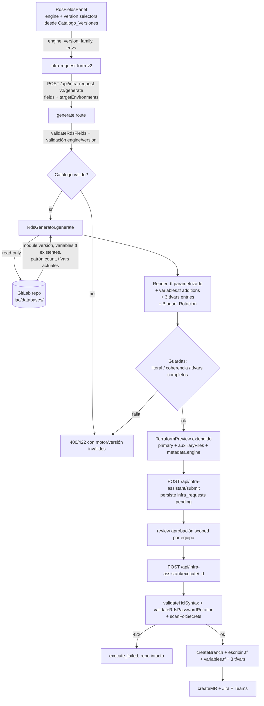

# Design Document

## Overview

Esta feature rediseña cómo el Portal genera el Terraform de una RDS nueva y el formulario
de solicitud asociado, para corregir el incidente de `marketplace-payments-api-db` (fichero
`.tf` autocontenido y desactualizado: módulo `6.6.0`, `engine_version = "16"`,
`family = "postgres16"`, literales incrustados) y alinear el resultado con la
**Convención_Parametrizada** vigente del Repositorio_Destino.

La decisión central de diseño es **abandonar la generación basada exclusivamente en el
agente de IA para RDS** y adoptar un **Generador_RDS determinista** (estilo
`src/lib/squad-infra/`) que:

1. **Introspecciona** `iac/databases/` del Repositorio_Destino para extraer la
   Version_Modulo real (R4) y descubrir qué variables del prefijo `<db>_` ya existen (R3.2)
   y el patrón condicional `count` vigente (R6.3).
2. **Renderiza** el `.tf` de forma determinista, referenciando `engine_version`, `family`,
   `major_engine_version`, `allow_major_version_upgrade` y `apply_immediately` como
   **variables** (cero literales — R3.1), incluyendo el Bloque_Rotacion obligatorio (R5).
3. **Produce las ediciones multi-fichero**: declaraciones para `iac/databases/variables.tf`
   (R3.2) y entradas para los tres `vars/{dev,uat,pro}.tfvars` (R3.3, R6).
4. **Verifica** el resultado contra la selección del formulario (Motor/Version/Familia)
   antes de persistir (guardas de coherencia, literal y completitud de tfvars — R3.6, R6.6,
   R7.5).

El **Catalogo_Versiones** es la **única fuente de verdad** compartida por el Formulario_RDS
(qué motores/versiones se ofrecen y los valores por defecto) y por el Generador_RDS (cómo se
deriva la Familia). Esto elimina la posibilidad de que UI y backend diverjan.

### Por qué determinista y no IA (justificación de la decisión "idónea")

| Criterio | Generador determinista (elegido) | AI + post-proceso | Solo AI (estado actual) |
|----------|----------------------------------|-------------------|-------------------------|
| Reproducibilidad | Total (misma entrada → misma salida) | Alta tras reescritura | Baja (alucinaciones) |
| Parametrización exacta `<db>_` | Garantizada por plantilla | Requiere reescritura forzada del output | No garantizada (causó el incidente) |
| Multi-fichero (variables.tf + 3 tfvars) | Nativo | Difícil de exigir al modelo | No soportado (un solo fichero) |
| Coste/latencia | Nulo / instantáneo | Una llamada Bedrock | Una llamada Bedrock |
| Coherencia Motor/Versión/Familia | Derivada del catálogo | Verificable a posteriori | Frecuentemente incoherente |

El incidente fue consecuencia directa de instruir al modelo a **copiar la versión del módulo
verbatim** y "no actualizar", combinado con plantillas obsoletas y salida de un solo fichero.
Un generador determinista que **lee** del repo (versión de módulo + convención de variables)
e **impone** la parametrización es la opción más robusta. La introspección del repo sigue el
patrón ya probado en `infra-agent.ts` (lectura read-only vía `gitlabClient`), pero la
composición del HCL deja de delegarse al modelo. El `InfraAgent` se conserva sin cambios para
S3, IAM Role y modificaciones complejas; solo cambia la rama RDS de creación.

### Alcance

Dentro: `buildRdsPrompt`/generación RDS, `RdsFields`, `rds-fields.tsx`,
`infra-request-form-v2.tsx`, endpoint `generate`, validación en `execute`, y el nuevo
Catalogo_Versiones + Generador_RDS determinista. Fuera: convenciones del repo `oms`, tipos
S3/IAM (salvo estructura compartida del formulario), salida en modo `standalone` de Next (los
clientes AWS SDK siguen siendo imports top-level — la introspección del repo usa
`gitlabClient`, no AWS SDK, así que no hay impacto).

## Architecture

### Flujo de datos (form → generate → generador → preview → execute → MR)



### Componentes afectados y su rol

- **Catalogo_Versiones** (`src/lib/rds/version-catalog.ts`, NUEVO): fuente de verdad de
  motores, versiones, familias y valores por defecto. Funciones puras de lookup/derivación.
- **RdsGenerator** (`src/lib/rds/rds-generator.ts`, NUEVO): orquesta introspección del repo +
  render determinista + guardas. Reemplaza a `buildRdsPrompt` para creación de RDS.
- **Render determinista** (`src/lib/rds/render-rds.ts`, NUEVO): compone el HCL del `.tf`, las
  declaraciones de variables y las entradas de tfvars (funciones puras).
- **Introspección del repo** (`src/lib/rds/repo-introspection.ts`, NUEVO): lee
  `iac/databases/` vía `gitlabClient` para extraer Version_Modulo, variables existentes y
  patrón `count`.
- **RdsFieldsPanel** (`rds-fields.tsx`, MODIFICADO): selector de Motor + selector de Versión
  dirigidos por el catálogo, reset on engine change, etiqueta "PostgreSQL" (MySQL no se ofrece).
- **generate route** (MODIFICADO): valida Motor/Versión contra el catálogo y delega en
  `RdsGenerator` para `resourceType === 'rds'`.
- **execute route** (MODIFICADO): escribe los ficheros auxiliares (variables.tf + 3 tfvars)
  además del `.tf` primario; refuerza `validateRdsPasswordRotation`.
- **terraform-validator** (MODIFICADO): `validateRdsPasswordRotation` verifica los 4 atributos
  con valores exactos (incluido `master_user_password_rotate_immediately = false`).

### Estrategia de salida multi-fichero

El `TerraformPreview` actual modela **un solo fichero** (`filePath` + `content`). Esta feature
lo extiende con un array opcional `auxiliaryFiles` de operaciones de fichero
(`create | append | upsert-entries`). El generador RDS emite:

- 1 operación primaria: `create` de `iac/databases/<identifier>.tf`.
- 1 operación: `append`/`upsert` sobre `iac/databases/variables.tf` (solo variables nuevas).
- 3 operaciones: `upsert-entries` sobre `iac/databases/vars/{dev,uat,pro}.tfvars`.

El endpoint `execute` itera `auxiliaryFiles` aplicando cada operación con bloqueo optimista
(igual que el manejo de ficheros compartidos existente). El mapeo `prod → pro.tfvars` se
resuelve en el generador (R6.4).

## Components and Interfaces

### Catalogo_Versiones

```typescript
// src/lib/rds/version-catalog.ts

export type RdsEngine = 'postgres'

export interface EngineVersion {
  /** Version mayor del motor, p.ej. "18" (postgres). */
  version: string
  /** Parameter group family asociada, p.ej. "postgres18". */
  family: string
}

export interface EngineCatalogEntry {
  engine: RdsEngine
  /** Versiones permitidas, ordenadas; la primera marcada default es la Version_Estandar. */
  versions: EngineVersion[]
  /** Version_Estandar (debe existir en `versions`). */
  defaultVersion: string
}

/** Fuente de verdad única (form + generador). */
export const VERSION_CATALOG: Record<RdsEngine, EngineCatalogEntry> = {
  postgres: {
    engine: 'postgres',
    defaultVersion: '18',
    versions: [
      { version: '18', family: 'postgres18' },
      { version: '17', family: 'postgres17' },
      { version: '16', family: 'postgres16' },
      { version: '15', family: 'postgres15' },
    ],
  },
}

// NOTA (decisión organizativa): MySQL NO es un motor soportado para RDS nuevas.
// No existe entrada `mysql` en el catálogo; el Formulario_RDS solo ofrece
// PostgreSQL y el Generador_RDS rechaza cualquier otro motor con `invalid_engine`.
export const SUPPORTED_ENGINES: RdsEngine[] = ['postgres']

/** true si `engine` es un Motor soportado. */
export function isSupportedEngine(engine: string): engine is RdsEngine

/** Devuelve las versiones del Motor, o [] si el motor no existe (catálogo vacío). */
export function versionsForEngine(engine: string): EngineVersion[]

/** Version_Estandar del Motor (R2.2, R2.3). */
export function defaultVersionForEngine(engine: RdsEngine): string

/** Deriva la Familia desde (engine, version) usando el catálogo. null si no existe (R2.4, R7.3). */
export function familyForVersion(engine: string, version: string): string | null

/** true si (engine, version) pertenece al catálogo (R1.5, R2.5). */
export function isValidEngineVersion(engine: string, version: string): boolean
```

### RdsFields extendido (compatibilidad hacia atrás)

```typescript
// src/lib/infra-prompt-builder.ts  (RdsFields extendido)

export interface RdsFields {
  identifier: string
  dbName: string
  instanceClass: string
  storageGb: number
  multiAz: boolean
  /** Version mayor del motor (antes "versión de PostgreSQL"). */
  engineVersion: string
  /** NUEVO. Motor de base de datos. Por compatibilidad, ausente ⇒ 'postgres'. */
  engine?: RdsEngine
  /** NUEVO (derivado). Familia del parameter group; el generador la recalcula desde el catálogo. */
  family?: string
}
```

`engine` es opcional para no romper payloads previos: si llega ausente, el generador y el
validador asumen `postgres` (comportamiento histórico). El formulario siempre lo envía.

### RdsGenerator (sustituye a buildRdsPrompt para creación de RDS)

```typescript
// src/lib/rds/rds-generator.ts

export interface RdsGenerateInput {
  fields: RdsFields                 // engine, engineVersion, identifier, dbName, ...
  targetEnvironments: string[]      // subconjunto de dev/uat/prod (portal)
  projectId: number
  defaultBranch: string
  /** Version_Modulo estándar configurada del Portal (fallback, R4.4/R4.5). */
  portalDefaultModuleVersion: string
}

export interface RdsGenerateOk {
  ok: true
  preview: TerraformPreview         // extendido con auxiliaryFiles + metadata.engine
}

export interface RdsGenerateError {
  ok: false
  /** 'invalid_engine' | 'invalid_version' | 'missing_databases_dir' |
   *  'literal_guard' | 'tfvars_incomplete' | 'coherence_mismatch' */
  code: string
  message: string
}

export type RdsGenerateResult = RdsGenerateOk | RdsGenerateError

export class RdsGenerator {
  constructor(private gitlab = gitlabClient) {}
  async generate(input: RdsGenerateInput): Promise<RdsGenerateResult>
}
```

### Introspección del repo (read-only)

```typescript
// src/lib/rds/repo-introspection.ts

export interface RepoRdsConvention {
  /** Version_Modulo seleccionada según R4.2/R4.3 (más frecuente, empate→mayor semver). */
  moduleVersion: string | null
  /** Nombres de variables ya declaradas en iac/databases/variables.tf (con prefijo incluido). */
  existingVariables: Set<string>
  /** Plantilla del patrón count vigente, p.ej. count = contains([...], var.environment) ? 1 : 0. */
  countPatternFound: boolean
  /** true si iac/databases/ existe y es legible (R3.5). */
  databasesDirReadable: boolean
}

/** Lee iac/databases/ vía gitlabClient. Nunca lanza por fichero ausente; señala con flags. */
export async function readRdsConvention(
  gitlab: typeof gitlabClient, projectId: number, branch: string,
): Promise<RepoRdsConvention>

/** Extrae la version del bloque module source=terraform-aws-modules/rds/aws (R4.2). */
export function extractModuleVersions(tfContents: string[]): string[]

/** Selecciona Version_Modulo: más frecuente; empate → mayor semver (R4.3). */
export function selectModuleVersion(versions: string[]): string | null
```

### Render determinista

```typescript
// src/lib/rds/render-rds.ts

export interface ParameterizedVar {
  /** Nombre con prefijo, p.ej. "<db>_rds_version". */
  name: string
  /** Tipo Terraform: "string" | "bool". */
  type: 'string' | 'bool'
  /** Valor por entorno para los tfvars. */
  values: { dev: string; uat: string; pro: string }
}

export interface RenderedRds {
  /** Contenido del .tf primario (referencias a variables, Bloque_Rotacion, count). */
  tf: string
  /** Declaraciones variable "..." {} a insertar en variables.tf (solo las nuevas). */
  variableDeclarations: string
  /** Las 5 variables parametrizadas con sus valores por entorno. */
  vars: ParameterizedVar[]
}

/** Compone el .tf, declaraciones y variables. dbPrefix = tfId(identifier). */
export function renderRds(
  fields: RdsFields, family: string, moduleVersion: string,
  targetEnvironments: string[], existingVariables: Set<string>,
): RenderedRds

/** Inserta/actualiza entradas `key = value` en un tfvars preservando el resto (R6.1, R6.3). */
export function upsertTfvarsEntries(
  currentContent: string, entries: Array<{ key: string; value: string; type: 'string' | 'bool' }>,
): string
```

### TerraformPreview extendido

```typescript
// src/lib/infra-agent.ts  (TerraformPreview extendido)

export interface AuxiliaryFileOp {
  filePath: string
  /** create: fichero nuevo · append: añadir al final · upsert-entries: fusionar k=v (tfvars). */
  op: 'create' | 'append' | 'upsert-entries'
  /** Para create/append: contenido literal. */
  content?: string
  /** Para upsert-entries: entradas a fusionar. */
  entries?: Array<{ key: string; value: string; type: 'string' | 'bool' }>
}

export interface TerraformPreview {
  filePath: string
  content: string
  resourceType: string
  resourceName: string
  targetEnvironments: string[]
  estimatedCostMonthly: number | null
  /** NUEVO. Ficheros adicionales (variables.tf + 3 tfvars). */
  auxiliaryFiles?: AuxiliaryFileOp[]
  /** NUEVO. Metadatos verificados frente al formulario. */
  metadata?: { engine?: RdsEngine; engineVersion?: string; family?: string }
}
```

### Validador reforzado

```typescript
// src/lib/terraform-validator.ts

/** Verifica los 4 atributos del Bloque_Rotacion con valores EXACTOS (R5.2).
 *  Añade la comprobación de master_user_password_rotate_immediately = false. */
export function validateRdsPasswordRotation(content: string): ValidationResult
```

## Data Models

### Las cinco variables parametrizadas (prefijo `<db>_`)

Para un `identifier` cuyo prefijo Terraform es `<db>` (p.ej. `marketplace_payments_api`):

| Variable | Tipo | Valor PostgreSQL 18 |
|----------|------|---------------------|
| `<db>_rds_version` | string | `"18"` |
| `<db>_family` | string | `"postgres18"` |
| `<db>_major_engine_version` | string | `"18"` |
| `<db>_allow_major_version_upgrade` | bool | `false` |
| `<db>_apply_immediately` | bool | `false` |

Los mismos valores se escriben en **los tres** tfvars (R6.1): el recurso solo se crea en los
Entornos_Destino mediante `count`, pero las variables tienen valor en todos los entornos para
que `terraform plan` no falle (R6.2).

### Ejemplo: RDS PostgreSQL 18 `marketplace-payments-api-db`, entornos dev+uat

`iac/databases/marketplace-payments-api-db.tf` (primario):

```hcl
module "marketplace_payments_api_db" {
  source  = "terraform-aws-modules/rds/aws"
  version = "<leída del repo, p.ej. 6.10.0>"

  identifier = "marketplace-payments-api-db"
  count      = contains(["dev", "uat"], var.environment) ? 1 : 0

  engine            = "postgres"
  engine_version    = var.marketplace_payments_api_db_rds_version
  family            = var.marketplace_payments_api_db_family
  major_engine_version         = var.marketplace_payments_api_db_major_engine_version
  allow_major_version_upgrade  = var.marketplace_payments_api_db_allow_major_version_upgrade
  apply_immediately            = var.marketplace_payments_api_db_apply_immediately

  db_name        = "marketplace_payments"
  instance_class = var.environment == "prod" ? "db.t4g.medium" : "db.t4g.micro"
  allocated_storage = 20
  multi_az          = var.environment == "prod" ? true : false

  # Rotación obligatoria de contraseña master (Bloque_Rotacion)
  manage_master_user_password                       = true
  manage_master_user_password_rotation              = true
  master_user_password_rotate_immediately           = false
  master_user_password_rotation_schedule_expression = "rate(15 days)"

  tags = {
    Terraform   = true
    Environment = var.environment
    Project     = "marketplace"
  }
}
```

> Nota: `count` sobre el módulo se usa aquí porque los Entornos_Destino no incluyen los tres
> entornos. El generador reproduce el **patrón condicional vigente del repo** detectado por la
> introspección (R6.3); si el repo usa otra forma del ternario, se respeta esa forma.

`iac/databases/variables.tf` (append, solo variables que no existían):

```hcl
variable "marketplace_payments_api_db_rds_version" { type = string }
variable "marketplace_payments_api_db_family" { type = string }
variable "marketplace_payments_api_db_major_engine_version" { type = string }
variable "marketplace_payments_api_db_allow_major_version_upgrade" { type = bool }
variable "marketplace_payments_api_db_apply_immediately" { type = bool }
```

`iac/databases/vars/dev.tfvars`, `uat.tfvars` y `pro.tfvars` (upsert — mismas entradas en los 3):

```hcl
marketplace_payments_api_db_rds_version                  = "18"
marketplace_payments_api_db_family                       = "postgres18"
marketplace_payments_api_db_major_engine_version         = "18"
marketplace_payments_api_db_allow_major_version_upgrade  = false
marketplace_payments_api_db_apply_immediately            = false
```

### Mapeo entorno Portal → Fichero_Tfvars

| Entorno Portal | Fichero_Tfvars |
|----------------|----------------|
| `dev` | `iac/databases/vars/dev.tfvars` |
| `uat` | `iac/databases/vars/uat.tfvars` |
| `prod` | `iac/databases/vars/pro.tfvars` |

El valor de las 5 variables es idéntico en los 3 ficheros (R6.1); el scoping por entorno lo
hace `count`, no la ausencia de variable.

## Correctness Properties

*Una propiedad es una característica o comportamiento que debe cumplirse en todas las
ejecuciones válidas del sistema — esencialmente, una afirmación formal sobre lo que el
software debe hacer. Las propiedades sirven de puente entre las especificaciones legibles por
humanos y las garantías de corrección verificables por máquina.*

Tras la reflexión de propiedades se consolidaron criterios redundantes: 1.3/2.1/2.4/7.3 se
unifican en la coherencia catálogo↔motor; 6.1/6.2/6.4 en la cobertura de tfvars; 1.6/7.2 en
la fidelidad de metadatos; 5.1/5.4 en el invariante de salida de seguridad. Los criterios de
UI puros (1.1, 1.2, 2.7, 7.4, 6.5), de integración (3.4, 5.3) y casos de configuración (2.6,
4.4, 4.5, 3.5) se cubren con tests de ejemplo/integración (ver Testing Strategy), no con PBT.

### Property 1: Coherencia entre catálogo, motor y familia

*Para todo* Motor soportado `e` y *para toda* Version_Motor `v` de su Catalogo_Versiones, la
Familia derivada `familyForVersion(e, v)` empieza por el nombre del motor (`postgres*` para
postgres) y nunca por el de otro motor; y `versionsForEngine(e)` contiene
únicamente pares pertenecientes a `e`.

**Validates: Requirements 1.3, 2.1, 2.4, 7.3**

### Property 2: Reset de versión al cambiar de motor

*Para todo* par (motorNuevo, versionPrevia), si `versionPrevia` no pertenece al
Catalogo_Versiones de `motorNuevo`, entonces la reconciliación del formulario descarta la
versión previa y la sustituye por `defaultVersionForEngine(motorNuevo)` (o el estado "sin
selección" que bloquea el envío); si sí pertenece, se conserva.

**Validates: Requirements 1.4**

### Property 3: Rechazo de motor inválido

*Para todo* string `e` que no pertenezca a `{postgres}` (incluido `mysql`), `RdsGenerator.generate` no
produce Preview_Terraform y devuelve un error cuyo mensaje contiene `e` y enumera los valores
admitidos.

**Validates: Requirements 1.5**

### Property 4: Rechazo de versión inválida

*Para todo* Motor válido `e` y *para toda* versión `v` que no pertenezca a su
Catalogo_Versiones, `RdsGenerator.generate` no produce Preview_Terraform y devuelve un error
cuyo mensaje identifica `v` y `e`.

**Validates: Requirements 2.5**

### Property 5: Fidelidad de metadatos entre preview y formulario

*Para toda* solicitud RDS válida, el Preview_Terraform producido tiene
`metadata.engine`, `metadata.engineVersion` y `targetEnvironments` exactamente iguales a los
recibidos del Formulario_RDS, sin sustituirlos por valores por defecto.

**Validates: Requirements 1.6, 7.2**

### Property 6: Parametrización sin literales con prefijo `<db>_`

*Para toda* solicitud RDS válida, en el `.tf` generado cada uno de los cinco atributos
(`engine_version`, `family`, `major_engine_version`, `allow_major_version_upgrade`,
`apply_immediately`) se asigna mediante una referencia `var.<db>_...` con el prefijo
`<db> = tfId(identifier)`, y ninguno de ellos aparece con valor literal.

**Validates: Requirements 3.1**

### Property 7: Declaraciones de variables = referenciadas menos existentes

*Para todo* conjunto de variables ya declaradas en el Fichero_Variables, las declaraciones que
el generador añade son exactamente las cinco variables parametrizadas que aún no existían (sin
duplicar ninguna ya presente y sin omitir ninguna ausente).

**Validates: Requirements 3.2**

### Property 8: Cobertura completa y bien tipada de los tres tfvars

*Para todo* contenido inicial de los tres Fichero_Tfvars y *para todo* subconjunto de
Entornos_Destino, tras la generación cada uno de los tres ficheros (`dev.tfvars`,
`uat.tfvars`, `pro.tfvars`, con `prod`→`pro.tfvars`) contiene una entrada con valor no vacío
para cada una de las cinco variables, con el tipo correcto (bool sin comillas, string entre
comillas), independientemente de los entornos seleccionados.

**Validates: Requirements 3.3, 6.1, 6.2, 6.4**

### Property 9: Guarda anti-literal

*Para todo* `.tf` candidato, la guarda detecta como inválido (bloqueo) cualquier asignación
literal de los cinco atributos parametrizados, y como válido el caso en que todos usan
referencias `var.<db>_...`.

**Validates: Requirements 3.6**

### Property 10: Version_Modulo exacta sin operadores

*Para toda* solicitud RDS válida, la `version` del bloque `module` generado es exactamente la
Version_Modulo seleccionada del repo (o el fallback configurado) y no contiene operadores de
rango (`~>`, `>=`, `<=`, `>`, `<`, `=`), ajustándose a `MAJOR.MINOR.PATCH`.

**Validates: Requirements 4.1**

### Property 11: Extracción de versiones del módulo RDS

*Para todo* conjunto de contenidos `.tf`, `extractModuleVersions` devuelve exactamente las
`version` de los bloques `module` cuyo `source` es `terraform-aws-modules/rds/aws`, sin incluir
versiones de bloques con otros `source`.

**Validates: Requirements 4.2**

### Property 12: Selección de Version_Modulo (moda; empate→mayor semver)

*Para todo* multiset no vacío de versiones, `selectModuleVersion` devuelve la versión más
frecuente; en caso de empate de frecuencia, devuelve la mayor según orden semver.

**Validates: Requirements 4.3**

### Property 13: Rotación obligatoria y ausencia de contraseña en claro

*Para toda* solicitud RDS válida, el `.tf` generado contiene los cuatro atributos del
Bloque_Rotacion con sus valores exactos (`manage_master_user_password = true`,
`manage_master_user_password_rotation = true`,
`master_user_password_rotate_immediately = false`,
`master_user_password_rotation_schedule_expression = "rate(15 days)"`) y no contiene ninguna
asignación literal de `password`.

**Validates: Requirements 5.1, 5.4**

### Property 14: Validador de rotación exacto

*Para todo* contenido `.tf`, `validateRdsPasswordRotation` devuelve válido si y solo si los
cuatro atributos del Bloque_Rotacion están presentes con su valor exacto; cualquier omisión o
valor distinto produce inválido listando cada atributo ausente o incorrecto.

**Validates: Requirements 5.2**

### Property 15: Scoping multi-entorno mediante count

*Para todo* subconjunto no vacío de Entornos_Destino, si no incluye los tres entornos el `.tf`
generado contiene un `count = contains([...envsSeleccionados], var.environment) ? 1 : 0` cuya
lista es exactamente los entornos seleccionados; si incluye los tres, el `.tf` no contiene
`count` en el módulo. En ambos casos las cinco variables conservan valor en los tres tfvars.

**Validates: Requirements 6.3**

### Property 16: Guarda de completitud de tfvars

*Para todo* plan de escritura de tfvars, si alguna de las cinco variables quedaría sin valor en
alguno de los tres ficheros, la guarda aborta la generación identificando la variable y el
Fichero_Tfvars afectados; si la cobertura es completa (5×3), la guarda pasa.

**Validates: Requirements 6.6**

### Property 17: Guarda de coherencia preview↔formulario

*Para todo* Preview_Terraform candidato, si su Motor, Version_Motor o Familia difieren de los
seleccionados en el Formulario_RDS, la guarda rechaza la generación identificando el campo
discrepante y no se persiste el preview; si los tres coinciden, la guarda pasa.

**Validates: Requirements 7.5**

## Error Handling

| Situación | Detección | Respuesta | Estado del repo |
|-----------|-----------|-----------|------------------|
| Motor inválido (R1.5) | `isSupportedEngine` en generate | 400/422 `invalid_engine`, mensaje con motor recibido + admitidos | intacto (no se genera) |
| Versión fuera de catálogo (R2.5) | `isValidEngineVersion` | 400/422 `invalid_version`, mensaje con versión + motor | intacto |
| Catálogo del motor vacío (R2.6) | `versionsForEngine(e).length === 0` | Form deshabilita submit + mensaje; generate no procede | intacto |
| `iac/databases/` ausente/ilegible (R3.5) | `RepoRdsConvention.databasesDirReadable === false` | abortar `missing_databases_dir`, mensaje "no se pudo determinar la Convención_Parametrizada" | intacto |
| Literal en uno de los 5 atributos (R3.6) | guarda anti-literal sobre el `.tf` | bloquear emisión y regenerar con referencia; si persiste, `literal_guard` | intacto |
| Sin bloque `module rds/aws` (R4.4) | `selectModuleVersion([]) === null` | usar `portalDefaultModuleVersion`, registrar incidencia (logger) | continúa |
| Falla lectura del repo (R4.5) | excepción de `gitlabClient` capturada | usar `portalDefaultModuleVersion`, registrar; no interrumpir | continúa |
| Falta rotación en `.tf` (R5.3) | `validateRdsPasswordRotation` en execute | **422**, mensaje listando atributos ausentes/incorrectos | **intacto** (sin rama/commit/MR) |
| Secreto detectado (existente) | `scanForSecrets` en execute | 422 | intacto |
| Variable sin valor en algún tfvars (R6.6) | guarda de completitud en generate | abortar `tfvars_incomplete`, identifica variable + fichero | intacto |
| Entornos_Destino vacíos (R6.5) | validación de formulario | submit deshabilitado + mensaje | intacto |
| Mismatch engine/version/family (R7.5) | guarda de coherencia preview↔form | `coherence_mismatch`, identifica campo; no persistir | intacto |

Principios: (1) toda condición de error previa a `execute` deja el repo **sin modificar**; (2)
los errores de validación en `execute` devuelven **422** y, gracias al rollback de rama
existente, no dejan ramas huérfanas; (3) los fallos de introspección no críticos (versión de
módulo) **degradan** al fallback configurado en lugar de abortar (R4.4, R4.5); (4) las guardas
deterministas (anti-literal, completitud de tfvars, coherencia) se ejecutan **antes** de
producir el `TerraformPreview`, no después.

## Testing Strategy

El repo usa `node:test` (vía `tsx --test`) + `fast-check` para property-based testing
(`package.json`: `"test": "tsx --test src/lib/__tests__/*.test.ts"`, `fast-check ^4.7.0`). Los
tests viven en `src/lib/__tests__/*.property.test.ts` y `*.test.ts`.

### Enfoque dual

- **Property tests** (fast-check, ≥100 iteraciones) para la lógica pura: catálogo, derivación
  de familia, parametrización, merge de tfvars, selección de versión de módulo, validador de
  rotación y guardas. Las propiedades 1–17 de este documento.
- **Unit/example tests** para valores concretos y UI: defaults del catálogo (2.2, 2.3),
  render del panel (1.1, 1.2, 2.7, 7.4), validación de envío del form (6.5, 7.1), casos límite
  (2.6, 4.4).
- **Integration tests** (con `gitlabClient` mockeado) para el wiring: que `generate` lee
  `iac/databases/` antes de renderizar (3.4); que `execute` devuelve 422 sin crear rama/MR
  cuando falta la rotación (5.3) o el `.tf` es inválido; que las operaciones `auxiliaryFiles`
  se aplican a los tres tfvars + variables.tf.

### Configuración de property tests

- Mínimo **100 iteraciones** por property test (`{ numRuns: 100 }`, o 200 para guardas
  críticas).
- Cada property test referencia su propiedad de diseño con un comentario tag:
  `// Feature: portal-rds-creation-improvement, Property {n}: {texto}`.
- Cada propiedad de corrección se implementa con **un único** property test.

### Generadores (arbitraries) propuestos

- `engineArb`: `fc.constantFrom('postgres')` (PostgreSQL es el único motor soportado).
- `validEngineVersionArb`: elige una versión de PostgreSQL del catálogo.
- `invalidEngineArb`: `fc.string()` filtrado para excluir `postgres` (p.ej. `mysql`, `oracle`).
- `identifierArb`: `fc.stringMatching(/^[a-z][a-z0-9-]{1,40}[a-z0-9]$/)` (para ejercitar
  `tfId` y el prefijo `<db>_`).
- `targetEnvsArb`: subconjunto no vacío de `['dev','uat','prod']`.
- `moduleVersionsArb`: `fc.array(fc.stringMatching(/^\d+\.\d+\.\d+$/))` para `selectModuleVersion`.
- `tfvarsContentArb`: contenido inicial arbitrario de tfvars (líneas `k = v`) para validar el
  upsert no destructivo.
- `existingVarsArb`: subconjunto de las cinco variables como ya declaradas.

### Notas de implementación para tests

- El `RdsGenerator` recibe `gitlabClient` por inyección, de modo que las propiedades que tocan
  el repo usan un doble que devuelve `RepoRdsConvention` controlado (sin red).
- Las funciones de `version-catalog.ts`, `render-rds.ts` y `repo-introspection.ts`
  (`extractModuleVersions`, `selectModuleVersion`, `upsertTfvarsEntries`) son puras y se testean
  de forma aislada — el grueso de las propiedades.
- `validateRdsPasswordRotation` se testea con mutación: partir de un `.tf` válido y mutar/omitir
  cada atributo del Bloque_Rotacion, verificando rechazo (Property 14).
- Modo de salida `standalone` de Next: la lógica nueva no introduce imports AWS SDK; usa
  `gitlabClient` (fetch). No hay impacto en el bundling.
