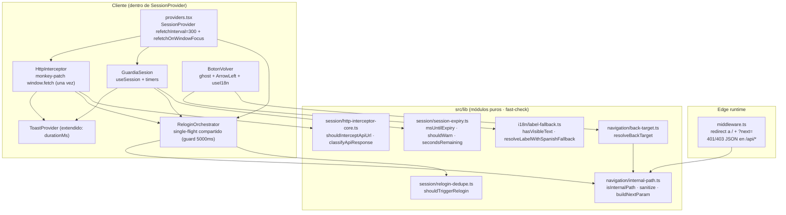
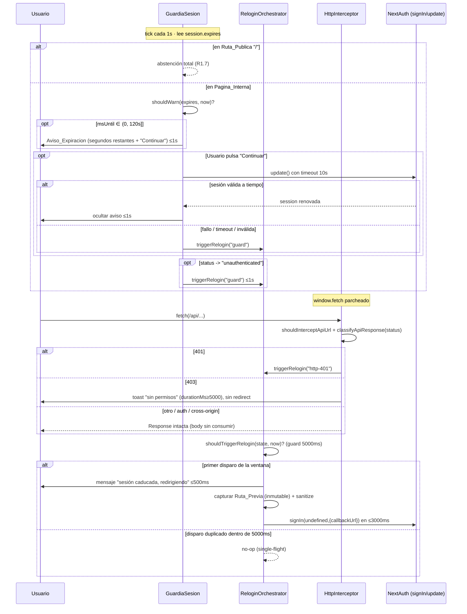

# Design Document

## Overview

Esta feature endurece dos frentes transversales del Platform Portal (Next.js 14 App Router, NextAuth v4 + Azure AD, `session.strategy="jwt"`, `maxAge` 1800 s rolling):

- **Frente A — Sesión/login.** Detectar en cliente que la sesión está por caducar o ya caducó, avisar sin bloquear, interceptar de forma global las respuestas `401`/`403` de `/api/*` y ejecutar un flujo de re-login limpio que devuelva al usuario a la ruta previa.
- **Frente B — Navegación.** Un único componente `Boton_Volver` (shadcn `Button variant="ghost"` + `ArrowLeft`, texto por i18n) que sustituye los 6 botones inline inconsistentes y se reutiliza (con destino explícito) donde hay navegación entre niveles internos.

**Principio de diseño rector:** toda la lógica decidible (validación anti open-redirect del `next`/`callbackUrl`, resolución del destino del `Boton_Volver`, deduplicación del re-login, clasificación de respuestas del interceptor, cálculo de instantes de expiración y fallback i18n) vive en **módulos puros bajo `src/lib/`**, sin dependencias de React ni de Node runtime, para (a) ser importable desde el middleware edge, desde componentes cliente y desde el interceptor, y (b) quedar cubierta por el glob de `npm test` con `fast-check` sin ampliarlo.

No se toca el modelo RBAC ni el `maxAge` de la sesión. No se introduce refresh token de Azure. El diagnóstico ya está cerrado: el problema es la UX de expiración + interceptación + navegación uniforme.

### Restricciones verificadas del código actual (condicionan el diseño)

1. `src/components/providers.tsx`: `<SessionProvider>` se monta **sin props**. Aquí montamos la config (`refetchInterval={300}`, `refetchOnWindowFocus`) y, una sola vez, el `Guardia_Sesion` y el `Interceptor_HTTP`.
2. `src/lib/i18n.tsx`: `t(key, fallback)` devuelve `translations[key] || fallback || key`. **Solo el locale activo está en memoria** (carga perezosa). Por tanto el fallback a español (R7 c6) NO es gratis: requiere tener el valor español disponible en el propio componente y un resolutor puro dedicado.
3. `src/components/ui/toast.tsx`: `useToast().toast(type, message)` **auto-cierra a 4000 ms hardcodeados**. R2 c3 exige que el aviso de `403` permanezca **≥ 5000 ms**. Se extiende la firma del toast a `toast(type, message, opts?: { durationMs?: number })` (retrocompatible: default 4000).
4. `middleware.ts`: corre en **edge runtime**. La validación de rutas que importe debe ser JS puro sin `Buffer`/`node:*`.
5. `src/components/conditional-shell.tsx`: `STANDALONE_PATHS = ["/"]` decide si se renderiza `PortalShell`. Es el punto natural para anclar el `Boton_Volver` a nivel de layout (una Pagina_Interna ⟺ se renderiza dentro de `PortalShell`).

## Architecture

### Mapa de componentes



### Flujo de expiración / aviso / re-login



### Decisiones técnicas y su justificación

**D1 — Interceptor: monkey-patch de `window.fetch` (una vez) vs wrapper `apiFetch`.**
Se elige **monkey-patch de `window.fetch`** instalado una única vez por un componente cliente montado dentro del `SessionProvider`. Razón: hoy cada componente usa `fetch` directo (docenas de call-sites); un wrapper `apiFetch` exigiría migración gradual y dejaría huecos (fallos silenciosos justo lo que R2 quiere eliminar). El monkey-patch es transversal desde el minuto uno y cumple R2.1 (“interceptar de forma transversal … con independencia del método”). Se instala idempotentemente (marca en el objeto parcheado) y **preserva el contrato**: envuelve la promesa, inspecciona solo `response.status` y la URL, y **devuelve el mismo objeto `Response` sin leer su body** (no `.json()`/`.text()`/`.clone()` del stream que consuma el original) para no violar R2.5/R2.7. Los errores de red se propagan tal cual (R2.8). Se excluye `/api/auth/` (R2.4) y todo lo que no sea mismo-origen `/api/` (R2.1).

**D2 — Un único orquestador de re-login compartido.**
`Guardia_Sesion` (R1) y `Interceptor_HTTP` (R2) comparten un **único `ReloginOrchestrator`** (contexto React con estado `lastTriggeredAt`) cuya decisión de disparar se delega en la función pura `shouldTriggerRelogin` con ventana de 5000 ms. Así R4.7 (disparo único ante disparos concurrentes de ambas fuentes) se cumple por construcción y la dedupe de 401 (R2.6) es el mismo mecanismo.

**D3 — Módulos puros importables desde edge.**
`internal-path.ts` no usa `Buffer` ni `node:*`; usa solo `String`/regex, así el `middleware.ts` (edge) y el cliente comparten exactamente la misma validación (R3.3/R3.4 ≡ R4.2/R4.3 ≡ R5.8). Una sola fuente de verdad evita divergencias de seguridad.

**D4 — Ubicación del `Boton_Volver`: centralizado en el header de página del `PortalShell`.**
Se ancla el `Boton_Volver` **una sola vez** en la cabecera de página que `PortalShell` ya renderiza (junto a `PageHeader`), no por página. Esto garantiza R6.1 (exactamente uno por Pagina_Interna), R6.7 (posición idéntica y verificable) y R6.2 (cero en `/`, que no usa `PortalShell`). Los botones inline se borran (R6.3). El caso de `comparison-explorer.tsx` (navegación entre niveles) se resuelve reutilizando el **mismo componente** con `destination` explícito (R6.4), fuera del anclaje de layout.

**D5 — Fallback i18n a español.**
Como el provider solo tiene el locale activo cargado y `t` no cae a español, el `Boton_Volver` pasa el literal español como `fallback` de `t("common.back", ES_BACK_LABEL)` y, además, la decisión se formaliza en el resolutor puro `resolveLabelWithSpanishFallback` (testeable) que aplica la regla “si el valor del locale activo no tiene texto visible, usar el español” (R7.6). El literal español se importa estáticamente de una constante compartida con `es.json` para no romper la carga perezosa.

## Components and Interfaces

### Módulos puros (`src/lib/`)

#### `src/lib/navigation/internal-path.ts`

```ts
export const MAX_INTERNAL_PATH_LENGTH = 2048;

/**
 * Validación TOTAL de ruta interna. Nunca lanza; para CUALQUIER entrada
 * devuelve boolean. Fuente única para middleware, callbackUrl y BotonVolver.
 * Válida sii: string, longitud 1..2048, empieza por un único "/",
 * no empieza por "//" ni "/\", no contiene "://", no contiene \r \n \t.
 */
export function isInternalPath(candidate: unknown): boolean;

/** Devuelve la ruta si es interna válida, o "/" en cualquier otro caso. */
export function sanitizeInternalPath(candidate: unknown): string;

/** pathname (+ search) → cadena de Ruta_Previa cruda (sin encode). */
export function capturePreviousRoute(pathname: string, search?: string): string;

/**
 * Valor listo para ?next=: encodeURIComponent(rutaPrevia) si la ruta cruda
 * es interna válida; en caso contrario "" (el llamador omite el parámetro).
 * El resultado siempre respeta el tope de 2048 sobre la ruta cruda.
 */
export function buildNextParam(pathname: string, search?: string): string;

/** Decodifica y valida un ?next= recibido → ruta interna o "/". */
export function resolveNextParam(rawNext: unknown): string;
```

#### `src/lib/session/session-expiry.ts`

```ts
export const WARNING_THRESHOLD_MS = 120_000; // Umbral_Aviso

/** ms hasta expiry; NaN/entrada inválida → 0 (tratado como expirado). */
export function msUntilExpiry(expiresIso: string | null | undefined, now: number): number;

/** true sii 0 < msUntilExpiry <= WARNING_THRESHOLD_MS. */
export function shouldWarn(expiresIso: string | null | undefined, now: number): boolean;

/** true sii msUntilExpiry <= 0. */
export function isExpired(expiresIso: string | null | undefined, now: number): boolean;

/** Segundos restantes redondeados hacia arriba, nunca negativos. */
export function secondsRemaining(expiresIso: string | null | undefined, now: number): number;
```

#### `src/lib/session/relogin-dedupe.ts`

```ts
export const RELOGIN_DEDUPE_MS = 5000;

export interface ReloginState {
  /** epoch ms del último disparo, o null si nunca. */
  lastTriggeredAt: number | null;
}

/** true sii no hay disparo previo o el previo es de hace >= 5000ms. */
export function shouldTriggerRelogin(state: ReloginState, now: number): boolean;

/** Nuevo estado tras un disparo (inmutable). */
export function markTriggered(state: ReloginState, now: number): ReloginState;
```

#### `src/lib/session/http-interceptor-core.ts`

```ts
export type InterceptAction = "relogin" | "forbidden" | "passthrough";

/**
 * true sii la URL es mismo-origen, su path empieza por "/api/"
 * y NO empieza por "/api/auth/". Acepta URL relativa o absoluta al origen.
 */
export function shouldInterceptApiUrl(url: string, origin: string): boolean;

/** 401 → "relogin", 403 → "forbidden", cualquier otro → "passthrough". */
export function classifyApiResponse(status: number): InterceptAction;
```

#### `src/lib/navigation/back-target.ts`

```ts
export type BackTarget =
  | { kind: "explicit"; path: string }   // navegar a path (ruta interna validada)
  | { kind: "history-or-home" };         // intentar history.back, si no "/"

/**
 * destination === undefined  -> { history-or-home }   (R5.7 + R6.5/6.6)
 * destination interno válido -> { explicit, path }     (R5.6)
 * destination presente inválido -> { explicit, "/" }   (R5.8)
 */
export function resolveBackTarget(destination?: string): BackTarget;
```

#### `src/lib/i18n/label-fallback.ts`

```ts
/** true sii el string tiene al menos un carácter no-espacio. */
export function hasVisibleText(value: unknown): boolean;

/** Etiqueta compartida del botón volver (fuente del fallback español). */
export const ES_BACK_LABEL = "Volver";

/**
 * Resolución TOTAL del texto:
 *  - si el valor del locale activo tiene texto visible -> ese valor
 *  - si no, si el español tiene texto visible          -> español (R7.6)
 *  - si no                                             -> key
 */
export function resolveLabelWithSpanishFallback(
  activeValue: unknown,
  spanishValue: unknown,
  key: string,
): string;
```

### Componentes cliente

#### `ReloginOrchestrator` (`src/components/session/relogin-orchestrator.tsx`)

Contexto React montado una vez dentro del `SessionProvider`. Mantiene `ReloginState` en un `useRef` (no re-render) y expone:

```ts
interface ReloginApi {
  /** Punto de entrada ÚNICO. source solo informativo para telemetría. */
  triggerRelogin(source: "guard" | "http-401" | "guard-refresh-failed"): void;
}
export function useReloginOrchestrator(): ReloginApi;
```

Lógica de `triggerRelogin`:
1. `now = Date.now()`; si `!shouldTriggerRelogin(state.current, now)` → no-op (R2.6, R4.7).
2. `state.current = markTriggered(state.current, now)`.
3. Captura inmutable de `next = buildNextParam(pathname, search)` y `callbackUrl = sanitizeInternalPath(decodeURIComponent(next))` (R4.1). Si el usuario está en `/` → `callbackUrl = "/"` (R1.7 refuerza que el guard no dispara en `/`; el interceptor sí puede, y entonces `callbackUrl="/"`).
4. Muestra mensaje “sesión caducada, redirigiendo” en ≤500 ms vía toast (R4.6).
5. Programa `signIn(undefined, { callbackUrl })` a ejecutar en ≤3000 ms (R4.6). `callbackUrl` interno válido ⇒ NextAuth vuelve a la Ruta_Previa (R4.2/R4.4); si no, a `/` (R4.3/R4.5).

#### `GuardiaSesion` (`src/components/session/guardia-sesion.tsx`)

```ts
export function GuardiaSesion(): JSX.Element | null;
```

- `const { data, status, update } = useSession();` `const pathname = usePathname();`
- Si `pathname === "/"` → no renderiza aviso ni dispara (R1.7). Se apoya en `isInternalPath` para decidir “Pagina_Interna” (todo lo interno distinto de `/`).
- `setInterval` de 1000 ms: calcula `shouldWarn(data?.expires, Date.now())` y `secondsRemaining(...)`; si procede muestra/actualiza el `Aviso_Expiracion` (banner no bloqueante con contador y botón “Continuar”) (R1.3). Mantiene el aviso mientras se cumpla el umbral o hasta “Continuar” (R1.4).
- `status === "unauthenticated"` en Pagina_Interna → `triggerRelogin("guard")` (R1.2).
- “Continuar” → `Promise.race([update(), timeout(10000)])` (R1.5). Si resuelve sesión válida a tiempo → oculta aviso ≤1s; si falla/timeout/ inválida → `triggerRelogin("guard-refresh-failed")` e informa (R1.6).

#### `HttpInterceptor` (`src/components/session/http-interceptor.tsx`)

```ts
export function HttpInterceptor(): null; // side-effect only
```

- En `useEffect` (una vez): si `window.fetch.__portalPatched` ausente, guarda `originalFetch` y sustituye por wrapper; marca `__portalPatched = true`. Cleanup restaura `originalFetch`.
- Wrapper:
  ```ts
  const res = await originalFetch(input, init);
  const url = toUrlString(input);            // Request | string | URL
  if (!shouldInterceptApiUrl(url, location.origin)) return res;   // R2.1/2.4/2.7
  switch (classifyApiResponse(res.status)) {
    case "relogin":  reloginApi.triggerRelogin("http-401"); break; // R2.2/2.6
    case "forbidden": toast("warning", t("http.forbidden"), { durationMs: 5000 }); break; // R2.3
  }
  return res;                                 // SIEMPRE el Response original, body intacto (R2.5)
  ```
- Errores: el `await originalFetch` que rechaza se propaga sin envolver (no `try/catch` que trague) (R2.8).

#### `BotonVolver` (`src/components/navigation/boton-volver.tsx`)

```ts
export interface BotonVolverProps {
  /** Ruta interna de destino. Ausente => history-or-home. */
  destination?: string;
  className?: string;
}
export function BotonVolver({ destination, className }: BotonVolverProps): JSX.Element;
```

- `const { t } = useI18n();` **dentro del cuerpo** (gotcha §8) (R7.2).
- Texto: `resolveLabelWithSpanishFallback(t("common.back", ""), ES_BACK_LABEL, "common.back")` — texto solo por i18n, con fallback español (R5.3, R7.3, R7.6).
- Render: `<Button variant="ghost">` con `<ArrowLeft className="mr-2 h-4 w-4" />` + label (R5.2, R5.9). `aria-label` = label; el `Button` es `<button>` nativo → activable por puntero, Enter y Space y con nombre accesible (R5.4).
- `onClick` según `resolveBackTarget(destination)`:
  - `explicit` → `router.push(path)` (R5.6 / R5.8 → "/" / R6.4 destino explícito).
  - `history-or-home` → si `window.history.length > 1` y hay referrer interno → `router.back()`; si no → `router.push("/")` (R5.7 + R6.5/R6.6).

#### Cambios en componentes existentes

| Fichero | Cambio |
|---------|--------|
| `providers.tsx` | `<SessionProvider refetchInterval={300} refetchOnWindowFocus>`; montar `<ReloginOrchestrator>` envolviendo `<HttpInterceptor/>` + `<GuardiaSesion/>` dentro del provider (R1.1, R1.8, D2). |
| `portal-shell.tsx` | Renderizar `<BotonVolver/>` una vez en la cabecera de página (junto a `PageHeader`) (R6.1, R6.7). |
| `ui/toast.tsx` | Firma `toast(type, message, opts?: { durationMs?: number })`; default 4000, usado 5000 para 403 (R2.3). |
| `middleware.ts` | En la redirección a `/` por ausencia de token, `redirectUrl.searchParams.set("next", buildNextParam(pathname, search))` si el valor no es vacío (R3.1/R3.2). 401/403 JSON intactos (R3.5/R3.6). |
| `cybersecurity-workspace.tsx`, `create-repo/page.tsx`, `user-onboarding/page.tsx`, `infra-page-client.tsx`, `synthetic-dashboard.tsx`, `tickets/page.tsx` | Borrar el botón inline de volver (R6.3). |
| `finops/comparison-explorer.tsx` | Reemplazar el "Volver" de niveles por `<BotonVolver destination={...}/>` (R6.4). |
| `i18n/{es,en,pt,fr}.json` | Añadir `common.back` (R7.1, R7.4, R7.5, R7.7). |

## Data Models

No hay persistencia nueva (ni DB ni migraciones). Los modelos son estructuras en memoria del cliente y contratos de URL.

```ts
// Estado del orquestador de re-login (en useRef, no persistido)
interface ReloginState { lastTriggeredAt: number | null; }

// Contrato del parámetro de retorno tras login
// URL: /?next=<encodeURIComponent(rutaInternaValida)>   (len cruda <= 2048)
type NextParam = string;

// Sesión NextAuth relevante (ya existente): session.expires es ISO-8601
interface SessionShape { expires: string; user: { appRole: string; roles: string[] } }

// Acción derivada de una respuesta interceptada
type InterceptAction = "relogin" | "forbidden" | "passthrough";

// Destino resuelto del botón volver
type BackTarget = { kind: "explicit"; path: string } | { kind: "history-or-home" };

// Clave i18n compartida
const BACK_LABEL_KEY = "common.back";
```

Claves i18n a añadir (valor no vacío en los 4 locales, R7.7):

| Locale | `common.back` |
|--------|---------------|
| es | `Volver` |
| en | `Back` |
| pt | `Voltar` |
| fr | `Retour` |

Y `http.forbidden` (aviso de 403), presente en los 4 locales.

## Correctness Properties

*Una propiedad es una característica o comportamiento que debe cumplirse en todas las ejecuciones válidas del sistema — esencialmente, una afirmación formal sobre lo que el software debe hacer. Las propiedades son el puente entre las especificaciones legibles por humanos y las garantías de corrección verificables por máquina.*

PBT **es aplicable** a esta feature porque la lógica de decisión reside en funciones puras (validación de rutas, clasificación de respuestas, dedupe temporal, cálculo de expiración, resolución de destino y fallback i18n) con espacios de entrada amplios (strings arbitrarios, timestamps, status HTTP). Los efectos React/DOM y la orquestación asíncrona se cubren con tests de ejemplo (ver Testing Strategy). Cada propiedad se implementa con **un único** test `fast-check` (mínimo 100 iteraciones).

Tras la reflexión de propiedades se han consolidado: la validación de ruta, su saneamiento y la resolución del `?next=` recibido en una sola propiedad de totalidad/anti open-redirect; la deduplicación de `401` (R2.6) queda subsumida por la propiedad general de disparo único (R4.7); las tres ramas de clasificación de respuesta (401/403/resto) en una; y las tres reglas de fallback i18n en una.

### Property 1: La validación de ruta interna es total y nunca permite open-redirect

*For any* entrada arbitraria (string, `null`, `undefined` o valor no-string), `isInternalPath` termina devolviendo un booleano sin lanzar, y `sanitizeInternalPath`/`resolveNextParam` devuelven **siempre** una ruta interna válida: o bien la propia entrada cuando `isInternalPath` es `true`, o bien `"/"`. En particular, para toda entrada que empiece por `//`, por `/\`, que contenga `://`, que contenga `\r`, `\n` o `\t`, que esté vacía, que no empiece por un único `/`, o que exceda 2048 caracteres, el resultado saneado es exactamente `"/"` (nunca un host externo).

**Validates: Requirements 3.3, 3.4, 4.2, 4.3, 5.8**

### Property 2: El parámetro `next` construido es siempre una ruta interna válida o vacío

*For any* `pathname` y `search`, `buildNextParam` devuelve o bien la cadena vacía, o bien un valor tal que `resolveNextParam(valor)` es igual a `capturePreviousRoute(pathname, search)` y ese valor decodificado es una ruta interna válida con longitud cruda ≤ 2048.

**Validates: Requirements 3.2**

### Property 3: La captura de la Ruta_Previa es determinista

*For any* `pathname` y `search`, `capturePreviousRoute(pathname, search)` es determinista e igual a `pathname` concatenado con `search` (anteponiendo `?` solo cuando `search` es no vacío y no lo incluye ya), sin depender de estado externo.

**Validates: Requirements 4.1**

### Property 4: La clasificación de la respuesta de API es total

*For any* entero `status`, `classifyApiResponse(status)` devuelve exactamente `"relogin"` si `status === 401`, `"forbidden"` si `status === 403`, y `"passthrough"` para cualquier otro valor. El resultado siempre pertenece al conjunto `{relogin, forbidden, passthrough}`.

**Validates: Requirements 2.2, 2.3, 2.7**

### Property 5: La interceptación cubre exactamente mismo-origen `/api/` excluyendo `/api/auth/`

*For any* URL (relativa o absoluta) y origen, `shouldInterceptApiUrl(url, origin)` devuelve `true` **si y solo si** la URL resuelve al mismo origen, su path empieza por `/api/` y **no** empieza por `/api/auth/`. Cualquier URL de otro origen, con path que no empiece por `/api/`, o bajo `/api/auth/`, devuelve `false`, con independencia del método HTTP.

**Validates: Requirements 2.1, 2.4**

### Property 6: El passthrough preserva la identidad del Response

*For any* `Response` con `status` fuera de `{401, 403}`, el wrapper del interceptor devuelve **el mismo objeto** `Response` (misma referencia) y su cuerpo permanece legible (el stream no se consume), preservando `status`, `ok`, `headers` y cuerpo.

**Validates: Requirements 2.5, 2.7**

### Property 7: El re-login se dispara una única vez por ventana de 5000 ms

*For any* secuencia de intentos de disparo con timestamps arbitrarios y fuentes arbitrarias (`guard`, `http-401`, `guard-refresh-failed`), aplicando `shouldTriggerRelogin`/`markTriggered`, el número de disparos efectivos dentro de cualquier ventana de 5000 ms iniciada por el primer disparo es exactamente uno, independientemente de la concurrencia y del origen de los intentos.

**Validates: Requirements 2.6, 4.7**

### Property 8: La resolución del destino del Boton_Volver es total y segura

*For any* valor de `destination` (`undefined`, ruta interna válida o string arbitrario inválido), `resolveBackTarget` devuelve: `{ kind: "history-or-home" }` cuando `destination` es `undefined`; `{ kind: "explicit", path: destination }` cuando `destination` es una ruta interna válida; y `{ kind: "explicit", path: "/" }` cuando `destination` está presente pero no es una ruta interna válida. Nunca produce un destino externo.

**Validates: Requirements 5.6, 5.7, 5.8**

### Property 9: El umbral de aviso y los segundos restantes son coherentes

*For any* instante `now` e instante de expiración `expires`, `shouldWarn(expires, now)` es `true` **si y solo si** el tiempo hasta la expiración está en el intervalo `(0, 120000]` ms, y `secondsRemaining(expires, now)` es siempre un entero no negativo coherente con ese tiempo restante (entradas inválidas o ya expiradas producen `0`).

**Validates: Requirements 1.3**

### Property 10: El fallback de i18n es total

*For any* par de valores (`activeValue`, `spanishValue`) y clave, `resolveLabelWithSpanishFallback` devuelve `activeValue` cuando este tiene al menos un carácter no-espacio; en caso contrario devuelve `spanishValue` cuando este tiene texto visible; y en caso contrario devuelve la clave. Nunca devuelve una cadena vacía o compuesta solo de espacios cuando existe alguna alternativa con texto visible.

**Validates: Requirements 7.4, 7.5, 7.6**

### Property 11: La clave `common.back` está presente y con texto visible en los cuatro locales

*For any* locale del conjunto `{es, en, pt, fr}`, el fichero de traducción correspondiente contiene la clave `common.back` con un valor que satisface `hasVisibleText` (al menos un carácter distinto de espacio en blanco).

**Validates: Requirements 7.1, 7.7**

## Error Handling

| Situación | Manejo | Requisito |
|-----------|--------|-----------|
| `session.expires` ausente / ISO inválido | `msUntilExpiry` → `0` (tratado como expirado); el guard puede disparar re-login pero solo en Pagina_Interna | 1.2, 1.6 |
| `update()` (Continuar) rechaza o excede 10000 ms | `Promise.race` con timeout; en fallo/timeout/sesión inválida → `triggerRelogin("guard-refresh-failed")` e informa al usuario | 1.5, 1.6 |
| `fetch` rechaza (error de red, sin Response) | El wrapper **no** captura ni transforma: la promesa se propaga tal cual; no se dispara re-login ni toast | 2.8 |
| Response con body ya consumido aguas abajo | El interceptor nunca lee el body (`.json()/.text()/.clone()`), solo `status`; el consumidor conserva el stream íntegro | 2.5, 2.7 |
| Disparos de re-login concurrentes (guard + 401 + más 401) | Single-flight vía `shouldTriggerRelogin` (ventana 5000 ms); disparos posteriores son no-op | 2.6, 4.7 |
| `?next=` malicioso o malformado (`//evil`, `/\evil`, `http://evil`, con `\n`, > 2048) | `resolveNextParam`/`sanitizeInternalPath` → `"/"`; jamás se redirige a host externo | 3.4, 4.3 |
| `destination` inválido en `Boton_Volver` | `resolveBackTarget` → `{ explicit, "/" }` | 5.8 |
| Sin historial interno / acceso directo por URL | `history-or-home` → `router.push("/")` en vez de `router.back()` | 6.6 |
| `common.back` falta o vacía en el locale activo | `resolveLabelWithSpanishFallback` → español; si también falta → la clave | 7.6 |
| Doble instalación del monkey-patch (React StrictMode, remounts) | Guardia de idempotencia `window.fetch.__portalPatched`; cleanup restaura `originalFetch` | 2.1 |

Principio general: **degradación segura**. Ante cualquier ambigüedad de destino se cae a `"/"` (nunca a un host externo), y ante cualquier duda de expiración se prioriza no bloquear al usuario (aviso no bloqueante, re-login deduplicado).

## Testing Strategy

### Enfoque dual

- **Property tests (`fast-check`, ≥100 iteraciones)** para la lógica pura: las 11 propiedades anteriores. Ubicación: `src/lib/__tests__/*.test.ts` (cubierto por el glob actual de `npm test` sin ampliarlo). Módulos bajo prueba: `internal-path.ts`, `session-expiry.ts`, `relogin-dedupe.ts`, `http-interceptor-core.ts`, `back-target.ts`, `label-fallback.ts`.
- **Unit/example tests** para efectos, timing y estructura: render de componentes (`src/components/__tests__/*.test.tsx`), orquestación asíncrona con fake timers, y el middleware.

Cada test de propiedad se etiqueta con un comentario que referencia la propiedad de este documento:

```
// Feature: session-nav-hardening, Property 1: La validación de ruta interna es total y nunca permite open-redirect
```

### Cobertura de propiedades (fast-check)

| Propiedad | Módulo | Generadores clave |
|-----------|--------|-------------------|
| 1 | `internal-path.ts` | `fc.string()`, `fc.constantFrom("//x","/\\x","http://evil","/a\nb")`, rutas válidas `"/"+segmentos`, cadenas > 2048 |
| 2 | `internal-path.ts` | `fc.webPath`-like para `pathname` + `fc.string` para `search` |
| 3 | `internal-path.ts` | pares `(pathname, search)` |
| 4 | `http-interceptor-core.ts` | `fc.integer()` sobre `status` |
| 5 | `http-interceptor-core.ts` | orígenes + paths `/api/*`, `/api/auth/*`, no-api, cross-origin, métodos |
| 6 | interceptor (model) | `Response` mock con `status` generado ≠ 401/403 |
| 7 | `relogin-dedupe.ts` | secuencias de timestamps `fc.array(fc.nat())` + fuentes |
| 8 | `back-target.ts` | `undefined`, rutas válidas, strings inválidos |
| 9 | `session-expiry.ts` | `now` y `expires` como `fc.date`/offsets, incl. pasado/futuro |
| 10 | `label-fallback.ts` | strings vacíos, solo-espacios, con texto, `undefined` |
| 11 | los 4 `*.json` | iteración sobre `["es","en","pt","fr"]` |

### Tests de ejemplo (no-PBT)

- **Guardia_Sesion**: fake timers — aviso aparece ≤1s al cruzar el umbral (1.3/1.4), abstención en `/` (1.7), montaje único (1.8), Continuar con `update()` que resuelve (1.5) o falla/timeout (1.6).
- **HttpInterceptor**: mock de `originalFetch` — 401 llama `triggerRelogin` (2.2), 403 llama `toast` con `durationMs≥5000` y **no** redirige (2.3), rechazo de red se propaga sin efectos (2.8), instalación idempotente.
- **ReloginOrchestrator**: mensaje ≤500 ms y `signIn` ≤3000 ms con `callbackUrl` correcto para ruta interna (4.4/4.6) y `/` (4.5).
- **middleware.ts**: ruta protegida sin token → redirect `/` con `?next=` (3.1/3.2); `/api/*` sin token → 401 (3.5); rol insuficiente → 403 (3.6).
- **BotonVolver**: render con `ArrowLeft` único (5.2), nombre accesible + activación por click/Enter/Space (5.4), texto por i18n (5.3/7.2/7.3), `router.back` con historial interno (6.5) y `router.push("/")` sin historial (6.6).
- **PortalShell**: exactamente un `BotonVolver` en una Pagina_Interna (6.1/6.7), cero en `/` (6.2).
- **Estáticos/refactor**: los 6 ficheros ya no contienen botones de volver inline (6.3); `comparison-explorer` usa `BotonVolver destination` (6.4).
- **providers.tsx**: `SessionProvider` con `refetchInterval={300}` y `refetchOnWindowFocus` (1.1).

### Configuración

- Runner: `node:test` vía `tsx` + `c8` (stack existente). `fast-check` ya presente en el repo.
- Los tests de componente usan la utilidad de testing React del repo con fake timers para las cotas temporales.
- Mínimo 100 iteraciones por propiedad (`fc.assert(..., { numRuns: 100 })` o superior).
