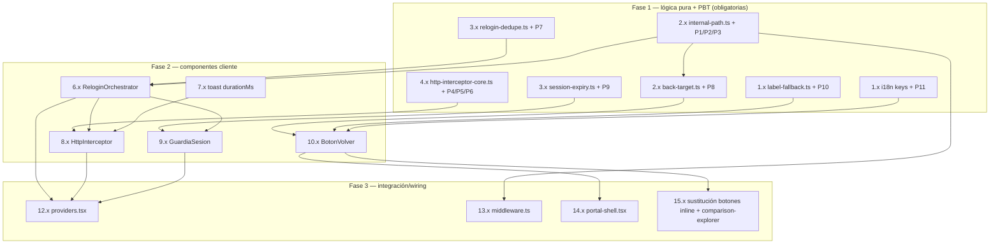

# Implementation Plan: session-nav-hardening

## Overview

Este plan implementa el endurecimiento de sesión/login (Frente A) y navegación uniforme
(Frente B) del Platform Portal siguiendo el principio rector del diseño: **toda la lógica
decidible vive en módulos puros bajo `src/lib/`**, y los efectos React/DOM se aíslan en
componentes cliente delgados.

Estrategia de ejecución:

- **Fase 1 (lógica pura, TDD/PBT primero).** Se implementan los 6 módulos puros
  (`i18n/label-fallback.ts`, `navigation/internal-path.ts`, `navigation/back-target.ts`,
  `session/session-expiry.ts`, `session/relogin-dedupe.ts`, `session/http-interceptor-core.ts`)
  y se cubren con las **11 Correctness Properties** del diseño mapeadas **1:1** a tareas
  **obligatorias** (sin `*`) usando `fast-check` con `{ numRuns: 100 }`, un fichero por
  propiedad, bajo `src/lib/__tests__/*.test.ts`. Cada test lleva el comentario canónico
  `// Feature: session-nav-hardening, Property N: <título>`.
- **Fase 2 (componentes cliente).** `ReloginOrchestrator`, `HttpInterceptor`, `GuardiaSesion`,
  `BotonVolver` y la extensión de `ui/toast.tsx`. Sus tests de ejemplo/componente (fake timers,
  fakes de `fetch`) van marcados `*` (opcionales) en `src/components/__tests__/*.test.tsx`.
- **Fase 3 (integración/wiring).** Config del `SessionProvider` y montaje único en `providers.tsx`,
  `next` en `middleware.ts`, anclaje del `BotonVolver` en `portal-shell.tsx`, sustitución de los
  6 botones inline + reutilización en `finops/comparison-explorer.tsx`.
- **Fase 4 (checkpoint final).** `npm test` en verde + `tsc` limpio sobre los ficheros cambiados.

Ubicación de tests (sin ampliar el glob de `npm test`): propiedades en `src/lib/__tests__/*.test.ts`
y tests de componente/ejemplo en `src/components/__tests__/*.test.tsx` (ambos ya cubiertos).

Convenciones git del repo: rama `feat/SRE-<n>` (sin descripción), commits
`[SRE-<n>] <type>: <desc>` (2–70 chars ASCII).

## Grafo de dependencias



## Tasks

- [x] 1. Fundaciones i18n y fallback de etiquetas
  - [x] 1.1 Implementar `src/lib/i18n/label-fallback.ts`
    - Escribir `hasVisibleText(value: unknown): boolean` (true sii al menos un carácter no-espacio)
    - Escribir la constante compartida `ES_BACK_LABEL = "Volver"` (fuente del fallback español)
    - Escribir `resolveLabelWithSpanishFallback(activeValue, spanishValue, key)`: activo con texto visible → activo; si no, español con texto visible → español; si no → key
    - Módulo puro sin dependencias de React ni `node:*`
    - _Requirements: 7.4, 7.5, 7.6_

  - [x] 1.2 Property test del fallback i18n total
    - Fichero `src/lib/__tests__/label-fallback.property.test.ts`, `fast-check` `{ numRuns: 100 }`
    - Comentario: `// Feature: session-nav-hardening, Property 10: El fallback de i18n es total`
    - Generadores: strings vacíos, solo-espacios, con texto, `undefined`
    - **Property 10: El fallback de i18n es total**
    - **Validates: Requirements 7.4, 7.5, 7.6**

  - [x] 1.3 Añadir claves i18n `common.back` y `http.forbidden` en los 4 locales
    - Editar `src/i18n/es.json`, `en.json`, `pt.json`, `fr.json`
    - `common.back`: es=`Volver`, en=`Back`, pt=`Voltar`, fr=`Retour` (valor no vacío, R7.7)
    - `http.forbidden`: aviso de 403 en los 4 locales (valor no vacío)
    - _Requirements: 7.1, 7.4, 7.5, 7.7_

  - [x] 1.4 Property test de presencia de `common.back` en los cuatro locales
    - Fichero `src/lib/__tests__/i18n-back-key.property.test.ts`, `fast-check` `{ numRuns: 100 }`
    - Comentario: `// Feature: session-nav-hardening, Property 11: La clave common.back está presente y con texto visible en los cuatro locales`
    - Itera `["es","en","pt","fr"]` cargando cada JSON y valida con `hasVisibleText`
    - **Property 11: La clave `common.back` está presente y con texto visible en los cuatro locales**
    - **Validates: Requirements 7.1, 7.7**

- [x] 2. Módulos puros de navegación
  - [x] 2.1 Implementar `src/lib/navigation/internal-path.ts`
    - `MAX_INTERNAL_PATH_LENGTH = 2048`
    - `isInternalPath(candidate: unknown): boolean` — total, nunca lanza; válida sii string 1..2048, empieza por un único `/`, no empieza por `//` ni `/\`, no contiene `://`, no contiene `\r`/`\n`/`\t`
    - `sanitizeInternalPath(candidate: unknown): string` — ruta si válida, si no `"/"`
    - `capturePreviousRoute(pathname, search?)` — pathname + search (antepone `?` solo si procede)
    - `buildNextParam(pathname, search?)` — `encodeURIComponent(ruta)` si interna válida, si no `""`
    - `resolveNextParam(rawNext: unknown): string` — decodifica y valida → ruta interna o `"/"`
    - Solo `String`/regex; importable desde el edge runtime del middleware
    - _Requirements: 3.2, 3.3, 3.4, 4.1, 4.2, 4.3, 5.8_

  - [x] 2.2 Property test de validación total y anti open-redirect
    - Fichero `src/lib/__tests__/internal-path-validation.property.test.ts`, `fast-check` `{ numRuns: 100 }`
    - Comentario: `// Feature: session-nav-hardening, Property 1: La validación de ruta interna es total y nunca permite open-redirect`
    - Generadores: `fc.string()`, `fc.constantFrom("//x","/\\x","http://evil","/a\nb")`, rutas válidas, cadenas > 2048
    - **Property 1: La validación de ruta interna es total y nunca permite open-redirect**
    - **Validates: Requirements 3.3, 3.4, 4.2, 4.3, 5.8**

  - [x] 2.3 Property test del parámetro `next` construido
    - Fichero `src/lib/__tests__/internal-path-nextparam.property.test.ts`, `fast-check` `{ numRuns: 100 }`
    - Comentario: `// Feature: session-nav-hardening, Property 2: El parámetro next construido es siempre una ruta interna válida o vacío`
    - Verifica que `buildNextParam` → `""` o valor tal que `resolveNextParam(valor) === capturePreviousRoute(...)` con longitud cruda ≤ 2048
    - **Property 2: El parámetro `next` construido es siempre una ruta interna válida o vacío**
    - **Validates: Requirements 3.2**

  - [x] 2.4 Property test de captura determinista de la Ruta_Previa
    - Fichero `src/lib/__tests__/internal-path-capture.property.test.ts`, `fast-check` `{ numRuns: 100 }`
    - Comentario: `// Feature: session-nav-hardening, Property 3: La captura de la Ruta_Previa es determinista`
    - Verifica `capturePreviousRoute(pathname, search)` = pathname + search (antepone `?` solo si search no vacío y no lo incluye), determinista
    - **Property 3: La captura de la Ruta_Previa es determinista**
    - **Validates: Requirements 4.1**

  - [x] 2.5 Implementar `src/lib/navigation/back-target.ts`
    - Tipo `BackTarget = { kind: "explicit"; path: string } | { kind: "history-or-home" }`
    - `resolveBackTarget(destination?)`: `undefined` → `{ history-or-home }`; interno válido → `{ explicit, destination }`; presente inválido → `{ explicit, "/" }`
    - Reutiliza `isInternalPath` de `internal-path.ts`
    - _Requirements: 5.6, 5.7, 5.8_

  - [x] 2.6 Property test de resolución del destino del BotonVolver
    - Fichero `src/lib/__tests__/back-target.property.test.ts`, `fast-check` `{ numRuns: 100 }`
    - Comentario: `// Feature: session-nav-hardening, Property 8: La resolución del destino del Boton_Volver es total y segura`
    - Generadores: `undefined`, rutas válidas, strings inválidos; nunca produce destino externo
    - **Property 8: La resolución del destino del Boton_Volver es total y segura**
    - **Validates: Requirements 5.6, 5.7, 5.8**

- [x] 3. Módulos puros de sesión
  - [x] 3.1 Implementar `src/lib/session/session-expiry.ts`
    - `WARNING_THRESHOLD_MS = 120_000`
    - `msUntilExpiry(expiresIso, now)` — NaN/entrada inválida → 0 (expirado)
    - `shouldWarn(expiresIso, now)` — true sii `0 < msUntilExpiry <= WARNING_THRESHOLD_MS`
    - `isExpired(expiresIso, now)` — true sii `msUntilExpiry <= 0`
    - `secondsRemaining(expiresIso, now)` — entero redondeado hacia arriba, nunca negativo
    - _Requirements: 1.3_

  - [x] 3.2 Property test del umbral de aviso y segundos restantes
    - Fichero `src/lib/__tests__/session-expiry.property.test.ts`, `fast-check` `{ numRuns: 100 }`
    - Comentario: `// Feature: session-nav-hardening, Property 9: El umbral de aviso y los segundos restantes son coherentes`
    - Generadores: `now` y `expires` como offsets/`fc.date` (pasado y futuro), entradas inválidas → 0
    - **Property 9: El umbral de aviso y los segundos restantes son coherentes**
    - **Validates: Requirements 1.3**

  - [x] 3.3 Implementar `src/lib/session/relogin-dedupe.ts`
    - `RELOGIN_DEDUPE_MS = 5000`
    - Interfaz `ReloginState { lastTriggeredAt: number | null }`
    - `shouldTriggerRelogin(state, now)` — true sii no hay disparo previo o el previo es de hace ≥ 5000ms
    - `markTriggered(state, now)` — nuevo estado inmutable tras un disparo
    - _Requirements: 2.6, 4.7_

  - [x] 3.4 Property test de disparo único por ventana de 5000 ms
    - Fichero `src/lib/__tests__/relogin-dedupe.property.test.ts`, `fast-check` `{ numRuns: 100 }`
    - Comentario: `// Feature: session-nav-hardening, Property 7: El re-login se dispara una única vez por ventana de 5000 ms`
    - Generadores: `fc.array(fc.nat())` de timestamps + fuentes arbitrarias (`guard`, `http-401`, `guard-refresh-failed`)
    - **Property 7: El re-login se dispara una única vez por ventana de 5000 ms**
    - **Validates: Requirements 2.6, 4.7**

- [x] 4. Núcleo puro del interceptor HTTP
  - [x] 4.1 Implementar `src/lib/session/http-interceptor-core.ts`
    - Tipo `InterceptAction = "relogin" | "forbidden" | "passthrough"`
    - `shouldInterceptApiUrl(url, origin)` — true sii mismo-origen, path empieza por `/api/` y NO por `/api/auth/`; acepta URL relativa o absoluta
    - `classifyApiResponse(status)` — 401 → `"relogin"`, 403 → `"forbidden"`, resto → `"passthrough"`
    - _Requirements: 2.1, 2.2, 2.3, 2.4, 2.7_

  - [x] 4.2 Property test de clasificación total de la respuesta de API
    - Fichero `src/lib/__tests__/http-interceptor-classify.property.test.ts`, `fast-check` `{ numRuns: 100 }`
    - Comentario: `// Feature: session-nav-hardening, Property 4: La clasificación de la respuesta de API es total`
    - Generador: `fc.integer()` sobre `status`; resultado siempre ∈ `{relogin, forbidden, passthrough}`
    - **Property 4: La clasificación de la respuesta de API es total**
    - **Validates: Requirements 2.2, 2.3, 2.7**

  - [x] 4.3 Property test del ámbito de interceptación (mismo-origen `/api/` excl. `/api/auth/`)
    - Fichero `src/lib/__tests__/http-interceptor-scope.property.test.ts`, `fast-check` `{ numRuns: 100 }`
    - Comentario: `// Feature: session-nav-hardening, Property 5: La interceptación cubre exactamente mismo-origen /api/ excluyendo /api/auth/`
    - Generadores: orígenes + paths `/api/*`, `/api/auth/*`, no-api, cross-origin, métodos HTTP
    - **Property 5: La interceptación cubre exactamente mismo-origen `/api/` excluyendo `/api/auth/`**
    - **Validates: Requirements 2.1, 2.4**

  - [x] 4.4 Property test de preservación de la identidad del Response en passthrough
    - Fichero `src/lib/__tests__/http-interceptor-passthrough.property.test.ts`, `fast-check` `{ numRuns: 100 }`
    - Comentario: `// Feature: session-nav-hardening, Property 6: El passthrough preserva la identidad del Response`
    - Modelo: para `status ∉ {401,403}` la capa de passthrough devuelve el **mismo** objeto `Response` (misma referencia) y su cuerpo permanece legible (stream no consumido)
    - **Property 6: El passthrough preserva la identidad del Response**
    - **Validates: Requirements 2.5, 2.7**

- [x] 5. Checkpoint — lógica pura y propiedades
  - Ensure all tests pass, ask the user if questions arise.

- [x] 6. Orquestador de re-login (single-flight)
  - [x] 6.1 Implementar `src/components/session/relogin-orchestrator.tsx`
    - Contexto React montado una vez; `ReloginState` en `useRef` (sin re-render)
    - `useReloginOrchestrator(): { triggerRelogin(source) }`
    - `triggerRelogin`: si `!shouldTriggerRelogin(state, now)` → no-op; si dispara, `markTriggered`, captura inmutable de `next = buildNextParam(...)` y `callbackUrl = sanitizeInternalPath(...)`
    - Muestra mensaje "sesión caducada, redirigiendo" en ≤500 ms y programa `signIn(undefined,{callbackUrl})` en ≤3000 ms
    - _Requirements: 2.6, 4.1, 4.2, 4.3, 4.5, 4.6, 4.7_

  - [x] 6.2 Test de ejemplo del ReloginOrchestrator
    - Fichero `src/components/__tests__/relogin-orchestrator.test.tsx` (fake timers)
    - Mensaje ≤500 ms y `signIn` ≤3000 ms con `callbackUrl` correcto para ruta interna (4.4/4.6) y `/` (4.5); disparos duplicados en 5000 ms → un único `signIn` (4.7)
    - _Requirements: 4.5, 4.6, 4.7_

- [x] 7. Extensión del sistema de toast
  - [x] 7.1 Extender `src/components/ui/toast.tsx` con `durationMs`
    - Firma `toast(type, message, opts?: { durationMs?: number })`, retrocompatible (default 4000)
    - El auto-cierre usa `opts.durationMs ?? 4000`
    - _Requirements: 2.3_

  - [x] 7.2 Test unitario de la duración del toast
    - Fichero `src/components/__tests__/toast-duration.test.tsx` (fake timers)
    - Default 4000 ms; `durationMs: 5000` mantiene el toast ≥ 5000 ms
    - _Requirements: 2.3_

- [x] 8. Interceptor HTTP (monkey-patch de `window.fetch`)
  - [x] 8.1 Implementar `src/components/session/http-interceptor.tsx`
    - `useEffect` (una vez): si `window.fetch.__portalPatched` ausente, guarda `originalFetch`, sustituye por wrapper y marca `__portalPatched`; cleanup restaura `originalFetch`
    - Wrapper: `res = await originalFetch(...)`; si `!shouldInterceptApiUrl(url, location.origin)` → devuelve `res`; según `classifyApiResponse(res.status)`: `relogin` → `triggerRelogin("http-401")`; `forbidden` → `toast("warning", t("http.forbidden"), { durationMs: 5000 })`; siempre devuelve el `Response` original sin leer el body
    - Rechazos de red se propagan sin envolver (sin `try/catch` que los trague)
    - _Requirements: 2.1, 2.2, 2.3, 2.4, 2.5, 2.7, 2.8_

  - [x] 8.2 Test de ejemplo del HttpInterceptor
    - Fichero `src/components/__tests__/http-interceptor.test.tsx` (mock de `originalFetch`)
    - 401 → `triggerRelogin` (2.2); 403 → `toast` con `durationMs≥5000` y sin redirect (2.3); rechazo de red se propaga sin efectos (2.8); instalación idempotente (2.1)
    - _Requirements: 2.2, 2.3, 2.8_

- [x] 9. Guardia de sesión
  - [x] 9.1 Implementar `src/components/session/guardia-sesion.tsx`
    - `useSession()` + `usePathname()`; en `/` → no renderiza aviso ni dispara (se apoya en `isInternalPath`)
    - `setInterval` 1000 ms: `shouldWarn`/`secondsRemaining` → muestra/actualiza `Aviso_Expiracion` no bloqueante con contador y botón "Continuar"
    - `status === "unauthenticated"` en Pagina_Interna → `triggerRelogin("guard")`
    - "Continuar" → `Promise.race([update(), timeout(10000)])`; sesión válida a tiempo → oculta aviso ≤1s; fallo/timeout/inválida → `triggerRelogin("guard-refresh-failed")` e informa
    - _Requirements: 1.2, 1.3, 1.4, 1.5, 1.6, 1.7_

  - [x] 9.2 Test de ejemplo del GuardiaSesion
    - Fichero `src/components/__tests__/guardia-sesion.test.tsx` (fake timers)
    - Aviso ≤1s al cruzar el umbral (1.3/1.4); abstención en `/` (1.7); Continuar con `update()` que resuelve (1.5) o falla/timeout (1.6); `unauthenticated` → re-login (1.2)
    - _Requirements: 1.2, 1.3, 1.4, 1.5, 1.6, 1.7_

- [x] 10. Componente BotonVolver
  - [x] 10.1 Implementar `src/components/navigation/boton-volver.tsx`
    - Props `{ destination?: string; className?: string }`
    - `const { t } = useI18n()` dentro del cuerpo (gotcha §8); texto = `resolveLabelWithSpanishFallback(t("common.back",""), ES_BACK_LABEL, "common.back")`
    - Render `<Button variant="ghost">` con `<ArrowLeft className="mr-2 h-4 w-4" />` + label; `aria-label` = label
    - `onClick` según `resolveBackTarget(destination)`: `explicit` → `router.push(path)`; `history-or-home` → si hay historial interno `router.back()`, si no `router.push("/")`
    - _Requirements: 5.1, 5.2, 5.3, 5.4, 5.6, 5.7, 5.9, 6.5, 6.6, 7.2, 7.3_

  - [x] 10.2 Test de componente del BotonVolver
    - Fichero `src/components/__tests__/boton-volver.test.tsx`
    - `ArrowLeft` único (5.2); nombre accesible + activación por click/Enter/Space (5.4); texto por i18n con fallback (5.3/7.2/7.3); `router.back` con historial (6.5) y `router.push("/")` sin historial (6.6); `destination` explícito e inválido→`/` (5.6/5.8)
    - _Requirements: 5.2, 5.3, 5.4, 6.5, 6.6, 7.2, 7.3_

- [x] 11. Checkpoint — componentes cliente
  - Ensure all tests pass, ask the user if questions arise.

- [x] 12. Wiring del SessionProvider y montaje único
  - [x] 12.1 Configurar `src/components/providers.tsx`
    - `<SessionProvider refetchInterval={300} refetchOnWindowFocus>`
    - Montar `<ReloginOrchestrator>` envolviendo `<HttpInterceptor/>` + `<GuardiaSesion/>` una sola vez dentro del provider (dentro de `I18nProvider`/`ToastProvider` para disponer de `t` y `toast`)
    - _Requirements: 1.1, 1.8_

  - [x] 12.2 Test de configuración de providers
    - Fichero `src/components/__tests__/providers-session.test.tsx`
    - `SessionProvider` con `refetchInterval={300}` y `refetchOnWindowFocus` (1.1); orquestador/guardia/interceptor montados una sola vez (1.8)
    - _Requirements: 1.1, 1.8_

- [x] 13. Parámetro `next` en el middleware
  - [x] 13.1 Integrar `buildNextParam` en `middleware.ts`
    - En la redirección a `/` por ausencia de token: `redirectUrl.searchParams.set("next", buildNextParam(pathname, search))` solo si el valor no es vacío
    - Mantener intactas las respuestas 401/403 JSON de `/api/*`
    - Importar el módulo puro `internal-path.ts` (compatible con edge runtime, sin `node:*`)
    - _Requirements: 3.1, 3.2, 3.5, 3.6_

  - [x] 13.2 Test del middleware
    - Fichero `src/lib/__tests__/middleware-next.test.ts`
    - Ruta protegida sin token → redirect `/` con `?next=` válido (3.1/3.2); `/api/*` sin token → 401 (3.5); rol insuficiente → 403 (3.6)
    - _Requirements: 3.1, 3.2, 3.5, 3.6_

- [x] 14. Anclaje del BotonVolver en el PortalShell
  - [x] 14.1 Renderizar `<BotonVolver/>` en la cabecera de página de `portal-shell.tsx`
    - Ancla único junto a `PageHeader`, posición idéntica en toda Pagina_Interna
    - Como `PortalShell` no se renderiza en `/` (STANDALONE_PATHS), garantiza cero en la home
    - _Requirements: 6.1, 6.2, 6.7_

  - [x] 14.2 Test del PortalShell
    - Fichero `src/components/__tests__/portal-shell-back.test.tsx`
    - Exactamente un `BotonVolver` en una Pagina_Interna (6.1/6.7); cero en `/` (6.2)
    - _Requirements: 6.1, 6.2, 6.7_

- [x] 15. Sustitución de los botones de "volver" inline
  - [x] 15.1 Borrar los 6 botones de volver inline
    - Eliminar el control inline en `synthetic-dashboard.tsx`, `create-repo/page.tsx`, `user-onboarding/page.tsx`, `infra-page-client.tsx`, `cybersecurity-workspace.tsx` y `tickets/page.tsx`
    - Dejar cero controles de "volver" inline duplicados (el anclaje del PortalShell los sustituye)
    - _Requirements: 6.3_

  - [x] 15.2 Reutilizar BotonVolver con destino explícito en `finops/comparison-explorer.tsx`
    - Reemplazar el "Volver" de niveles por `<BotonVolver destination={...}/>` conservando la navegación entre niveles internos
    - _Requirements: 6.4_

  - [x] 15.3 Test estático de sustitución
    - Fichero `src/components/__tests__/back-button-refactor.test.tsx`
    - Los 6 ficheros ya no contienen botones de volver inline (6.3); `comparison-explorer` usa `BotonVolver` con `destination` (6.4)
    - _Requirements: 6.3, 6.4_

- [x] 16. Checkpoint final — suite y tipos en verde
  - Ejecutar `npm test` y confirmar que toda la suite (incluidas las 11 property tests) está en verde
  - Ejecutar `tsc` (p.ej. `npx tsc --noEmit`) y confirmar que no hay errores de tipos en los ficheros cambiados
  - Ensure all tests pass, ask the user if questions arise.

## Notes

- Las tareas marcadas con `*` son opcionales (tests de ejemplo/componente: unit, integración,
  timing) y pueden omitirse para un MVP más rápido. Las **11 property tests NO llevan `*`**: son
  obligatorias y mapean 1:1 las Correctness Properties del diseño.
- Cada property test lleva el comentario canónico `// Feature: session-nav-hardening, Property N: <título>`
  y se ejecuta con `fast-check` a `{ numRuns: 100 }` como mínimo, un fichero por propiedad.
- Las property tests viven en `src/lib/__tests__/*.test.ts` y los tests de componente en
  `src/components/__tests__/*.test.tsx`: ambos directorios ya están cubiertos por el glob de
  `npm test`, por lo que **no hace falta ampliar el glob** en `package.json`.
- Cada tarea referencia las cláusulas de requisito que cubre para trazabilidad; los checkpoints
  garantizan validación incremental.
- El interceptor nunca lee el body (`.json()/.text()/.clone()`), solo `status` y URL, para
  preservar el contrato de `fetch` (R2.5/R2.7).

## Task Dependency Graph

```json
{
  "waves": [
    { "id": 0, "tasks": ["1.1", "1.3", "2.1", "3.1", "3.3", "4.1", "7.1"] },
    { "id": 1, "tasks": ["1.2", "1.4", "2.2", "2.3", "2.4", "2.5", "3.2", "3.4", "4.2", "4.3", "4.4", "6.1", "7.2", "13.1"] },
    { "id": 2, "tasks": ["2.6", "6.2", "8.1", "9.1", "10.1", "13.2"] },
    { "id": 3, "tasks": ["8.2", "9.2", "10.2", "12.1", "14.1", "15.1", "15.2"] },
    { "id": 4, "tasks": ["12.2", "14.2", "15.3"] }
  ]
}
```
