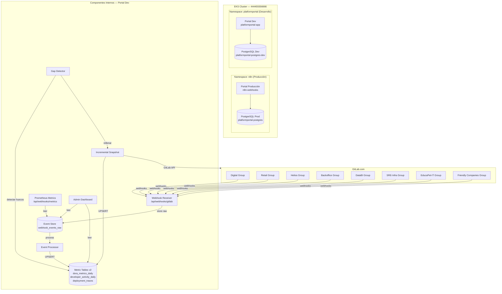
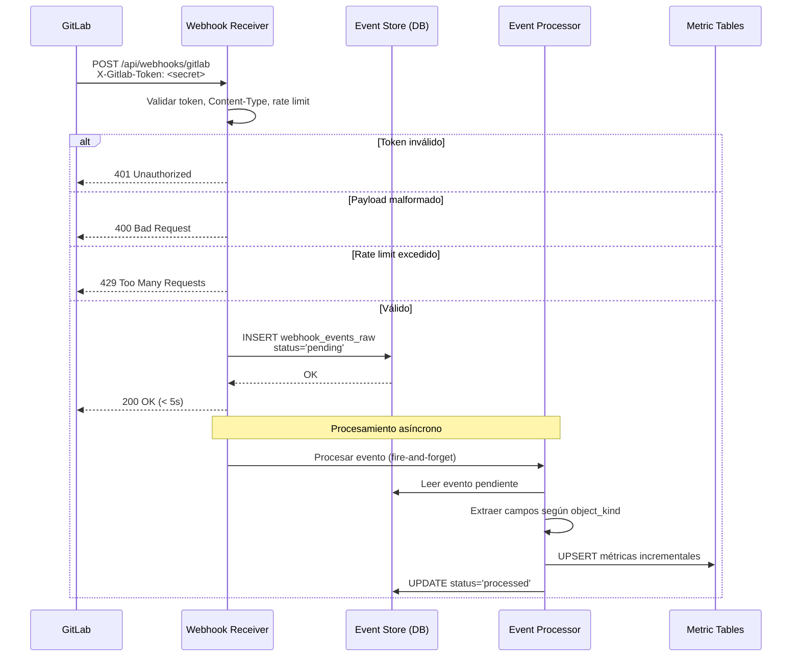

# Documento de Diseño — Webhook Metrics Pipeline

## Visión General

Este documento describe el diseño técnico para reemplazar el snapshot monolítico diario de métricas DORA por un **pipeline basado en webhooks de GitLab** que proporciona datos en tiempo real. El sistema se compone de:

1. **Entorno de desarrollo** (`platformportal` namespace) — réplica aislada del portal de producción con PostgreSQL independiente.
2. **Webhook Receiver** — endpoint HTTP que recibe, valida y almacena eventos de GitLab.
3. **Event Processor** — componente que transforma eventos crudos en métricas incrementales.
4. **Gap Detector + Incremental Snapshot** — job nocturno que detecta y rellena huecos en los datos.
5. **Observabilidad** — métricas Prometheus y dashboard de administración.

### Decisiones de Diseño Clave

| Decisión | Elección | Justificación |
|----------|----------|---------------|
| Procesamiento de eventos | Síncrono en request (store) + async en background (process) | Responder a GitLab en <5s almacenando el evento crudo; procesar después |
| Esquema de métricas | Tablas v2 con soporte UPSERT incremental | Permite actualizaciones atómicas sin recalcular el día completo |
| Identidad de desarrollador | Tabla de mapeo `developer_identity_map` | Resuelve emails privados de GitLab y duplicados |
| Secretos por grupo | Un `X-Gitlab-Token` por grupo GitLab | Rotación independiente, aislamiento de seguridad |
| Rate limiting | En memoria por IP (100 req/min) | Protección contra abuso sin dependencia externa |
| Event Store | Retención 90 días con replay | Auditoría completa y capacidad de reprocesamiento |

---

## Arquitectura

### Diagrama de Arquitectura General



### Diagrama de Flujo de Datos — Procesamiento de Evento



---

## Componentes e Interfaces

### 1. Entorno de Desarrollo — Manifiestos Kubernetes

El entorno de desarrollo se despliega en el namespace `platformportal` con los siguientes recursos:

#### Estructura de Manifiestos

```
k8s/dev/
├── namespace.yaml
├── serviceaccount.yaml
├── secrets.yaml              # Template (valores reales en K8s secrets)
├── configmap.yaml
├── postgres-deployment.yaml
├── postgres-service.yaml
├── postgres-pvc.yaml
├── app-deployment.yaml
├── app-service.yaml
└── app-ingress.yaml
```

#### Namespace y ServiceAccount

```yaml
# namespace.yaml
apiVersion: v1
kind: Namespace
metadata:
  name: platformportal
  labels:
    app: platformportal
    environment: dev
---
# serviceaccount.yaml
apiVersion: v1
kind: ServiceAccount
metadata:
  name: platformportal-app
  namespace: platformportal
  annotations:
    eks.amazonaws.com/role-arn: "arn:aws:iam::444455556666:role/portal-inventory-irsa"
```

#### ConfigMap (réplica de producción + feature flags dev)

```yaml
# configmap.yaml
apiVersion: v1
kind: ConfigMap
metadata:
  name: platformportal-config
  namespace: platformportal
data:
  AZURE_AD_TENANT_ID: "19e73cc9-78d1-4540-862c-5a89572ef80e"
  N8N_WEBHOOK_URL: "http://n8n.n8n.svc.cluster.local/webhook/create-repo"
  N8N_ONBOARDING_WEBHOOK: "http://n8n.n8n.svc.cluster.local/webhook/user-onboarding"
  N8N_FINOPS_WEBHOOK: "http://n8n.n8n.svc.cluster.local/webhook/finops-costs"
  N8N_FINOPS_ATHENA_WEBHOOK: "http://n8n.n8n.svc.cluster.local/webhook/finops-athena"
  AWX_API: "https://awx-ansible.tooling.dp.iskaypet.com/api/v2"
  N8N_INTERNAL_URL: "http://n8n.n8n.svc.cluster.local"
  GRAFANA_STACK_URL: "https://iskaylog.grafana.net"
  SONARQUBE_URL: "http://sonarqube-sonarqube.sonarqube.svc.cluster.local:9000/api"
  GITLAB_URL: "https://gitlab.com"
  AWS_BEDROCK_REGION: "eu-west-1"
  AWS_BEDROCK_ROLE_ARN: "arn:aws:iam::100300500700:role/portal-bedrock-access"
  AWS_BEDROCK_MODEL_ID: "eu.amazon.nova-lite-v1:0"
  # Feature flags — habilitados en dev
  ENABLE_AUTOMATIONS: "true"
  ENABLE_JIRA: "true"
  ENABLE_CYBERSECURITY: "false"
  # Webhook pipeline config
  WEBHOOK_GROUPS: "Digital:66347331,Retail:RETAIL_ID,Helios:HELIOS_ID,Backoffice:BACKOFFICE_ID,DataBI:DATABI_ID,SRE-Infra:SRE_ID,EducaPet-IT:EDUCAPET_ID,FriendlyCompanies:FC_ID"
  WEBHOOK_RATE_LIMIT_PER_MINUTE: "100"
```

#### PostgreSQL Dev

```yaml
# postgres-pvc.yaml
apiVersion: v1
kind: PersistentVolumeClaim
metadata:
  name: platformportal-postgres-dev-pvc
  namespace: platformportal
spec:
  accessModes: [ReadWriteOnce]
  resources:
    requests:
      storage: 10Gi
  storageClassName: gp3
---
# postgres-deployment.yaml
apiVersion: apps/v1
kind: Deployment
metadata:
  name: platformportal-postgres-dev
  namespace: platformportal
spec:
  replicas: 1
  selector:
    matchLabels:
      app: platformportal-postgres-dev
  template:
    metadata:
      labels:
        app: platformportal-postgres-dev
    spec:
      containers:
      - name: postgres
        image: postgres:16-alpine
        ports:
        - containerPort: 5432
        env:
        - name: POSTGRES_DB
          value: platformportal
        - name: POSTGRES_USER
          value: platformportal
        - name: POSTGRES_PASSWORD
          valueFrom:
            secretKeyRef:
              name: platformportal-secrets
              key: postgres-password
        volumeMounts:
        - name: postgres-data
          mountPath: /var/lib/postgresql/data
        resources:
          requests:
            cpu: 100m
            memory: 256Mi
          limits:
            cpu: 500m
            memory: 512Mi
        livenessProbe:
          exec:
            command: ["pg_isready", "-U", "platformportal"]
          initialDelaySeconds: 15
          periodSeconds: 30
        readinessProbe:
          exec:
            command: ["pg_isready", "-U", "platformportal"]
          initialDelaySeconds: 5
          periodSeconds: 10
      volumes:
      - name: postgres-data
        persistentVolumeClaim:
          claimName: platformportal-postgres-dev-pvc
---
# postgres-service.yaml
apiVersion: v1
kind: Service
metadata:
  name: platformportal-postgres-dev
  namespace: platformportal
spec:
  selector:
    app: platformportal-postgres-dev
  ports:
  - port: 5432
    targetPort: 5432
```

#### App Deployment (réplica del portal)

```yaml
# app-deployment.yaml
apiVersion: apps/v1
kind: Deployment
metadata:
  name: platformportal-app
  namespace: platformportal
  labels:
    app: platformportal-app
spec:
  replicas: 1
  selector:
    matchLabels:
      app: platformportal-app
  template:
    metadata:
      labels:
        app: platformportal-app
      annotations:
        k8s.grafana.com/scrape: "true"
        k8s.grafana.com/metrics_path: /api/webhooks/metrics
        k8s.grafana.com/metrics_portNumber: "3000"
    spec:
      serviceAccountName: platformportal-app
      imagePullSecrets:
      - name: harbor-registry
      containers:
      - name: portal
        image: harbor.tooling.dp.iskaypet.com/tooling/platformportal:4d2dae4a
        imagePullPolicy: Always
        ports:
        - containerPort: 3000
          name: http
        env:
        - name: NEXTAUTH_URL
          value: "https://portal.today.dev.tooling.dp.iskaypet.com"
        - name: DATABASE_URL
          valueFrom:
            secretKeyRef:
              name: platformportal-secrets
              key: database-url
        - name: NEXTAUTH_SECRET
          valueFrom:
            secretKeyRef:
              name: platformportal-secrets
              key: nextauth-secret
        - name: AZURE_AD_CLIENT_ID
          valueFrom:
            secretKeyRef:
              name: platformportal-secrets
              key: azure-ad-client-id
        - name: AZURE_AD_CLIENT_SECRET
          valueFrom:
            secretKeyRef:
              name: platformportal-secrets
              key: azure-ad-client-secret
        - name: GITLAB_TOKEN
          valueFrom:
            secretKeyRef:
              name: platformportal-secrets
              key: gitlab-token
        - name: GRAFANA_TOKEN
          valueFrom:
            secretKeyRef:
              name: platformportal-secrets
              key: grafana-token
        - name: AWX_TOKEN
          valueFrom:
            secretKeyRef:
              name: platformportal-secrets
              key: awx-token
        - name: SONARQUBE_TOKEN
          valueFrom:
            secretKeyRef:
              name: platformportal-secrets
              key: sonarqube-token
        - name: INTERNAL_API_SECRET
          valueFrom:
            secretKeyRef:
              name: platformportal-secrets
              key: internal-api-secret
        envFrom:
        - configMapRef:
            name: platformportal-config
        resources:
          requests:
            cpu: 100m
            memory: 128Mi
          limits:
            cpu: 500m
            memory: 512Mi
        livenessProbe:
          httpGet:
            path: /api/health
            port: 3000
          initialDelaySeconds: 15
          periodSeconds: 30
          timeoutSeconds: 5
          failureThreshold: 3
        readinessProbe:
          httpGet:
            path: /api/health
            port: 3000
          initialDelaySeconds: 5
          periodSeconds: 10
          timeoutSeconds: 3
          failureThreshold: 3
```

#### Service e Ingress

```yaml
# app-service.yaml
apiVersion: v1
kind: Service
metadata:
  name: platformportal-app
  namespace: platformportal
spec:
  selector:
    app: platformportal-app
  ports:
  - port: 80
    targetPort: 3000
    name: http
---
# app-ingress.yaml
apiVersion: networking.k8s.io/v1
kind: Ingress
metadata:
  name: platformportal-app
  namespace: platformportal
  annotations:
    kubernetes.io/ingress.class: nginx
    cert-manager.io/cluster-issuer: letsencrypt-prod
spec:
  tls:
  - hosts:
    - portal.today.dev.tooling.dp.iskaypet.com
    secretName: platformportal-dev-tls
  rules:
  - host: portal.today.dev.tooling.dp.iskaypet.com
    http:
      paths:
      - path: /
        pathType: Prefix
        backend:
          service:
            name: platformportal-app
            port:
              number: 80
```

### 2. Webhook Receiver — API Route

**Ruta:** `src/app/api/webhooks/gitlab/route.ts`

```typescript
// Interfaz pública del Webhook Receiver
export async function POST(request: Request): Promise<NextResponse>
```

**Responsabilidades:**
1. Validar `Content-Type: application/json`
2. Validar `X-Gitlab-Token` contra los secretos configurados por grupo
3. Aplicar rate limiting por IP (100 req/min)
4. Parsear el payload JSON
5. Insertar en `webhook_events_raw` con `status = 'pending'`
6. Responder 200 OK
7. Disparar procesamiento asíncrono (fire-and-forget con `Promise` no-await)

**Módulo de soporte:** `src/lib/webhook-receiver.ts`

```typescript
export interface WebhookValidationResult {
  valid: boolean;
  groupId?: number;
  groupName?: string;
  errorCode?: number;
  errorMessage?: string;
}

export function validateWebhookToken(token: string | null): WebhookValidationResult;
export function checkRateLimit(ip: string): boolean;
export async function storeRawEvent(event: RawWebhookEvent): Promise<number>;
```

### 3. Event Processor

**Módulo:** `src/lib/webhook-event-processor.ts`

```typescript
export interface ProcessingResult {
  eventId: number;
  success: boolean;
  error?: string;
}

// Punto de entrada principal
export async function processEvent(eventId: number): Promise<ProcessingResult>;

// Procesadores por tipo de evento
export async function processDeploymentEvent(eventId: number, payload: DeploymentPayload): Promise<void>;
export async function processMergeRequestEvent(eventId: number, payload: MRPayload): Promise<void>;
export async function processPipelineEvent(eventId: number, payload: PipelinePayload): Promise<void>;
export async function processPushEvent(eventId: number, payload: PushPayload): Promise<void>;
```

**Estrategia de procesamiento:**
- Cada procesador extrae los campos relevantes del payload
- Ejecuta UPSERTs atómicos en las tablas de métricas
- Actualiza el estado del evento en `webhook_events_raw`
- Los errores se capturan por evento individual, sin afectar otros eventos

### 4. Gap Detector + Incremental Snapshot

**Módulo:** `src/lib/webhook-gap-detector.ts`

```typescript
export interface GapInfo {
  projectId: number;
  projectPath: string;
  date: string;  // YYYY-MM-DD
  groupId: number;
}

export interface GapDetectorResult {
  gapsDetected: number;
  gapsFilled: number;
  gapsFailed: number;
  executionTimeMs: number;
  details: GapInfo[];
}

export async function detectGaps(): Promise<GapInfo[]>;
export async function fillGaps(gaps: GapInfo[]): Promise<GapDetectorResult>;
```

**Ruta API:** `src/app/api/webhooks/gap-fill/route.ts` (protegida con `requireInternalAuth`)

**Lógica del Gap Detector:**
1. Obtener lista de proyectos activos por grupo (con actividad en últimos 30 días)
2. Para cada proyecto, verificar si hay eventos webhook en las últimas 48 horas
3. Si no hay eventos y el proyecto tiene actividad reciente → marcar como hueco
4. Para cada hueco, consultar la API de GitLab solo para ese proyecto/día
5. Insertar los datos faltantes con `data_source = 'snapshot_v2'`

### 5. Developer Identity Resolver

**Módulo:** `src/lib/webhook-identity-resolver.ts`

```typescript
export interface IdentityResolution {
  canonicalEmail: string;
  canonicalName: string;
  isProvisional: boolean;
}

export async function resolveIdentity(
  email: string | null,
  username: string | null,
  name: string | null
): Promise<IdentityResolution>;

export async function mergeIdentities(
  sourceEmail: string,
  targetEmail: string
): Promise<void>;
```

### 6. Observabilidad

**Ruta métricas Prometheus:** `src/app/api/webhooks/metrics/route.ts`

Expone contadores en formato Prometheus text:
- `webhook_events_received_total{group, event_type}`
- `webhook_events_processed_total{group, event_type, status}`
- `webhook_events_failed_total{group, event_type}`
- `webhook_processing_duration_seconds{event_type}`
- `webhook_events_pending_count`

**Ruta dashboard admin:** `src/app/api/webhooks/admin/dashboard/route.ts` (protegida con `requireUserAuth` + rol admin)

### 7. Replay de Eventos

**Ruta API:** `src/app/api/webhooks/admin/replay/route.ts`

```typescript
// POST con filtros
export interface ReplayRequest {
  dateFrom: string;       // YYYY-MM-DD
  dateTo: string;         // YYYY-MM-DD
  eventType?: string;     // deployment, merge_request, pipeline, push
  projectId?: number;
  status?: string;        // failed, processed, pending
}
```

---

## Modelos de Datos

### Tablas Nuevas

#### `webhook_events_raw` — Event Store

```sql
CREATE TABLE webhook_events_raw (
    id SERIAL PRIMARY KEY,
    received_at TIMESTAMP WITH TIME ZONE DEFAULT NOW(),
    gitlab_event_type TEXT NOT NULL,          -- deployment, merge_request, pipeline, push
    gitlab_project_id INTEGER NOT NULL,
    gitlab_group_id INTEGER,
    group_name TEXT,
    payload JSONB NOT NULL,
    processing_status TEXT NOT NULL DEFAULT 'pending',  -- pending, processing, processed, failed
    processed_at TIMESTAMP WITH TIME ZONE,
    error_message TEXT,
    retry_count INTEGER DEFAULT 0,
    source_ip INET,
    
    CONSTRAINT valid_status CHECK (processing_status IN ('pending', 'processing', 'processed', 'failed'))
);

CREATE INDEX idx_webhook_events_status ON webhook_events_raw(processing_status, received_at);
CREATE INDEX idx_webhook_events_project ON webhook_events_raw(gitlab_project_id, received_at);
CREATE INDEX idx_webhook_events_type ON webhook_events_raw(gitlab_event_type, received_at);
CREATE INDEX idx_webhook_events_group ON webhook_events_raw(gitlab_group_id, received_at);
CREATE INDEX idx_webhook_events_received ON webhook_events_raw(received_at);

-- Partición por mes para retención eficiente (90 días)
-- Se implementará con pg_partman o partición manual por rango de received_at
```

#### `webhook_processing_log` — Historial de Procesamiento

```sql
CREATE TABLE webhook_processing_log (
    id SERIAL PRIMARY KEY,
    event_id INTEGER NOT NULL REFERENCES webhook_events_raw(id),
    attempt_number INTEGER NOT NULL DEFAULT 1,
    started_at TIMESTAMP WITH TIME ZONE DEFAULT NOW(),
    completed_at TIMESTAMP WITH TIME ZONE,
    status TEXT NOT NULL,                    -- success, error
    error_message TEXT,
    metrics_affected JSONB                   -- {"dora_metrics_daily": 1, "developer_activity_daily": 3}
);

CREATE INDEX idx_processing_log_event ON webhook_processing_log(event_id);
```

#### `developer_identity_map` — Mapeo de Identidades

```sql
CREATE TABLE developer_identity_map (
    id SERIAL PRIMARY KEY,
    canonical_email TEXT NOT NULL,
    canonical_name TEXT NOT NULL,
    alias_email TEXT NOT NULL UNIQUE,
    alias_username TEXT,
    is_provisional BOOLEAN DEFAULT true,
    created_at TIMESTAMP WITH TIME ZONE DEFAULT NOW(),
    updated_at TIMESTAMP WITH TIME ZONE DEFAULT NOW()
);

CREATE INDEX idx_identity_map_canonical ON developer_identity_map(canonical_email);
CREATE INDEX idx_identity_map_alias ON developer_identity_map(alias_email);
CREATE INDEX idx_identity_map_username ON developer_identity_map(alias_username);
```

#### `webhook_group_config` — Configuración de Grupos

```sql
CREATE TABLE webhook_group_config (
    id SERIAL PRIMARY KEY,
    group_id INTEGER NOT NULL UNIQUE,
    group_name TEXT NOT NULL,
    group_path TEXT NOT NULL,
    is_active BOOLEAN DEFAULT true,
    secret_key_ref TEXT NOT NULL,             -- nombre del key en K8s secret
    events_subscribed TEXT[] DEFAULT ARRAY['deployment', 'merge_request', 'pipeline', 'push'],
    created_at TIMESTAMP WITH TIME ZONE DEFAULT NOW(),
    updated_at TIMESTAMP WITH TIME ZONE DEFAULT NOW()
);
```

### Modificaciones a Tablas Existentes

#### `dora_metrics_daily` — Columnas Nuevas

```sql
ALTER TABLE dora_metrics_daily
ADD COLUMN IF NOT EXISTS data_source TEXT DEFAULT 'gitlab',
ADD COLUMN IF NOT EXISTS last_webhook_at TIMESTAMP WITH TIME ZONE;

-- El campo data_source ya existe pero se reutiliza con nuevos valores:
-- 'gitlab' = snapshot v1 (legacy)
-- 'webhook' = datos de webhook en tiempo real
-- 'snapshot_v2' = datos del snapshot incremental
```

#### `developer_activity_daily` — Columnas Nuevas

```sql
ALTER TABLE developer_activity_daily
ADD COLUMN IF NOT EXISTS data_source TEXT DEFAULT 'gitlab',
ADD COLUMN IF NOT EXISTS last_webhook_at TIMESTAMP WITH TIME ZONE;
```

### Operaciones UPSERT — Ejemplos

#### UPSERT para `dora_metrics_daily` desde evento deployment

```sql
INSERT INTO dora_metrics_daily (
    snapshot_date, project_id, team, project_name, project_path,
    deployment_count, data_source, last_webhook_at
) VALUES ($1, $2, $3, $4, $5, 1, 'webhook', NOW())
ON CONFLICT (snapshot_date, project_id) DO UPDATE SET
    deployment_count = dora_metrics_daily.deployment_count + 1,
    last_webhook_at = NOW(),
    data_source = CASE
        WHEN dora_metrics_daily.data_source = 'webhook' THEN 'webhook'
        ELSE 'webhook'
    END;
```

#### UPSERT para `developer_activity_daily` desde evento push

```sql
INSERT INTO developer_activity_daily (
    snapshot_date, developer_email, project_id,
    developer_name, team, project_name, project_path,
    commits_count, lines_added, lines_removed,
    data_source, last_webhook_at
) VALUES ($1, $2, $3, $4, $5, $6, $7, $8, $9, $10, 'webhook', NOW())
ON CONFLICT (snapshot_date, developer_email, project_id) DO UPDATE SET
    commits_count = developer_activity_daily.commits_count + EXCLUDED.commits_count,
    lines_added = developer_activity_daily.lines_added + EXCLUDED.lines_added,
    lines_removed = developer_activity_daily.lines_removed + EXCLUDED.lines_removed,
    last_webhook_at = NOW(),
    data_source = 'webhook';
```

### Diagrama Entidad-Relación

```mermaid
erDiagram
    webhook_events_raw {
        serial id PK
        timestamp received_at
        text gitlab_event_type
        integer gitlab_project_id
        integer gitlab_group_id
        text group_name
        jsonb payload
        text processing_status
        timestamp processed_at
        text error_message
        integer retry_count
    }

    webhook_processing_log {
        serial id PK
        integer event_id FK
        integer attempt_number
        timestamp started_at
        timestamp completed_at
        text status
        text error_message
        jsonb metrics_affected
    }

    developer_identity_map {
        serial id PK
        text canonical_email
        text canonical_name
        text alias_email
        text alias_username
        boolean is_provisional
    }

    webhook_group_config {
        serial id PK
        integer group_id
        text group_name
        text group_path
        boolean is_active
        text secret_key_ref
    }

    dora_metrics_daily {
        date snapshot_date PK
        integer project_id PK
        text team
        integer deployment_count
        text data_source
        timestamp last_webhook_at
    }

    developer_activity_daily {
        date snapshot_date PK
        text developer_email PK
        integer project_id PK
        integer commits_count
        text data_source
        timestamp last_webhook_at
    }

    deployment_traces {
        serial id PK
        date snapshot_date
        integer project_id
        text commit_sha
        text deploy_type
    }

    webhook_events_raw ||--o{ webhook_processing_log : "tiene intentos"
    webhook_events_raw }o--|| webhook_group_config : "pertenece a grupo"
    webhook_events_raw ..>  dora_metrics_daily : "actualiza vía UPSERT"
    webhook_events_raw ..>  developer_activity_daily : "actualiza vía UPSERT"
    webhook_events_raw ..>  deployment_traces : "inserta trazas"
    developer_identity_map ..> developer_activity_daily : "resuelve identidad"
```


---

## Propiedades de Corrección

*Una propiedad es una característica o comportamiento que debe cumplirse en todas las ejecuciones válidas de un sistema — esencialmente, una declaración formal sobre lo que el sistema debe hacer. Las propiedades sirven como puente entre especificaciones legibles por humanos y garantías de corrección verificables por máquina.*

### Property 1: Validación de Token y Mapeo a Grupo

*Para cualquier* petición HTTP al endpoint de webhooks, la petición es aceptada (200) si y solo si el header `X-Gitlab-Token` coincide exactamente con el secreto configurado de uno de los grupos activos. Si el token no coincide con ningún grupo, la respuesta debe ser 401. Cada token válido debe mapear a exactamente un grupo.

**Validates: Requirements 2.2, 2.3, 2.6, 4.4, 10.1, 10.2**

### Property 2: Round-Trip de Almacenamiento de Eventos

*Para cualquier* evento webhook válido con un payload JSON arbitrario, al almacenarlo en `webhook_events_raw` y leerlo de vuelta, el payload JSON recuperado debe ser idéntico al original, y todos los campos requeridos (`gitlab_event_type`, `gitlab_project_id`, `gitlab_group_id`, `received_at`, `processing_status`) deben estar presentes y correctos.

**Validates: Requirements 2.4, 2.5**

### Property 3: Extracción de Campos por Tipo de Evento

*Para cualquier* evento webhook válido de tipo `deployment`, `merge_request`, `pipeline` o `push`, el Event Processor debe extraer correctamente todos los campos especificados del payload. Los campos extraídos deben coincidir con los valores presentes en el payload original.

**Validates: Requirements 3.3, 3.4, 3.5, 3.6**

### Property 4: Acumulación Incremental UPSERT

*Para cualquier* secuencia de N eventos webhook dirigidos al mismo proyecto y día, los contadores en `dora_metrics_daily` (deployment_count, total_commits, total_mrs) y `developer_activity_daily` (commits_count, lines_added, lines_removed) deben ser iguales a la suma de las contribuciones individuales de cada evento.

**Validates: Requirements 3.7, 5.2, 5.6**

### Property 5: Aislamiento de Procesamiento

*Para cualquier* lote de eventos donde exactamente uno causa un error de procesamiento, todos los demás eventos del lote deben procesarse exitosamente. El evento fallido debe marcarse como `failed` con un mensaje de error, sin afectar el estado de los demás.

**Validates: Requirements 3.1, 3.2, 6.6**

### Property 6: Extracción de Grupo desde Path

*Para cualquier* payload webhook con un campo `project.path_with_namespace` que contenga un prefijo de grupo conocido, la función de extracción de grupo debe retornar el ID y nombre del grupo correcto. Para paths que no coincidan con ningún grupo configurado, debe retornar un valor por defecto o error.

**Validates: Requirements 4.2**

### Property 7: Derivación de Equipo desde Path

*Para cualquier* ruta de proyecto (`path_with_namespace`) con profundidad de jerarquía variable, la función de derivación de equipo debe extraer correctamente el segmento correspondiente (2do o 3er segmento según la profundidad) como nombre de equipo.

**Validates: Requirements 4.3**

### Property 8: Detección de Huecos

*Para cualquier* conjunto de proyectos activos y datos de cobertura webhook, el Gap Detector debe identificar como "hueco" exactamente aquellas combinaciones proyecto/día donde: (a) no se han recibido eventos webhook en las últimas 48 horas, Y (b) el proyecto tiene actividad reciente (últimos 30 días). Ningún proyecto sin actividad reciente debe ser marcado como hueco.

**Validates: Requirements 6.1, 6.2**

### Property 9: Relleno Selectivo de Huecos

*Para cualquier* lista de huecos identificados, el Incremental Snapshot debe procesar únicamente los proyectos y días incluidos en la lista. Ningún proyecto/día fuera de la lista debe ser consultado o modificado.

**Validates: Requirements 6.3**

### Property 10: Detección de Entorno de Producción

*Para cualquier* evento de tipo `deployment` o `pipeline`, el sistema debe clasificar correctamente si es un despliegue a producción basándose en: (a) el nombre del entorno coincide con los patrones configurados (production, prod, prd, live), o (b) el pipeline contiene un job cuyo nombre coincide con los patrones de deploy configurados.

**Validates: Requirements 7.1, 7.3**

### Property 11: Clasificación de Tipo de Despliegue

*Para cualquier* despliegue a producción con una rama origen y etiquetas de MR, la clasificación debe ser: `rollback` si la rama o etiquetas coinciden con patrones de rollback, `hotfix` si coinciden con patrones de hotfix, y `feature` en caso contrario. La prioridad es rollback > hotfix > feature.

**Validates: Requirements 7.2**

### Property 12: Cálculo de Lead Time

*Para cualquier* despliegue a producción, el lead time debe calcularse como: (a) `deploy_timestamp - mr_first_commit_timestamp` si existe un MR asociado con commits, o (b) `deploy_timestamp - commit_timestamp` si es un push directo sin MR. El resultado debe ser siempre ≥ 0.

**Validates: Requirements 7.4, 7.5**

### Property 13: Cálculo de MTTR

*Para cualquier* secuencia de eventos de pipeline/despliegue de un proyecto que contenga al menos un fallo seguido de una recuperación, el MTTR debe calcularse como la diferencia de tiempo entre el evento de fallo y el siguiente evento exitoso. Si no hay recuperación, el MTTR no debe calcularse para ese par.

**Validates: Requirements 7.6**

### Property 14: Resolución de Identidad de Desarrollador

*Para cualquier* email de autor (incluyendo emails privados de GitLab con formato `*@users.noreply.gitlab.com`), la función de resolución debe: (a) normalizar el email a minúsculas sin espacios, (b) intentar resolver emails noreply usando el username, (c) crear una entrada provisional en `developer_identity_map` si el email/username no está mapeado. El email canónico resultante debe ser siempre lowercase y trimmed.

**Validates: Requirements 8.1, 8.2, 8.4**

### Property 15: Orden Cronológico en Replay

*Para cualquier* conjunto de eventos seleccionados para replay, el procesamiento debe ejecutarse en orden estrictamente cronológico según `received_at`. Si dos eventos tienen el mismo timestamp, el orden por `id` (secuencial) debe ser el desempate.

**Validates: Requirements 9.3**

### Property 16: Log de Procesamiento Append-Only

*Para cualquier* evento procesado múltiples veces (original + replays), la tabla `webhook_processing_log` debe contener un registro por cada intento con su `attempt_number` incremental. Ningún registro previo debe ser modificado o eliminado al añadir nuevos intentos.

**Validates: Requirements 9.4**

### Property 17: Rate Limiting por IP

*Para cualquier* dirección IP que envíe peticiones al endpoint de webhooks, las primeras 100 peticiones en una ventana de 1 minuto deben ser aceptadas (asumiendo tokens válidos), y cualquier petición adicional dentro de la misma ventana debe ser rechazada con código 429. Al iniciar una nueva ventana, el contador debe reiniciarse.

**Validates: Requirements 10.5**

### Property 18: Precisión de Contadores Prometheus

*Para cualquier* secuencia de eventos procesados, los contadores Prometheus (`webhook_events_received_total`, `webhook_events_processed_total`, `webhook_events_failed_total`) deben reflejar exactamente el número de eventos recibidos, procesados exitosamente y fallidos respectivamente, desglosados por grupo y tipo de evento.

**Validates: Requirements 11.1**

---

## Manejo de Errores

### Errores en el Webhook Receiver

| Escenario | Código HTTP | Acción |
|-----------|-------------|--------|
| Token `X-Gitlab-Token` ausente o inválido | 401 | Log warning, incrementar contador `webhook_auth_failures_total` |
| `Content-Type` no es `application/json` | 400 | Log warning |
| Payload JSON malformado | 400 | Log warning con primeros 200 chars del body |
| Rate limit excedido (>100 req/min/IP) | 429 | Log info, header `Retry-After: 60` |
| Error al insertar en Event Store (DB) | 500 | Log error con stack trace, incrementar contador de errores |
| Error interno inesperado | 500 | Log error, respuesta genérica sin detalles internos |

### Errores en el Event Processor

| Escenario | Acción |
|-----------|--------|
| Payload con campos faltantes | Marcar evento como `failed`, log warning, continuar con siguiente |
| Error de UPSERT en DB | Marcar evento como `failed`, registrar en `webhook_processing_log`, retry automático hasta 3 intentos |
| Timeout de DB | Marcar como `failed`, log error, el evento queda disponible para retry manual |
| Email/username no resuelto | Crear entrada provisional, log info, continuar procesamiento |
| Tipo de evento desconocido | Almacenar en Event Store pero no procesar, marcar como `skipped` |

### Errores en el Gap Detector / Incremental Snapshot

| Escenario | Acción |
|-----------|--------|
| Error al listar proyectos de un grupo | Log error, continuar con otros grupos |
| Error al procesar un hueco específico | Log error, continuar con otros huecos, incluir en resumen de fallos |
| Rate limit de GitLab API alcanzado | Esperar según header `Retry-After`, reintentar |
| Timeout de ejecución (>30 min) | Log error, reportar huecos procesados hasta el momento |

### Estrategia de Reintentos

```typescript
const RETRY_CONFIG = {
  maxRetries: 3,
  backoffMs: [1000, 5000, 15000],  // Backoff exponencial
  retryableErrors: ['ECONNRESET', 'ETIMEDOUT', '503', '429'],
};
```

---

## Estrategia de Testing

### Enfoque Dual: Tests Unitarios + Tests de Propiedades

Este feature combina lógica pura (clasificación, extracción, cálculo) con integración de infraestructura (K8s, DB, GitLab API). La estrategia de testing refleja esta dualidad:

#### Tests de Propiedades (Property-Based Testing)

**Librería:** [fast-check](https://github.com/dubzzz/fast-check) para TypeScript/Node.js

**Configuración:** Mínimo 100 iteraciones por propiedad.

**Tag format:** `Feature: webhook-metrics-pipeline, Property {N}: {título}`

Las siguientes propiedades del documento de diseño se implementarán como tests de propiedades:

| Propiedad | Módulo bajo test | Generadores necesarios |
|-----------|-----------------|----------------------|
| P1: Validación de Token | `webhook-receiver.ts` | Tokens aleatorios, secretos de grupo |
| P2: Round-Trip Almacenamiento | `webhook-receiver.ts` + DB | Payloads JSON arbitrarios |
| P3: Extracción de Campos | `webhook-event-processor.ts` | Payloads de deployment, MR, pipeline, push |
| P4: Acumulación UPSERT | `webhook-event-processor.ts` + DB | Secuencias de eventos para mismo proyecto/día |
| P5: Aislamiento de Procesamiento | `webhook-event-processor.ts` | Lotes de eventos con uno envenenado |
| P6: Extracción de Grupo | `webhook-receiver.ts` | Paths con prefijos de grupo variados |
| P7: Derivación de Equipo | `webhook-event-processor.ts` | Paths con profundidad variable |
| P8: Detección de Huecos | `webhook-gap-detector.ts` | Conjuntos de proyectos y cobertura webhook |
| P9: Relleno Selectivo | `webhook-gap-detector.ts` | Listas de huecos |
| P10: Detección Producción | `webhook-event-processor.ts` | Nombres de entorno y jobs |
| P11: Clasificación Despliegue | `webhook-event-processor.ts` | Ramas y etiquetas |
| P12: Cálculo Lead Time | `webhook-event-processor.ts` | Pares de timestamps deploy/commit |
| P13: Cálculo MTTR | `webhook-event-processor.ts` | Secuencias de eventos fallo/éxito |
| P14: Resolución Identidad | `webhook-identity-resolver.ts` | Emails con formatos variados |
| P15: Orden Cronológico Replay | `webhook-event-processor.ts` | Conjuntos de eventos con timestamps |
| P16: Log Append-Only | `webhook-event-processor.ts` + DB | Eventos procesados múltiples veces |
| P17: Rate Limiting | `webhook-receiver.ts` | Secuencias de peticiones por IP |
| P18: Contadores Prometheus | `webhook-receiver.ts` | Secuencias de eventos variados |

#### Tests Unitarios (Example-Based)

- Verificar que los 4 tipos de evento son aceptados (2.7)
- Verificar que los 8 grupos GitLab están configurados (4.1)
- Verificar que un nuevo grupo se puede añadir sin cambios de código (4.5)
- Verificar retry de evento fallido (3.9)
- Verificar endpoint de replay acepta filtros (9.2)
- Verificar dashboard admin retorna estructura esperada (11.2)
- Verificar alertas de umbral: pendientes >1000 → WARNING (11.3)
- Verificar alertas de umbral: fallidos >50/hora → ERROR (11.4)
- Verificar resumen de ejecución del Gap Detector (6.5, 11.5)

#### Tests de Integración

- Despliegue dev no afecta producción (1.8, 1.10)
- Eliminación de dev namespace no afecta producción (1.10)
- Snapshot incremental completa en <30 min con carga típica (6.4)
- Rate limiting de GitLab API respetado (6.7)

#### Tests Smoke (Infraestructura)

- Namespace `platformportal` existe (1.1)
- Imagen de contenedor coincide con producción (1.2)
- ConfigMap y Secrets replicados (1.3, 1.6, 1.7)
- PostgreSQL dev independiente (1.4)
- Ingress accesible (1.5)
- Probes de salud configuradas (1.11)
- Tablas nuevas existen con esquema correcto (1.9, 5.1, 5.3, 5.4)
- Secretos almacenados en K8s secrets (10.6)
- Retención de 90 días configurada (9.1)

### Estructura de Archivos de Test

```
tests/
├── properties/
│   ├── webhook-token-validation.property.test.ts    # P1
│   ├── event-storage-roundtrip.property.test.ts     # P2
│   ├── event-field-extraction.property.test.ts      # P3
│   ├── upsert-accumulation.property.test.ts         # P4
│   ├── processing-isolation.property.test.ts        # P5
│   ├── group-extraction.property.test.ts            # P6
│   ├── team-derivation.property.test.ts             # P7
│   ├── gap-detection.property.test.ts               # P8
│   ├── selective-gap-fill.property.test.ts          # P9
│   ├── production-detection.property.test.ts        # P10
│   ├── deploy-classification.property.test.ts       # P11
│   ├── lead-time-calculation.property.test.ts       # P12
│   ├── mttr-calculation.property.test.ts            # P13
│   ├── identity-resolution.property.test.ts         # P14
│   ├── replay-ordering.property.test.ts             # P15
│   ├── processing-log-append.property.test.ts       # P16
│   ├── rate-limiting.property.test.ts               # P17
│   └── prometheus-counters.property.test.ts         # P18
├── unit/
│   ├── webhook-receiver.test.ts
│   ├── webhook-event-processor.test.ts
│   ├── webhook-gap-detector.test.ts
│   └── webhook-identity-resolver.test.ts
└── generators/
    ├── webhook-payload.gen.ts       # Generadores de payloads GitLab
    ├── project-path.gen.ts          # Generadores de paths con grupos/equipos
    ├── developer-identity.gen.ts    # Generadores de emails/usernames
    └── event-sequence.gen.ts        # Generadores de secuencias de eventos
```
